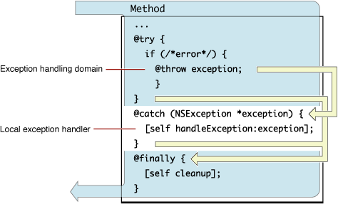

> 导航：[总目录](../../../README.md) · [文档](../../../_indexes/documentation.md) · [异常编程主题](Introduction%20to%20Exception%20Programming%20Topics%20for%20Cocoa.md)


[下一篇](Throwing%20Exceptions.md) [上一篇](Exceptions%20and%20the%20Cocoa%20Frameworks.md)

# 处理异常

Objective-C 程序提供的异常处理机制能够有效处理异常状况。它将异常状况的检测与处理解耦，并自动把异常从检测位置传播到处理位置。因此，代码可以更加简洁，更容易正确编写，也更易于维护。

编译器对异常的支持基于四条编译器指令：

- `@try`：定义一个作为异常处理域的代码块，即可能抛出异常的代码。
- `@catch()`：定义一个代码块，用于处理 `@try` 块中抛出的异常。`@catch` 的参数是局部抛出的异常对象；它通常是 `NSException` 对象，但也可以是其他类型的对象，例如 [NSString](https://developer.apple.com/library/archive/documentation/LegacyTechnologies/WebObjects/WebObjects_3.5/Reference/Frameworks/ObjC/Foundation/Classes/NSStringClassCluster/Description.html#//apple_ref/occ/cl/NSString) 对象。
- `@finally`：定义一个相关代码块，无论是否抛出异常，随后都会执行该块。
- `@throw`：抛出异常；此指令的行为与 `NSException` 的 [raise](https://developer.apple.com/library/archive/documentation/LegacyTechnologies/WebObjects/WebObjects_3.5/Reference/Frameworks/ObjC/Foundation/Classes/NSException/Description.html#//apple_ref/occ/instm/NSException/raise) 方法几乎相同。通常会抛出 `NSException` 对象，但并不限于此。有关 `@throw` 的更多信息，请参阅[抛出异常](Throwing%20Exceptions.md#apple-f4xwc4dqnrsv64tfmyxwi33df52wszbpgiydambqga2tqlkcijbugrsjijda)。

`@try`、`@catch` 和 `@finally` 指令共同构成一个控制结构。`@try` 花括号之间的代码是异常处理域；`@catch` 块中的代码是局部异常处理器；`@finally` 代码块是通用的“清理”部分。在图 1 中，灰色箭头表示程序的正常执行流程；仅当局部异常处理域或调用序列中更深层的位置抛出异常时，才会执行局部异常处理器中的代码。抛出（或引发）异常会使程序控制跳转到局部异常处理器的第一行可执行代码。异常处理完毕后，控制会“顺势进入”`@finally` 块；如果没有抛出异常，控制则从 `@try` 块跳转到 `@finally` 块。

__图 1__　使用编译器指令时的异常处理流程



异常在何处以及如何得到处理，取决于引发异常时的上下文（不过，在大多数程序中，大部分异常在到达共享 [NSApplication](https://developer.apple.com/documentation/appkit/nsapplication) 或 [UIApplication](https://developer.apple.com/documentation/uikit/uiapplication) 对象安装的顶层处理器之前都不会被捕获）。通常，异常对象会在异常处理器的域内抛出（或引发）。虽然可以直接在局部异常处理域中抛出异常，但更常见的情况是，由该域调用的方法通过 `@throw` 或 [raise](https://developer.apple.com/library/archive/documentation/LegacyTechnologies/WebObjects/WebObjects_3.5/Reference/Frameworks/ObjC/Foundation/Classes/NSException/Description.html#//apple_ref/occ/instm/NSException/raise) 间接抛出异常。无论异常在调用序列的多深处抛出，执行都会跳转到局部异常处理器（前提是中间没有其他异常处理器，详见[嵌套异常处理器](Nesting%20Exception%20Handlers.md#apple-f4xwc4dqnrsv64tfmyxwi33df52wszbpgiydambqga3dalkdjjbeersejfda)）。这样便可以在高层捕获低层引发的异常。

清单 1 展示了 `@try`、`@catch` 和 `@finally` 编译器指令的一种用法。在本例中，如果 [setValue:forKeyPath:](https://developer.apple.com/documentation/objectivec/nsobject/1418139-setvalue) 消息导致调用序列下层抛出任何异常，`@catch` 块会将受影响的属性改设为 `nil` 来处理。无论是否抛出异常，`@finally` 块中的消息都会发送。

__清单 1__　使用编译器指令处理异常

```objc
- (void)endSheet:(NSWindow *)sheet
{
    BOOL success = [predicateEditorView commitEditing];
    if (success == YES) {

        @try {
            [treeController setValue:[predicateEditorView predicate] forKeyPath:@"selection.predicate"];
        }

        @catch ( NSException *e ) {
            [treeController setValue:nil forKeyPath:@"selection.predicate"];
        }

        @finally {
            [NSApp endSheet:sheet];
        }
    }
}
```

处理异常的一种方法，是将其“提升”为错误消息，用于通知用户或请求用户干预。可以将异常转换为 [NSError](https://developer.apple.com/documentation/foundation/nserror) 对象，然后在警告面板中向用户显示错误对象中的信息。在 OS X 中，还可以将该对象交给 Application Kit 的错误处理机制向用户显示。对于包含错误参数的方法，也可以间接返回此类信息。清单 2 展示了后一种方式：Automator 操作对 [runWithInput:fromAction:error:](https://developer.apple.com/documentation/automator/amaction/1438363-runwithinput) 的实现（本例中的错误参数是指向 [NSDictionary](https://developer.apple.com/library/archive/documentation/LegacyTechnologies/WebObjects/WebObjects_3.5/Reference/Frameworks/ObjC/Foundation/Classes/NSDictionaryClassClstr/Description.html#//apple_ref/occ/cl/NSDictionary) 对象的指针，而不是 `NSError` 对象）。

__清单 2__　将异常转换为错误

```objc
- (id)runWithInput:(id)input fromAction:(AMAction *)anAction error:(NSDictionary **)errorInfo {

    NSMutableArray *output = [NSMutableArray array];
    NSString *actionMessage = nil;
    NSArray *recipes = nil;
    NSArray *summaries = nil;

    // 此处为其他代码……

    @try {
        if (managedObjectContext == nil) {
            actionMessage = @"accessing user recipe library";
            [self initCoreDataStack];
        }
        actionMessage = @"finding recipes";
        recipes = [self recipesMatchingSearchParameters];
        actionMessage = @"generating recipe summaries";
        summaries = [self summariesFromRecipes:recipes];
    }
    @catch (NSException *exception) {
        NSMutableDictionary *errorDict = [NSMutableDictionary dictionary];
        [errorDict setObject:[NSString stringWithFormat:@"Error %@: %@", actionMessage, [exception reason]] forKey:OSAScriptErrorMessage];
        [errorDict setObject:[NSNumber numberWithInt:errOSAGeneralError] forKey:OSAScriptErrorNumber];
        *errorInfo = errorDict;
        return input;
    }

    // 此处为其他代码……
}
```

可以连续使用多个 `@catch` 错误处理块，每个块处理不同类型的异常对象。应按异常对象类型从最具体到最宽泛（最宽泛的类型为 `id`）排列这些 `@catch` 块，如清单 3 所示。这样的顺序便于按组定制异常的处理方式。

__清单 3__　异常处理器序列

```objc
@try {
    // 抛出异常的代码
    ...
}
@catch (CustomException *ce) { // 最具体的类型
    // 处理异常 ce
    ...
}
@catch (NSException *ne) { // 较宽泛的类型
    // 执行此层级所需的恢复操作
    ...
    // 重新抛出异常，以便在更高层级处理
    @throw;
}
@catch (id ue) { // 最宽泛的类型
    // 处理此异常的代码
    ...
}
@finally {
    // 执行无论是否发生异常都必需的任务
    ...
}
```


使用 Objective-C 的异常处理指令会使[内存管理](https://developer.apple.com/library/archive/documentation/General/Conceptual/DevPedia-CocoaCore/MemoryManagement.html#//apple_ref/doc/uid/TP40008195-CH27)变得复杂，但只需遵循一些常识即可避开陷阱。下面从一个简单示例开始：为提高效率，某方法创建并使用一个对象，然后显式释放它：

```objc
- (void)doSomething {
    NSMutableArray *anArray = [[NSMutableArray alloc] initWithCapacity:0];
    [self doSomethingElse:anArray];
    [anArray release];
}
```

这里的问题很明显：如果 `doSomethingElse:` 方法抛出异常，就会发生内存泄漏。解决方法也同样直观：将 [release](https://developer.apple.com/library/archive/documentation/LegacyTechnologies/WebObjects/WebObjects_3.5/Reference/Frameworks/ObjC/Foundation/Protocols/NSObject/Description.html#//apple_ref/occ/intfm/NSObject/release) 移到 `@finally` 块中：

```objc
- (void)doSomething {
    NSMutableArray *anArray = nil;
    anArray = [[NSMutableArray alloc] initWithCapacity:0];
    @try {
        [self doSomethingElse:anArray];
    }
    @finally {
        [anArray release];
    }
}
```

这种使用 `@try...@finally` 释放异常所涉及对象的模式同样适用于其他资源。如果存在通过 `malloc` 分配的内存块或打开的文件描述符，`@finally` 是释放它们的合适位置；它也是解开已获取锁的理想位置。

另一个更隐蔽的内存管理问题，是存在内部[自动释放](https://developer.apple.com/library/archive/documentation/LegacyTechnologies/WebObjects/WebObjects_3.5/Reference/Frameworks/ObjC/Foundation/Protocols/NSObject/Description.html#//apple_ref/occ/intfm/NSObject/autorelease)池时过度释放异常对象。几乎所有 `NSException` 对象（以及其他类型的异常对象）在创建时都是自动释放的，因此会被分配到作用域内最近的自动释放池。当该池释放时，异常也会被销毁。池既可以直接释放，也可能由于栈中更深层（因而作用域更外层）的自动释放池被弹出（即释放）而随之释放。请看以下方法：

```objc
- (void)doSomething {
    NSAutoreleasePool *pool = [[NSAutoreleasePool alloc] init];
    NSMutableArray *anArray = [[[NSMutableArray alloc] initWithCapacity:0] autorelease];
    [self doSomethingElse:anArray];
    [pool release];
}
```

这段代码看似可靠：如果 `doSomethingElse:` 消息导致异常抛出，当栈中更低层（或更外层）的自动释放池弹出时，局部自动释放池就会被释放。但这里存在潜在问题。正如[抛出异常](Throwing%20Exceptions.md#apple-f4xwc4dqnrsv64tfmyxwi33df52wszbpgiydambqga2tqlkcijbugrsjijda)所述，重新抛出的异常会使与之关联的 `@finally` 块作为提前副作用而执行。如果外层自动释放池在 `@finally` 块中释放，局部池就可能在异常送达_之前_被释放，从而产生“僵尸”异常。

有多种方法可以解决这个问题。最简单的方法是不在 `@finally` 块中释放局部自动释放池，而是让更深层池的弹出负责释放保存异常对象的池。不过，如果异常沿栈向上传播时始终没有更深层的池弹出，栈中的池就会泄漏内存；这些池中的所有对象在相应线程销毁前都不会释放。

另一种方法是捕获所有抛出的异常，保留它，然后重新抛出。接着，在 `@finally` 块中释放自动释放池，并对异常对象执行自动释放。清单 4 展示了相应代码。

__清单 4__　释放包含异常对象的自动释放池

```objc
- (void)doSomething {
    id savedException = nil;
    NSAutoreleasePool *pool = [[NSAutoreleasePool alloc] init];
    NSMutableArray *anArray = [[[NSMutableArray alloc] initWithCapacity:0] autorelease];
    @try {
        [self doSomethingElse:anArray];
    }
    @catch (NSException *theException) {
        savedException = [theException retain];
        @throw;
    }
    @finally {
        [pool release];
        [savedException autorelease];
    }
}
```

这样可以让抛出的异常在内部自动释放池（异常从 `doSomethingElse:` 传播出来时被放入的池）释放期间仍得到保留，并确保它在作用域中下一个更外层的自动释放池（换个角度说，即栈中位于其下方的自动释放池）中自动释放。为确保操作正确，必须先释放内部自动释放池，再对已保留的异常对象执行自动释放。

[下一篇](Throwing%20Exceptions.md) [上一篇](Exceptions%20and%20the%20Cocoa%20Frameworks.md)
