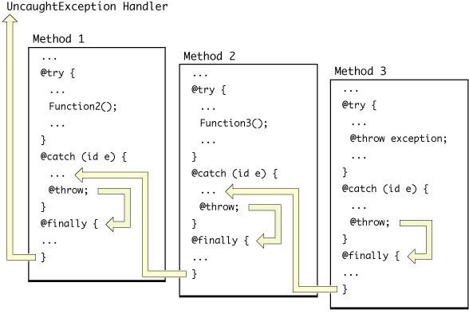

> 导航：[总目录](../../../README.md) · [文档](../../../_indexes/documentation.md) · [异常编程主题](Introduction%20to%20Exception%20Programming%20Topics%20for%20Cocoa.md)


[下一篇](Uncaught%20Exceptions.md) [上一篇](Throwing%20Exceptions.md)

# 嵌套异常处理器

异常处理器可以嵌套，使内部域中引发的异常能够由局部异常处理器_以及_任意数量的外围异常处理器处理。这种设计允许由距离实际异常产生位置更远、但可能更了解异常成因的代码来处理异常。

要了解如何调用以编译器指令定义的嵌套异常处理器，请看清单 1 中的代码片段。

__清单 1__　抛出和重新抛出异常

```objc
@try {
    // ...
    if (someError) {
        NSException *theException = [NSException exceptionWithName:MyAppException reason:@"Some error just occurred!" userInfo:nil];
        @throw theException;
    }
}
@catch (NSException *exception) {
    if ([[exception name] isEqualToString:MyAppException]) {
        NSRunAlertPanel(@"Error Panel", @"%@", @"OK", nil, nil,
                exception);
    }
    @throw; // 重新抛出异常
}
@finally {
    [self cleanUp];
}
```

在这段代码中，异常（`exception`）会在局部处理器末尾再次抛出，使外围异常处理器能够执行一些其他操作。图 1 展示了程序控制流如何在使用 `@catch` 指令创建的嵌套异常处理器之间转移。

__图 1__　使用指令时嵌套异常处理器的控制流



在方法 3 的域内引发异常，会使程序执行跳转到其局部异常处理器。在典型应用程序中，该异常处理器会查询异常对象，以确定异常的性质。局部处理器可以处理它所识别的异常类型，随后还可以重新抛出异常对象，将异常通知传递给嵌套在其上方的处理器，即方法 2 中的处理器。不过，在调用下一个外层异常处理器之前，会先执行与局部异常处理器关联的 `@finally` 块中的代码。（这会影响内存管理，详见[异常处理与内存管理](Handling%20Exceptions.md#apple-f4xwc4dqnrsv64tfmyxwi33df52wszbpgiydambqga2tslktk43q)。）

重新抛出的异常对上一层处理器而言，就像初始异常在其自身异常处理域内引发一样。方法 2 的异常处理器同样可以处理该异常，也可以将异常重新抛给方法 1 的异常处理器；只有当方法 2 的 `@finally` 块完成任务后，方法 1 的处理器才会收到重新抛出的异常。最后，方法 1 的处理器再次抛出异常。由于方法 1 上方不再有异常处理域，该异常会传递给未捕获异常处理器（请参阅[未捕获的异常](Uncaught%20Exceptions.md#apple-f4xwc4dqnrsv64tfmyxwi33df52wszbpgiydambqga2tmlkciffeirchi5ca)）。

[下一篇](Uncaught%20Exceptions.md) [上一篇](Throwing%20Exceptions.md)
