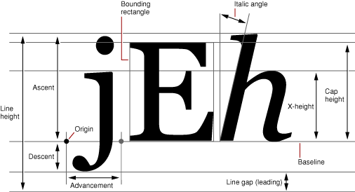

> 导航：[总目录](../../../README.md) · [documentation](../../../_indexes/documentation.md) · [Font Handling](Introduction%20to%20Font%20Handling.md)

[Next](Querying%20Aqua%20Font%20Variations.md)[Previous](Creating%20a%20Font%20Object.md)

# Getting Font Metrics

NSFont defines a number of methods for accessing a font’s metrics information, when that information is available. Methods such as `boundingRectForGlyph:`, `boundingRectForFont`, `xHeight`, and so on, all correspond to standard font metrics information. Figure 1 shows how the font metrics apply to glyph dimensions, and Table 1 lists the method names that correlate with the metrics. See the various method descriptions for more specific information.

__Figure 1__  Font metrics

__Table 1__  Font metrics and related NSFont methods

| Font metric | Methods |
| Advancement | `advancementForGlyph:`, `maximumAdvancement` |
| X-height | `xHeight` |
| Ascent | `ascender` |
| Bounding rectangle | `boundingRectForFont`, `boundingRectForGlyph:` |
| Cap height | `capHeight` |
| Line height | `defaultLineHeightForFont`, `pointSize`, `labelFontSize`, `smallSystemFontSize`, `systemFontSize`, `systemFontSizeForControlSize:` |
| Descent | `descender` |
| Italic angle | `italicAngle` |

[Next](Querying%20Aqua%20Font%20Variations.md)[Previous](Creating%20a%20Font%20Object.md)

