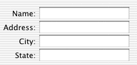

> 导航：[总目录](../../../README.md) · [documentation](../../../_indexes/documentation.md) · [Form Programming Topics](Introduction%20to%20Forms.md)

[Next](Setting%20a%20Form%E2%80%99s%20Appearance.md)[Previous](Introduction%20to%20Forms.md)

# How Forms Work

A form is group of related text fields. Unlike individual text fields, the fields in a form work together without any intervention from the developer. For example, you can tab from one field to another without writing any code or doing any work in Interface Builder.

A form is implemented as a NSForm, a subclass of NSMatrix, which contains a column of NSFormCells. Here’s an example:

In NSForm’s methods, each NSFormCell is called an “entry” (or, sometimes, a “cell” or “item”). The left part of each entry is called the “title,” and the right part is called the “text.” Methods that refer to individual entries use a one-dimensional “index”; the indexing system starts at the top of the top of form, with zero.

Generally, you’ll create and modify a form in Interface Builder. You can also create one programmatically with one of NSForm’s constructors. To add an entry to the end of a form, use `addEntry:`. To add an entry at a specific index, use `insertEntry:atIndex:`. To remove an entry, use `removeEntryAtIndex:`.

Any entry in the form can be “selected.” When an entry is selected, its text area responds to the user’s keystrokes. You can select an entry using the `selectTextAtIndex:` method, or you can let the user select an entry by clicking it with the mouse. Once an entry is selected, the user can select the next entry by pressing Tab, or select the previous entry by pressing Shift-Tab.

To initiate the action of a selected entry, the user presses Return or Enter. In response, the entry sends an action message to its target. If the entry has no target, the NSForm sends an action message to its target.

[Next](Setting%20a%20Form%E2%80%99s%20Appearance.md)[Previous](Introduction%20to%20Forms.md)

