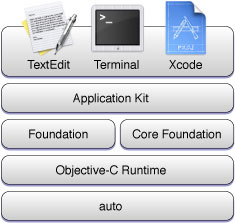
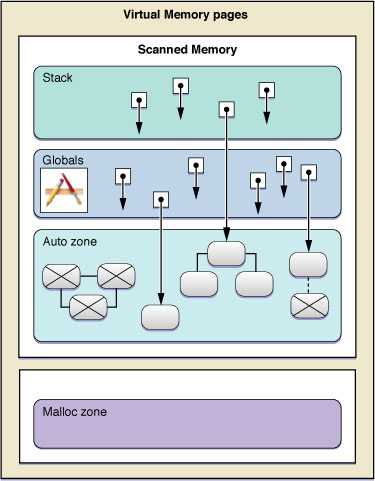

> 导航：[总目录](../../../README.md) · [documentation](../../../_indexes/documentation.md) · [Garbage Collection Programming Guide](Introduction%20to%20Garbage%20Collection.md)


[Next](Using%20Garbage%20Collection.md)[Previous](Adopting%20Garbage%20Collection.md)

# Architecture

Garbage collection simplifies memory management and makes it easier to ensure thread and exception safety. It also avoids common problems such as retain cycles, and simplifies some code patterns (such as accessor methods in Cocoa). Together these make applications more robust.

Garbage collection systems were first developed around 1960 and have undergone much research and refinement since then. Most garbage collection systems restrict direct access to memory pointers. This has the benefit that you never have to be concerned about memory errors—either leaks due to cyclic data structures or due to the use of a dangling pointer. The Objective-C language, however, has no such restrictions on pointer use. Although a few garbage collection systems have been developed for use with the C language, their assumptions and performance make them unsuitable for use with Cocoa objects. Cocoa therefore uses a custom non-copying conservative garbage collection system that in normal use brings safety and a simplified programming model.

Restricted pointer access–languages allow for fully-automatic garbage collection. If you program purely in objects, then garbage collection in Cocoa can also be fully automatic. Beyond programming purely in objects, however, the collector also provides access to a new collection-based memory allocation system. Core Foundation objects are also garbage collected, but you must follow specific rules to allocate and dispose of them properly. In order to understand how you can take advantage of these features, you need to understand some of the architectural details described in this document.

The immediate benefits of garbage collection can be highlighted using a simple class definition and implementation. The Widget class is declared as follows:

```objc
@interface Widget : NSObject
{
@private
    Widget *nextWidget;
}
- (Widget *)nextWidget;
- (void)setNextWidget:(Widget *)aWidget;
@end
```

[Listing 1](#apple-f4xwc4dqnrsv64tfmyxwi33df52wszbpkridimbqgazdinjrfvjvomq) illustrates a full-featured, thread-safe, traditional Cocoa implementation of the Widget class.

__Listing 1__  Full-featured implementation of the Widget class

```objc
@implementation Widget
- (Widget *)nextWidget
{
    @synchronized(self)
    {
        return [[nextWidget retain] autorelease];
    }
}

- (void)setNextWidget:(Widget *)aWidget
{
    @synchronized(self)
    {
        if (nextWidget != aWidget)
        {
            [nextWidget release];
            nextWidget = [aWidget retain];
         }
    }
}
@end
```

There are many other permutations that trade increased speed for less safety (see Basic Accessor Methods).

If you do not implement memory management correctly, your application will suffer from memory leaks that bloat its memory footprint, or even worse, from dangling pointers which lead to crashes. Retain cycles, or circular references, can cause significant problems in traditional Cocoa programming (see, for example, Object Ownership and Disposal). Consider the following trivial example.

```
Widget *widget1 = [[Widget alloc] init];
Widget *widget2 = [[Widget alloc] init];
[widget1 setNextWidget:widget2];
[widget2 setNextWidget:widget1];
```

If you use manual memory management and the accessor methods described earlier, this sets up a retain cycle between the two widgets and is likely to lead to a memory leak.

If you use a garbage collector, the implementation of the Widget class is much simpler.

```objc
@implementation Widget
- (Widget *)nextWidget
{
    return nextWidget;
}

- (void)setNextWidget:(Widget *)aWidget
{
    nextWidget = aWidget;
}
@end
```

Retain cycles are not a problem if you use garbage collection: as soon as both objects become unreachable, they are marked for deletion.

The garbage collector is implemented as a reusable library (called “auto”). The Objective-C runtime is a client of the library.



The collector does not scan all areas of memory (see [Figure 1](#apple-f4xwc4dqnrsv64tfmyxwi33df52wszbpkridimbqgazdinjrfvjvoni)). The stack and global variables are always scanned; the malloc zone is never scanned. The collector provides a special area of memory known as the auto zone from which all garbage-collected blocks of memory are dispensed. You can use the collector to allocate blocks of memory in the auto zone—these blocks are then managed by the collector.

The mechanism of garbage collection is fairly simple to describe although the implementation is more complicated. The garbage collector's goal is to form a set of _reachable_ objects that constitute the "valid" objects in your application. When a collection is initiated, the collector initializes the set with all known _root_ objects such as stack-allocated and global variables (for example, the `NSApplication` shared instance). The collector then recursively follows _strong_ references from these objects to other objects, and adds these to the set. All objects that are _not_ reachable through a chain of strong references to objects in the root set are designated as “garbage”. At the end of the collection sequence, the garbage objects are finalized and immediately afterwards the memory they occupy is recovered.

__Figure 1__  Scanned and unscanned memory



There are several points of note regarding the collector:

- The collector is conservative—it never compacts the heap by moving blocks of memory and updating pointers. Once allocated, an object always stays at its original memory location.
- The collector is both request and demand driven. The Cocoa implementation makes requests at appropriate times. You can also programmatically request consideration of a garbage collection cycle, and if a memory threshold has been exceeded a collection is run automatically.
- The collector runs on its own thread in the application. At no time are all threads stopped for a collection cycle, and each thread is stopped for as short a time as is possible. It is possible for threads requesting collector actions to block during a critical section on the collector thread's part. Only threads that have directly or indirectly performed an `[NSThread self]` operation are subject to garbage collection.
- The collector is generational (see [Write Barriers](#apple-f4xwc4dqnrsv64tfmyxwi33df52wszbpkridimbqgazdinjrfvjvona))—most collections are very fast and recover significant amounts of recently-allocated memory, but not all possible memory. Full collections are also fast and do collect all possible memory, but are run less frequently, at times unlikely to impact user event processing, and may be aborted in the presence of new user events.

Most garbage collection systems are “closed”—that is, the language, compiler, and runtime collaborate to be able to identify the location of every pointer reference to a collectable block of memory. This allows such collectors to reallocate and copy blocks of memory and update each and every referring pointer to reflect the new address. The movement has the beneficial effect of compacting memory and eliminating memory wastage due to fragmentation.

In contrast to closed collection systems, “open” systems allow pointers to garbage collected blocks to reside anywhere, and in particular where pointers reside in stack frames as local variables. Such garbage collectors are deemed "conservative." Their design point is often that since programmers can spread pointers to any and all kinds of memory, then all memory must be scanned to determine unreachable (garbage) blocks. This leads to frequent long collection times to minimize memory use. Memory collection is instead often delayed, leading to large memory use which, if it induces paging, can lead to very long pauses. As a result, conservative garbage collection schemes are not widely used.

Cocoa's garbage collector strikes a balance between being “closed” and “open” by knowing exactly where pointers to scanned blocks are wherever it can, by easily tracking "external" references, and being "conservative" only where it must. By tracking the allocation age of blocks, and using write barriers, the Cocoa collector also implements partial (“incremental” or “generational”) collections which scan an even smaller amount of the heap. This eliminates the need for the collector to have to scan all of memory seeking global references and provides a significant performance advantage over traditional conservative collectors.

In most applications, objects are typically short-lived—they are created on a temporary basis, consulted, and never used again. Cocoa's Garbage Collector is _generational_—it divides allocated memory into "generations" and prioritizes recovery of memory from the newest generations. This means that the memory from short-lived objects can often be reclaimed quickly and easily.

In order to recover these objects, the compiler introduces what is known as a write-barrier whenever it detects that an object pointer is stored (“assigned”) into another object, or more completely, whenever a pointer to a garbage collected block of memory is stored into either another garbage collected block (or into global memory).

Within the collector, memory is split into several generations—old and newer. The write-barrier simply marks a "clump" of objects when a "newer" object is stored somewhere within an older. The number of "clumps" of older generation objects that get marked is usually very low. When an incremental garbage collection is requested, the stack and the objects within marked clumps are examined recursively for "newer" objects that have been attached and are now reachable. These "newer" objects are then marked "older" (promoted). All unreachable "newer" objects are reclaimed after any necessary finalization.

A generational collection does not discover any older generation objects that are no longer reachable and so, over time, the oldest generation needs to be examined with a "full" collection. In principle there can be many generations—a generational collection in the midst of work with a lot of temporary objects will promote the temporary objects to an older generation where they could be recovered without resorting to a full collection. The Cocoa collector runs with 2 to 8 generations.

Consider the following example.

```objc
static id LastLink;
@interface Link2 : NSObject {
    id theLink;
}
- link;
- (void)setLink:newLink;
@end

@implementation Link2
- link {
    return theLink;
}
- (void)setLink: newLink
{
    theLink = newLink;
    LastLink = newLink;
}
@end
```

Behind the scenes the compiler calls an intrinsic helper function to deal with the assignment and when garbage collection is enabled the helper function calls into the collector to note the store of a pointer. Effectively the two assignments within `setLink:` are rewritten by the compiler to be:

```
objc_assign_ivar(newLink, self, offsetof(theLink));
objc_assign_global(newlink, &LastLink);
```

These helper functions are almost without cost when not running with garbage collection—there is only a two instruction penalty. At runtime, if garbage collection is enabled these routines are rewritten at startup to include the write-barrier logic.

[Next](Using%20Garbage%20Collection.md)[Previous](Adopting%20Garbage%20Collection.md)

