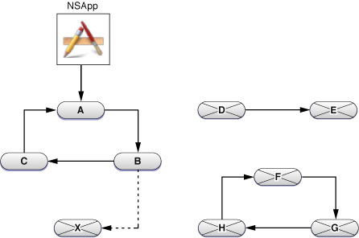
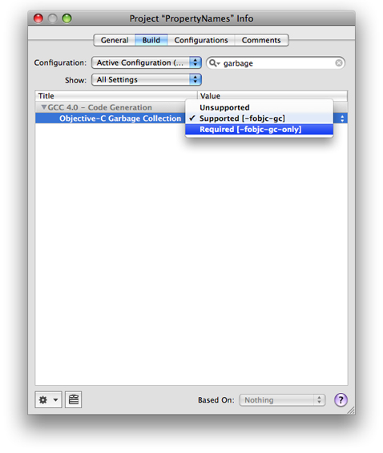

> 导航：[总目录](../../../README.md) · [documentation](../../../_indexes/documentation.md) · [Garbage Collection Programming Guide](Introduction%20to%20Garbage%20Collection.md)


[Next](Adopting%20Garbage%20Collection.md)[Previous](Introduction%20to%20Garbage%20Collection.md)

# Garbage Collection for Cocoa Essentials

This article describes the basic concepts and features of the garbage collection technology that are essential for a Cocoa developer to understand. It does not provide a complete treatment of the subject—you are expected to read the other articles in this document to gain a deeper understanding. In particular, you should also read [Implementing a finalize Method](Implementing%20a%20finalize%20Method.md#apple-f4xwc4dqnrsv64tfmyxwi33df52wszbpkridimbqgazdinjtfvjvomi).

When you use the Cocoa garbage collection technology, it manages your application's memory for you. All Cocoa objects are garbage collected. There is no need to explicitly manage objects' retain counts to ensure that they remain "live" or that the memory they take up is reclaimed when they are no longer used. For example, with garbage collection enabled the following method (although inefficient!) does not result in any memory leaks:

```objc
- (NSString *)fullName {
    NSMutableString *mString = [[NSMutableString alloc] init];
    if ([self firstName] != nil)
        [mString appendString:[self firstName]];
    if (([self firstName] != nil) && ([self lastName] != nil))
        [mString appendString:@" "];
    if ([self lastName] != nil)
        [mString appendString:[self lastName]];
    return [mString copy];
}
```


The garbage collector's goal is to form a set of _reachable_ objects that constitute the "valid" objects in your application, and then to discard any others. When a collection is initiated, the collector initializes the set with all well-known _root_ objects. The collector then recursively follows _strong_ references from these objects to other objects, and adds these to the set. At the end of the process, all objects that are _not_ reachable through a chain of strong references to objects in the root set are designated as "garbage." At the end of the collection sequence, the unreachable objects are finalized and immediately afterwards the memory they occupy is recovered.

The initial root set of objects is comprised of global variables, stack variables, and objects with external references (for more details about globals, see [Global Object Pointers](Using%20Garbage%20Collection.md#apple-f4xwc4dqnrsv64tfmyxwi33df52wszbpkridimbqga4dambwfvjvoni)). These objects are never considered as garbage. The root set is comprised of all objects reachable from root objects and all possible references found by examining the call stacks of every Cocoa thread.

As implied earlier, there are two types of reference between objects—strong and weak. A strong reference is visible to the collector, a weak reference is not. A non-root object is only live if it can be reached via strong references from a root object. An important corollary is that simply because you have a strong reference to an object does not mean that that object will survive garbage collection, as illustrated in the following figure.



There is a strong reference from a global object (the shared `NSApplication` instance) to object A, which in turn has a strong reference to B, which has a strong reference to C. All of these objects are therefore valid. There is a weak reference from B to X, therefore X will be treated as garbage.

There is a strong reference from D to E, but since neither has a strong reference from a root object, both are treated as garbage. As an extension of the latter case, objects F, G, and H illustrate a retain cycle. In reference-counted applications this may be a problem (see Object Ownership and Disposal); in a garbage collected application, since none of these objects has a strong reference from a root object all are treated as garbage and all are properly reclaimed.

All references to objects (`id`, `NSObject *`, and so on) are considered strong by default. Objects have strong behavior, but so can other memory blocks and Core Foundation-style objects. You can create a weak reference using the keyword `__weak`, or by adding objects to a collection configured to use weak references (such as [NSHashTable](https://developer.apple.com/documentation/foundation/nshashtable) and [NSMapTable](https://developer.apple.com/documentation/foundation/nsmaptable)).

Garbage collection is an optional feature; you need to set an appropriate flag for the compiler to mark code as being GC capable. The compiler will then use garbage collector write-barrier assignment primitives within the Objective-C runtime. An application marked GC capable will be started by the runtime with garbage collection enabled.

There are three possible compiler settings:

- No flag. This means that GC is not supported.
- `-fobjc-gc-only` This means that only GC logic is present.

  Code compiled as GC Required is presumed to not use traditional Cocoa retain/release methods and may not be loaded into an application that is not running with garbage collection enabled.
- `-fobjc-gc` This means that both GC and retain/release logic is present.

  Code compiled as GC Supported is presumed to also contain traditional retain/release method logic and can be loaded into any application.

You can choose an option most easily by selecting the appropriate build setting in Xcode, as illustrated in [Figure 1](#apple-f4xwc4dqnrsv64tfmyxwi33df52wszbpkridimbqgazdinjsfvjvomq).

__Figure 1__  Xcode code generation build settings for garbage collection



In a Cocoa desktop application, the garbage collector is automatically started and run for you. If you are writing a Foundation tool, you need to start the collector thread manually using the function `objc_startCollectorThread`:

```objc
#import <objc/objc-auto.h>
int main (int argc, const char * argv[]) {
    objc_startCollectorThread();
    // your code
    return 0;
}
```

You may want to occasionally clear the stack using `objc_clear_stack()` to ensure that nothing is falsely rooted on the stack. You should typically do this when the stack is as shallow as possible—for example, at the top of a processing loop.

You can also use `objc_collect(OBJC_COLLECT_IF_NEEDED)` to provide a hint to the collector that collection might be appropriate—for example, after you finish using a large number of temporary objects.

Don't try to optimize details in advance.

In a garbage-collected application, you should ideally ensure that any external resources held by an object (such as open file descriptors) are closed prior to an object’s destruction. If you do need to perform some operations just before an object is reclaimed, you should do so in a `finalize` method. For more details, see [Implementing a finalize Method](Implementing%20a%20finalize%20Method.md#apple-f4xwc4dqnrsv64tfmyxwi33df52wszbpkridimbqgazdinjtfvjvomi). Note that you should never invoke `finalize` directly (except to invoke super’s implementation in the `finalize` method itself).

If an object holds on to a scarce resource, such as a file descriptor, you should indicate that the resource is no longer required using an invalidation method. You should _not_ wait until the object is collected and release the resource in `finalize`. For more details, again see [Implementing a finalize Method](Implementing%20a%20finalize%20Method.md#apple-f4xwc4dqnrsv64tfmyxwi33df52wszbpkridimbqgazdinjtfvjvomi).

Since the collector follows strong references from root objects, and treats as garbage all objects that cannot be reached from a root object, you must ensure that there are strong references to all top-level objects in a nib file (including for example, stand-alone controllers)—otherwise they will be collected. You can create a strong reference simply by adding an outlet to the File's Owner and connecting it to a top-level object. (In practice this is rarely likely to be an issue.)

In a standard application, Cocoa automatically hints at a suitable point in the event cycle that collection may be appropriate. The collector then initiates collection if memory load exceeds a threshold. Typically this should be sufficient to provide good performance. Sometimes, however, you may provide a hint to the collector that collection may be warranted—for example after a loop in which you create a large number of temporary objects. You can do this using the `NSGarbageCollector` method [collectIfNeeded](https://developer.apple.com/documentation/foundation/nsgarbagecollector/1431015-collectifneeded).

```
// Create temporary objects
NSGarbageCollector *collector = [NSGarbageCollector defaultCollector];
[collector collectIfNeeded];
```


Garbage collection is performed on its own thread—a thread is explicitly registered with the collector if it calls `NSThread`'s [currentThread](https://developer.apple.com/library/archive/documentation/LegacyTechnologies/WebObjects/WebObjects_3.5/Reference/Frameworks/ObjC/Foundation/Classes/NSThread/Description.html#//apple_ref/occ/clm/NSThread/currentThread) method (or if it uses an autorelease pool). There is no other explicit API for registering a `pthread` with the collector.

The collector scans memory to find reachable objects, so by definition keeps the working set hot. You should therefore make sure you get rid of objects you don't need.

Object allocation is no less expensive an operation in a garbage collected environment than in a reference-counted environment. You should avoid creating large numbers of (typically short-lived) objects.

In general, you should not try to design your application to be dual-mode (that is, to support both garbage collection and reference-counted environments). The exception is if you are developing frameworks and you expect clients to operate in either mode.

In general, C++ code should remain unchanged: you can assume memory allocated from standard `malloc` zone. If you need to ensure the longevity of Objective-C objects, you should use `CFRetain` instead of `retain`.

[Next](Adopting%20Garbage%20Collection.md)[Previous](Introduction%20to%20Garbage%20Collection.md)

