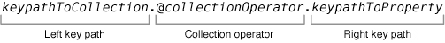

> 导航：[总目录](../../../README.md) · [文档](../../../_indexes/documentation.md) · [键值编码编程指南](index.md)

## 使用集合运算符

向符合键值编码规范的对象发送 [valueForKeyPath:](https://developer.apple.com/library/archive/documentation/LegacyTechnologies/WebObjects/WebObjects_3.5/Reference/Frameworks/ObjC/EOF/EOControl/Classes/NSObjectAdditions/Description.html#//apple_ref/occ/instm/NSObject/valueForKeyPath:) 消息时，可以在键路径中嵌入_集合运算符_。集合运算符是少数几个以 `@` 符号为前缀的关键字之一，它指定 getter 在返回数据前应执行的操作。`NSObject` 提供的 `valueForKeyPath:` 默认实现支持这种行为。

键路径包含集合运算符时，运算符前面的部分称为_左键路径_，它指示相对于消息接收者要操作的集合。如果直接向 `NSArray` 实例等集合对象发送消息，可以省略左键路径。

运算符后面的部分称为_右键路径_，它指定运算符应处理的集合内属性。除 `@count` 外，所有集合运算符都需要右键路径。图 4-1 展示了运算符键路径的格式。

__图 4-1__　运算符键路径格式

集合运算符表现出三种基本行为：

- [聚合运算符](#apple-f4xwc4dqnrsv64tfmyxwi33df52wszbpgiydambsge3tmlktk42q)以某种方式合并集合中的对象，并返回单个对象；该对象的数据类型通常与右键路径所命名属性的数据类型一致。`@count` 运算符是例外：它不接收右键路径，并且始终返回 `NSNumber` 实例。
- [数组运算符](#apple-f4xwc4dqnrsv64tfmyxwi33df52wszbpgiydambsge3tmlktk43q)返回一个 `NSArray` 实例，其中包含指定集合所保存对象的某个子集。
- [嵌套运算符](#apple-f4xwc4dqnrsv64tfmyxwi33df52wszbpgiydambsge3tmlktk44q)处理包含其他集合的集合，并根据具体运算符返回 `NSArray` 或 `NSSet` 实例，以某种方式组合嵌套集合中的对象。

### 示例数据

下面的说明包含代码片段，展示如何调用各个运算符及其结果。这些示例依赖[清单 2-1](BasicPrinciples.md#apple-f4xwc4dqnrsv64tfmyxwi33df52wszbpgiydambsge3talktk4yq)中的 `BankAccount` 类，该类保存一个 `Transaction` 对象数组。每个对象表示一条简单的支票簿记录，如清单 4-1 所声明。

__清单 4-1__　`Transaction` 对象的接口声明

1. `@interface Transaction : NSObject`
3. `@property (nonatomic) NSString* payee; // 收款人`
4. `@property (nonatomic) NSNumber* amount; // 金额`
5. `@property (nonatomic) NSDate* date; // 日期`
7. `@end`

为便于讨论，假设 `BankAccount` 实例的 `transactions` 数组填充了表 4-1 所示数据，并且示例调用均从 `BankAccount` 对象内部发出。

__表 4-1__　`Transaction` 对象的示例数据

| `payee` 值 | 格式化为货币的 `amount` 值 | 格式化为月、日、年的 `date` 值 |
| --- | --- | --- |
| `Green Power` | `$120.00` | `Dec 1, 2015` |
| `Green Power` | `$150.00` | `Jan 1, 2016` |
| `Green Power` | `$170.00` | `Feb 1, 2016` |
| `Car Loan` | `$250.00` | `Jan 15, 2016` |
| `Car Loan` | `$250.00` | `Feb 15, 2016` |
| `Car Loan` | `$250.00` | `Mar 15, 2016` |
| `General Cable` | `$120.00` | `Dec 1, 2015` |
| `General Cable` | `$155.00` | `Jan 1, 2016` |
| `General Cable` | `$120.00` | `Feb 1, 2016` |
| `Mortgage` | `$1,250.00` | `Jan 15, 2016` |
| `Mortgage` | `$1,250.00` | `Feb 15, 2016` |
| `Mortgage` | `$1,250.00` | `Mar 15, 2016` |
| `Animal Hospital` | `$600.00` | `Jul 15, 2016` |

### 聚合运算符

聚合运算符处理属性数组或属性集合，生成反映集合某项特征的单个值。

### @avg

指定 `@avg` 运算符时，`valueForKeyPath:` 会读取集合中每个元素由右键路径指定的属性，将其转换为 `double`（`nil` 值替换为 0），并计算算术平均值。随后，它返回存储在 `NSNumber` 实例中的结果。

要获取表 4-1 示例数据中的平均交易金额：

1. `NSNumber *transactionAverage = [self.transactions valueForKeyPath:@"@avg.amount"];`

`transactionAverage` 的格式化结果为 $456.54。

### @count

指定 `@count` 运算符时，`valueForKeyPath:` 会在 `NSNumber` 实例中返回集合的对象数量。如果存在右键路径，它会被忽略。

要获取 `transactions` 中 `Transaction` 对象的数量：

1. `NSNumber *numberOfTransactions = [self.transactions valueForKeyPath:@"@count"];`

`numberOfTransactions` 的值为 13。

### @max

指定 `@max` 运算符时，`valueForKeyPath:` 会在右键路径命名的集合条目中搜索并返回最大值。搜索使用许多 Foundation 类（例如 `NSNumber` 类）定义的 `compare:` 方法进行比较。因此，右键路径所指示的属性必须保存能对此消息作出有效响应的对象。搜索会忽略值为 `nil` 的集合条目。

要获取表 4-1 所列交易中的最大日期值，即最近一笔交易的日期：

1. `NSDate *latestDate = [self.transactions valueForKeyPath:@"@max.date"];`

`latestDate` 的格式化值为 2016 年 7 月 15 日。

### @min

指定 `@min` 运算符时，`valueForKeyPath:` 会在右键路径命名的集合条目中搜索并返回最小值。搜索使用许多 Foundation 类（例如 `NSNumber` 类）定义的 `compare:` 方法进行比较。因此，右键路径所指示的属性必须保存能对此消息作出有效响应的对象。搜索会忽略值为 `nil` 的集合条目。

要获取表 4-1 所列交易中的最小日期值，即最早一笔交易的日期：

1. `NSDate *earliestDate = [self.transactions valueForKeyPath:@"@min.date"];`

`earliestDate` 的格式化值为 2015 年 12 月 1 日。

### @sum

指定 `@sum` 运算符时，`valueForKeyPath:` 会读取集合中每个元素由右键路径指定的属性，将其转换为 `double`（`nil` 值替换为 0），并计算总和。随后，它返回存储在 `NSNumber` 实例中的结果。

要获取表 4-1 示例数据中的交易金额总和：

1. `NSNumber *amountSum = [self.transactions valueForKeyPath:@"@sum.amount"];`

`amountSum` 的格式化结果为 $5,935.00。

### 数组运算符

数组运算符使 `valueForKeyPath:` 返回对象数组，对应右键路径所指示对象的某个特定集合。

### @distinctUnionOfObjects

指定 `@distinctUnionOfObjects` 运算符时，`valueForKeyPath:` 会创建并返回一个数组，其中包含与右键路径所指定属性对应的集合中的不同对象。

要获取 `transactions` 中各项交易的 `payee` 属性值集合，并省略重复值：

1. `NSArray *distinctPayees = [self.transactions valueForKeyPath:@"@distinctUnionOfObjects.payee"];`

得到的 `distinctPayees` 数组分别包含以下每个字符串的一个实例：Car Loan、General Cable、Animal Hospital、Green Power、Mortgage。

### @unionOfObjects

指定 `@unionOfObjects` 运算符时，`valueForKeyPath:` 会创建并返回一个数组，其中包含与右键路径所指定属性对应的集合中的所有对象。与 `@distinctUnionOfObjects` 不同，它不会移除重复对象。

要获取 `transactions` 中各项交易的 `payee` 属性值集合：

1. `NSArray *payees = [self.transactions valueForKeyPath:@"@unionOfObjects.payee"];`

得到的 `payees` 数组包含以下字符串：Green Power、Green Power、Green Power、Car Loan、Car Loan、Car Loan、General Cable、General Cable、General Cable、Mortgage、Mortgage、Mortgage、Animal Hospital。请注意其中的重复项。

### 嵌套运算符

嵌套运算符处理嵌套集合，其中集合的每个条目本身都包含一个集合。

在下面的说明中，假设存在第二个名为 `moreTransactions` 的数据数组，其中填充了表 4-2 的数据，并与原始 `transactions` 数组（来自[示例数据](#apple-f4xwc4dqnrsv64tfmyxwi33df52wszbpgiydambsge3tmlktk4zq)一节）共同组成一个嵌套数组：

1. `NSArray* moreTransactions = @[<# transaction data #>];`
2. `NSArray* arrayOfArrays = @[self.transactions, moreTransactions];`

__表 4-2__　`moreTransactions` 数组中假设的 `Transaction` 数据

| `payee` 值 | 格式化为货币的 `amount` 值 | 格式化为月、日、年的 `date` 值 |
| --- | --- | --- |
| `General Cable - Cottage` | `$120.00` | `Dec 18, 2015` |
| `General Cable - Cottage` | `$155.00` | `Jan 9, 2016` |
| `General Cable - Cottage` | `$120.00` | `Dec 1, 2016` |
| `Second Mortgage` | `$1,250.00` | `Nov 15, 2016` |
| `Second Mortgage` | `$1,250.00` | `Sep 20, 2016` |
| `Second Mortgage` | `$1,250.00` | `Feb 12, 2016` |
| `Hobby Shop` | `$600.00` | `Jun 14, 2016` |

### @distinctUnionOfArrays

指定 `@distinctUnionOfArrays` 运算符时，`valueForKeyPath:` 会创建并返回一个数组，其中包含与右键路径所指定属性对应的所有集合合并后的不同对象。

要获取 `arrayOfArrays` 中所有数组的 `payee` 属性的不同值：

1. `NSArray *collectedDistinctPayees = [arrayOfArrays valueForKeyPath:@"@distinctUnionOfArrays.payee"];`

得到的 `collectedDistinctPayees` 数组包含以下值：Hobby Shop、Mortgage、Animal Hospital、Second Mortgage、Car Loan、General Cable - Cottage、General Cable、Green Power。

### @unionOfArrays

指定 `@unionOfArrays` 运算符时，`valueForKeyPath:` 会创建并返回一个数组，其中包含与右键路径所指定属性对应的所有集合合并后的全部对象，且不移除重复项。

要获取 `arrayOfArrays` 内所有数组中的 `payee` 属性值：

1. `NSArray *collectedPayees = [arrayOfArrays valueForKeyPath:@"@unionOfArrays.payee"];`

得到的 `collectedPayees` 数组包含以下值：Green Power、Green Power、Green Power、Car Loan、Car Loan、Car Loan、General Cable、General Cable、General Cable、Mortgage、Mortgage、Mortgage、Animal Hospital、General Cable - Cottage、General Cable - Cottage、General Cable - Cottage、Second Mortgage、Second Mortgage、Second Mortgage、Hobby Shop。

### @distinctUnionOfSets

指定 `@distinctUnionOfSets` 运算符时，`valueForKeyPath:` 会创建并返回一个 `NSSet` 对象，其中包含与右键路径所指定属性对应的所有集合合并后的不同对象。

该运算符的行为与 `@distinctUnionOfArrays` 相同，但它要求的是一个包含对象 `NSSet` 实例的 `NSSet` 实例，而不是包含 `NSArray` 实例的 `NSArray` 实例。此外，它返回 `NSSet` 实例。假设示例数据存储在集合而非数组中，则示例调用和结果与 `@distinctUnionOfArrays` 所示相同。

[访问集合属性](AccessingCollectionProperties.md#apple-f4xwc4dqnrsv64tfmyxwi33df52wszbpgeydambqgeydo2jninedilktk4yq)

[表示非对象值](DataTypes.md#apple-f4xwc4dqnrsv64tfmyxwi33df52wszbpgiydambsge3tclkciffekqkjivcq)
