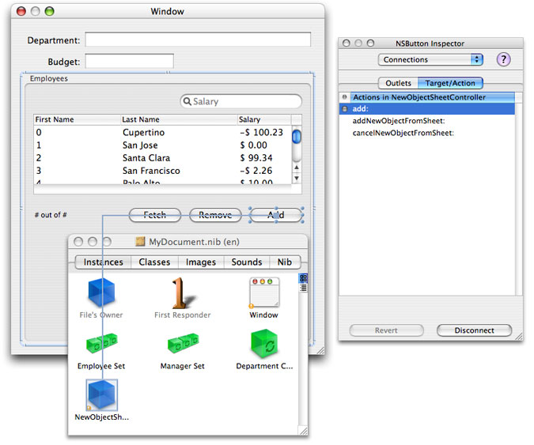
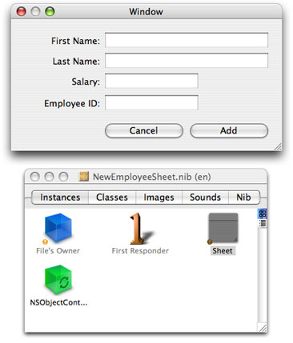

> 导航：[总目录](../../../README.md) · [documentation](../../../_indexes/documentation.md) · [NSPersistentDocument Core Data Tutorial for Mac OS X v10.4.](Introduction%20to%20NSPersistentDocument%20Core%20Data%20Tutorial%20for%20Mac%20OS%20X%20v10.4.md)


[Next](Document%20Revision%20History.md)[Previous](Document%20Metadata.md)

This document will not be modified in the future.

# A Sheet for Creating a New Employee

It is possible to use the existing application to create new employees. The Add button that is part of the automatically-created user interface is connected to the `add:` method of the Employee array controller. If you click on the button, a new instance of the array controller's entity is added to its content array. Sometimes, though, you might want a more sophisticated user interface. Specifically, some applications use a sheet to allow the user to fill in details about a new entry, and optionally discard the new entry before it is committed. An example of how this could be implemented in the current project is illustrated in [Figure 8-1](#apple-f4xwc4dqnrsv64tfmyxwi33df52wszbpkridimbqga4dcnryfvbuqmrygqwvgvzr).

__Figure 8-1__  Creating a new employee using a sheet

!

In following this section, recall that you are expected to have mastered fundamental Cocoa tools and techniques (see [Introduction to NSPersistentDocument Core Data Tutorial for Mac OS X v10.4](Introduction%20to%20NSPersistentDocument%20Core%20Data%20Tutorial%20for%20Mac%20OS%20X%20v10.4.md#apple-f4xwc4dqnrsv64tfmyxwi33df52wszbpkridimbqga4dcnryfvbuqmrqgiwvgvzr))—basic tasks such as connecting outlets and establishing bindings in Interface Builder are not described in detail.

There are a number of issues to consider in implementing the sheet. To create a new employee instance, you need a managed object context. A more subtle—but profound—aspect is that you should isolate any changes from the document, so that adding the new employee is a single action that can be undone in a single action. Moreover, it should be possible (if the user clicks Cancel) to discard the new instance without affecting the undo stack in the document.

Together, these constraints suggest a new pattern, where the sheet uses a separate managed object context. The new employee is inserted into this context when the sheet is created. If the user clicks the Add button, the employee is added to the document's main context. If the user clicks the Cancel button, the new employee is deleted and the sheet's context reset—the document's context remains unchanged.

The implementation shown here is but one of several possibilities. Management of the sheet and the managed object context are factored into a separate controller, distinct from the document object. This largely follows the coordinator design pattern (discussed in [The Model-View-Controller Design Pattern](../Cocoa%20Fundamentals%20Guide/Cocoa%20Design%20Patterns.md#apple-f4xwc4dqnrsv64tfmyxwi33df52wszbpkridimbqgazdsnzufvbuqnrnknltc) in _[Cocoa Fundamentals Guide](../Cocoa%20Fundamentals%20Guide/Introduction.md#apple-f4xwc4dqnrsv64tfmyxwi33df52wszbpkridimbqgazdsnzu)_). The goal here, though, is primarily to illustrate the use of Core Data, with comparatively few distractions; it also aims to be fairly reusable. You can adapt what you learn in the tutorial to your own needs. Which approach you take for your own project will depend on the constraints that are specific to your application.

There are several separate steps to the implementation. You need to define the functionality of a new class—the new employee sheet controller—and create a new nib file that contains the sheet.

1. The new employee controller needs to be able to do several things. It must coordinate its own managed object context—which must be configured using the managed object model from the document. The controller must also be able to add the new employee to the document's Department object's employees relationship. To do this, it needs access to that relationship, and again to the document's managed object model.

   The simplest way to satisfy all these needs is to give the new employee controller an outlet to the employees array controller. The array controller gives access to the document's managed object context (to which it is bound), gives the new employee controller an easy way to create a new Employee instance, and (since it manages it) a means to insert the new Employee into the Department's employees relationship.
2. One issue with creating the new top-level object in the nib file is that when you use bindings an object retains other objects to which it is bound. This means that bindings must be broken to ensure there are no retain cycles when a document is closed. Moreover, since the nib file the new controller owns contains top level objects and the controller’s class does not inherit from `NSWindowController`, you need to release the top level objects when the window is closed.
3. You need to support undo in the sheet.

Create in the project the files for a new class called `NewObjectSheetController`. An instance of this class is responsible for creating and managing the sheet for the new Employee object and for coordinating data between the sheet and the document.

The sheet controller uses a private managed object context. It also need to be able to access the document window, the employees array controller, an object controller in its own nib file, and the sheet. Add to the interface suitable instance variables for all these.

```objc
@interface NewObjectSheetController : NSObject
{
    IBOutlet NSWindow *documentWindow;
    IBOutlet NSArrayController *sourceArrayController;
    IBOutlet NSObjectController *newObjectController;
    IBOutlet NSPanel *newObjectSheet;

    NSManagedObjectContext *managedObjectContext;
}
```

To complete the interface, add the method declarations. The controller needs to provide accessor methods for accessing the managed object contexts, and action methods to launch the sheet, dismiss the sheet, and support undo and redo.

```objc
- (NSManagedObjectContext *)managedObjectContext;
- (NSManagedObjectContext *)documentManagedObjectContext;

- (IBAction)add:(id)sender;

- (IBAction)addNewObjectFromSheet:sender;
- (IBAction)cancelNewObjectFromSheet:sender;

- (IBAction)undo:sender;
- (IBAction)redo:sender;

@end
```


You need to add an instance of the sheet controller in the document nib file and configure it appropriately.

- Import the `NewObjectSheetController` header file into MyDocument.nib, then instantiate an instance.
- Connect the outlets as follows:

  Connect `documentWindow` to the document window.

  Connect `sourceArrayController` to the Employees array controller.
- Now disconnect the Add button from the array controller, and set its target to be the sheet controller and the action to be `add:`.



The next stage is to create and configure the user interface for the sheet.

- Create a new nib file named “NewEmployeeSheet” and add it to the project.
- Import the header file for the `NewObjectSheetController` class into the nib file. Set the File’s Owner to be an instance of `NewObjectSheetController`.
- Add an `NSObjectController` instance to the nib file. Set its entity to be Employee.

  Bind the `managedObjectContext` binding of the `NSObjectController` instance to the `managedObjectContext` key of File’s Owner.
- Connect the File’s Owner’s `newObjectController` outlet to the object controller.
- Add an `NSPanel` instance to the nib file. To the panel, add user interface elements so that it looks like the image below.

  
- Connect the File’s Owner’s `newObjectSheet` outlet to the panel.
- Connect the panel’s `delegate` outlet to the File’s Owner.
- Bind the values of the text fields to the appropriate attribute in the object controller. For example, bind the value of the First Name text field to the object controller’s `selection.firstName` key path. Ensure that the “Validates Immediately” option is selected.
- Set up the target and action for the Add and Cancel buttons. The target is File’s Owner, the actions are `addNewObjectFromSheet:` and `cancelNewObjectFromSheet:` respectively.

You need access to two different managed object contexts—one from the source array controller (the document's context), and one for the sheet controller itself. You can implement a simple accessor for the source array controller, whereas the sheet controller's accessor lazily creates the context on demand. You set the persistent store coordinator for the controller’s context to be the same as that of the document context.

Implement the `managedObjectContext` and `documentManagedObjectContext` methods as follows:

__Listing 8-1__  Managed object context accessor methods

```objc
- (NSManagedObjectContext *)documentManagedObjectContext
{
    return [sourceArrayController managedObjectContext];
}

- (NSManagedObjectContext *)managedObjectContext
{
    if (managedObjectContext == nil) {
        managedObjectContext = [[NSManagedObjectContext alloc] init];
        [managedObjectContext setPersistentStoreCoordinator:
            [[self documentManagedObjectContext] persistentStoreCoordinator]];
    }
    return managedObjectContext;
}
```


You configure the sheet in the `add:` method. The first step is to load the nib file, if necessary.

```objc
- (IBAction)add:sender
{
    if (newObjectSheet == nil) {

        NSBundle *myBundle = [NSBundle bundleForClass:[self class]];
        NSNib *nib = [[NSNib alloc] initWithNibNamed:@"NewEmployeeSheet" bundle:myBundle];

        BOOL success = [nib instantiateNibWithOwner:self topLevelObjects:nil];
        [nib release];

        if (success != YES) {
            // should present error
            return;
        }
    }
    // implementation continues...
}
```

You next need to create a new Employee instance. The easiest way is to use the object controller’s `newObject` method. It is also useful to disable undo registration to ensure that the user cannot undo the creation of the new object. This is similar to the initialization of the Department object for a new document.

```
    NSUndoManager *um = [[self managedObjectContext] undoManager];
    [um disableUndoRegistration];

    id newObject = [[newObjectController newObject] autorelease];
    [newObjectController addObject:newObject];

    [[self managedObjectContext] processPendingChanges];
    [um enableUndoRegistration];
```

Finally, you need to display the sheet. Use the `NSApplication` method, [beginSheet:modalForWindow:modalDelegate:didEndSelector:contextInfo:](https://developer.apple.com/documentation/appkit/nsapplication/1428505-beginsheet), and pass `newObjectSheetDidEnd:returnCode:contextInfo:` as the selector.

```
    [NSApp beginSheet:newObjectSheet
            modalForWindow:documentWindow
            modalDelegate:self
            didEndSelector:@selector(newObjectSheetDidEnd:returnCode:contextInfo:)
            contextInfo:NULL];
```


Implement the action methods for the Add and Cancel buttons. Both end the sheet, but with different return codes. Note that the add method also invokes [commitEditing](https://developer.apple.com/documentation/appkit/nscontroller/1531472-commitediting) on the object controller—this ensures that if the user has started editing a field, the pending changes are committed.

__Listing 8-2__  Action methods for the Add and Cancel buttons.

```objc
- (IBAction)addNewObjectFromSheet:sender
{
    [newObjectController commitEditing];
    [NSApp endSheet:newObjectSheet returnCode:NSOKButton];
}

- (IBAction)cancelNewObjectFromSheet:sender
{
    [NSApp endSheet:newObjectSheet returnCode:NSCancelButton];
}
```

When the sheet actually ends, you must respond accordingly in the implementation of `newObjectSheetDidEnd:returnCode:contextInfo:` (the method you defined in [Setting up the Sheet](#apple-f4xwc4dqnrsv64tfmyxwi33df52wszbpkridimbqga4dcnryfvbuqmrygqwvgvzt) as the callback for the sheet). If the Add button was pressed, you make a new instance of a managed object using the source array controller, and copy the copy attributes from the sheet's managed object.

Whichever button was pressed, you set the content of the sheet's object controller to `nil`, and reset the context (this disposes of all changes). Finally, you order out the sheet.

```objc
- (void)newObjectSheetDidEnd:(NSWindow *)sheet
    returnCode:(int)returnCode
    contextInfo:(void  *)contextInfo
{
    NSManagedObject *sheetObject = [newObjectController content];

    if (returnCode == NSOKButton) {

        NSManagedObject *newObject =
            [[sourceArrayController newObject] autorelease];
        [newObject setValuesForKeysWithDictionary:
            [sheetObject valuesForKeys:[[newObject class] copyKeys]]];
        [sourceArrayController addObject:newObject];
    }

    [newObjectController setContent:nil];
    [[self managedObjectContext] reset];

    [newObjectSheet orderOut:self];
}
```

In order to suppress compiler warnings for the use of the custom method (`copyKeys`) in the Employee class, you must import the Employee header file. At the top of the implementation file, add:

```objc
#import "Employee.h"
```


To take care of memory management details, the sheet controller must dispose of the sheet and the object controller when the document closes. It must also dispose of the managed object context on `dealloc`. Implement an `awakeFromNib` method to register for window closing notification from the document's window, and implement the corresponding method (`documentWindowWillClose:`) to autorelease `newObjectSheet` and `newObjectController`. Finally, implement a suitable `dealloc` method.

__Listing 8-3__  Tidying up methods

```objc
- (void)awakeFromNib
{
    [[NSNotificationCenter defaultCenter] addObserver:self
            selector:@selector(documentWindowWillClose:)
            name:NSWindowWillCloseNotification
            object:documentWindow];
}

- (void)documentWindowWillClose:(NSNotification *)note
{
    [[NSNotificationCenter defaultCenter]
        removeObserver:self name:nil object:nil];
    [newObjectSheet autorelease];
    [newObjectController autorelease];
}

- (void)dealloc
{
    [managedObjectContext release];
    [super dealloc];
}
```


Although there are only four fields in the sheet, it is still useful to properly support undo—especially if you adapt the techniques described here to a larger task. There are several steps to this. First, you have to ensure that the sheet uses the sheet controller’s managed object context’s undo manager and direct undo and redo actions to the undo manager. Second, to ensure the user interface is consistent, you should implement the `validateUserInterfaceItem:` method. And finally, unfortunately, you have to work around a bug in the implementation of undo support in AppKit.

First, implement `windowWillReturnUndoManager:` to return the private managed object context’s undo manager:

```objc
- (NSUndoManager *)windowWillReturnUndoManager:(NSWindow *)sender
{
    return [[self managedObjectContext] undoManager];
}
```

Next, implement `undo:` and `redo:` methods to direct the actions to the context’s undo manager.

```objc
- (IBAction)undo:sender
{
    [[[self managedObjectContext] undoManager] undo];
}

- (IBAction)redo:sender
{
    [[[self managedObjectContext] undoManager] redo];
}
```


To validate menu items correctly, you must implement the [validateUserInterfaceItem:](https://developer.apple.com/documentation/appkit/nsuserinterfacevalidations/1528162-validateuserinterfaceitem) method to return the appropriate value. For more details, see _[User Interface Validation](../User%20Interface%20Validation/Introduction%20to%20User%20Interface%20Validation.md#apple-f4xwc4dqnrsv64tfmyxwi33df52wszbpgeydambqga2da2i)_.

```objc
- (BOOL)validateUserInterfaceItem:(id <NSValidatedUserInterfaceItem>)anItem
{
    if ([anItem action] == @selector(undo:)) {
        return [[[self managedObjectContext] undoManager] canUndo];
    }
    if ([anItem action] == @selector(redo:)) {
        return [[[self managedObjectContext] undoManager] canRedo];
    }
    return YES;
}
```


Unfortunately, in Mac OS X version 10.4 there is a bug in the way the Application Framework determines the target for an action and subsequently directs action methods. To work around this, you must implement a subclass of `NSApplication` as shown below:

```objc
@class NewObjectSheetController;

@implementation MyApplication

- (id)targetForAction:(SEL)anAction to:(id)aTarget from:(id)sender
{
    if ((anAction != @selector(undo:)) &&
        (anAction != @selector(redo:))) {

        return [super targetForAction:anAction to:aTarget from:sender];
    }

    id keyWindowDelegate = [[self keyWindow] delegate];
    if ([keyWindowDelegate isKindOfClass:[NewObjectSheetController class]]) {
        return keyWindowDelegate;
    }
    return [super targetForAction:anAction to:aTarget from:sender];
}


- (BOOL)sendAction:(SEL)anAction to:(id)theTarget from:(id)sender
{
    if ((anAction != @selector(undo:)) &&
        (anAction != @selector(redo:))) {

        return [super sendAction:anAction to:theTarget from:sender];
    }

    id keyWindowDelegate = [[self keyWindow] delegate];
    if ([keyWindowDelegate isKindOfClass:[NewObjectSheetController class]]) {
        return [super sendAction:anAction to:keyWindowDelegate from:sender];
    }
    return [super sendAction:anAction to:theTarget from:sender];
}

@end
```

In Xcode (in the Properties inspector for the target), set the principal class (`NSPrincipalClass`) for your project to `MyApplication`.

Build and run the application.

In this section, you followed the coordinator design pattern to create a new controller object that is responsible for managing a sheet used to create a new object. The controller uses a separate managed object context to keep the new managed object, and edits to the new managed object, discrete from the document..

[Next](Document%20Revision%20History.md)[Previous](Document%20Metadata.md)

