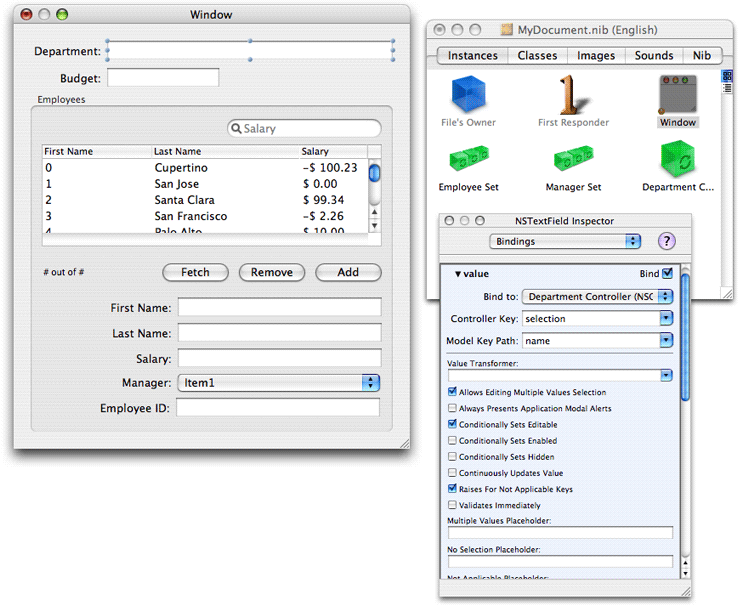

> 导航：[总目录](../../../README.md) · [documentation](../../../_indexes/documentation.md) · [NSPersistentDocument Core Data Tutorial for Mac OS X v10.4.](Introduction%20to%20NSPersistentDocument%20Core%20Data%20Tutorial%20for%20Mac%20OS%20X%20v10.4.md)


[Next](Copy%20and%20Paste.md)[Previous](Creating%20a%20Custom%20Class.md)

This document will not be modified in the future.

# Adding a Department Object

The original task specification stated that each document represents an individual department and the employees associated with it. Thus far, however, the only actions that have been taken with respect to departments has been to remove all references to them. In this section you add a Department object to the document—ensuring that only one department is associated with the document—and reconfigure the user interface appropriately.

When a new document is created, you need to create a Department object, avoiding undo registration (so that a new document does not appear edited when it is first presented). If the user opens a saved document, the Department object should already exist (it is retrieved from the persistent store). `NSDocument` provides a method—`initWithType:error:`—that is called only when a new document is created, not when it is subsequently reopened. You can therefore create the Department object in this method, and be assured that when a document is reopened a new Department object will not be created.

1. In the MyDocument class header file, add an instance variable, `department`, of type `NSManagedObject`. The class declaration should now look like this:

```objc
@interface MyDocument : NSPersistentDocument
{
    NSManagedObject *department;
}
@end
```
2. In the MyDocument class, declare and implement a set accessor method for the `department` variable, and add a suitable `dealloc` method.

```objc
- (void)setDepartment:(NSManagedObject *)aDepartment {
    if (department != aDepartment) {
        [department release];
        department = [aDepartment retain];
    }
}

- (void)dealloc {
    [self setDepartment:nil];
    [super dealloc];
}
```
3. In the MyDocument class implementation file, add the instance method `-(id)initWithType:error:`. The first step is to set `self` to the result of calling the superclass’s implementation, then check to ensure that `self` is not `nil`. The remainder of the implementation described in the following steps is contained within the conditional.

```objc
- (id)initWithType:(NSString *)type error:(NSError **)error {
    self = [super initWithType:type error:error];
    if (self != nil) {
        // implementation continues...
    }
    return self;
}
```
4. To create a new instance of department, it is easiest to use the `NSEntityDescription` convenience method `insertNewObjectForEntityForName:inManagedObjectContext:`. The method requires as its second argument a managed object context. You get this from the document itself. The method returns the new object.

```
NSManagedObjectContext *managedObjectContext = [self managedObjectContext];
[self setDepartment:[NSEntityDescription insertNewObjectForEntityForName:@"Department"
                inManagedObjectContext:managedObjectContext]];
```

   Note that this illustrates the strategy the employees array controller takes to create a new object. You don’t specify the class of the new object, you specify its entity, just as you specify an entity for the array controller.
5. When you insert the new object into the managed object context, it registers the event with its undo manager. Unless you take further steps, when a new document is created, it appears dirty (edited). To avoid undo registration for the insertion, disable undo registration before inserting the new managed object then re-enable it afterwards. Invoke `processPendingChanges` on the managed object context to ensure changes are propagated.

   After the line `NSManagedObjectContext *managedObjectContext = ...` disable undo registration:

```
[[managedObjectContext undoManager] disableUndoRegistration];
```

   After the line `[self setDepartment: ...`, process changes and re-enable undo registration:

```
[managedObjectContext processPendingChanges];
[[managedObjectContext undoManager] enableUndoRegistration];
```


The complete listing for `initWithType:error:` is shown in Listing 4-1.

__Listing 4-1__  The complete listing for `initWithType:error:`

```objc
- (id)initWithType:(NSString *)type error:(NSError **)error {
    self = [super initWithType:type error:error];
    if (self != nil) {

        NSManagedObjectContext *managedObjectContext = [self managedObjectContext];
        [[managedObjectContext undoManager] disableUndoRegistration];
        [self setDepartment:[NSEntityDescription insertNewObjectForEntityForName:@"Department"
                inManagedObjectContext:managedObjectContext]];
        [managedObjectContext processPendingChanges];
        [[managedObjectContext undoManager] enableUndoRegistration];
    }
    return self;
}
```


If you need to access the department from within any of your document’s methods, you need to fetch it from the persistent store.

In order to perform a fetch, you need a fetch request and a managed object context. The fetch request specifies what instances of a particular entity it is that you fetch. By implication, therefore, you also need at least an entity description. The managed object context is the gateway to the underlying persistent store coordinator and hence persistent stores.

You can define an accessor method for the department. The first thing it should do is check whether or not the department has already been fetched. If it has, return it immediately. If it has not already been fetched, create a fetch request for the Department entity and fetch from the document’s managed object context.

1. In the MyDocument class implementation file, add the instance method `-(NSManagedObject *)department`. The first step is to check whether `department` is not `nil`. If it is not, return it.

```objc
- (NSManagedObject *)department {
    if (department != nil) {
        return department;
    }
    // implementation continues...
    return department;
}
```
2. To use a fetch request, you need a managed object context, an `NSError` variable to pass as an argument to the fetch method, and an array variable to which the returned value is assigned. Given these, you can create the fetch request.

```
NSManagedObjectContext *moc = [self managedObjectContext];
NSError *fetchError = nil;
NSArray *fetchResults;
NSFetchRequest *fetchRequest = [[NSFetchRequest alloc] init];
```
3. As a minimum for the fetch request, you must specify the entity description for the entity that is to be fetched. You may also provide a predicate and an array of sort descriptors. In this case there is (or should be!) only one department to fetch, so neither a predicate nor sort orderings are required.

   You get the entity description using a convenience method—`entityForName:inManagedObjectContext:`—of `NSEntityDescription`. It takes as its arguments the name of an entity and a managed object context. It uses the context to find the persistent store coordinator, and from the model associated with the coordinator, the entity description with the specified name.

   You set the entity for the fetch request, then use the context to execute the fetch, and finally release the fetch request. You can wrap these steps in try/finally blocks to catch any exception that is thrown and ensure that the fetch request is released.

```
@try {
    NSEntityDescription *entity = [NSEntityDescription entityForName:@"Department"
            inManagedObjectContext:moc];
    [fetchRequest setEntity:entity];
    fetchResults = [moc executeFetchRequest:fetchRequest error:&fetchError];
} @finally {
    [fetchRequest release];
}
```
4. If there is one object in the returned array, and there is no fetch error, the object in the array is the Department object. If these conditions are not satisfied, then something has gone wrong. If there is an error, you can display it most easily using `NSDocument`'s `presentError:` method. This, however, creates an application-modal window, so ideally you should use `presentError:modalForWindow:delegate:didPresentSelector:contextInfo:` to present a panel modal just for the window, but showing how to do that lies outside the scope of this example (it requires significant additional code and explanation that is not directly related to understanding Core Data and `NSPersistentDocument`). If there is no error, but the either the result is `nil` or the count of the results array is not `1`, then something has gone wrong and the user should be alerted. Again how to do this is not shown here.

```
if ((fetchResults != nil) && ([fetchResults count] == 1) && (fetchError == nil)) {
    [self setDepartment:[fetchResults objectAtIndex:0]];
    return department;
}
if (fetchError != nil) {
    [self presentError:fetchError];
}
else {
    // should present custom error message...
}
return nil;
```


The complete listing for the `department` method is given in Listing 4-2.

__Listing 4-2__  The complete listing for the `department` method

```objc
- (NSManagedObject *)department
{
    if (department != nil) {
        return department;
    }
    NSManagedObjectContext *moc = [self managedObjectContext];
    NSFetchRequest *fetchRequest = [[NSFetchRequest alloc] init];
    NSError *fetchError = nil;
    NSArray *fetchResults;

    @try {
        NSEntityDescription *entity = [NSEntityDescription entityForName:@"Department"
                inManagedObjectContext:moc];

        [fetchRequest setEntity:entity];
        fetchResults = [moc executeFetchRequest:fetchRequest error:&fetchError];
    } @finally {
        [fetchRequest release];
    }

    if ((fetchResults != nil) && ([fetchResults count] == 1) && (fetchError == nil)) {
        [self setDepartment:[fetchResults objectAtIndex:0]];
        return department;
    }

    if (fetchError != nil) {
        [self presentError:fetchError];
    }
    else {
        // should present custom error message...
    }
    return nil;
}
```


You can now update the user interface to include the Department object. Figure 4-1 provides an example of how the user interface might look when you have finished.

1. Open the MyDocument nib file in Interface Builder. Add an `NSObjectController` instance. Its entity is Department. Bind its `managedObjectContext` to File’s Owner’s `managedObjectContext` and its `contentObject` to File’s Owner’s `department`.
2. Add two text fields to the window. Bind the value of one to the department’s name (bind to the Department object controller’s `selection.name`), the other to the department’s budget—the latter requires a number formatter (so that the input string is converted into a number object). (To set a formatter in Interface Builder, drag a number formatter from the Cocoa-Text palette onto the text field—see [Frequently Asked Questions](https://developer.apple.com/library/archive/documentation/DeveloperTools/Conceptual/IBTips/Articles/FreqAskedQuests.html#//apple_ref/doc/uid/20002102). Better still, programatically set an instance of `NSNumberFormatter` that uses Mac OS X v10.4 behavior—see [Number Formatters](https://developer.apple.com/library/archive/documentation/Cocoa/Conceptual/DataFormatting/Articles/dfNumberFormatting10_4.html#//apple_ref/doc/uid/TP40002368)).

__Figure 4-1__  User interface with department



You can now specify that the employee array controllers retrieve their employees not directly from the managed object context, but from the department’s employees relationship. This is important to ensure that when a new employee is added, it is properly added to the department’s employees relationship, and the employee’s department relationship is set.

It is important to note that you bind the array controller’s `contentSet`, not `contentArray`. Managed objects represent to-many relationships using a set, not an array.

By default, removing an object from an array controller whose content set is bound to a relationship simply removes the object from the relationship, not from the object graph. If you want the remove operation to act as a delete, you must enable the Deletes Objects On Remove option for the `contentSet` binding.

1. For each array controller, bind the `contentSet` to the department controller’s `selection.employees`.
2. Inspect the bindings for the Employees array controller that manages the content of the table view. For the `contentSet` binding, enable the Deletes Objects On Remove option.

Build and run the application again. You should find that if you set the department name and then save the document, when you reopen the document, its department’s name is properly reconstituted.

Since the document retains the department object, you must make sure that it is properly released in the case of the document being reverted. You need to implement a [revertToContentsOfURL:ofType:error:](https://developer.apple.com/documentation/appkit/nsdocument/1515122-reverttocontentsofurl) method, as follows:

```objc
- (BOOL)revertToContentsOfURL:(NSURL *)inAbsoluteURL ofType:(NSString *)inTypeName error:(NSError **)outError
{
    [self setDepartment: nil];
    return [super revertToContentsOfURL:inAbsoluteURL ofType:inTypeName error:outError];
}
```

Note that although technically correct, due to a bug in `NSObjectController` the above is still not sufficient in versions 10.4.0 to 10.4.8 of Mac OS X. The object controller maintains a handle to the department object even after a revert, so you must also set its content to `nil`. To work around this, you need to add an outlet to the controller and then connect it in Interface Builder (see [Making Connections in Cocoa Applications](https://developer.apple.com/library/archive/documentation/DeveloperTools/Conceptual/IBTips/Articles/MakingConnections.html#//apple_ref/doc/uid/20002101)).

```objc
// add outlet as an instance variable in MyDocument.h
IBOutlet NSObjectController *departmentController;

- (BOOL)revertToContentsOfURL:(NSURL *)inAbsoluteURL ofType:(NSString *)inTypeName error:(NSError **)outError
{
    [departmentController setContent:nil];
    [self setDepartment:nil];
    return [super revertToContentsOfURL:inAbsoluteURL ofType:inTypeName error:outError];
}
```


In the Cocoa document architecture, an `NSDocument` instance serves primarily as a model controller and one or more instances of `NSWindowController` serve as view controllers (see The Roles of Key Objects in Document-Based Applications). The mediator pattern extends this concept of distributed control—mediating controllers mediate the flow of data between view objects and model objects in an application (for a general discussion, see [Cocoa Design Patterns](https://developer.apple.com/library/archive/documentation/Cocoa/Conceptual/CocoaFundamentals/CocoaDesignPatterns/CocoaDesignPatterns.html#//apple_ref/doc/uid/TP40002974-CH6)).

In the current application, the Department instance serves as a “root” object for the graph of model objects. This is a common pattern in traditional Cocoa programming, and you would typically access other model objects via relationships from this root object through the document instance. Many developers may be more used to and more comfortable with the idea of keeping a reference to a root model object or collection. If you are using Core Data, however, the recommendation is not to do that (unless it is necessary or useful), but instead to hand responsibility for model object graph to the managed object context. If you need a reference to a particular instance, you either execute a fetch request, or (more commonly) retrieve it from the relevant object controller.

In this example, there is actually no _need_ to keep an explicit reference to the department in the document instance, although it is convenient for an implementation of the paste method (see [Paste](Copy%20and%20Paste.md#apple-f4xwc4dqnrsv64tfmyxwi33df52wszbpkridimbqga4dcnryfvbuqmrugmwvgvzv)) and—to reiterate—here it served the useful purpose of illustrating how to fetch objects from the document's managed object context. Since there is only ever one Department record, however, the `NSObjectController` object can simply fetch it directly. Thus, instead of binding the department object controller’s `contentObject` to the File’s Owner, you bind only its `managedObjectContext` and configure it to automatically prepare content (see [setAutomaticallyPreparesContent:](https://developer.apple.com/documentation/appkit/nsobjectcontroller/1534767-automaticallypreparescontent))—this means that at runtime, the controller automatically executes a fetch to fill its content. Since there is one and only one Department instance, the correct Department instance is retrieved. If you do need a reference to the instance, you can either fetch it or retrieve it from the object controller. You then dispense with the `department` and `setDepartment:` methods, and the explicit support for the revert method described in [Supporting Document Revert](#apple-f4xwc4dqnrsv64tfmyxwi33df52wszbpkridimbqga4dcnryfvbuqmrsgmwvgvzw).

More of the task goals have now been met through adding an instance of Department to the document.

[Next](Copy%20and%20Paste.md)[Previous](Creating%20a%20Custom%20Class.md)

