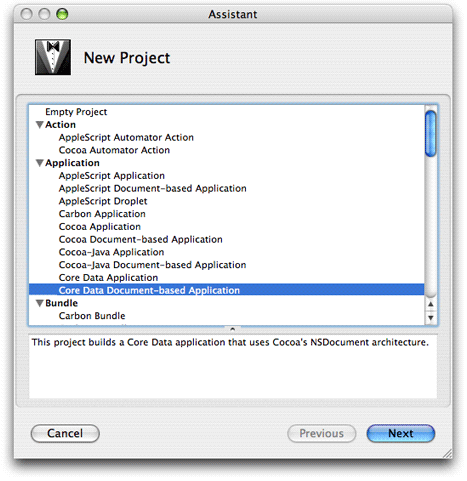
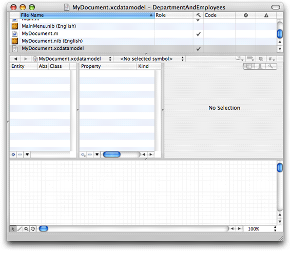
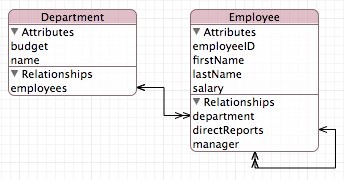
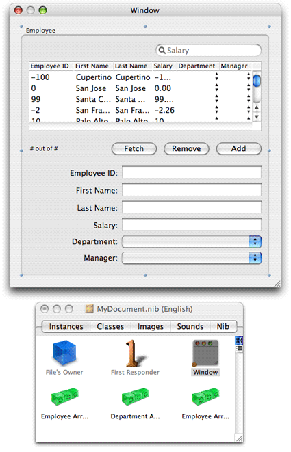
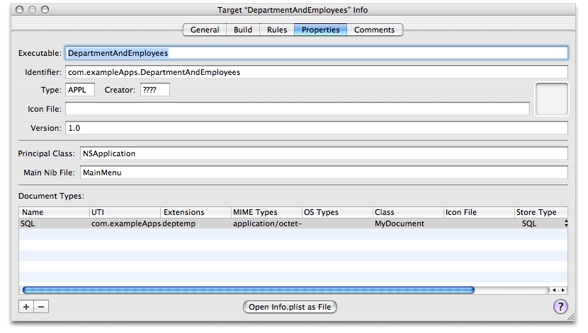

> 导航：[总目录](../../../README.md) · [documentation](../../../_indexes/documentation.md) · [NSPersistentDocument Core Data Tutorial for Mac OS X v10.4.](Introduction%20to%20NSPersistentDocument%20Core%20Data%20Tutorial%20for%20Mac%20OS%20X%20v10.4.md)

[Next](Creating%20a%20Custom%20Class.md)[Previous](Overview%20of%20the%20Tutorial.md)

This document will not be modified in the future.

# Creating the Project, Model, and Interface

This part of the tutorial guides you through building the Department and Employees application and in the process teaches you the steps essential to building a Cocoa application using Core Data and `NSPersistentDocument`.

Core Data is integrated into the Cocoa framework, so any Cocoa application can use it. The Employees and Departments application you’ll build is a Core Data document-based application. Follow these steps to create the initial project:

1. Choose New Project from the File menu.
2. Select Core Data Document-based Application in Xcode’s project Assistant window, and click the Next button (as shown in Figure 2-1).
3. Enter the project name (for example, “DepartmentAndEmployees”) and a destination folder for the project.

__Figure 2-1__  Select the Core Data Document-based Application project type

It’s common to begin developing a Cocoa application by prototyping the application’s user interface. Using Core Data, however, the first step in application development is typically to create a data model (or schema) that describes the entities that you will use in your application. Core Data uses the model to help you build more full-featured prototypes even than is possible using Cocoa and Cocoa bindings.

Xcode has a data modeling tool that you use to define the schema for your application, as shown in Figure 2-2. The tool itself is described in _[Xcode Tools for Core Data](../../Developer%20Tools/Xcode%20Tools%20for%20Core%20Data/Xcode%20Entity%20Modeling%20Tools%20for%20Core%20Data.md#apple-f4xwc4dqnrsv64tfmyxwi33df52wszbpkridimbqga3dqnbw)_. If you do not know how to use the tool, consult _Creating a Managed Object Model with Xcode_, which describes how to create a data model.

__Figure 2-2__  Data modeling tool

After creating the project, open `MyDocument.xcdatamodel` in the modeling tool by selecting its icon in the project Models folder. Use the tool to define two entities, Employee and Department as specified in Table 2-1 through Table 2-4. The diagram for the finished model should look like that shown in Figure 2-3.

Items of note and not covered in the tables:

- The class for both entities is `NSManagedObject`; neither entity is abstract.
- None of the properties is transient.
- Employee has a reciprocal relationship—a relationship to itself—that defines the manager-reports relationship.
- For this part of the tutorial, the Employee’s department relationship is optional.
- The delete rule for all relationships is Nullify.
- The minimum value for the Employee salary attribute is 0.

__Figure 2-3__  Diagram for completed data model

__Table 2-1__  Attributes for the Employee entity

| Name | Type | Optional | Default value |
| firstName | String | NO | First |
| lastName | String | NO | Last |
| employeeID | int 32 | YES | 0 |
| salary | Decimal | YES | 0 |

__Table 2-2__  Relationships for the Employee entity

| Name | Destination | To-many | Optional | Inverse |
| department | Department | NO | YES | employees |
| manager | Employee | NO | YES | directReports |
| directReports | Employee | YES | YES | manager |

__Table 2-3__  Attributes for the Department entity

| Name | Type | Optional | Default value |
| name | String | NO | Department |
| budget | Decimal | YES | 0 |

__Table 2-4__  Relationships for the Department entity

| Name | Destination | To-many | Optional | Inverse |
| employees | Employee | YES | YES | department |

Note that the relationships are all modeled in both directions. It is important that you do this to ensure the integrity of the object graph. Core Data keeps the relationships synchronized.

Now that the data model is complete, you can create the user interface. In fact, you can use the model to create a user interface quickly. This provides a useful strategy for testing a model—you can create an application very quickly with little effort and use it to exercise the model.

Open MyDocument.nib in Interface Builder. First remove the “Document Contents” text field from the document window, then follow these steps:

1. Ensure that you can see the user interface window.
2. In Xcode, click the Employee entity in the graphic view of the data modeling tool.
3. Option-drag the Employee entity node to the user interface window so that a cursor appears showing a “+” symbol. (You must make sure that Xcode is the foreground application when you start to do this—Option-clicking Xcode while it is not foreground makes it foreground and hides all other applications, including Interface Builder.)
4. When you release the mouse, you should be presented with an alert asking if you want to add an interface for one or many objects. Choose Many.
5. Interface Builder automatically creates a user interface, as illustrated in Figure 2-4. The interface contains a table view, search field, text fields for individual attributes, pop-up menu for Department and Manager, and buttons to add, remove, and fetch employees. Array controllers are also added to the nib file to manage two arrays of employees and an array of departments.

   __Figure 2-4__  Default automatic user interface

   
6. Interface Builder actually does more than is required for this tutorial. Delete the Department popup menu and the Departments array controller; also delete the Department and Manager columns in the table view. Rearrange the user interface if you wish, to make it neater.
7. Save the nib file.

You should take some time to investigate both the connections in the nib file and the behavior of the application. The user interface is created almost entirely using bindings. In particular you should note:

- The array controllers’ `managedObjectContext` binding is bound to the File’s Owner’s `managedObjectContext` (see the Bindings pane of the `NSArrayController` Inspector).
- The array controllers are set to manage an entity, not a class (see the Attributes pane of the Inspector).
- The search field has been populated with a number of predicates—one for each attribute, and an additional one to search all attributes.
- There are two array controllers to manage collections of Employees—one for the table view, and one for the pop-up menu.

Core Data supports several types of data store—XML, SQLite, and binary. Each has their own advantages and disadvantages. XML, for example, is (to an extent) human-readable, which may be particularly useful during the early stages of development when you want to ensure that data you expected to be saved to a file has in fact been stored. The XML store, however, is verbose and comparatively slow. The SQLite store is smaller and more efficient. In particular, it has the unique advantage that its entire contents do not have to be read into memory when it is opened.

By default, the project is configured with three document types, one for each store type. You can change these directly in Xcode simply by using the Properties pane in the Target Info window as illustrated in Figure 2-5. You set the extension as you would for any other document in a Cocoa document-based application and select the desired store type from the pop-up menu in the Store Type menu. Typically SQLite represents the best choice for a deployed application.

Spotlight metadata importers are associated with document types by specifying the uniform type identifiers (UTIs) that they can extract data from (see [Extracting Metadata from Documents](https://developer.apple.com/library/archive/documentation/Carbon/Conceptual/MDImporters/Concepts/Importers.html#//apple_ref/doc/uid/TP40001283)). If you plan to write a custom importer you should therefore specify a suitable UTI for your document type (for details of how to specify a UTI, see _[Uniform Type Identifiers Overview](../../File%20Management/Uniform%20Type%20Identifiers%20Overview/Introduction%20to%20Uniform%20Type%20Identifiers%20Overview.md#apple-f4xwc4dqnrsv64tfmyxwi33df52wszbpkridimbqgaytgmjz)_).

__Figure 2-5__  Properties pane of the Target Info window

You can now build and test your application. You should find that it is (almost) fully functional! You can add and remove employees, and edit their attributes. You can set an employee’s manager using the pop-up menu. The application supports undo and redo, the search field works, and you can save and open documents. If you make a mistake and enter, for example, a negative salary, then try to save the document, the application presents an alert.

You haven’t yet written any code . . .

As you test the application, however, you may start to notice some problems. The popup menu displays only the employees’ first names. First, this may not be the best way of identifying a particular employee. Second, if more than one employee share the same name, it is impossible to distinguish between them.

There are several steps that are necessary to fix these problems, all of which require a custom class for the Employee entity—which in turn requires a change to the managed object model. Specifically, you need to do the following (the implementation of these steps is described in the next section).

1. In a custom class for the Employee entity, define a custom method to return a unique derived property—a string that contains the employee’s full name and employee ID.
2. Implement the relevant key-value observing method to ensure that the derived property is updated when any of its components is changed.
3. Implement a method to set a new employee ID when a new employee is created.

The title [Creating the Project, Model, and Interface](#apple-f4xwc4dqnrsv64tfmyxwi33df52wszbpkridimbqga4dcnryfvbuqmrqgmwvgvzr) is somewhat misleading. More than just “creating the project,” in a very few steps you have completed the main task goals. In the next chapters you will refine the implementation and provide additional user-friendly behavior. Now, though, it is worth briefly reviewing what has happened.

The example so far illustrates the focus of Core Data. Your primary tasks have been to specify the data models in your application, and to implement custom logic relating to the data. The Core Data framework (in conjunction with Cocoa bindings for the user interface) has provided the infrastructure to support most of the other required behaviors.

Most of the Core Data infrastructure is hidden by the persistent document. `NSPersistentDocument` implements a number of methods to support integration with Core Data. From the perspective of the typical developer, the most important method is `managedObjectContext`. The managed object context serves as the gateway to the rest of the Core Data infrastructure. It also provides the document’s undo manager. `NSPersistentDocument` takes care of creating and setting the type of the persistent store, saving and loading data, and configuring the Core Data stack. For many applications you do not need to customize its behavior further. Later in this tutorial, however, you will override some of `NSPersistentDocument`'s methods to customize the store.

[Next](Creating%20a%20Custom%20Class.md)[Previous](Overview%20of%20the%20Tutorial.md)

