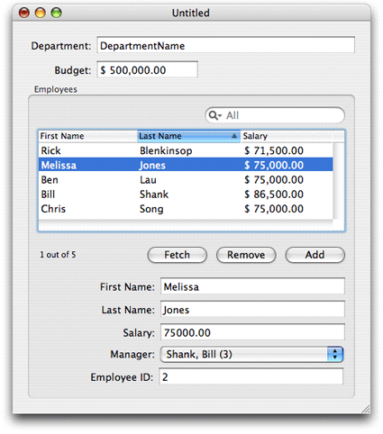

> 导航：[总目录](../../../README.md) · [documentation](../../../_indexes/documentation.md) · [NSPersistentDocument Core Data Tutorial for Mac OS X v10.4.](Introduction%20to%20NSPersistentDocument%20Core%20Data%20Tutorial%20for%20Mac%20OS%20X%20v10.4.md)

[Next](Creating%20the%20Project%2C%20Model%2C%20and%20Interface.md)[Previous](Introduction%20to%20NSPersistentDocument%20Core%20Data%20Tutorial%20for%20Mac%20OS%20X%20v10.4.md)

This document will not be modified in the future.

# Overview of the Tutorial

The task goal of this tutorial is to create a document-based application that allows a user to display and modify information about a department, employees in the department, and managerial relationships between the employees. Each document (file) contains information about a single department and the employees associated with it. The application allows the user to save a document as a file and then reopen the file, and supports undo and redo.

The final user interface may look like that shown in Figure 1-1.

__Figure 1-1__  Final User Interface

Note that the emphasis in this tutorial is on functionality. Little attempt is made to refine the user interface as would be appropriate in a shipping application. Moreover, the problem domain is chosen for consistency with other documentation and for clarity rather than for realism.

This document is intended to give a high-level view of creating a functional application with little code. Although some explanation is given of what happens behind the scenes, this document does not give an in-depth analysis of the Core Data infrastructure.

The first step illustrates the creation of a Core Data document-based project in Xcode. The major initial requirement is to create the data model, which you can use to automatically create a default user interface. Between Core Data and Cocoa bindings, this first step actually creates a fully functional application that meets most of the task goals without the need to write any code!

The first step deals only with employees. The next step is to add a Department object to the document and configure the user interface appropriately. One issue that arises here is ensuring the uniqueness of the department. You want to ensure that only one department is created per document.

This part of the tutorial illustrates one approach to supporting copy and paste in a Core Data application.

`NSDocument` provides an API to allow alert panels to be customized. Since Core Data provides such a rich infrastructure for specifying constraints on data values and error checking, it is sometimes the case that the user generates more than one error in a single operation. It is often useful, therefore, to customize the error presented to the user to make it as informative as possible.

Spotlight provides users with a means of searching for files quickly and easily. To support this, you need to associate metadata with your documents. Core Data makes it easy to do this, and to write the necessary importer.

Although this tutorial does not aim to cover all the possible features you might implement in an application, some functionality is omitted due to limitations in `NSPersistentDocument` itself. Because of the way Core Data operates, it is not possible to easily support autosaving in an `NSPersistentDocument`-based application. Core Data cannot save to a store and maintain the same changed state in a managed object context, all while keeping an unsaved stack around as the current document. For similar reasons, `NSPersistentDocument` does not support Save To operations.

[Next](Creating%20the%20Project%2C%20Model%2C%20and%20Interface.md)[Previous](Introduction%20to%20NSPersistentDocument%20Core%20Data%20Tutorial%20for%20Mac%20OS%20X%20v10.4.md)

