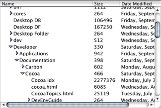

> 导航：[总目录](../../../README.md) · [documentation](../../../_indexes/documentation.md) · [Outline View Programming Topics](Introduction%20to%20Outline%20Views.md)

[Next](Writing%20an%20Outline%20View%20Data%20Source.md)[Previous](Introduction%20to%20Outline%20Views.md)

# About Outline Views

[NSOutlineView](https://developer.apple.com/documentation/appkit/nsoutlineview) is a subclass of [NSTableView](https://developer.apple.com/documentation/appkit/nstableview) that lets the user expand or collapse rows that contain hierarchical data. As in a table view, an outline view displays data for a set of related items, with rows representing individual items and columns representing the attributes of those items. Unlike a table view, items in an outline view are not in a flat list, but rather may be organized in a hierarchy, like files and folders on a hard drive, or managers and employees in an organization.

An item in an outline view is expandable if it can contain other items. An expandable item is distinguished visually by a disclosure triangle, which points to the right when the item is collapsed and points down when the item is expanded. Clicking on the disclosure triangle causes the item to be expanded or collapsed, depending on the new state of the triangle. An item can be expanded even if it contains no items. An Option-click on an item’s disclosure triangle expands or collapses all of its contained items.

When an item is expanded, the outline view can display the previous expanded or collapsed state of its contained items, if the items were previously shown. To automatically restore the entire expanded state of an outline view for previously shown items, use [setAutosaveExpandedItems:](https://developer.apple.com/documentation/appkit/nsoutlineview/1530638-autosaveexpandeditems).

Items inside an expanded item are indented. By default, as a user expands or collapses nested items, the width of the column is resized so that it is just wide enough to display the widest item, based on the width of the items and their indentation in the hierarchy. Justification follows the current system justification. To turn off automatic resizing, use [setAutoresizesOutlineColumn:](https://developer.apple.com/documentation/appkit/nsoutlineview/1532304-autoresizesoutlinecolumn). Note that an item may consist of text, an image, or anything else that can be drawn by a subclass of [NSCell](https://developer.apple.com/documentation/appkit/nscell).

An instance of `NSOutlineView` is typically displayed in an instance of [NSScrollView](https://developer.apple.com/documentation/appkit/nsscrollview), as shown below.

An outline view inherits much of its behavior from its parent class, `NSTableView`. As a result, many operations supported by a table view, such as selecting rows or columns, repositioning columns by dragging column headers, deferred activation for dragging, and so on, are also supported by an outline view. Your application has control of these features, and can configure the view’s parameters to allow or disallow certain operations. For example, you might choose not to allow editing or rearranging for specific columns.

The `NSTableView` class also provides methods for working with data, responding to mouse clicks, setting grid attributes, editing cells, and performing other operations. For more information, see _[Table View Programming Guide for Mac](../Table%20View%20Programming%20Guide%20for%20Mac/About%20Table%20Views%20in%20OS%20X%20Applications.md#apple-f4xwc4dqnrsv64tfmyxwi33df52wszbpgeydambqgazdm2i)_.

[Next](Writing%20an%20Outline%20View%20Data%20Source.md)[Previous](Introduction%20to%20Outline%20Views.md)

