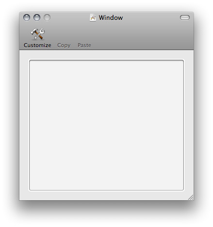

> 导航：[总目录](../../../README.md) · [documentation](../../../_indexes/documentation.md) · [Pasteboard Programming Guide](Introduction.md)


[Next](Pasteboard%20Concepts.md)[Previous](Introduction.md)

# Getting Started with Pasteboards

This tutorial offers a quick, practical, introduction to using pasteboards. It doesn’t provide in-depth explanation of how pasteboards work, or details of the methods used. These are discussed in later articles in this document.

This tutorial introduces you to pasteboards on OS X. The project is a simple document-based application that manages a window containing an image view. You can copy and paste images between documents in your application, or to and from another application. The application will not support saving and opening documents, although you can easily add this functionality.

On completion of this tutorial, you should be able to:

- Copy objects to and retrieve objects from a pasteboard
- Understand how to validate user interface items based on the content of the pasteboard

This tutorial assumes you already have familiarity with the fundamentals of Cocoa development. Concepts you must understand include:

- How to create a new Xcode project
- How to configure a user interface in Interface Builder
- How to define and implement a [simple class](https://developer.apple.com/library/archive/documentation/General/Conceptual/DevPedia-CocoaCore/ModelObject.html#//apple_ref/doc/uid/TP40008195-CH31)

You must have at least either worked through _[Start Developing Mac Apps Today](https://developer.apple.com/library/archive/referencelibrary/GettingStarted/RoadMapOSX/index.html#//apple_ref/doc/uid/TP40012262)_ or gained equivalent experience using other examples.

It is also helpful to understand:

- The document architecture

  You don’t need to understand the document architecture in detail—the application will not support saving and opening documents, although you can easily add these features. The goal is simply to provide an application that supports copy and paste between multiple windows, and this is most easily achieved using the document architecture. If you want to know more about the document architecture, read _[Mac App Programming Guide](../../General/Mac%20App%20Programming%20Guide/About%20OS%20X%20App%20Design.md#apple-f4xwc4dqnrsv64tfmyxwi33df52wszbpkridimbqgeydknbt)_.
- Toolbars

  The document makes use of a toolbar to illustrate user interface validation.
- User interface validation

  User interface validation provides a standard way to set the state of interface items as appropriate for the current application context. In this tutorial, it is used to disable the Paste toolbar item if there is no suitable data on the pasteboard. You don’t need to know more than this, but for more details see _[User Interface Validation](../User%20Interface%20Validation/Introduction%20to%20User%20Interface%20Validation.md#apple-f4xwc4dqnrsv64tfmyxwi33df52wszbpgeydambqga2da2i)_.

The main stages of the tutorial are as follows:

- Create a simple document-based application
- Configure the document class to interact with a simple user interface
- Configure the document user interface
- Add copy and paste methods to the document
- Add user interface validation to the application

Create a new Xcode Cocoa document-based application. Call your new project CopyImage, or something like that.

The document maintains a simple user interface that contains an image view. It knows how to copy an image from the image view, and paste an image into the image view.

Update MyDocument.h to this:

```objc
#import <Cocoa/Cocoa.h>

@interface MyDocument : NSDocument
{
    NSImageView *imageView;
}
@property (nonatomic, retain) IBOutlet NSImageView *imageView;
- (IBAction)copy:sender;
- (IBAction)paste:sender;
@end
```

Update MyDocument.m. _In addition to the methods provided by the template_, synthesize the property and add stub implementations of the `copy:` and `paste:` methods: methods:

```objc
@synthesize imageView;
- (IBAction)copy:sender {
}
- (IBAction)paste:sender {
}
```


To the document window:

- Add an image view
- Connect the document’s (File’s Owner’s) `imageView` outlet to the image view
- Add a toolbar
- Add two toolbar items to the toolbar—one labeled “Copy”, the other “Paste”
- Connect the “Copy” and “Paste” toolbar items’ actions to File’s Owner’s `copy:` and `paste:` actions respectively

You should end up with a document window that looks like this:



There are three steps to writing to a pasteboard:

1. Get a pasteboard
2. Clear the pasteboard’s contents
3. Write an array of objects to the pasteboard

Objects you write to the pasteboard must adopt the [NSPasteboardWriting Protocol Reference](https://developer.apple.com/documentation/appkit/nspasteboardwriting) protocol. Several of the common Foundation and Application Kit classes implement the protocol including `NSString`, `NSImage`, `NSURL`, and `NSColor`. (If you want to write an instance of a custom class, either it must adopt the `NSPasteboardWriting` protocol or you can wrap it in an instance of an [NSPasteboardItem](https://developer.apple.com/documentation/appkit/nspasteboarditem)—see [Custom Data](Custom%20Data.md#apple-f4xwc4dqnrsv64tfmyxwi33df52wszbpkridimbqga4dcmrsfvjvomi).) Since `NSImage` adopts the `NSPasteboardWriting` protocol, you can write an instance directly to a pasteboard.

In the MyDocument class, complete the implementation of `copy:` as follows:

```objc
- (IBAction)copy:sender {
    NSImage *image = [imageView image];
    if (image != nil) {
        NSPasteboard *pasteboard = [NSPasteboard generalPasteboard];
        [pasteboard clearContents];
        NSArray *copiedObjects = [NSArray arrayWithObject:image];
        [pasteboard writeObjects:copiedObjects];
    }
}
```


Build and run your application.

- Drag an image from Finder or from another application into a document’s image view
- Press Copy in the toolbar

You should find that you can paste the image into another application. (For example, in Text Edit, create a new Rich Text document then select Edit > Paste.)

Before you try to read from a pasteboard, you need to check that it contains data you want.

You check that the pasteboard contains objects you’re interested in by sending it a [canReadObjectForClasses:options:](https://developer.apple.com/documentation/appkit/nspasteboard/1533360-canreadobject) message. The first argument is an array that tell the pasteboard what classes object you’re interested in.

Classes you ask to read from the pasteboard must adopt the [NSPasteboardReading](https://developer.apple.com/documentation/appkit/nspasteboardreading) protocol. Like writing, several of the common Foundation and Application Kit classes implement the protocol, again including `NSString`, `NSImage`, `NSURL`, and `NSColor`. (Similarly, if you want to read an instance of a your own class class, either it must adopt the `NSPasteboardReading` protocol or, when you write it to the pasteboard, you can wrap it in an instance of an `NSPasteboardItem` and retrieve that—see [Custom Data](Custom%20Data.md#apple-f4xwc4dqnrsv64tfmyxwi33df52wszbpkridimbqga4dcmrsfvjvomi).) Since `NSImage` adopts the `NSPasteboardReading` protocol, you can read an instance directly from the pasteboard

If the pasteboard does contain objects you’re interested in, you can retrieve them by sending the pasteboard a [readObjectsForClasses:options:](https://developer.apple.com/documentation/appkit/nspasteboard/1524454-readobjectsforclasses). message. The pasteboard determines which objects it contains that can be represented using the classes you specify, and returns an array of the best matches (if any).

In the MyDocument class, complete the implementation of `paste:` as follows:

```objc
- (IBAction)paste:sender {
    NSPasteboard *pasteboard = [NSPasteboard generalPasteboard];
    NSArray *classArray = [NSArray arrayWithObject:[NSImage class]];
    NSDictionary *options = [NSDictionary dictionary];

    BOOL ok = [pasteboard canReadObjectForClasses:classArray options:options];
    if (ok) {
        NSArray *objectsToPaste = [pasteboard readObjectsForClasses:classArray options:options];
        NSImage *image = [objectsToPaste objectAtIndex:0];
        [imageView setImage:image];
    }
}
```


Build and run your application:

- Drag an image from Finder or from another application into the document window
- Press Copy in the toolbar
- Create a new document (select File > New)
- In the new document, press Paste in the toolbar

You should find that you can paste the image from the first document into the second.
If you have another application that allows you to copy and paste images, you should also find that you can copy and paste between that application and the tutorial application.

It’s good practice to restrict the user to performing actions that will have an effect. In the current application, you can press the Paste toolbar item even if there is no image on the pasteboard. It would be better to disable the item if there isn’t anything on the pasteboard that can be pasted.

User interface validation—supported by the [NSUserInterfaceValidations](https://developer.apple.com/documentation/appkit/nsuserinterfacevalidations) protocol—provides a standard way to set the state of interface items as appropriate for the current application context. The protocol contains a single method—[validateUserInterfaceItem:](https://developer.apple.com/documentation/appkit/nsuserinterfacevalidations/1528162-validateuserinterfaceitem)—that returns a Boolean which specifies whether or not the user interface element passed as the argument should be enabled.

When you implement `validateUserInterfaceItem:`, you typically first check the action associated with the user interface element (you don’t want to enable or disable every item on the basis of a single test). In this case, you’re only interested if the associated action is `paste:`. If it is, you then need to check whether there’s anything on the pasteboard that can be pasted. You can use [canReadObjectForClasses:options:](https://developer.apple.com/documentation/appkit/nspasteboard/1533360-canreadobject) to ask the pasteboard if it contains any data that can be converted into an `NSImage` object.

In your document class, implement `validateUserInterfaceItem:` as follows:

```objc
- (BOOL)validateUserInterfaceItem:(id < NSValidatedUserInterfaceItem >)anItem {

    if ([anItem action] == @selector(paste:)) {
        NSPasteboard *pasteboard = [NSPasteboard generalPasteboard];
        NSArray *classArray = [NSArray arrayWithObject:[NSImage class]];
        NSDictionary *options = [NSDictionary dictionary];
        return [pasteboard canReadObjectForClasses:classArray options:options];
    }
    return [super validateUserInterfaceItem:anItem];
}
```

If you build and run your application, you should find that you can copy and paste images as before. You should also, though, find that if you haven’t copied an image, the Paste toolbar item is disabled.

[Next](Pasteboard%20Concepts.md)[Previous](Introduction.md)

