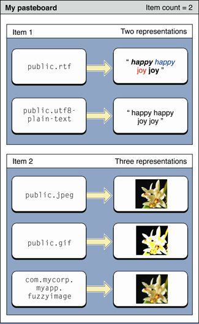

> 导航：[总目录](../../../README.md) · [documentation](../../../_indexes/documentation.md) · [Pasteboard Programming Guide](Introduction.md)

[Next](Copying%20to%20a%20Pasteboard.md)[Previous](Getting%20Started%20with%20Pasteboards.md)

# Pasteboard Concepts

On OS X, a number of operations are supported by a pasteboard server process. The most obvious is copy and paste, however dragging and Services operations are also mediated using pasteboards. In Cocoa, you access the pasteboard server through an `NSPasteboard` object. This article describes how the pasteboard process works.

A pasteboard is a standardized mechanism for exchanging data within an application or between applications. The most familiar use for pasteboards is handling copy and paste operations:

- When a user selects data in an application and chooses the Copy (or Cut) menu item, the selected data is placed onto a pasteboard.
- When the user chooses the Paste menu item (either in the same or a different application), the data on a pasteboard is copied to the current application.

Perhaps less obviously, Find operations are also supported by pasteboards, as are dragging and Services operations:

- When a user begins a drag, the drag data is added to a pasteboard. If the drag ends with a drop action, the receiving application retrieves the drag data from the pasteboard.
- If a translation service is requested, the requesting application places the data to be translated onto a pasteboard. The service retrieves this data, performs the translation, and places the translated data back onto the pasteboard.

Because they may be used to transfer data between applications, pasteboards exist in a special global memory area separate from application processes—this is described in more detail in [The Pasteboard Server](#apple-f4xwc4dqnrsv64tfmyxwi33df52wszbpkridimbqga4dcmbrfvjvooa). This implementation detail, though, is abstracted away by the `NSPasteboard` class and its methods. All you have to do is interact with the pasteboard object.

The basic tasks you want to perform, regardless of the operation, are to (a) write data to a pasteboard and (b) read data from a pasteboard. These tasks are conceptually very simple, but mask a number of important details. In practical terms, the main underlying issue that adds complexity is that there may be a number of ways to represent data—this leads in turn to considerations of efficiency. Furthermore, from the system’s perspective, there are additional issues to consider. These are discussed in the following sections.

Pasteboards may be public or private, and may be used for a variety of purposes. There are several standard pasteboards provided for well-defined operations system-wide:

- `NSGeneralPboard`—for cut, copy, and paste
- `NSRulerPboard`—for copy and paste of rulers
- `NSFontPboard`—for cut, copy, and paste of `NSFont` objects
- `NSFindPboard`—application-specific find panels can share a sought after text value
- `NSDragPboard`—for graphical drag and drop operations

Typically you use one of the system-defined pasteboards, but if necessary you can create your own pasteboard for exchanges that fall outside the predefined set using [pasteboardWithName:](https://developer.apple.com/documentation/appkit/nspasteboard/1531026-init) If you invoke [pasteboardWithUniqueName](https://developer.apple.com/documentation/appkit/nspasteboard/1528936-withuniquename), the pasteboard server will provide you with a uniquely-named pasteboard.

Each piece of data placed onto a pasteboard is considered a pasteboard _item_. The pasteboard can hold multiple items. Applications can place or retrieve as many items as they wish. For example, say a user selection in a browser window contains both text and an image. The pasteboard lets you copy the text and the image to the pasteboard as separate items. An application pasting multiple items can choose to take only those that is supports (the text, but not the image, for example).

Pasteboard operations are often carried out between two different applications. Neither application has knowledge about the other and the kinds of data each can handle. To maximize the potential for sharing, a pasteboard can hold multiple representations of the same pasteboard _item_. For example, a rich text editor might provide RTFD, RTF, and `NSString` representations of the copied data. An item that is added to a pasteboard specifies what representations it is able to provide.

Each representation of an item is identified by a different Unique Type Identifier (UTI). (A UTI is simply a string that uniquely identifies a particular data type. For more information, see _[Uniform Type Identifiers Overview](../../File%20Management/Uniform%20Type%20Identifiers%20Overview/Introduction%20to%20Uniform%20Type%20Identifiers%20Overview.md#apple-f4xwc4dqnrsv64tfmyxwi33df52wszbpkridimbqgaytgmjz)_.) The UTI provides a common means to identify to identify data types.

For example, suppose an application supported selection of rich text and images. It may want to place on a pasteboard both rich text and Unicode versions of a text selection and different representations of an image selection. Each representation of each item is stored with its own data, as shown in [Figure 1](#apple-f4xwc4dqnrsv64tfmyxwi33df52wszbpkridimbqga4dcmbrfvjvooi). You can declare your own UTIs to support your own custom data types.

__Figure 1__  Pasteboard items and representations

In general, to maximize the potential for sharing, pasteboard items should provide as many different representations as possible (see [Custom Data](Custom%20Data.md#apple-f4xwc4dqnrsv64tfmyxwi33df52wszbpkridimbqga4dcmrsfvjvomi)). Theoretically this may lead to concerns regarding efficiency, in practice, however, these are mitigated by the way the items provide different representations—see [Promised Data](#apple-f4xwc4dqnrsv64tfmyxwi33df52wszbpkridimbqga4dcmbrfvjvomjq).

A pasteboard reader must find the data type that best suits its capabilities (if any). Typically, this means selecting the richest type available. In the previous example, a rich text editor might provide RTFD, RTF, and `NSString` representations of copied data. An application that supports rich text but without images should retrieve the RTF representation; an application that only supports plain text should retrieve the `NSString` object, whereas an image-editing application might not be able to use the text at all.

If a pasteboard item supports multiple representations, it is typically impractical or time- and resource-consuming to put the data for each representation onto the pasteboard. For example, say your application places an image on the pasteboard. For maximum compatibility, it might be useful for the image to provide a number of different representations, including PNG, JPEG, TIFF, GIF, and so on. Creating each of these representations, however, would require time and memory.

Rather than requiring an item to provide all of the representations it offers, a pasteboard only asks for the first representation in the list of representations an item offers. If a paste recipient wants a different representation, the item can generate it when it’s requested.

You can also place an item on a pasteboard and specify that one or more representations of the item be provided by some other object. To do this, you specify a data provider for a particular type on the pasteboard item. The data provider must conform to the [NSPasteboardItemDataProvider Protocol](https://developer.apple.com/documentation/appkit/nspasteboarditemdataprovider) protocol to provide the corresponding data on demand.

The change count is a computer-wide variable that increments every time the contents of the pasteboard changes (a new owner is declared). An independent change count is maintained for each named pasteboard. By examining the change count, an application can determine whether the current data in the pasteboard is the same as the data it last received. The `changeCount` and `clearContents` methods return the change count.

Whether the data is transferred between objects in the same application or two different applications, in a Cocoa application the interface is the same—an `NSPasteboard` object accesses a shared repository where writers and readers meet to exchange data. The writer, referred to as the pasteboard owner, deposits data on a pasteboard instance and moves on. The reader then accesses the pasteboard asynchronously, at some unspecified point in the future. By that time, the writer object may not even exist anymore. For example, a user may have closed the source document or quit the application.

Consequently, when moving data between two different applications, and therefore two different address spaces, a third memory space gets involved so the data persists even in the absence of the source. `NSPasteboard` provides access to a third address space—a pasteboard server process (`pbs`)—that is always running in the background. The pasteboard server maintains an arbitrary number of individual pasteboards to distinguish among several concurrent data transfers.

Except where errors are specifically mentioned in the `NSPasteboard` method descriptions, any communications error with the pasteboard server raises an`NSPasteboardCommunicationException`.

[Next](Copying%20to%20a%20Pasteboard.md)[Previous](Getting%20Started%20with%20Pasteboards.md)

