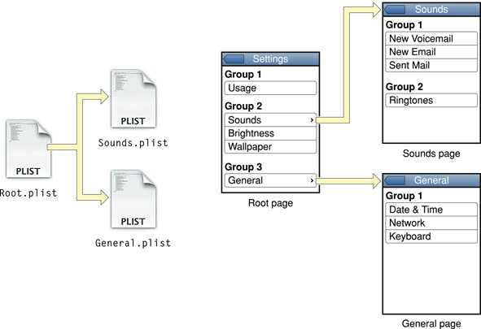
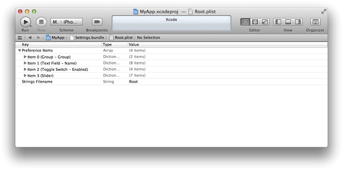
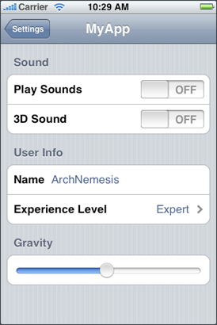

> 导航：[总目录](../../../README.md) · [文档](../../../_indexes/documentation.md) · [偏好与设置编程指南](About%20Preferences%20and%20Settings.md)


[下一页](Document%20Revision%20History.md)[上一页](Storing%20Preferences%20in%20iCloud.md)

# 实现 iOS Settings Bundle

在 iOS 中，Foundation 框架提供了存储偏好设置数据的底层机制。至于如何呈现偏好设置，应用有两种选择：

- 在应用内部显示偏好设置。
- 使用 Settings [bundle](https://developer.apple.com/library/archive/documentation/General/Conceptual/DevPedia-CocoaCore/Bundle.html#//apple_ref/doc/uid/TP40008195-CH4)，从「设置」应用中管理偏好设置。

选择哪种方式取决于你期望用户如何与偏好设置交互。一般来说，Settings bundle 是显示偏好设置的首选机制。不过，游戏以及其他包含配置选项或需要频繁访问的偏好设置的应用，可能更愿意把它们放在应用内部呈现。无论以哪种方式呈现，你都要用 [NSUserDefaults](https://developer.apple.com/library/archive/documentation/LegacyTechnologies/WebObjects/WebObjects_3.5/Reference/Frameworks/ObjC/Foundation/Classes/NSUserDefaults/Description.html#//apple_ref/occ/cl/NSUserDefaults) 类在代码中访问偏好设置的值。

本章聚焦于如何为你的应用创建 Settings bundle。_Settings bundle_ 中包含了描述偏好设置结构和呈现样式的文件，「设置」应用会利用这些信息为你的应用创建一个条目，并显示你自定义的偏好设置页面。

关于如何管理和呈现设置与配置选项的指导原则，请参阅 _iOS Human Interface Guidelines_。

「设置」应用实现了一套层级式页面，用于浏览应用的偏好设置。「设置」应用的主页面列出了那些偏好设置可以被自定义的系统应用和第三方应用。选中某个第三方应用，就会进入该应用的偏好设置。

每个带有 Settings bundle 的应用至少有一页偏好设置，称为 _主页面（main page）_。如果你的应用只有寥寥几项偏好设置，那么主页面可能就是你需要的全部。但如果偏好设置太多，主页面放不下，你可以创建从主页面或其他子页面链接出去的子页面。可创建的子页面数量没有具体限制，但你应当尽量让偏好设置保持简单、易于浏览。

每个页面的内容由一个或多个你所配置的控件构成。表 4-1 列出了「设置」应用支持的控件类型，并说明了每种类型的用途。表中还列出了存储在 Settings bundle 配置文件中的原始键名。

__表 4-1__  偏好设置控件类型

| 控件类型 | 说明 |
| --- | --- |
| Text field | 文本字段类型显示一个标题（可选）和一个可编辑的文本字段。对于需要用户指定自定义字符串值的偏好设置，可以使用这种类型。  该类型的键是 `PSTextFieldSpecifier`。 |
| Title | 标题类型显示一个只读的字符串值。你可以用它来展示只读的偏好设置值。（如果偏好设置中存的是晦涩或不直观的值，这种类型可以把可能的取值映射成自定义字符串。）  该类型的键是 `PSTitleValueSpecifier`。 |
| Toggle switch | 开关类型显示一个「开／关」切换按钮。对于只能取两个值之一的偏好设置，可以使用这种类型。虽然通常用它表示布尔值偏好设置，但它也可以用于取值不是布尔值的偏好设置。  该类型的键是 `PSToggleSwitchSpecifier`。 |
| Slider | 滑块类型显示一个滑块控件。对于表示某个取值范围的偏好设置，可以使用这种类型。该类型的值是一个实数，其最小值和最大值由你指定。  该类型的键是 `PSSliderSpecifier`。 |
| Multivalue | 多值类型让用户从一组值中选择一个。对于支持一组互斥取值的偏好设置，可以使用这种类型。这些值可以是任意类型。  该类型的键是 `PSMultiValueSpecifier`。 |
| Group | 分组类型用于在同一页面上组织成组的偏好设置。分组类型本身并不代表一项可配置的偏好设置，它只是包含一个标题字符串，显示在一项或多项可配置偏好设置的正上方。  该类型的键是 `PSGroupSpecifier`。 |
| Child pane | 子面板类型让用户可以跳转到新的一页偏好设置。你可以用这种类型来实现层级式偏好设置。关于如何配置和使用这种偏好设置类型的更多信息，请参阅[层级式偏好设置](#apple-f4xwc4dqnrsv64tfmyxwi33df52wszbpgeydambqga2ts2jninedmlktk42a)。  该类型的键是 `PSChildPaneSpecifier`。 |

关于每种偏好设置类型格式的详细信息，请参阅 _[Settings Application Schema Reference](../../Settings%20Application%20Schema%20Reference/Introduction.md#apple-f4xwc4dqnrsv64tfmyxwi33df52wszbpkridimbqga3tanzr)_。要了解如何创建和编辑「设置」页面文件，请参阅[创建和修改 Settings bundle](#apple-f4xwc4dqnrsv64tfmyxwi33df52wszbpgeydambqga2ts2jninedmlktk43a)。

Settings [bundle](https://developer.apple.com/library/archive/documentation/General/Conceptual/DevPedia-CocoaCore/Bundle.html#//apple_ref/doc/uid/TP40008195-CH4) 的名称是 `Settings.bundle`，位于你的应用 bundle 的顶层目录中。这个 bundle 包含一个或多个「设置」页面文件，用于描述各页偏好设置。它还可能包含显示偏好设置所需的其他支持文件，例如图像或本地化字符串。表 4-2 列出了一个典型 Settings bundle 的内容。

__表 4-2__  `Settings.bundle` 目录的内容

| 项目名称 | 说明 |
| --- | --- |
| `Root.plist` | 包含根页面偏好设置的「设置」页面文件。该文件的名称必须是 `Root.plist`。它的内容在[「设置」页面文件格式](#apple-f4xwc4dqnrsv64tfmyxwi33df52wszbpgeydambqga2ts2jninedmlktk43q)中有更详细的描述。 |
| 其他 `.plist` 文件 | 如果你用子面板构建了一套层级式偏好设置，那么每个子面板的内容都存储在单独的「设置」页面文件中。你要负责为这些文件命名，并把它们与正确的子面板关联起来。 |
| 一个或多个 `.lproj` 目录 | 这些目录存放「设置」页面文件的本地化字符串资源。每个目录包含一个 strings 文件，其名称在你的「设置」页面文件中指定。这些 strings 文件为偏好设置提供要显示的本地化字符串。 |
| 其他图像 | 如果你使用了滑块控件，可以把滑块所需的图像存放在 bundle 的顶层目录中。 |

除了 Settings bundle，应用 bundle 中还可以包含一个用于应用设置的自定义图标。「设置」应用会把你提供的图标显示在你的应用偏好设置条目旁边。关于应用图标以及如何指定它们的信息，请参阅 _[App Programming Guide for iOS](https://developer.apple.com/library/archive/documentation/iPhone/Conceptual/iPhoneOSProgrammingGuide/Introduction/Introduction.html#//apple_ref/doc/uid/TP40007072)_。

「设置」应用启动时，会检查每个自定义应用是否带有 Settings bundle。对于找到的每个自定义 bundle，它都会加载该 bundle，并在「设置」主页面中显示对应应用的名称和图标。当用户点按属于你的应用的那一行时，「设置」应用会加载你的 Settings bundle 中的 `Root.plist` 页面文件，并用它构建你的应用的偏好设置主页面。

除了加载 bundle 中的 `Root.plist` 页面文件，「设置」应用还会按需加载该文件对应的语言专属资源。每个「设置」页面文件都可以关联一个 `.strings` 文件，其中包含所有用户可见字符串的本地化值。在准备显示你的偏好设置时，「设置」应用会按用户的首选语言查找字符串资源，并在显示之前把它们替换进你的偏好设置页面。

每个「设置」页面文件都以 iPhone Settings [属性列表](https://developer.apple.com/library/archive/documentation/General/Conceptual/DevPedia-CocoaCore/PropertyList.html#//apple_ref/doc/uid/TP40008195-CH44)文件格式存储，这是一种结构化的文件格式。编辑「设置」页面文件最简单的方式是使用 Xcode 内置的编辑器，参阅[准备编辑「设置」页面](#apple-f4xwc4dqnrsv64tfmyxwi33df52wszbpgeydambqga2ts2jninedmlktk4zda)。你也可以用随 Xcode 工具一起提供的 Property List Editor 应用来编辑属性列表文件。

每个「设置」页面文件的根元素包含表 4-3 中列出的键。实际上只有一个键是必需的，但建议你把两个都写上。

__表 4-3__  偏好设置「设置」页面文件的根级键

| 键 | 类型 | 值 |
| --- | --- | --- |
| `PreferenceSpecifiers`（必需） | Array | 该键的值是一个[字典数组](https://developer.apple.com/library/archive/documentation/General/Conceptual/DevPedia-CocoaCore/Collection.html#//apple_ref/doc/uid/TP40008195-CH10)，其中每个字典都包含单个控件的信息。控件类型的列表参见[表 4-1](#apple-f4xwc4dqnrsv64tfmyxwi33df52wszbpgeydambqga2ts2jninedmlktk4za)。关于与各个控件关联的键的说明，请参阅 _[Settings Application Schema Reference](../../Settings%20Application%20Schema%20Reference/Introduction.md#apple-f4xwc4dqnrsv64tfmyxwi33df52wszbpkridimbqga3tanzr)_。 |
| `StringsTable` | String | 与本文件关联的 strings 文件的名称。该文件的副本（包含相应的本地化字符串）应当放在你的 bundle 中每个语言专属的工程目录下。如果不包含这个键，本文件中的字符串就不会被本地化。关于这些字符串如何被使用的信息，请参阅[本地化资源](#apple-f4xwc4dqnrsv64tfmyxwi33df52wszbpgeydambqga2ts2jninedmlktk44q)。 |

如果你打算按层级组织偏好设置，那么你定义的每个页面都必须有自己单独的 `.plist` 文件。每个 `.plist` 文件只包含在该页面上显示的那组偏好设置。你的应用的主偏好设置页面始终存放在名为 `Root.plist` 的文件中，其他页面则可以随意命名。

要指定父页面与子页面之间的链接，请在父页面中加入一个子面板控件。子面板控件会创建一行，点按该行就会显示新的一页设置。子面板控件的 `File` 键标识了存放子页面内容的 `.plist` 文件的名称，`Title` 键标识了子页面的标题；该标题同时也用作显示子页面的那个控件的文字。「设置」应用会在子页面上自动提供导航控件，让用户可以返回父页面。

图 4-1 展示了这套层级式页面是如何工作的。图的左侧是各个 `.plist` 文件，右侧则是相应页面之间的关系。

__图 4-1__  使用子面板组织偏好设置



关于子面板控件及其相关键的更多信息，请参阅 _[Settings Application Schema Reference](../../Settings%20Application%20Schema%20Reference/Introduction.md#apple-f4xwc4dqnrsv64tfmyxwi33df52wszbpkridimbqga3tanzr)_。

由于偏好设置中包含用户可见的字符串，你应当随 Settings bundle 一起提供这些字符串的本地化版本。对于 bundle 所支持的每一种本地化，每一页偏好设置都可以关联一个 `.strings` 文件。当「设置」应用遇到支持本地化的键时，会到相应的本地化 `.strings` 文件中查找匹配的键；如果找到了，就显示与该键关联的值。

在查找 `.strings` 文件这类本地化资源时，「设置」应用遵循与其他 iOS 应用相同的规则：首先尝试查找与用户首选语言设置相匹配的资源本地化版本；如果不存在这样的资源，就选择一种合适的备用语言。

关于 strings 文件的格式、语言专属的工程目录，以及如何从 bundle 中获取语言专属资源的信息，请参阅 _[国际化与本地化指南](../../Mac%20OSX/Internationalization%20and%20Localization%20Guide/About%20Internationalization%20and%20Localization.md#apple-f4xwc4dqnrsv64tfmyxwi33df52wszbpgeydambqge3tc2i)_。

Xcode 提供了一个模板，用于向当前工程添加 Settings [bundle](https://developer.apple.com/library/archive/documentation/General/Conceptual/DevPedia-CocoaCore/Bundle.html#//apple_ref/doc/uid/TP40008195-CH4)。默认的 Settings bundle 包含一个 `Root.plist` 文件和一个用于存放本地化资源的默认语言目录。你可以按需扩展这个 bundle，加入 Settings bundle 所需的其他属性列表文件和资源。

要向 Xcode 工程中添加 Settings bundle：

1. 选择 File > New > New File。
2. 在 iOS 下选择 Resource，然后选中 Settings Bundle 模板。
3. 把文件命名为 `Settings.bundle`。

除了把新的 Settings bundle 添加到工程中，Xcode 还会自动把该 bundle 加入应用 target 的 Copy Bundle Resources 构建阶段。因此，你要做的只是修改 Settings bundle 中的[属性列表](https://developer.apple.com/library/archive/documentation/General/Conceptual/DevPedia-CocoaCore/PropertyList.html#//apple_ref/doc/uid/TP40008195-CH44)文件，并添加所需的资源。

新建的 Settings bundle 具有如下结构：

```
Settings.bundle/
    Root.plist
    en.lproj/
        Root.strings
```


在编辑 Settings bundle 中的任何属性列表文件之前，你应当先配置 Xcode 编辑器，让它把这些文件的内容格式化为 iPhone Settings 格式。Xcode 会自动对 `Root.plist` 文件这样处理，但其他属性列表文件可能需要你手动设置格式。要把某个文件格式化为 iPhone Settings，请执行以下操作：

1. 选中该文件。
2. 在编辑器窗口中按住 Control 点按，选择 Property List Type > iPhone Settings plist（如果尚未选中的话）。

   格式化属性列表可以让文件内容更易于理解和编辑。Xcode 会替换成适合所选格式的、便于阅读的字符串（如图 4-2 所示）。

   __图 4-2__  格式化后的 `Root.plist` 文件内容

   

本节介绍如何配置一个「设置」页面，让它显示你想要的控件。本教程的目标是创建一个如图 4-3 所示的页面。如果你还没有为工程创建 Settings bundle，应当先按[添加 Settings bundle](#apple-f4xwc4dqnrsv64tfmyxwi33df52wszbpgeydambqga2ts2jninedmlktk4yq)中的说明创建，再继续下面的步骤。

__图 4-3__  一个根「设置」页面



1. 展开 Preference Items 键，显示模板自带的默认条目。
2. 把 `Item 0` 的标题改为 `Sound`。

   - 展开 `Preference Items` 中的 `Item 0`。
   - 把 `Title` 键的值从 `Group` 改为 `Sound`。
   - 保持 `Type` 键为 `Group` 不变。
   - 点按该条目的展开三角形，收起其内容。
3. 为改名后的 Sound 分组创建第一个开关。

   - 选中 `Preference Items` 中的 `Item 2`（开关条目），选择 Edit > Cut。
   - 选中 `Item 0`，选择 Edit > Paste。（这会把开关条目移到文本字段条目之前。）
   - 展开该开关条目，显示它的配置键。
   - 把 `Title` 键的值改为 `Play Sounds`。
   - 把 `Identifier` 键的值改为 `play_sounds_preference`。
   - 点按该条目的展开三角形，收起其内容。
4. 为 Sound 分组创建第二个开关。

   - 选中 `Item 1`（Play Sounds 开关）。
   - 选择 Edit > Copy。
   - 选择 Edit > Paste，把开关的副本放到第一个开关的紧后面。
   - 展开新的开关条目，显示它的配置键。
   - 把它的 `Title` 键的值改为 `3D Sound`。
   - 把它的 `Identifier` 键的值改为 `3D_sound_preference`。
   - 点按该条目的展开三角形，收起其内容。

   到这里，第一组设置就完成了，接下来可以创建 User Info 分组。
5. 把 `Item 3` 改成 Group 控件，并命名为 `User Info`。

   - 点按 `Preferences Items` 中的 `Item 3`，这会弹出一个列有各种条目类型的菜单。
   - 从弹出菜单中选择 `Group`，以更改该控件的类型。
   - 展开 `Item 3` 的内容。
   - 把 `Title` 键的值设为 `User Info`。
   - 点按该条目的展开三角形，收起其内容。
6. 创建 Name 字段。

   - 选中 `Preferences Items` 中的 `Item 4`。
   - 用弹出菜单把它的类型改为 `Text Field`。
   - 把 `Title` 键的值设为 `Name`。
   - 把 `Identifier` 键的值设为 `user_name`。
   - 点按该条目的展开三角形，收起其内容。
7. 创建 Experience Level 设置。

   - 选中 `Item 4`。
   - 在编辑器窗口中按住 Control 点按，选择 Add Row 添加一个新条目。
   - 把新条目的类型设为 `Multi Value`。
   - 展开该条目的内容，把它的标题设为 `Experience Level`，标识符设为 `experience_preference`，默认值设为 `0`。
   - 选中 Default Value 键，按住 Control 点按并选择 Add Row，添加一个 `Titles` 数组。
   - 选中 `Titles` 数组并按 Return 键，添加一个新的子条目。
   - 再添加两个子条目，总共凑成三个条目。
   - 把这些子条目的值分别设为 `Beginner`、`Expert` 和 `Master`。
   - 收起该键的子条目。
   - 为 `Values` 数组添加一个新条目。
   - 给 `Values` 数组添加三个子条目，并把它们的值分别设为 `0`、`1` 和 `2`。
   - 收起 `Item 5` 的内容。
8. 为你的设置页面添加最后一个分组。

   - 新建一个条目，把它的类型设为 `Group`，标题设为 `Gravity`。
   - 再新建一个条目，把它的类型设为 `Slider`，标识符设为 `gravity_preference`，默认值设为 `1`，最大值设为 `2`。

Settings Bundle 模板中包含 `Root.plist` 文件，它定义了应用的顶层「设置」页面。要定义更多「设置」页面，你必须向 Settings bundle 中添加更多属性列表文件。

要在 Xcode 中向 Settings bundle 添加属性列表文件，请执行以下操作：

1. 选择 File > New > New File。
2. 在 iOS 下选择 Resource，然后选中 Property List 模板。
3. 选中新文件，在编辑器中显示它的内容。
4. 在编辑器面板中按住 Control 点按，选择 Property List Type > iPhone Settings plist 来格式化其内容。
5. 再次在编辑器面板中按住 Control 点按，选择 Add Row 添加一个新键。
6. 添加并配置你需要的其他键。

向 Settings bundle 添加新的「设置」页面之后，你可以按[配置「设置」页面：教程](#apple-f4xwc4dqnrsv64tfmyxwi33df52wszbpgeydambqga2ts2jninedmlktk4yti)中的说明编辑该页面的内容。要显示该页面的设置，你必须按[层级式偏好设置](#apple-f4xwc4dqnrsv64tfmyxwi33df52wszbpgeydambqga2ts2jninedmlktk42a)中的说明，从一个子面板控件引用它。

运行你的应用时，iOS 模拟器会把应用的所有偏好设置值存储在 `~/Library/Application Support/iOS Simulator/User/Applications/`_<APP_ID>_`/Library/Preferences` 中，其中 _<APP_ID>_ 是 iOS 用来标识你的应用、以编程方式生成的目录名。

每次构建应用时，Xcode 都会保留你的应用偏好设置和其他相关的库文件。如果你出于测试目的想清除当前的偏好设置，可以从模拟器中删除该应用，或者从 iOS Simulator 菜单中选择 Reset Contents and Settings。

[下一页](Document%20Revision%20History.md)[上一页](Storing%20Preferences%20in%20iCloud.md)

