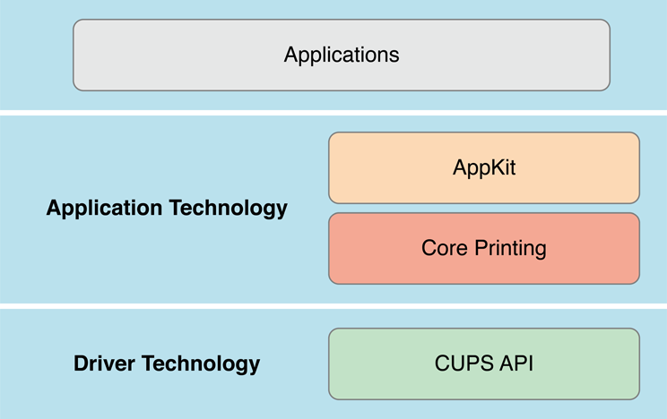

> 导航：[总目录](../../../README.md) · [documentation](../../../_indexes/documentation.md)

[Next](Printing%20System%20Workflow%20and%20User%20Interface.md)

# About Printing on the Mac

Like many other technologies in OS X, printing technology is layered. The top layer is the custom application code that you write to generate the printed output you want. The AppKit layer provides the printing classes that Cocoa apps use to print. That layer is the focus of this book. The Core Printing layer is a C API that most Cocoa app developers will never use directly because it is ideal for writing command-line tools or performing printing tasks that don’t require a user interface. The Common UNIX Printing System (CUPS) layer provides the low-level services, print queue management, and driver interfaces needed to communicate with printing devices. As an app developer, you don’t need to know anything about CUPS.

Most Cocoa apps provide printing support in one form or another. When you create a Cocoa app, the Print command is automatically provided in the File menu. It’s straightforward for apps to implement printing.

### Printing is Designed to be Easy-to-Use and Flexible

The printing system does as much as possible automatically for your app. If your app’s printing needs are simple, you might need to write only a few lines of code. But if your app needs to print precisely formatted pages, you’ll find that OS X printing provides all the flexibility you need.

### NSView and NSDocument Objects Each Support Printing

The printing system API works in conjunction with the `NSView` and `NSDocument` classes. Each class has API that responds to print messages. Your app will either be view-based or document-based. Printing is easy to use in either type of app. The basic concepts are the same with only minor differences in the API available to each.

### Layout Options Let You Format for Paper

Most of the time you’ll want to print content other than what shows on the display, if only to add page numbers or margins. You can add borders, crop marks, and other features to the page as well as set up layout options that work best with paper.

### If it Needs to, Your App Can Manage the Printing Workflow

Most apps can let the printing system take care of managing Print and Page Setup panels, querying printers, and managing print information. If your app is not a typical app, you can manage various objects in the printing system. For example, your app can add an accessory view to the Print panel to allow users to set app-specific printing features.

[Next](Printing%20System%20Workflow%20and%20User%20Interface.md)

