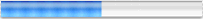

> 导航：[总目录](../../../README.md) · [documentation](../../../_indexes/documentation.md) · [Progress Indicator Programming Topics](Introduction%20to%20Progress%20Indicators.md)

[Next](Using%20Determinate%20Progress%20Indicators.md)[Previous](Introduction%20to%20Progress%20Indicators.md)

# About Progress Indicators

A progress indicator shows that a lengthy task is under way. Some progress indicators do nothing more than spin to show that the application is busy, while others show the percentage of the task that has been completed. NSProgressIndicator provides both types of display:

- An indeterminate progress indicator (the “barber pole”) that spins until the task is complete, like this:

  
- A determinate progress indicator that draws a three-dimensional progress bar from left to right in the view as the task progresses, like this:

  

NSProgressIndicator is a subclass of NSView. To display a progress indicator, your application creates a window and adds the progress indicator as a subview of the window’s content view or any subview. You can create a progress indicator programmatically either with its Java constructor or initialize it with the Objective-C `initWithFrame:` method. However, you normally use Interface Builder to create and initialize a progress indicator and to install it in an application view.

You can display progress indicators of different sizes by varying the frame size. However, the default size is designed to provide the best results.

By default, a progress indicator is drawn with a bezeled frame, but you can use the `setBezeled:` method to modify the bezeled-frame setting.

[Next](Using%20Determinate%20Progress%20Indicators.md)[Previous](Introduction%20to%20Progress%20Indicators.md)

