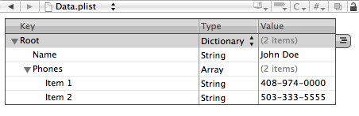
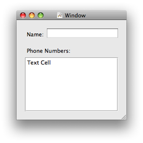

> 导航：[总目录](../../../README.md) · [文档](../../../_indexes/documentation.md) · [属性列表编程指南](Introduction%20to%20Property%20Lists.md)


[下一页](About%20Property%20Lists.md)[上一页](Introduction%20to%20Property%20Lists.md)

# 属性列表快速入门

这份小教程带你快速、实际地入门属性列表。你先用 XML 写一个简短的属性列表，然后设计一个应用程序：它在启动时读取这个 XML 属性列表，把其中的元素转换成对应的对象，并把这些对象存放到实例变量中。应用程序会在用户界面里显示这些对象的值，并允许你修改它们。退出应用程序时，它会把修改后的属性列表以 XML 形式写出。再次启动应用程序时，就会显示新的值。

在 Xcode 中创建一个简单的 Cocoa 应用程序项目，命名为 PropertyListExample。然后选中项目的 Resources 文件夹，从 File 菜单中选择 New File。在“Other”模板类别中选择 Property List 模板并点击 Next，把文件命名为“Data.plist”。

在 Xcode 中双击 `Data.plist` 文件（它在 Resources 文件夹里）。Xcode 会用一个专门的编辑器显示这个空的属性列表。编辑该属性列表，使其看起来像下面这个例子：



你也可以用 TextEdit 或 BBEdit 这类文本编辑器来编辑属性列表。编辑完成后，它应该像下面这段 XML 代码。


```xml
<?xml version="1.0" encoding="UTF-8"?> <!DOCTYPE plist PUBLIC "-//Apple//DTD PLIST 1.0//EN" "http://www.apple.com/DTDs/PropertyList-1.0.dtd"> <plist version="1.0"> <dict>     <key>Name</key>     <string>John Doe</string>     <key>Phones</key>     <array>         <string>408-974-0000</string>         <string>503-333-5555</string>     </array> </dict> </plist>
```

由于这个属性列表文件位于 Resources 文件夹中，构建项目时它会被写入应用程序的主 [bundle](https://developer.apple.com/library/archive/documentation/General/Conceptual/DevPedia-CocoaCore/Bundle.html#//apple_ref/doc/uid/TP40008195-CH4)。

这一步你要给项目添加一个[协调控制器](https://developer.apple.com/library/archive/documentation/General/Conceptual/DevPedia-CocoaCore/ControllerObject.html#//apple_ref/doc/uid/TP40008195-CH11)类，并[声明属性](https://developer.apple.com/library/archive/documentation/General/Conceptual/DevPedia-CocoaCore/DeclaredProperty.html#//apple_ref/doc/uid/TP40008195-CH13)来保存 `Data.plist` 中定义的属性列表对象。（注意这里要区分声明的_属性_（property）和_属性_列表对象。）

在 Xcode 中选中 Classes 文件夹，从 File 菜单选择 New File。选择 Objective-C Class 模板，把文件命名为“Controller.h”和“Controller.m”。在 `Controller.h` 中做如下声明。

```objc
#import <Cocoa/Cocoa.h>

@interface Controller : NSObject {
    NSString *personName;
    NSMutableArray *phoneNumbers;
}

@property (copy, nonatomic) NSString *personName;
@property (retain, nonatomic) NSMutableArray *phoneNumbers;

@end
```

在 `Controller.m` 中，让编译器为这些属性合成存取方法（accessor）：

```objc
@implementation Controller

@synthesize personName;
@synthesize phoneNumbers;

@end
```


双击项目的 [nib 文件](https://developer.apple.com/library/archive/documentation/General/Conceptual/DevPedia-CocoaCore/NibFile.html#//apple_ref/doc/uid/TP40008195-CH34)，在 Interface Builder 中打开它。创建一个类似下图的简单用户界面：



表格视图应该只有一列，并且该列可编辑。

出于简单和高效的考虑，接下来你要把文本框绑定到 `personName` [属性](https://developer.apple.com/library/archive/documentation/General/Conceptual/DevPedia-CocoaCore/DeclaredProperty.html#//apple_ref/doc/uid/TP40008195-CH13)。而你的 Controller 对象将充当表格的[数据源](https://developer.apple.com/library/archive/documentation/General/Conceptual/DevPedia-CocoaCore/Delegation.html#//apple_ref/doc/uid/TP40008195-CH14)。我们先从文本框开始。

1. 从 Library 中拖一个通用的 Object 代理对象到 nib 文档窗口。选中它，在检查器的 Identify 面板中，为其类身份输入或选择“Controller”。
2. 从 Library 中拖一个 Object Controller 对象到 nib 文档窗口。按住 Control 键（或用右键）从 Object Controller 拖一条线到 Controller，在弹出的连接窗口中选择“content”。
3. 选中那个可编辑的文本框，在检查器的 Bindings 面板中，按如下设置绑定文本框的 value 特性：

   - Bind to: Object Controller
   - Controller Key: selection
   - Model Key Path: personName

接下来，按住 Control 键从 nib 文档窗口中的 File's Owner（这里的 File's Owner 代表全局的 [NSApplication](https://developer.apple.com/documentation/appkit/nsapplication) 对象）拖一条线到 Controller 对象，然后在连接窗口中选择 `delegate`。你稍后会看到，应用程序委托（Controller）在把属性列表保存为 XML 表示的过程中扮演了一个角色。

对于表格视图，在 nib 文档窗口中从表格视图拖一条线到 Controller 对象，在连接窗口中选择 `dataSource` 输出口。保存 nib 文件。把清单 1-1 中的代码复制到 `Controller.m`。

__清单 1-1__  表格视图数据源的实现代码

```objc
 - (NSInteger)numberOfRowsInTableView:(NSTableView *)tableView {
    return self.phoneNumbers.count;
}

 - (id)tableView:(NSTableView *)tableView
         objectValueForTableColumn:(NSTableColumn *)tableColumn
         row:(NSInteger)row {
    return [phoneNumbers objectAtIndex:row];
}

- (void)tableView:(NSTableView *)tableView setObjectValue:(id)object
         forTableColumn:(NSTableColumn *)tableColumn row:(NSInteger)row {
    [phoneNumbers replaceObjectsAtIndexes:[NSIndexSet indexSetWithIndex:row]
                  withObjects:[NSArray arrayWithObject:object]];
}
```

注意最后一个方法把表格视图中各项的改动同步到了作为其后备存储的 `phoneNumbers` 可变数组。

现在必要的用户界面工作已经完成，我们可以把注意力放到与属性列表相关的代码上。应用程序首次启动时，Controller 对象在它的 `init` 方法中从[主 bundle](https://developer.apple.com/library/archive/documentation/General/Conceptual/DevPedia-CocoaCore/Bundle.html#//apple_ref/doc/uid/TP40008195-CH4) 读入最初的 XML 属性列表；之后则从用户的 `Documents` 目录获取属性列表。拿到属性列表后，它把其中的元素转换成对应的属性列表对象。清单 1-2 展示了具体做法。

__清单 1-2__  读入并转换 XML 属性列表

```objc
- (id) init {

    self = [super init];
    if (self) {
        NSString *errorDesc = nil;
        NSPropertyListFormat format;
        NSString *plistPath;
        NSString *rootPath = [NSSearchPathForDirectoriesInDomains(NSDocumentDirectory,
           NSUserDomainMask, YES) objectAtIndex:0];
        plistPath = [rootPath stringByAppendingPathComponent:@"Data.plist"];
        if (![[NSFileManager defaultManager] fileExistsAtPath:plistPath]) {
            plistPath = [[NSBundle mainBundle] pathForResource:@"Data" ofType:@"plist"];
        }
        NSData *plistXML = [[NSFileManager defaultManager] contentsAtPath:plistPath];
        NSDictionary *temp = (NSDictionary *)[NSPropertyListSerialization
            propertyListFromData:plistXML
            mutabilityOption:NSPropertyListMutableContainersAndLeaves
            format:&format
            errorDescription:&errorDesc];
        if (!temp) {
            NSLog(@"Error reading plist: %@, format: %d", errorDesc, format);
        }
        self.personName = [temp objectForKey:@"Name"];
        self.phoneNumbers = [NSMutableArray arrayWithArray:[temp objectForKey:@"Phones"]];

    }
    return self;
}
```

这段代码首先取得 `~/Documents` 目录下那个包含 XML 属性列表的文件（`Data.plist`）的文件系统路径。如果该位置没有同名文件，它就从应用程序的主 bundle 中取得属性列表文件。然后它用 `NSFileManager` 的 [contentsAtPath:](https://developer.apple.com/documentation/foundation/filemanager/1407347-contents) 方法把属性列表作为 [NSData](https://developer.apple.com/library/archive/documentation/LegacyTechnologies/WebObjects/WebObjects_3.5/Reference/Frameworks/ObjC/Foundation/Classes/NSDataClassCluster/Description.html#//apple_ref/occ/cl/NSData) 对象读入内存。接着，它调用 `NSPropertyListSerialization` 的类方法 [propertyListFromData:mutabilityOption:format:errorDescription:](https://developer.apple.com/documentation/foundation/propertylistserialization/1411993-propertylistfromdata) 把静态的属性列表转换成对应的属性列表对象——具体来说，是一个包含一个字符串和一个字符串数组的字典。最后它把这个字符串和字符串数组赋给 Controller 对象相应的属性。

当用户退出应用程序时，你希望把 `personName` 和 `phoneNumbers` 属性的当前值保存到一个字典对象中，把这些属性列表对象转换成静态的 XML 表示，然后把这些 XML 数据写入 `~/Documents` 下的文件。`NSApplication` 的 [applicationShouldTerminate:](https://developer.apple.com/documentation/appkit/nsapplicationdelegate/1428642-applicationshouldterminate) [委托](https://developer.apple.com/library/archive/documentation/General/Conceptual/DevPedia-CocoaCore/Delegation.html#//apple_ref/doc/uid/TP40008195-CH14)方法正是编写清单 1-3 这段代码的合适位置。

__清单 1-3__  转换属性列表并写入应用程序 bundle

```objc
- (NSApplicationTerminateReply)applicationShouldTerminate:(NSApplication *)sender {
    NSString *error;
    NSString *rootPath = [NSSearchPathForDirectoriesInDomains(NSDocumentDirectory, NSUserDomainMask, YES) objectAtIndex:0];
    NSString *plistPath = [rootPath stringByAppendingPathComponent:@"Data.plist"];
    NSDictionary *plistDict = [NSDictionary dictionaryWithObjects:
            [NSArray arrayWithObjects: personName, phoneNumbers, nil]
            forKeys:[NSArray arrayWithObjects: @"Name", @"Phones", nil]];
    NSData *plistData = [NSPropertyListSerialization dataFromPropertyList:plistDict
                            format:NSPropertyListXMLFormat_v1_0
                            errorDescription:&error];
    if(plistData) {
        [plistData writeToFile:plistPath atomically:YES];
    }
    else {
        NSLog(error);
        [error release];
    }
    return NSTerminateNow;
}
```

这段代码创建了一个 [NSDictionary](https://developer.apple.com/library/archive/documentation/LegacyTechnologies/WebObjects/WebObjects_3.5/Reference/Frameworks/ObjC/Foundation/Classes/NSDictionaryClassClstr/Description.html#//apple_ref/occ/cl/NSDictionary) 对象，其中包含 `personName` 和 `phoneNumbers` 属性的值，并把它们与键“Name”和“Phones”关联起来。然后，它用 [NSPropertyListSerialization](https://developer.apple.com/documentation/foundation/nspropertylistserialization) 的[类方法](https://developer.apple.com/library/archive/documentation/General/Conceptual/DevPedia-CocoaCore/ClassMethod.html#//apple_ref/doc/uid/TP40008195-CH8) [dataFromPropertyList:format:errorDescription:](https://developer.apple.com/documentation/foundation/nspropertylistserialization/1416061-datafrompropertylist)，把这个顶层字典及其所包含的其他属性列表对象转换成 XML 数据。最后，它把这些 XML 数据写入用户 `Documents` 目录下的 `Data.plist`。

构建并运行应用程序。窗口中会显示你在 XML 属性列表里指定的姓名和电话号码。修改姓名和某个电话号码，然后退出应用程序。在 `~/Documents` 中找到 `Data.plist` 文件，用文本编辑器打开它，你会看到你在用户界面里所做的修改已经反映到了 XML 属性列表中。如果再次启动应用程序，它会显示修改后的值。

[下一页](About%20Property%20Lists.md)[上一页](Introduction%20to%20Property%20Lists.md)

