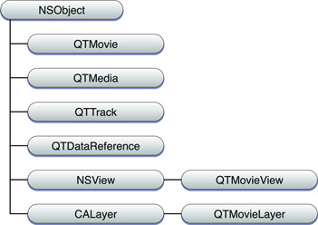
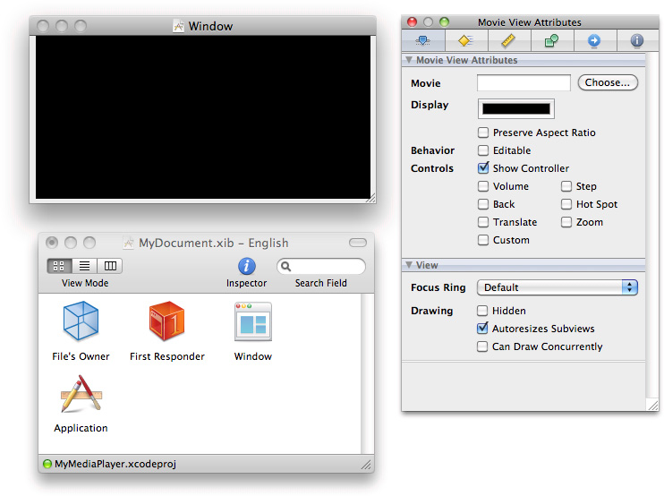
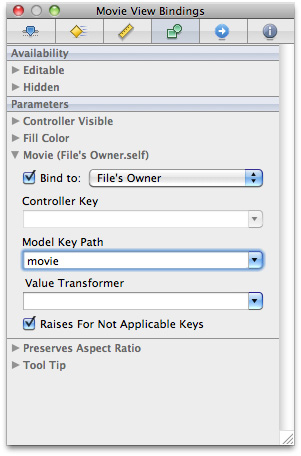

> 导航：[总目录](../../../README.md) · [documentation](../../../_indexes/documentation.md) · [QTKit Application Programming Guide](Introduction.md)


[Next](QTKit%20Capture.md)[Previous](Introduction.md)

# QTKit Architecture

This chapter describes the fundamentals of the QTKit software architecture.

To develop successful applications using the classes and methods in the QTKit API, you don’t necessarily have to understand all the details of how QuickTime deals with and manipulates video and media content. The approach taken in this chapter is to provide you with a high-level description of the six classes that form the core [object model](https://developer.apple.com/library/archive/documentation/General/Conceptual/DevPedia-CocoaCore/ObjectModeling.html#//apple_ref/doc/uid/TP40008195-CH41) for the API, with a list of their most commonly used methods, tasks, and behaviors. The next chapter, [QTKit Capture](QTKit%20Capture.md#apple-f4xwc4dqnrsv64tfmyxwi33df52wszbpkridimbqga4dcnjwfvbuqmjqhawvgvzz), describes the portion of the API that includes classes devoted to the capture and recording of media.

The chapter also discusses a number of use cases and scenarios for handling media playback, editing, exporting, thread safety issues, and applying Core Image filters to video playback. The intent is to provide you with code snippets that demonstrate best practices and techniques to reduce time and effort in your development cycle.

QuickTime and QTKit are graphics and media frameworks that reside in OS X, which includes Core Video, Core Image and Core Animation, as well as OpenGL, Quartz and Core Audio.

To better understand these frameworks, you can view their implementation depicted graphically as a set of layers, shown in Figure 1-1. Each layer provides a progressively more powerful and sophisticated collection of application services. The graphics and media layer implements a number of specialized services for playing audio and video media content and for rendering 2D and 3D graphics.

QuickTime and QTKit are core Apple technologies for displaying and capturing, editing and exporting a wide array of audio, video and multimedia-related content. Both frameworks are powerful building blocks in an ecosystem of OS X technologies intended to provide developers with the tools and frameworks necessary to build and deploy state-of-the-art multimedia applications.

You use QuickTime and QTKit to handle the basic as well as advanced chores of video, audio, and image media processing, and thereby reduce the code you need to write in your application development cycle.

__Figure 1-1__  OS X graphics and media layers

!

QuickTime and QTKit support a wide range of standards-based formats, in addition to proprietary formats from Apple and others.

Table 1-1 lists some of the more common file formats that are supported.

__Table 1-1__  A partial list of media formats and codecs supported by QuickTime and QTKit

| _Audio formats_ | AIFF, MP3, AU, WAV, uLaw |
| _Video formats_ | AVI, AVR, DV, M-JPEG, MPEG-1, MPEG-2, MPEG-4 |
| _Codecs_ | AAC, AVI, AVR, DV, M-JPEG, MPEG-1, MPEG-2, MPEG-4, , OpenDML, 3GPP, 3GPP2, AMC, H.264 |
| _Web streaming formats_ | HTTP, RTP, RTSP |

A distinction should be emphasized here: audio/video formats supported by QuickTime and QTKit are essentially _container_ formats whose specifications only deal with how the data is stored within a file, not how it is encoded. In the case of QuickTime, the `.mov` file format which is native to QuickTime serves as a multimedia container file, typically containing one or more tracks, each of which stores a particular type of data, such as audio, video, effects or text. A video _codec_, by contrast, is software that enables video compression and decompression of digital media. The MPEG-4 codec, for example, is based on the QuickTime file format and is an industry standard.

Introduced in OS X v10.4, QTKit is an Objective-C, Cocoa-based framework for manipulating time-based media. Built on top of QuickTime, as shown in [Figure 1-2](#apple-f4xwc4dqnrsv64tfmyxwi33df52wszbpkridimbqga4dcnjwfvbuqmjqhewvgvzx), the framework lets you incorporate movie playback, movie editing, export to standard media formats, audio/video capture and recording, and other multimedia behaviors easily into your Cocoa application.

QTKit developers do not need to know the low-level workings of the QuickTime Movie Toolbox, for example, as shown in the illustration, to play back or edit movies. Nor do they necessarily need to understand the terminology and workings of media and data handlers, as well as components, which are part of QuickTime.

As a modern design, the QTKit software architecture is constructed from the ground up to provide Cocoa developers with the power and capabilities available in QuickTime without having to deal with its innate complexity or low-level abstractions.

__Figure 1-2__  QTKit built on top of QuickTime

!

Thus, QTKit provides a much less complex programmer interface than QuickTime, and represents a distillation and abstraction of the most essential QuickTime functions as a small set of classes and methods. A great deal of functionality is packed into a relatively small objective API.

The framework is at once powerful, yet easy to use and work with in your Cocoa application. Notably, QTKit provides Objective-C classes that are suitable for use within a wide range of Cocoa-based software, including applications with a GUI and tools intended to run in a “headless” environment. For example, you can use the framework to write command-line tools that manipulate QuickTime movie files.

QTKit is also the primary 64-bit interface into QuickTime. You use QTKit to create 64-bit applications to manipulate a wide range of multimedia content, including audio, video, animation, graphics, text, music, and other media types.

For more detailed information about the classes and methods in the QTKit API, refer to _[QTKit Framework Reference](https://developer.apple.com/documentation/qtkit)_.

If you want to see the framework header files, you can find them in the OS X `/System/Library/Frameworks` directory as `QTKit.framework`. The `QTMovieView` plug-in control resides in the Interface Builder library of objects.

You can use the methods and classes in the QTKit API to accomplish a number of essential media programming tasks, shown graphically in [Figure 1-3](#apple-f4xwc4dqnrsv64tfmyxwi33df52wszbpkridimbqga4dcnjwfvbuqmjqhewvgvzrgm). At the basic level, the QTKit API lets you:

- Play back all types of media (as QuickTime movies)
- Edit media
- Export from QuickTime movies to other formats
- Capture and record digital data into QuickTime movies

__Figure 1-3__  QTKit tasks and capabilities

!

In the context of support for workflows with linear media, the QTKit API is intended to perform a specific range of tasks, namely, to:

- __Acquire__ (either open existing media from disk or capture media from a specific device)
- __Edit/author__ that media
- __Export__ media for an intended destination (for example, the web, Apple mobile devices, broadcast, and so on)
- __Present__ media on multiple devices, including desktop and mobile

In each iteration of OS X, the QTKit API has been extended with new features and capabilities. In OS X v10.5, for example, QTKit introduced 17 new classes to support professional-grade audio/video capture, discussed in [QTKit Capture](QTKit%20Capture.md#apple-f4xwc4dqnrsv64tfmyxwi33df52wszbpkridimbqga4dcnjwfvbuqmjqhawvgvzz).

The input and output classes included with the latest iteration of the framework provide all the components necessary for your application to implement the most common use case for a media capture system: _recording from a camera to a QuickTime file._ The classes in the QTKit capture API enable your application to perform video capture that includes frame-accurate audio/video synchronization. You can then preview captured content and save it to a file.

QuickTime X is a new media architecture that provides a set of media services for efficient, high-performance playback of audio/video media.

You gain access to these media playback services, available in OS X v10.6, through QTKit by opting-in to QuickTime X with a single method call. How you can modify your existing QTKit code to use these services is discussed in the section [Opting into QuickTime X](Adopting%20QuickTime%20X%20for%20Playback.md#apple-f4xwc4dqnrsv64tfmyxwi33df52wszbpkridimbqga4dcnjwfvbuqmjrgewvgvzrga) in the chapter [Adopting QuickTime X for Playback](Adopting%20QuickTime%20X%20for%20Playback.md#apple-f4xwc4dqnrsv64tfmyxwi33df52wszbpkridimbqga4dcnjwfvbuqmjrgewvgvzr).

The QTKit [framework](https://developer.apple.com/library/archive/documentation/General/Conceptual/DevPedia-CocoaCore/Framework.html#//apple_ref/doc/uid/TP40008195-CH56) is comprised of 23 Objective-C, Cocoa classes, along with over 400 methods, attributes, constants, and notifications. The framework has grown and evolved significantly with each iteration of OS X.

For purposes of better conceptual understanding, the QTKit class hierarchy, shown in Figure 1-4, can be divided into a group of six classes that handle the most common chores of media display, playback and editing of QuickTime movies, as well as support for Core Animation layers. These are discussed in this chapter.

Another group of classes in the QTKit API, designed to support professional-grade audio/video capture and recording, are discussed in great detail in the [QTKit Capture](QTKit%20Capture.md#apple-f4xwc4dqnrsv64tfmyxwi33df52wszbpkridimbqga4dcnjwfvbuqmjqhawvgvzz) chapter.

The movie, media, and track class portion of the class hierarchy for the QTKit framework consists of four classes, `QTMovie`, `QTMedia`, `QTTrack` and `QTDataReference`, all of which inherit from `NSObject`, while the `QTMovieView` class inherits from `NSView` and the `QTMovieLayer` class, which supports Core Animation rendering, inherits from `CALayer`.

__Figure 1-4__  The QTKit movie, media, and track class hierarchy



There are six classes in the QTKit API that are used primarily for the rendering and playback of QuickTime movies. [Table 1-2](#apple-f4xwc4dqnrsv64tfmyxwi33df52wszbpkridimbqga4dcnjwfvbuqmjqhewvgvzs) describes briefly each of these classes and what tasks they are commonly used for.

__Table 1-2__  QTKit movie, media and track classes with their associated tasks

| Class | Description | Tasks |
| `QTMovie` | An object that represents a playable collection of media data. | Typically used in combination with a `QTMovieView` object for playback. Also can be used for other purposes, such as converting the media data into a different format. |
| `QTMovieView` | A subclass of `NSView`. | Used to display and control QuickTime movies in combination with a `QTMovie` object, which supplies the movie being displayed. Also supports editing operations on the movie. |
| `QTTrack` | An object that represents the ordering and other characteristics of media data in a `QTMovie` object, such as a single video track or audio track. | Provides methods for getting and setting track properties. |
| `QTMedia` | An object that represents the data associated with a `QTTrack` object. | Provides methods for getting and setting the media properties. |
| `QTDataReference` | A representation of a QuickTime data reference which specifies the location of a QuickTime movie or some media data. | Used to specify the location of a movie or its media data. You can create `QTDataReference` objects that refer to data stored in files accessed using filenames or URLs, or in memory accessed using handles, pointers, or `NSData` objects. |
| `QTMovieLayer` | A subclass of `CALayer`, providing a layer into which the frames of a `QTMovie` object can be drawn. | Intended to provide support for Core Animation. |

Of the 23 classes in the QTKit API, the two most useful and important to understand at the conceptual level are `QTMovie` and `QTMovieView`. These form the foundation of the framework, and in the case of `QTMovie`, include the largest number of methods. You need to know how these objects behave and what tasks they are intended to accomplish in order to work successfully with the API.

A `QTMovie` is an object that represents a playable collection of media data. A movie describes the sources and types of the media in that collection and their spatial and temporal organization. These collections may be used for presentation (such as playback on the screen) or for the organization of media for processing (such as composition and transcoding to a different compression type).

A `QTMovie` object can be initialized from a file, from a resource specified by a URL, from a block of memory, from a pasteboard, or from an existing QuickTime movie. Once a `QTMovie` object has been initialized, it will typically be used in combination with a `QTMovieView` for playback. It can also be used for other purposes, such as converting the media data into a different format.

Just as a QuickTime movie contains a set of tracks, each of which defines the type, the segments, and the ordering of the media data it presents, a `QTMovie` object is associated with instances of the `QTTrack` class. In turn, a `QTTrack` object is associated with a single `QTMedia` object. `QTMovie` instances can reference data contained in files, URLs, or in memory. `QTMovie` provides methods for getting and setting movie properties and for editing movies.

To display a `QTMovie` object in a window, for example, you use the `QTMovieView` class. As a subclass of `NSView`, `QTMovieView` supports movie playback and editing, with a movie controller bar that is displayed in the view, but can be optionally hidden.

The `QTMovie` class includes an extensive number of instance and [class methods](https://developer.apple.com/library/archive/documentation/General/Conceptual/DevPedia-CocoaCore/ClassMethod.html#//apple_ref/doc/uid/TP40008195-CH8) that let you perform a wide range of operations on QuickTime movies. Some of these capabilities include:

- Creating and initializing a `QTMovie` object
- Controlling movie playback
- Editing a movie
- Saving movie data
- Setting movie properties and attributes
- Getting movie tracks and movie images

The `QTMovie` class also includes a large number of string constants that let you specify movie attributes. Some of the more commonly used attributes for handling duration and current time are shown in Table 1-3. The `QTMovieOpen`... attributes, for example, can be used for [initialization](https://developer.apple.com/library/archive/documentation/General/Conceptual/DevPedia-CocoaCore/Initialization.html#//apple_ref/doc/uid/TP40008195-CH21) and for opting-in to the high-performance media playback services provided by QuickTime X (refer to[Opting into QuickTime X](Adopting%20QuickTime%20X%20for%20Playback.md#apple-f4xwc4dqnrsv64tfmyxwi33df52wszbpkridimbqga4dcnjwfvbuqmjrgewvgvzrga) for more information). Attributes that deal with load state are discussed in [Monitoring Load State](#apple-f4xwc4dqnrsv64tfmyxwi33df52wszbpkridimbqga4dcnjwfvbuqmjqhewvgvzrge).

Coding techniques for using these attributes are described in the _[QTKit Application Tutorial](../QTKit%20Application%20Tutorial/Introduction.md#apple-f4xwc4dqnrsv64tfmyxwi33df52wszbpkridimbqga4dcnjv)_, in particular the usage of the `QTMovieNaturalSizeAttribute` for displaying and playing back QuickTime movies at their original or “authored” size.

__Table 1-3__  QTMovie attributes with their associated tasks

| Attributes | Tasks |
| `QTMovieDurationAttribute` | The duration of a `QTMovie` object; the value for this key is of type `NSValue`, interpreted as a `QTTime` structure. |
| `QTMovieCurrentTimeAttribute` | The current time of a `QTMovie` object; the value for this key is of type `NSValue`, interpreted as a `QTTime` structure. |
| `QTMovieEditableAttribute` | The editable setting. |
| `QTMovieLoadStateAttribute` | The load state value; the value for this key is of type `NSNumber`, interpreted as a `long`. |
| `QTMovieLoadStateErrorAttribute` | The load state error of a `QTMovie` object; the value for this key is of type `NSError`. |
| `QTMovieNaturalSizeAttribute` | The natural size of a `QTMovie` object; the value for this key is of type `NSValue`, interpreted as an `NSSize` structure. |
| `QTMovieOpenAsyncOKAttribute` | Indicates whether a movie file can be opened asynchronously if possible, an `NSNumber` wrapping a `BOOL`. |
| `QTMovieOpenAsyncRequiredAttribute` | Indicates whether the `QTMovie` must be opened asynchronously, an `NSNumber` wrapping a `BOOL`. |
| `QTMovieOpenForPlaybackAttribute` | Indicates whether the `QTMovie` will be used only for playback, an `NSNumber` wrapping a `BOOL`. |

The recommended way to open a movie file is with `initWithAttributes:error`. This is now the [designated initializer](https://developer.apple.com/library/archive/documentation/General/Conceptual/DevPedia-CocoaCore/MultipleInitializers.html#//apple_ref/doc/uid/TP40008195-CH33) of the `QTMovie` class in OS X v10.6. You do this:

```objc
- (id)initWithAttributes:(NSDictionary *)attributes
                   error:(NSError **)errorPtr;

+ (id)movieWithAttributes:(NSDictionary *)attributes
                   error:(NSError **)errorPtr;
```

You pass in a dictionary of attributes describing what it is you want and then QTKit will create a movie with that set of characteristics. There are three kinds of attributes you can put into that dictionary of attributes.

- __Data locator__ attributes. These are attributes that specify where the movie data is located. Typically, you pass in a file name or a URL.

```
QTMovieFileNameAttribute
QTMovieURLAttribute
QTMoviePasteboardAttribute
QTMovieDataAttribute
QTMovieDataReferenceAttribute
```

- __Movie configuration__ attributes. These are attributes applied to the movie as it is being opened. For instance, if you want to open the movie in an editable state, you can put in this attribute and value `YES`. Similarly, you could assign a [delegate](https://developer.apple.com/library/archive/documentation/General/Conceptual/DevPedia-CocoaCore/Delegation.html#//apple_ref/doc/uid/TP40008195-CH14). You could say you want the movie to loop, or you could set the volume to some non-standard volume you want. Basically, in this category of attributes you can put in any settable attribute. These attributes are ones that can be read and written. For information about the attributes you can set and write, refer to the _[QTKit Framework Reference](https://developer.apple.com/documentation/qtkit)_, specifically the _QTMovie Class Reference_.

```
QTMovieEditableAttribute
QTMovieDelegateAttribute
QTMovieLoopsAttribute
QTMovieVolumeAttribute
```

- __Special initialization__ attributes. These are attributes that affect how QTKit opens the movie.

```
QTMovieDontInteractWithUserAttribute
QTMovieResolveDataRefsAttribute
QTMovieAskUnresolvedDataRefsAttribute
QTMovieOpenAsyncOKAttribute
QTMovieOpenAsyncRequiredAttribute
QTMovieOpenForPlaybackAttribute
```

Note that in OS X v10.6, the [designated initializer](https://developer.apple.com/library/archive/documentation/General/Conceptual/DevPedia-CocoaCore/MultipleInitializers.html#//apple_ref/doc/uid/TP40008195-CH33) for the `QTMovie` class is `initWithAttributes:error:`, whose first parameter is a dictionary of attribute keys and their desired values. As described, one of these attributes must specify the location of the media data (for instance, using the `QTMovieURLAttribute` key). Other attributes may specify desired movie-opening behaviors, and others still may specify desired initial values of `QTMovie` properties (for instance, `QTMovieVolumeAttribute`).

Using the new `QTMovieOpenAsyncRequiredAttribute` available in OS X v10.6, you can indicate whether you want QTKit to attempt to initialize a `QTMovie` object asynchronously to the initialization thread. If `QTMovieOpenForPlaybackAttribute` is also specified and the media resource is compatible with QuickTime X, asynchronous opening will always succeed. If QuickTime 7 is used instead, QTKit will attempt to make use of its limited support for initialization on pre-emptive background threads; for some media types this will fail. In cases of failure, the application can chose to retry the operation without setting `QTMovieOpenAsyncRequiredAttribute`, or it may choose to report the failure to the user as appropriate.

You accomplish this in your code by passing the `QTMovieOpenAsyncRequiredAttribute` and setting this exactly in the same way that you set the other attribute (`QTMovieOpenForPlaybackAttribute`, as shown in [Listing 3-2](Adopting%20QuickTime%20X%20for%20Playback.md#apple-f4xwc4dqnrsv64tfmyxwi33df52wszbpkridimbqga4dcnjwfvbuqmjrgewvgvzv)), that is, by putting it into the dictionary of attributes.

```objc
- (id)initWithAttributes:(NSDictionary *)attributes
                   error:(NSError **)errorPtr;
```

You use this code snippet to pass this key.

```
QTMovie *movie = nil;
NSError *error = nil;
NSNumber *num = [NSNumber numberWithBool:YES];
NSDictionary *attributes =
          [NSDictionary dictionaryWithObjectsAndKeys:
              fileName, QTMovieFileNameAttribute,
              num, QTMovieLoopsAttribute,
              num, QTMovieOpenAsyncRequiredAttribute,
                 nil];

movie = [[QTMovie alloc] initWithAttributes:attributes
                                      error:&error];
```

By setting the `QTMovieOpenAsyncRequiredAttribute` attribute to an `NSNumber` wrapping `YES`, you are indicating that all operations necessary to open the movie file (or other container) and create a valid `QTMovie` object must occur asynchronously. This means that the methods `+movieWithAttributes:error:` and `-initWithAttributes:error:` must return almost immediately, performing any lengthy operations on another thread.

If you require asynchronous opening but `QTMovie` is unable to honor your request, then the methods `+movieWithAttributes:error:` and `-initWithAttributes:error:` return with an `NSError`. Note that if you give `QTMovie` a reference to valid movie data with `QTMovieOpenAsyncRequiredAttribute`, you will always get back a valid, non-nil `QTMovie`, even if that data cannot be loaded asynchronously. The only time you will ever get back nil is if there is a problem with your parameters or with locating the data.

Your application needs to monitor the movie load state to determine the progress of those operations. In point of fact, unless the `QTMovie` object is being initialized with `openAsyncOK=NO`, or uses `autoplay` or simply allows the `QTMovieView` user interface to control playing, your application _must_ monitor the load state, as discussed in the next section Monitoring Load State.

Opening a movie file and initializing a `QTMovie` object for that file may require a considerable amount of time, perhaps to convert the data in the file from one format to another. By setting this attribute to an `NSNumber` wrapping the value `YES`, you grant `QTMovie` permission to return a non-nil `QTMovie` identifier to your application immediately and then to continue processing the file data internally. If a movie is opened asynchronously, you must monitor the movie load state and ensure that it has reached the appropriate threshold before attempting to perform certain operations on the movie. For instance, you cannot export or copy a `QTMovie` object until its load state has reached `QTMovieLoadStateComplete`.

By performing this action, you’ve given QTKit permission to spawn a background thread to open your media resource. While that is occurring in the background, your main thread will not be blocked by movie-opening operations. But how do you know the movie is ready to play, particularly if it is a very large file? The answer is: _you must monitor load states_. That is because the relevant movie data may not be there and it may not be meaningful to ask the movie for its various properties.

Load states are important to understand in working with QTKit in QuickTime X. These are discussed in detail in the next section Monitoring Load State.

Because opening a movie file or URL may involve reading and processing large amounts of movie data, QTKit may take a non-negligible amount of time to make a `QTMovie` object ready for inspection and playback. Accordingly, you need to pay attention to the movie’s load states when opening a movie file or URL. These are the defined movie load states:

```
enum {
   QTMovieLoadStateError   = -1L, // an error occurred while loading the movie
   QTMovieLoadStateLoading = 1000, // the movie is loading
   QTMovieLoadStateLoaded = 2000, // the movie atom has loaded; it's safe to query movie properties
   QTMovieLoadStatePlayable = 10000, // the movie has loaded enough media data to begin playing
   QTMovieLoadStatePlaythroughOK = 20000, //the movie has loaded enough media data to play through to end
   QTMovieLoadStateComplete = 100000L // the movie has loaded completely
};
typedef NSInteger QTMovieLoadState;
```

Movie load states are just specified as integers, increasing from —1 to 100,000. A —1 indicates that something has occurred that returns an error; other states indicate loading. To watch for these load states, you register for the `QTMovieDidChangeLoadStateNotification`.

```
movie = [[QTMovie alloc] initWithAttributes:attributes
                                      error:&error];

[[NSNotificationCenter defaultCenter]
addObserver:self
   selector:@selector(loadStateChanged:)
       name:QTMovieLoadStateDidChangeNotification
     object:movie];
```

You are issued the `QTMovieDidChangeLoadStateNotification` notification when QTKit detects that the load state has changed from one level to another. If you get to the `QTMovieLoadedStateLoaded` returned, it means that now you can query the object for its various properties, such as its duration, natural size, the volume, and so on. If you get `QTMovieLoadStatePlaythroughOK`, it means you can continue to play uninterrupted to the end. To handle the load state change, using the method called by the notification, you do this:

```objc
- (void)loadStateChanged:(NSNotification *)notification
{
    QTMovie *movie = [notification object];

    if (movie) {
       [self handleLoadStateChanged:movie];
    }
}
```

```objc
- (void)handleLoadStateChanged:(QTMovie *)movie
{
    NSInteger loadState = [[movie
           attributeForKey:QTMovieLoadStateAttribute] longValue];

    if (loadState == QTMovieLoadStateError) {
        /* an error occurred; handle it */
        ...
    }
}
```

Note that once you call `initWithAttributes:error`, you might get back a movie that is fully loaded, in which case you won’t get a load state change notification. After you’ve called `initWithAttributes:error`, be sure to check the load state.

```
movie = [[QTMovie alloc] initWithAttributes:attributes
                                      error:&error];

[self handleLoadStateChanged:movie];

[[NSNotificationCenter defaultCenter]
addObserver:self
   selector:@selector(loadStateChanged:)
       name:QTMovieLoadStateDidChangeNotification
     object:movie];
```

Not all media files can be loaded asynchronously, so OS X v10.6 provides you with the new `QTMovieLoadStateErrorAttribute` attribute.

You can check the error returned and then retry opening the media file on the main thread, depending on the playback needs of your application.

```objc
- (void)handleLoadStateChanged:(QTMovie *)movie
{
    NSInteger loadState = [[movie
           attributeForKey:QTMovieLoadStateAttribute] longValue];

    if (loadState == QTMovieLoadStateError) {
       NSError *error = [movie attributeForKey:
                                    QTMovieLoadStateErrorAttribute];
       NSString *domain = [error domain];
       NSInteger code = [error code];

       if (/* not file not found or invalid URL ... */) {
           /* retry without QTMovieOpenAsyncRequiredAttribute */
       }
   ...
}
```

The `MyMediaPlayer` code sample (shown in Listing 1-1) illustrates how to use and monitor various load states in QuickTime X and OS X v10.6. This block of code (fully commented here) shows the technique you can use to accomplish that particular task.

__Listing 1-1__  MyMediaPlayer code monitoring load states

```objc
-(void)handleLoadStateChanged:(QTMovie *)movie
{
    NSInteger loadState = [[movie attributeForKey:QTMovieLoadStateAttribute] longValue];

    if (loadState == QTMovieLoadStateError) {
        /* what goes here is app-specific */
        /* you can query QTMovieLoadStateErrorAttribute to get the error code, if it matters */
        /* for example:
        /* NSError *err = [movie attributeForKey:QTMovieLoadStateErrorAttribute]; */
        /* you might also need to undo some operations done in the other state handlers */
    }

    if ((loadState >= QTMovieLoadStateLoaded) && ([mMovieView movie] == nil)) {
        /* can query properties here */
        /* for instance, if you need to size a QTMovieView based on the movie's natural size, you can do so now */
        /* you can also put the movie into a view now, even though no media data might yet be available and hence
           nothing will be drawn into the view */

        [mMovieView setMovie:movie];
    }

    if ((loadState >= QTMovieLoadStatePlayable) && ([movie rate] == 0.0f)) {
        /* can start movie playing here */
    }
}

-(void)movieLoadStateChanged:(NSNotification *)notification
{
    QTMovie *movie = (QTMovie *)[notification object];

    if (movie) {
        [self handleLoadStateChanged:movie];
    }
}
```

Note that load-state changes can occur when transitioning from any given load state to any other load state. That is, one can transition from the current load state (whatever it happens to be) to almost any other load state, even to `QTMovieLoadStateError`. You should also note that any given application can choose to handle any subset of the defined load states. That is, one application might care about `QTMovieLoadStateLoaded` but another might care only about `QTMovieLoadStatePlayable`. It is important to understand that load state changes do not necessarily pass through all defined stages. The first load state ever reported might be `QTMovieLoadStateComplete`. Keep in mind that it is never guaranteed that an application will ever get any specific load state when querying the `QTMovieLoadStateAttribute`.

Now if your application simply wants to play media _without_ dealing with load state issues, you can use a method on `QTMovie` that does not require you monitor all load state progress. You can use the `autoplay` method to monitor load progress for you.

```
// put a movie in a view and play it when ready
movie = [[QTMovie alloc] initWithAttributes:attributes
                                      error:NULL];
[movieView setMovie:movie];
[movie autoplay];
```


A `QTMovieView` is a subclass of `NSView` that can be used to display and control QuickTime movies. You normally use a `QTMovieView` in combination with a `QTMovie` object, which supplies the movie being displayed.

To display a `QTMovie` object in a window, you use the `QTMovieView` class.

A `QTMovieView` also supports editing operations on the movie. It also provides an optional controller bar that allows users to directly control the playback of a movie. If you want to provide your own custom controls instead, the `QTMovieView` class provides a full complement of methods to control playback, such as play, pause, and stop. The movie can be placed within an arbitrary bounding rectangle in the view’s coordinate system, and the remainder of the view can be filled with a fill color. The movie controller, if it is visible, can also be placed within an arbitrary bounding rectangle in the view’s coordinate system.

A `QTMovieView` object (shown in [Figure 1-5](#apple-f4xwc4dqnrsv64tfmyxwi33df52wszbpkridimbqga4dcnjwfvbuqmjqhewvgvzt)) is provided in Interface Builder that lets you simply drag a QuickTime movie object, complete with a controller for playback, into a window, and then set attributes for the movie.

__Figure 1-5__  The movie view object

!

A QuickTime movie consists of one or more tracks, each of which is associated with a single media. Similarly, a `QTMovie` is associated with one or more objects of type `QTTrack`, each of which is associated with a single `QTMedia` object. The `QTTrack` and `QTMedia` classes provide a number of methods for operating on QuickTime tracks and media, but only when using QuickTime 7.

The `QTTrack` class represents a QuickTime track (of type `Track`). `QTTrack` objects are associated with `QTMovie` objects and support methods for getting and setting the track properties.

The `QTMedia` class represents a QuickTime media (of type `Media`). `QTMedia` objects are associated with `QTTrack` objects and support methods for getting and setting the media properties, but only when using QuickTime 7.

A `QTDataReference` object is a representation of a QuickTime data reference, which is used to specify the location of a movie or its media data. You can create `QTDataReference` objects that refer to data stored in files accessed using filenames or URLs, or in memory accessed using handles, pointers, or `NSData` objects.

As a subclass of `CALayer`, the `QTMovieLayer` object provides support for Core Animation layers. You can use this object to draw the contents of a movie into a layer, rendering a `QTMovie` within a layer hierarchy. Using the `layerWithMovie:` method, for example, you create an autoreleased `QTMovieLayer` associated with the specified object. You can then modify the default characteristics—that is, the movie starts playing immediately at rate 1.0 from its beginning—by setting layer properties or movie properties. (For more information about how to take advantage of QTKit and Core Animation layers in your application, refer to the section [Working With Core Animation Layers](#apple-f4xwc4dqnrsv64tfmyxwi33df52wszbpkridimbqga4dcnjwfvbuqmjqhewvgvzthe)).

In addition to a rich set of classes and methods, the QTKit framework also provides a number of functions for working with `QTTime` and `QTTimeRange` structures. These define the `QTTime` and `QTTimeRange` structures for representing specific times and time ranges in a movie or track. These structures are:

- `QTTime`. Defines the value and time scale of a time.

```
typedef struct {
     long long     timeValue;
     long          timeScale;
     long          flags;
} QTTime;
```

  `QTTime` is a simple data structure that consists of three fields. In this case, the `timeScale` field is the number of units per second you work with when dealing with time. The `timeValue` field is the number of those units in duration.
- `QTTimeRange`. Defines a range of time, and is used, for instance, to specify the active segment of a movie or track.

```
typedef struct {
     QTTime        time;
     QTTime        duration;
} QTTimeRange;
```

  `QTTimeRange` is also a simple data structure that consists of two fields. In this case, the `time` field indicates the start time of the range and the `duration` field indicates the duration of the range.

There are also a number of functions that you use in dealing with time. These include:

- `QTTime QTMakeTime (long long timeValue, long timeScale);`
- `QTTime QTTimeIncrement (QTTime time, QTime increment);`
- `QTTime QTMakeTimeScaled (QTTime time, long timeScale);`
- `QTTimeRange QTMakeTimeRange (QTTime time, QTTime duration);`

You use these functions to create a `QTTime` structure, get and set times, compare `QTTime` structures, add and subtract times, and get a description. In addition, other functions are also available for creating a `QTTimeRange` structure, querying time ranges, creating unions and intersections of time ranges, and getting a description.

In QTKit it is important to understand that the primary object for rendering and playing movies, `QTMovie`, does _not_ rely on a single time scale, since times are all fully expressed as `QTTime` structures. To specify a point in time in a time coordinate system, for example, you use a `QTTime` structure. In QTKit, you don’t need to think of a movie or a track as having an intrinsic time scale, or that the time scale should have some meaning based on the format of the media in a track.

Processor-intensive operations can delay responsiveness of your application by blocking the user interface or by limiting the number of tasks that can be performed at the same time. As a consequence, the user experience suffers.

QTKit provides a number of methods for dealing with and managing `QTMovie` objects on background threads. By moving processor-intensive tasks to background threads, you free up the main thread and thus improve the speed, responsiveness and overall performance of your application.

User interface elements must stay on the main thread, however. You also need to avoid creating or presenting a dialog box or window on a background thread. In addition, your application should not allow more than one thread to work on the same `QTMovie` object at same time if you want to ensure thread safety. As the caller, it’s your responsibility to ensure that this is the case.

The `QTMovie` class has [class](https://developer.apple.com/library/archive/documentation/General/Conceptual/DevPedia-CocoaCore/ClassMethod.html#//apple_ref/doc/uid/TP40008195-CH8) and instance methods that support thread safety, shown in Table 1-4. These methods allow you to notify the framework when it will be using, or is finished using QTKit objects on background threads. This includes the ability to inform QTKit when you want to use a `QTMovie` instance on a background thread when you are attaching or detaching a `QTMovie` instance from the current thread. Note that these methods can be nested, although the `+enter...` and `+exit...` methods must be balanced, as described in the tasks field in Table 1-4.

__Table 1-4__  Methods to deal with thread safety and their associated tasks

| Methods For Thread-Safety | Tasks |
| `+enterQTKitOnThread` | Performs any QTKit-specific initialization for the background thread. You must pair a call to this method with a subsequent call to `+exitQTKitOnThread`. |
| `+enterQTKitOnThreadDisablingThreadSafetyProtection` | Performs any QTKit-specific initialization for the background thread, allowing non-thread-safe components. You must pair a call to this method with a subsequent call to `+exitQTKitOnThread`. |
| `+exitQTKitOnThread` | Performs any QTKit-specific shut-down for the background thread. You must pair a call to this method with a previous call to `+enterQTKitOnThread` or `+enterQTKitOnThreadDisablingThreadSafetyProtection`. |
| `-attachToCurrentThread` | Attaches a `QTMovie` object to the current thread. |
| `-detachFromCurrentThread` | Detaches a `QTMovie` object to the current thread. |

Before any QTKit operations can be performed on a secondary thread, either `+enterQTKitOnThread` or `+enterQTKitOnThreadDisablingThreadSafetyProtection` must be called, and `+exitQTKitOnThread` must be called before exiting the thread. A `QTMovie` object can be migrated from one thread to another by first calling `-detachFromCurrentThread` on the first thread and then `-attachToCurrentThread` on the second thread.

Follow these guidelines for working with `QTMovie` objects on background threads:

- Allocate all `QTMovie` objects on the main thread.
- To operate on a `QTMovie` on a different thread, detach it from the current thread. You use the `-detachFromCurrentThread` instance method on the QuickTime movie associated with that `QTMovie` as gotten with the `quickTimeMovie:` method). Then you attach it to the different thread using the `-attachToCurrentThread` method.
- Call `+enterQTKitOnThread` before you make any other QTKit calls on a secondary thread.
- Call `+exitQTKitOnThread` before exiting a thread you have made QTKit calls on.
- Be prepared to handle errors from any of those calls; some movies cannot be moved to secondary threads (this is codec-specific).

The following code snippet (Listing 1-2) demonstrates how to set up a `QTMovie` object on the main thread and how to do an export on a background thread.

__Listing 1-2__  Setting up a movie on the main thread and exporting on a background thread

```objc
- (void)doExportWithFile:(NSString *)inFile
{
    QTMovie *movie = nil;

    NSDictionary *attrs = [NSDictionary dictionaryWithObjectsAndKeys:(id)inFile, QTMovieFileNameAttribute,
                                            [NSNumber numberWithBool:NO], QTMovieOpenAsyncOKAttribute, nil];

    movie = [QTMovie movieWithAttributes:attrs error:nil];

    [movie detachFromCurrentThread];

    [NSThread detachNewThreadSelector:@selector(doExportOnThread:)
                             toTarget:self
                           withObject:movie];
}
// exporting on a background thread
- (void)doExportOnThread:(QTMovie *)movie
{
    NSAutoreleasePool *pool = [[NSAutoreleasePool alloc] init];

    NSDictionary *attrs = [NSDictionary dictionaryWithObjectsAndKeys:
                                            [NSNumber numberWithBool:YES], QTMovieExport,
                                            [NSNumber numberWithLong:'M4V '], QTMovieExportType, nil];

    [QTMovie enterQTKitOnThread];
    [movie attachToCurrentThread];

    // do export
    [movie writeToFile:@"/Users/Shared/iPodMovie.m4v" withAttributes:attrs];

    [movie detachFromCurrentThread];
    [QTMovie exitQTKitOnThread];

    [pool release];
}
```


This section discusses some of the coding techniques you can use to construct different Cocoa applications, using the classes and methods in QTKit. The primary focus is on how to build a media player application that incorporates editing. Simple tasks such as opening, saving, and creating an empty movie file are also explained. The last section describes more advanced programming techniques you can use to integrate Core Image and Core Animation methods for image processing and applying filters to movie playback.

Follow these steps to build a simple QTKit media player application that handles playback and editing of media types that QuickTime supports, such as `.mov`, `.mp4` and audio files.

1. Launch Xcode and create a Cocoa-document based project.
2. Import the `QTKit.h` header files into your project
3. Declare a retained reference to a `QTMovie` instance, using the [@property](https://developer.apple.com/library/archive/documentation/General/Conceptual/DevPedia-CocoaCore/DeclaredProperty.html#//apple_ref/doc/uid/TP40008195-CH13) directive.

```objc
@property(retain) QTMovie *movie;
```

   At this point, the code in your `MyDocument.h` file should look like this.

```objc
#import <Cocoa/Cocoa.h>
#import <QTKit/QTKit.h>

@interface MyDocument : NSDocument

@property(retain) QTMovie *movie;

@end
```
4. Save the file.
5. In the implementation (.m) file of your Xcode project, set the contents of your movie document. To begin with, you open the `MyDocument.m` implementation file.
6. Set a URL location for obtaining the contents of your movie document and use the `setMovie:` method to set the document’s movie to be the `QTMovie` object you just created.

   - Scroll down to the block of code that includes the `- (BOOL)readFromData:` method.
   - Replace that block of code with the following code in the next step.

```objc
- (BOOL)readFromURL:(NSURL *)absoluteURL ofType:(NSString *)typeName error:(NSError **)outError
{
     QTMovie *newMovie = [QTMovie movieWithURL:absoluteURL error:outError];
     if (newMovie) {
        [self setMovie:newMovie];
     }
    return (newMovie != nil);
}
```
7. Add the `@synthesize` directive to generate the [getter and setter methods](https://developer.apple.com/library/archive/documentation/General/Conceptual/DevPedia-CocoaCore/AccessorMethod.html#//apple_ref/doc/uid/TP40008195-CH2) you need and to complete your implementation.

```objc
@synthesize movie;
```
8. Deallocate memory.

```objc
- (void)dealloc
{
    QTMovie *movie = [self movie];
    [self setMovie:nil];

    [super dealloc];
}
```
9. Save your file.
10. Launch Interface Builder 3.2.
11. Open the `MyDocument.xib` file.

    Because of the integration between Xcode 3.2 and Interface Builder 3.2, the methods you declared in your `MyDocument.h` file have been kept in sync with Interface Builder 3.2.
12. In Interface Builder 3.2, select Tools > Library to open a library of plug-in objects.

    - Scroll down until you find the QuickTime Movie View object in the objects library, as shown in [Figure 1-5](#apple-f4xwc4dqnrsv64tfmyxwi33df52wszbpkridimbqga4dcnjwfvbuqmjqhewvgvzt).

    The `QTMovieView` object provides you with an instance of a view subclass to display QuickTime movies that are supplied by `QTMovie` objects in your project.
13. Select the “Your document contents here” text object in the window and press Delete.
14. Drag the `QTMovieView` object from the library into your window and resize the object to fit the window.

    Note that the object combines both a view and a control for playback of media.
15. Modify the movie view attributes, shown in [Figure 1-6](#apple-f4xwc4dqnrsv64tfmyxwi33df52wszbpkridimbqga4dcnjwfvbuqmjqhewvgvzugq).

    - Choose Tools > Inspector.
    - In the Inspector panel, select the Movie View Attributes icon, which appears as the first icon in the row at the top of the panel.
    - Make sure the Show Controller checkbox is checked.

    __Figure 1-6__  Movie view attributes

    
16. Set the autosizing for the `QTMovieView` object in the Movie View Size, as shown in Figure 1-7.

    __Figure 1-7__  Movie view size

    !
17. Connect the movie view object to the QuickTime movie to be displayed. You do this by defining a Cocoa binding:

    - In the `QTMovieView` Inspector (select the `QTMovieView` and open with Command-Shift-I, if needed), navigate to the Bindings panel. (You can also access it by selecting Tools > Bindings Panel.)
    - In the Parameters section of the [Bindings](https://developer.apple.com/library/archive/documentation/Cocoa/Conceptual/CocoaBindings/Concepts/HowDoBindingsWork.html#//apple_ref/doc/uid/20002373) panel, open the movie parameter by clicking the disclosure triangle next to it.
    - In the “Bind to:” pull-down menu, select File’s Owner.
    - In the Model Key Path field, enter the text `movie`, shown in Figure 1-8.

      __Figure 1-8__  Movie view bindings

      
    - Check the “Bind to:” checkbox to save your settings.

    In this case, by specifying the [binding](https://developer.apple.com/library/archive/documentation/General/Conceptual/DevPedia-CocoaCore/DynamicBinding.html#//apple_ref/doc/uid/TP40008195-CH15) in Figure 1-8, you’ve instructed Cocoa essentially to create a connection at runtime between the object that loads the user interface—that is, the File’s Owner object—and the `QTMovieView` object. This connection provides the `QTMovieView` object with a reference to the QuickTime movie that is to be opened and displayed.
18. Save your `MyDocument.xib` file in Interface Builder and return to your Xcode project.
19. After you’ve completed this sequence of steps, you simply build and run the `MyMediaPlayer` project in Xcode. When the player launches, you can open and play any QuickTime movie of your choice. Simply locate a `.mov` file and launch the movie from the File > Open menu in your media player application.

QTKit provides four `QTMovieView` methods for editing movies. These are

- `add:`. An action method that lets you add the contents of the clipboard to the movie at the current movie time.
- `addScaled:`. An action method that lets you add the contents of the clipboard to the movie, scaled to fit into the current movie selection.
- `replace:`. An action method that replaces the current movie selection with the contents of the clipboard. If there is no selection, the contents of the clipboard replace the entire movie.
- `trim:`. An action method that lets you trim the movie to the current movie selection. If there is no selection, the current frame is retained and the remainder of the movie is deleted.

To enable editing capabilities in your sample media player application, you add this line of code inside the block of code beginning with the `readFromURL:ofType:error:` method.

```
[newMovie setAttribute:[NSNumber numberWithBool:YES] forKey:QTMovieEditableAttribute];
```

The complete block of code to support editing is shown as follows:

```objc
- (BOOL)readFromURL:(NSURL *)absoluteURL ofType:(NSString *)typeName error:(NSError **)outError
{
    QTMovie *newMovie = [QTMovie movieWithURL:absoluteURL error:outError];
    if (newMovie) {
        [newMovie setAttribute:[NSNumber numberWithBool:YES] forKey:QTMovieEditableAttribute];

        [self setMovie:newMovie];
   }

    return (newMovie != nil);
}
```

By calling the `setAttribute:forKey:` method and using the `QTMovie` editable attribute, you’ve marked the movie as _editable_. This means that any editing operations you choose, such as cut, copy, and paste, can be performed on the movie itself. The [value for this key](https://developer.apple.com/library/archive/documentation/General/Conceptual/DevPedia-CocoaCore/KeyValueCoding.html#//apple_ref/doc/uid/TP40008195-CH25) is of type `NSNumber`, interpreted as a Boolean value. If the movie can be edited, the value is `YES`. You use attributes to specify and perform a large number of media-processing tasks (some of which are shown in [Table 1-3](#apple-f4xwc4dqnrsv64tfmyxwi33df52wszbpkridimbqga4dcnjwfvbuqmjqhewvgvzv)).

The `readFromURL:ofType:error:` method enables you to set the contents of the document by reading from a file or file package, of a specified type, located by a URL.

To save a movie, you do this:

```objc
- (IBAction)saveDocument:(id)sender
{
    [[movieView movie] updateMovieFile];
    [self updateChangeCount:NSChangeCleared];
}
```


To create an empty movie file and place a movie into the file, do this:

```
QTMovie *movie = nil;
NSImage *image = nil;
NSDictionary *attrs = nil;

movie = [[QTMovie alloc] initToWritableFile:fileName error:NULL];

image = [NSImage imageNamed:@"myImage"];
attrs = [NSDictionary dictionaryWithObject:@"jpeg"
                                    forKey:QTAddImageCodecType];

[movie addImage:image
    forDuration:QTMakeTime(3, 1)
 withAttributes:attrs];

[movie updateMovieFile];
```


To get an image for a movie frame at a specific time, you simply use the `frameImageAtTime:withAttributes:error:` method, which accepts a dictionary of attributes..

```objc
- (void *)frameImageAtTime:(QTTime)time
               withAttributes:(NSDictionary *)attributes
                        error:(NSError **)errorPtr;
```

The dictionary of attributes may contain the following keys:

```
  QTMovieFrameImageSize
  QTMovieFrameImageType
  QTMovieFrameImageRepresentationsType
  QTMovieFrameImageOpenGLContext
  QTMovieFrameImagePixelFormat
  QTMovieFrameImageDeinterlaceFields
  QTMovieFrameImageHighQuality
  QTMovieFrameImageSingleField
```

Refer to `QTMovie.h` and the _[QTKit Framework Reference](https://developer.apple.com/documentation/qtkit)_ for additional information about these attributes.

For the `QTMovieFrameImageType` attribute, some of the possible values are

```
QTMovieFrameImageTypeNSImage
QTMovieFrameImageTypeCGImageRef
QTMovieFrameImageTypeCIImage
QTMovieFrameImageTypeCVPixelBufferRef
QTMovieFrameImageTypeCVOpenGLTextureRef
```

If you want to get a `CGImage` for a movie frame at a given time, you ask for a particular image type (`NSImage` is the default, and the default representation is `NSBitmapImageRep`):

```
 NSDictionary *dict = [NSDictionary
            dictionaryWithObject:QTMovieFrameImageTypeCGImageRef
                  forKey:QTMovieFrameImageType];
  QTTime time = [movie currentTime];

  CGImageRef theImage = (CGImageRef)[movie frameImageAtTime:time
                   withAttributes:dict error:NULL];
```


QTKit is designed to work with a number of other OS X graphics and media technologies, as discussed in [Graphics and Media Layer in OS X](#apple-f4xwc4dqnrsv64tfmyxwi33df52wszbpkridimbqga4dcnjwfvbuqmjqhewvgvzugi). These media technologies, which include Core Audio, Core Animation, Quartz 2D, Open GL, and Core Image, provide you with a powerful set of tools for multimedia application development.

For example, what if you used QTKit to apply a Core Image filter to the playback of a QuickTime movie? The effects of applying that filter could be quite stunning and visually exciting.

Core Image is an Objective-C framework, like QTKit, but primarily with an API for image processing. It comes bundled with a long list of filters that your application can use to perform such tasks as:

- Enhancing and modifying still images
- Processing RAW photos
- Generating an array of effects on live video playback

The `MyMovieFilter`, which is available in OS X v10.5, is a sample code application that demonstrates how to play a movie into a layer-backed `QTMovieView` and apply a Core Image filter while the movie is playing.

You follow these steps to construct the `MyMovieFilter` application.

1. Create a Cocoa-document based project.
2. In your declaration file, create an instance of the `QTMovie` object and an outlet for a `QTMovieView`.

```objc
@interface MyDocument : NSDocument
{
    QTMovie        *mMovie;

    IBOutlet    QTMovieView *mMovieView;
```
3. Declare an instance variable `mCIFilter` that points to a `CIFilter` object.

```
CIFilter    *mCIFilter;
```
4. Declare an instance variable `mVideoPreviewFilter` that points to an object of type `NSString`.

```
NSString    *mVideoPreviewFilter;
}
```
5. In your implementation file, declare the `-availableFilters` instance method `@"VideoPreviewFilter"` property that returns an `NSArray` return value. This is an array of CIFilters that you use to display the Filter pop-up menu.

```objc
- (NSArray *)availableFilters
{
    return [NSArray arrayWithObjects:
        @"CIKaleidoscope",
        @"CIGaussianBlur",
        @"CIZoomBlur",
        @"CIColorInvert",
        @"CISepiaTone",
        @"CIBumpDistortion",
        @"CICircularWrap",
        @"CIHoleDistortion",
        @"CITorusLensDistortion",
        @"CITwirlDistortion",
        @"CIVortexDistortion",
        @"CICMYKHalftone",
        @"CIColorPosterize",
        @"CIDotScreen",
        @"CIHatchedScreen",
        @"CIBloom",
        @"CICrystallize",
        @"CIEdges",
        @"CIEdgeWork",
        @"CIGloom",
        @"CIPixellate",
        nil];
}
```
6. You bind the method to the pop-up menu in Interface Builder, as shown in Figure 1-9.

   __Figure 1-9__  Binding to File’s Owner

   !
7. Return the `NSString` object associated with the `mVideoPreviewFilter` instance variable. That is the getter method that returns the current filter selection.

```objc
- (NSString *)videoPreviewFilter
{
    return mVideoPreviewFilter;
}
```

   Note that in the Core Image API, filters are specified as strings, so that string identifiers are used as keys to filter names.
8. In Interface Builder, you enable Core Animation rendering by simply checking the box that enables you to apply a Core Animation layer to your `QTMovieView` object. This binds it to the `videoPreviewFilter`.
9. Finally, you add this line of code to your `setVideoPreviewFilter` method block in your implementation file:

```
 [[mMovieView layer] setFilters:[NSArray arrayWithObject:mCIFilter]];
```


You have a `QTMovieView` object that opts for layer backing. This means that instead of the standard `NSView` backing model, it uses Core Animation to do its rendering.

Because the `QTMovieView` object now uses a layer, rendering video into a layer, it has all the services that layers are entitled to, including the ability to apply a Core Image filter to that layer. That service is part of the `CALayer` interface. If you look at the `CALayer.h` header file, you find a property for applying a `CIFilter` to it.

In this case, you’ve taken your `QTMovieView` and said this wants to be a layer now, so it behaves like every other Core Animation layer. Then you’ve specified a `CIFilter`, which you would like you to apply to this layer.

Technically, layer-backed views use Core Animation layers as their backing store. Enabling layer-backing for the view (and its descendants) in this particular code sample is accomplished via Interface Builder by setting the Wants Core Animation Layer check box on the Movie View in the Movie View Effects Inspector Panel (shown in Figure 1-10).

__Figure 1-10__  Checking the Wants Core Animation layer checkbox

!

When layer backing is enabled for a view, the view and all its subviews are, in effect, mirrored by a Core Animation layer tree. The view and its subviews still take part in the responder-chain, still receive events, and act as any other view. However, when redrawing needs to be done and the content has not changed, the render tree handles the redraw rather than the application.

Aside from providing cached redrawing, layer-backed views expose a number of the advanced visual properties of Core Animation layer properties, including:

- Control over the view’s opacity
- An optional shadow, specified using an `NSShadow` object
- An optional array of Core Image filters that are applied to the content behind a view before its content is composited
- A Core Image filter used to composite the view’s contents with the background
- An optional array of Core Image filters that are applied to the contents of the view and its subviews

Notably, this sample takes advantage of the advanced Core Animation layer visual properties and applies a Core Image filter to the contents of the `QTMovieView` to achieve a cool visual effect.

When you launch the application, a document window is automatically displayed showing a preselected movie. You press the Play button and the movie starts playing. You press the Pause button and the movie will stop. A pop-up menu is provided to allow you to select a Core Image filter in to apply to the movie, shown in [Figure 1-11](#apple-f4xwc4dqnrsv64tfmyxwi33df52wszbpkridimbqga4dcnjwfvbuqmjqhewvgvzuge). After launch, the filter default is set to No Value.

__Figure 1-11__  Selecting a Core Animation filter to apply to the movie

!

You then select a filter of your choice while the movie is playing or stopped and the filter will automatically be applied to the movie. You can even change the filter while the movie is playing.

QTKit can be used as the audio/video playback engine of choice for working with and building applications with other graphics and imaging frameworks in OS X.

For example, you could use Core Animation with multiple `QTMovieLayer` objects for video compositing in conjunction with playback in QTKit. By applying Core Image filters to the playback of video media, you can take advantage of Core Animation layer-backing support, as demonstrated in [Applying Core Image Filters to a Movie](#apple-f4xwc4dqnrsv64tfmyxwi33df52wszbpkridimbqga4dcnjwfvbuqmjqhewvgvzrgq). Using the tools and graphics frameworks provided in OS X, you could construct media-rich, immersive environments such as the multimedia kiosk depicted in [Figure 1-12](#apple-f4xwc4dqnrsv64tfmyxwi33df52wszbpkridimbqga4dcnjwfvbuqmjqhewvgvzu).

In that environment, the user has the ability to interact with the media content, and to perceive that content from a number of different angles and dimensions. Ultimately, the experience becomes immersive for the user, in that it is possible to interact on multiple levels with the content of the presentation.

__Figure 1-12__  A multimedia kiosk constructed with graphics and imaging frameworks in OS X

!!

[Next](QTKit%20Capture.md)[Previous](Introduction.md)

