> 导航：[总目录](../../../README.md) · [documentation](../../../_indexes/documentation.md) · [QTKit Application Tutorial](Introduction.md)


[Next](Adding%20Audio%20Input%20and%20DV%20Camera%20Support.md)[Previous](Customizing%20the%20Media%20Player%20Application.md)

# Building a Simple QTKit Recorder Application

In this chapter, you build a simple QTKit recorder application. When completed, your QTKit recorder will allow you to capture a video stream and record the output of that stream to a QuickTime movie. To implement this recorder, you’ll be surprised at how few lines of [Objective-C](https://developer.apple.com/library/archive/documentation/General/Conceptual/DevPedia-CocoaCore/ObjectiveC.html#//apple_ref/doc/uid/TP40008195-CH43) code you have to write.

Your recorder application will have simple start and stop buttons that allow you to output and display your captured files in QuickTime Player. For this project, you need an iSight camera, either built-in or plugged into your Mac.

In building your QTKit recorder application as described in this tutorial, you work essentially with the following three QTKit capture objects:

- `QTCaptureSession`. The primary interface for capturing media streams.
- `QTCaptureMovieFileOutput`. The output destination for a `QTCaptureSession` object that writes captured media to QuickTime movie files.
- `QTCaptureDeviceInput`. The input source for media devices, such as cameras and microphones.

Rather than simply jumping into Interface Builder and constructing your prototype there, visualize the elements first in a rough design sketch, thinking of the design elements you want to incorporate into the application.

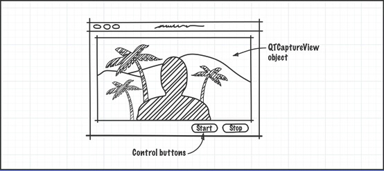

In this prototype, you use three simple Cocoa objects: a QuickTime capture view, and two control buttons to start and stop the actual recording process. These are the building blocks for your application. After you’ve sketched them out, you can begin to think of how to hook them up in Interface Builder and what code you need in your Xcode project to make this happen.

Follow the same steps you performed when you created and built the `MyMediaPlayer` application, described in [Creating a Simple QTKit Media Player Application](Creating%20a%20Simple%20QTKit%20Media%20Player%20Application.md#apple-f4xwc4dqnrsv64tfmyxwi33df52wszbpkridimbqga4dcnjvfvbuqmznknltq).

To create the project:

1. Launch Xcode 3.2 and choose File > New Project.
2. When the new project window appears, select Cocoa Application and click Choose.
3. Name the project MyRecorder and navigate to the location where you want the Xcode application to create the project folder. The Xcode project window appears, as shown here.

   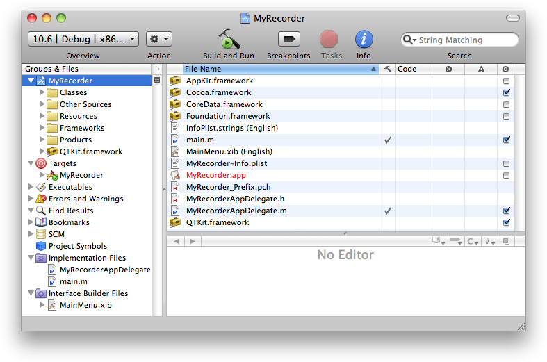
4. Add the QTKit framework to your MyRecorder project.

   - From the Action menu in your Xcode project, choose Add > Add to Existing Frameworks.
   - In the `/System/Library/Frameworks` directory, select `QTKit.framework`.
   - Click the Target “MyMediaPlayer” Info panel and verify you have linked to the QTKit.framework and the Type `Required` is selected.

   This completes the first sequence of steps in your project. In the next sequence, you define actions and outlets in Xcode _before_ working with Interface Builder.

Now that you’ve already prototyped your QTKit recorder application, at least in rough form with a clearly defined data model, you can determine which actions and outlets need to be implemented. In this case, you have a `QTCaptureView` object, which is a subclass of `NSView`, and two simple buttons to start and stop the recording of your captured media content.

1. Choose File > New File. In the panel, scroll down and select Cocoa > Objective-C class, which includes the `<Cocoa/Cocoa.h>` header files.
2. Name your implementation file `MyRecorderController.m`. Check the item in the field below to name your declaration file `MyRecorderController.h`.
3. In your `MyRecorderController.h` file, add the necessary QTKit import statement.

```objc
#import <QTKit/QTKit.h>
```


Now begin adding outlets and actions.

1. In your `MyRecorderController.h` file, add the instance variable `mCaptureView`, which points to the `QTCaptureView` object as an outlet.

```
IBOutlet QTCaptureView *mCaptureView;
```
2. Define two actions to start and stop recording.

```objc
- (IBAction)startRecording:(id)sender;
- (IBAction)stopRecording:(id)sender;
```

   At this point, the code in your `MyRecorderController.h` file should look like this:

```objc
#import <Cocoa/Cocoa.h>
#import <QTKit/QTKit.h>

@interface MyRecorderController : NSObject {
    IBOutlet QTCaptureView *mCaptureView;
}
- (IBAction)startRecording:(id)sender;
- (IBAction)stopRecording:(id)sender;

@end
```
3. Open the `MyRecorderController.m` file and add the following actions, along with the requisite braces.

```objc
- (IBAction)startRecording:(id)sender
{
}
- (IBAction)stopRecording:(id)sender
{
}
```
4. Save both your `MyRecorderController.h` and `MyRecorderController.m` files. Otherwise, when you go to work in Interface Builder, the application will not know about the `MyRecorderController` class.

This completes the second stage of your project. Now use Interface Builder 3.2 to construct the user interface for your project.

Now you construct and implement the various user interface elements in your project.

1. Launch Interface Builder 3.2.
2. In your Xcode project window, open the `MainMenu.xib` file .
3. In Interface Builder 3.2, find the library of objects.
4. Set up the preview window.

   - Scroll down until you find the QuickTime Capture View object.

     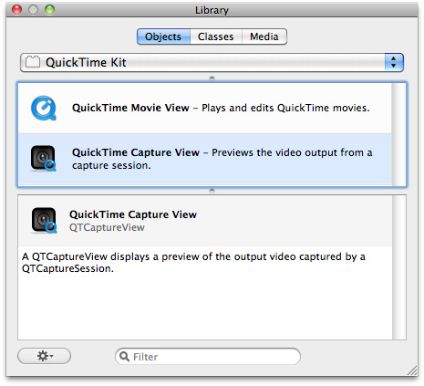

     The `QTCaptureView` object provides you with an instance of a view subclass to display a preview of the video output that is captured by a capture session.
   - Drag the `QTCaptureView` object into your window and resize the object to fit the window, allowing room for the two Start and Stop buttons in your QTKit recorder.
   - Click the object in the window.

     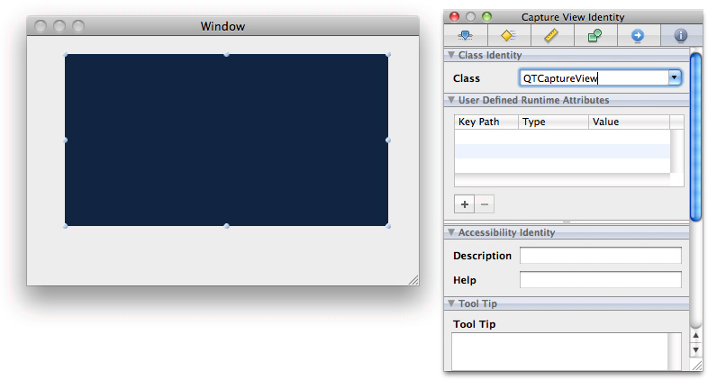
   - Set the autosizing for the object in the Capture View Size panel, as illustrated below.

     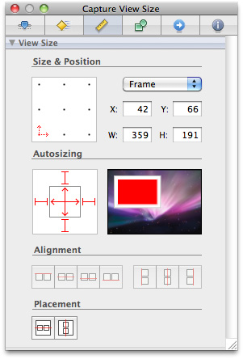
5. Define the window attributes of your MyRecorder Window.

   - Verify the controls, appearance, behavior, and memory items are checked, as shown in the illustration.

     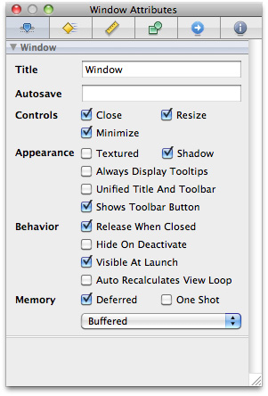
   - Create the Start and Stop buttons for the MyRecorder Window.
   - In the Library, select the Push Button control and drag it to the Window.

     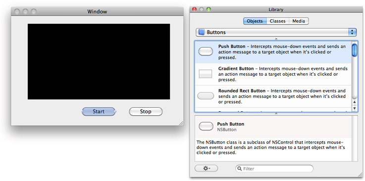
   - Enter the text `Start` and duplicate the button to create another button as `Stop`.
6. Set up the autosizing for your buttons (as shown in the illustration) by selecting the button and clicking the Button Size Inspector.

   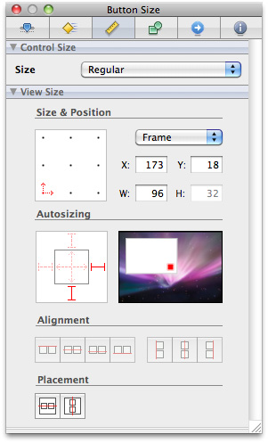
7. Add a controller, and name it.

   - In the Library, scroll down and select the blue cube control, which is an object (`NSObject`) you can instantiate as your controller.
   - Drag the object into your `MainMenu.xib` window.
   - Select the object and enter its name as `My Recorder Controller`. Then click the information icon in the Inspector.
   - When you click the Class Identity field, enter the first few letters of the class name into the text field. Interface Builder autocompletes it for you.

   The `MyRecorderController` object appears. If you have saved both your declaration and implementation files as specified in [Determine the Actions and Outlets You Want](#apple-f4xwc4dqnrsv64tfmyxwi33df52wszbpkridimbqga4dcnjvfvbuqobnknltcmi), Interface Builder automatically updates the `MyRecorderController` class specified in your Xcode implementation file. To verify and reconfirm that an update has occurred, press Return. If the identify field is not automatically updated, you may need to specify manually that it is a `MyRecorderController` object.

In the next phase of your project, you continue working with Interface Builder and Xcode to construct and implement the various elements in your project. Because of the seamless integration between Interface Builder and Xcode, your code will run more efficiently and with less overhead.

1. In Interface Builder, hook up the `MyRecorderController` object to the `QTCaptureView` object.

   - Control-drag from the `MyRecorderController` object in your nib file to the `QTCaptureView` object.
   - A transparent panel appears, displaying the `IBOutlet` instance variable, `mCaptureView`, that you’ve specified in your declaration file.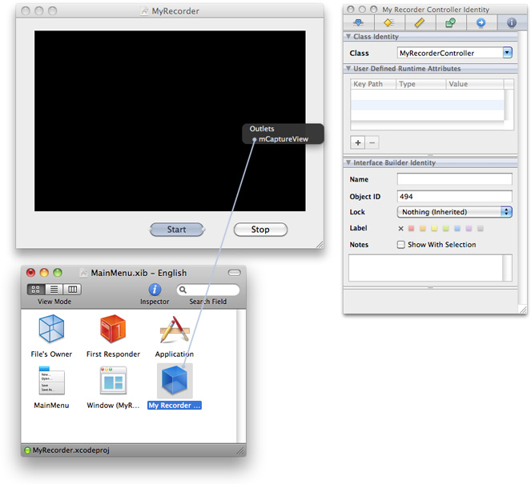
2. Click the Interface Builder outlet `mCaptureView` to wire up the two objects.

Now you’re ready to add your Start and Stop push buttons and wire them up in your MainMenu.nib window.

1. Control-drag each of the Start and Stop buttons from the window to the `MyRecorderController` object.

   - Click the `startRecording:` method in the transparent Received Actions panel to connect the Start button.
   - Likewise, click the `stopRecording:` method in the Received Actions panel to connect the Stop button.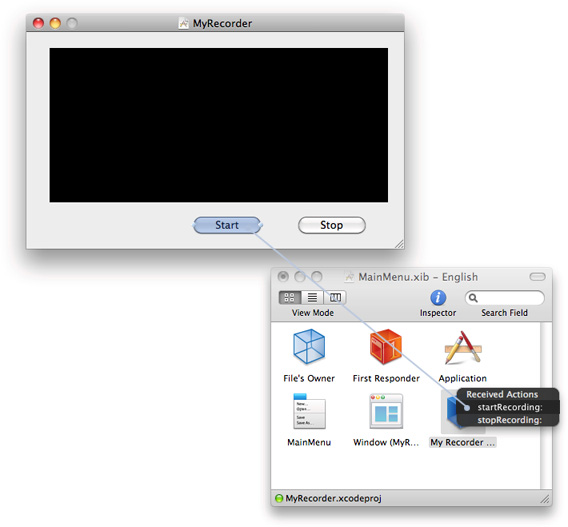
2. Now hook up the window and the `MyRecorderController` object as a delegate.

   Control-drag a connection from the window to the `MyRecorderController` object and click the outlet, connecting the two objects.

   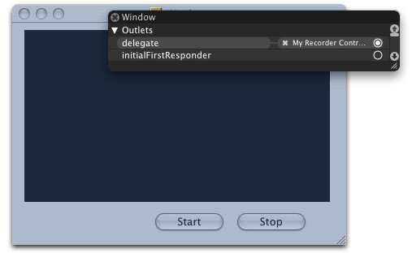
3. To verify that you’ve correctly wired up your window object to your delegate object, select the Window and click the Window Connections Inspector icon.

   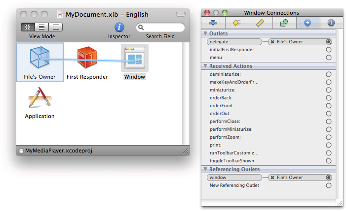
4. Verify that you’ve correctly wired up your outlets and received actions.

   Select the My Recorder Controller object and click the My Recorder Controller Connections icon.

   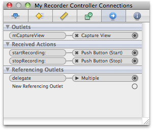
5. Check the My Recorder Controller Identity Inspector panel to confirm the class actions and class outlets.

   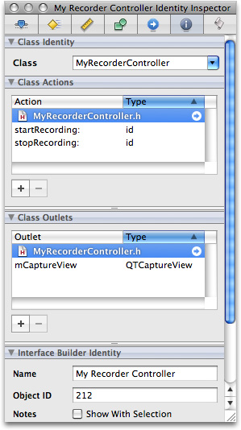
6. Click the `MainMenu.xib` file to verify that Interface Builder and Xcode have worked together to synchronize the actions and outlets you’ve specified.

   A small green light appears at the left bottom corner of the `MainMenu.xib` file next to `MyRecorder.xcodeproj` to confirm this synchronization.

   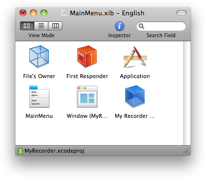
7. Save your nib file.
8. Verify that your QTKit MyRecorder application appears as shown in the illustration below.

   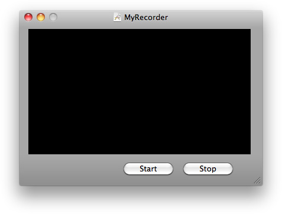

You’ve now completed your work in Interface Builder 3.2. In this next sequence of steps, you return to your Xcode project and add a few lines of code in both your declaration and implementation files to build and compile the application.

To complete the implementation of the `MyRecorderController` class, you need to define the instance variables that point to the capture session, as well as to the input and output objects. In your Xcode project, you add the instance variables to the interface declaration.

1. Update your `MyRecorderController.h` declaration file:

```objc
@interface MyRecorderController : NSObject {
QTCaptureSession           *mCaptureSession;
QTCaptureMovieFileOutput   *mCaptureMovieFileOutput;
QTCaptureDeviceInput       *mCaptureDeviceInput;
```

   The complete code for your declaration file should look like this:

```objc
#import <Cocoa/Cocoa.h>
#import <QTKit/QTKit.h>

@interface MyRecorderController : NSObject {

    IBOutlet QTCaptureView *mCaptureView;

    QTCaptureSession            *mCaptureSession;
    QTCaptureMovieFileOutput    *mCaptureMovieFileOutput;
    QTCaptureDeviceInput        *mCaptureDeviceInput;

}
- (IBAction)startRecording:(id)sender;
- (IBAction)stopRecording:(id)sender;

@end
```

   In the remaining steps, you modify the `MyRecorderController.m` implementation file. These steps are arranged in logical, though not necessarily rigid, order.
2. Create the capture session.

```objc
- (void)awakeFromNib
{
    mCaptureSession = [[QTCaptureSession alloc] init];
```
3. Connect inputs and outputs to the session.

```
    BOOL success = NO;
    NSError *error;
```
4. Find the device and create the device input. Then add it to the session.

```
QTCaptureDevice *device = [QTCaptureDevice defaultInputDeviceWithMediaType:QTMediaTypeVideo];
    if (device) {
        success = [device open:&error];
        if (!success) {
        }
        mCaptureDeviceInput = [[QTCaptureDeviceInput alloc] initWithDevice:device];
        success = [mCaptureSession addInput:mCaptureDeviceInput error:&error];
        if (!success) {
            // Handle error
        }
```
5. Create the movie file output and add it to the session.

```
    mCaptureMovieFileOutput = [[QTCaptureMovieFileOutput alloc] init];
    success = [mCaptureSession addOutput:mCaptureMovieFileOutput error:&error];
    if (!success) {
    }
    [mCaptureMovieFileOutput setDelegate:self];
```
6. Specify the compression options with an identifier with a size for video and a quality for audio.

```
NSEnumerator *connectionEnumerator = [[mCaptureMovieFileOutput connections] objectEnumerator];
        QTCaptureConnection *connection;

        while ((connection = [connectionEnumerator nextObject])) {
            NSString *mediaType = [connection mediaType];
            QTCompressionOptions *compressionOptions = nil;
            if ([mediaType isEqualToString:QTMediaTypeVideo]) {
                compressionOptions = [QTCompressionOptions compressionOptionsWithIdentifier:@"QTCompressionOptions240SizeH264Video"];
            } else if ([mediaType isEqualToString:QTMediaTypeSound]) {
                compressionOptions = [QTCompressionOptions compressionOptionsWithIdentifier:@"QTCompressionOptionsHighQualityAACAudio"];
            }

            [mCaptureMovieFileOutput setCompressionOptions:compressionOptions forConnection:connection];
```
7. Associate the capture view in the user interface with the session.

```
    [mCaptureView setCaptureSession:mCaptureSession];
    }
```
8. Start the capture session running.

```
    [mCaptureSession startRunning];
}
```
9. Handle the closing of the window and notify for your input device, and then stop the capture session.

```objc
- (void)windowWillClose:(NSNotification *)notification
{
    [mCaptureSession stopRunning];
    [[mCaptureDeviceInput device] close];
}
```
10. Deallocate memory.

```objc
 - (void)dealloc
{
    [mCaptureSession release];
    [mCaptureDeviceInput release];
    [mCaptureMovieFileOutput release];

    [super dealloc];
}
```
11. Implement start and stop actions, and specify the output destination for your recorded media, in this case a QuickTime movie (`.mov`) in your `/Users/Shared` folder.

```objc

- (IBAction)startRecording:(id)sender
{
    [mCaptureMovieFileOutput recordToOutputFileURL:[NSURL fileURLWithPath:@"/Users/Shared/My Recorded Movie.mov"]];
}

- (IBAction)stopRecording:(id)sender
{
    [mCaptureMovieFileOutput recordToOutputFileURL:nil];
}
```
12. Finish recording and then launch your recording as a QuickTime movie on your Desktop.

```objc

- (void)captureOutput:(QTCaptureFileOutput *)captureOutput didFinishRecordingToOutputFileAtURL:(NSURL *)outputFileURL forConnections:(NSArray *)connections dueToError:(NSError *)error
{
    [[NSWorkspace sharedWorkspace] openURL:outputFileURL];
}
```


After you’ve saved your project, click Build and Go. After compiling, click the Start button to record, and the Stop button to stop recording. The output of your captured session is saved as a QuickTime movie in the path you specified in this code sample.

Using a simple iSight camera, you now have the capability of capturing and recording media at a specific size and audio quality, and then outputting your recording to a QuickTime movie.

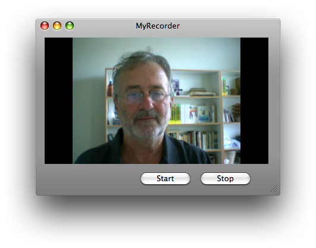

In this chapter, as a programmer, you focused on building a recorder application using three capture objects: `QTCaptureSession`, `QTCaptureMovieFileOutput` and `QTCaptureDeviceInput`. These were the essential building blocks for your project. You learned how to:

- Prototype and design the data model and controllers for your project in a rough sketch before constructing the actual user interface.
- Define two specific IB actions as buttons to start and stop recording.
- Create the user interface using the `QTCaptureView` plug-in from the Interface Builder library of controls.
- Wire up the control buttons for your user interface.
- Specify compression options with an identifier for the size of your recorded video and the for quality of your audio.
- Build and run the recorder application, using the iSight camera as your input device.

[Next](Adding%20Audio%20Input%20and%20DV%20Camera%20Support.md)[Previous](Customizing%20the%20Media%20Player%20Application.md)

