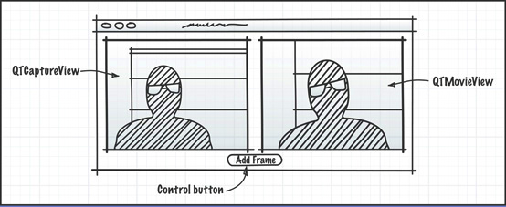
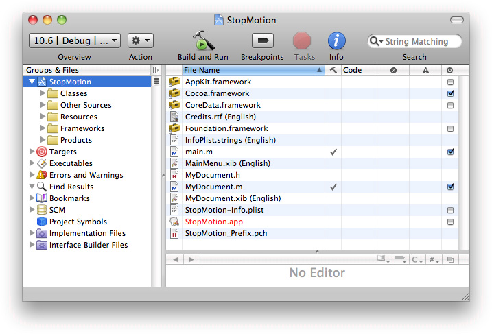
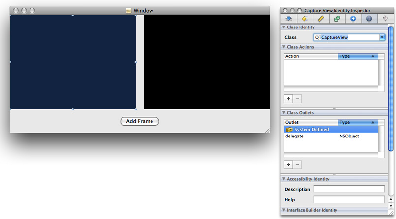
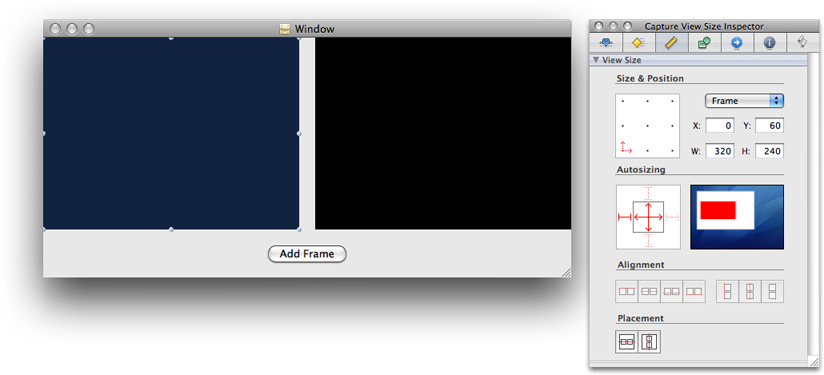
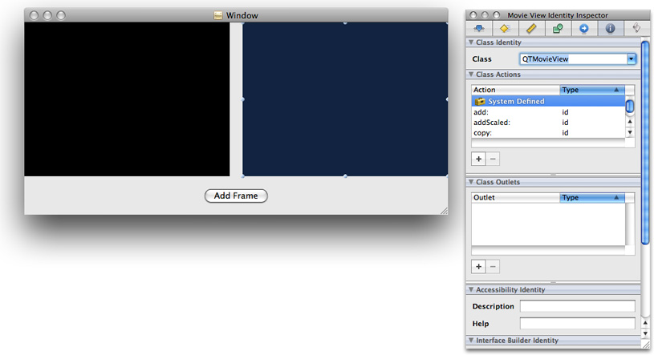
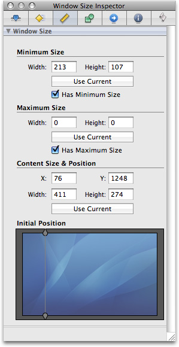
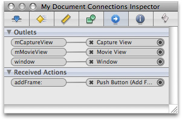
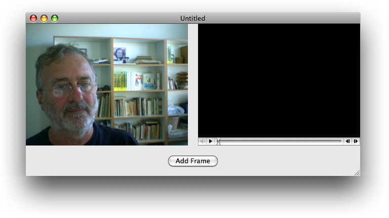

> 导航：[总目录](../../../README.md) · [documentation](../../../_indexes/documentation.md) · [QTKit Application Tutorial](Introduction.md)


[Next](Document%20Revision%20History.md)[Previous](Adding%20Audio%20Input%20and%20DV%20Camera%20Support.md)

# Creating a QTKit Stop Motion Application

Following the steps outlined in this chapter, you construct a simple stop motion recorder application that lets you capture a live video feed, grab frames one at a time with great accuracy, and then record the output of those frames to a QuickTime movie. You accomplish this with less than 100 lines of [Objective-C](https://developer.apple.com/library/archive/documentation/General/Conceptual/DevPedia-CocoaCore/ObjectiveC.html#//apple_ref/doc/uid/TP40008195-CH43) code, constructing the sample as you’ve done in previous chapters, in Xcode 3.2 and Interface Builder 3.2.

In building your stop motion recorder application, you work with the following three QTKit classes:

- `QTCaptureSession`. The primary interface for capturing media streams.
- `QTCaptureDecompressedVideoOutput`. The output destination for a `QTCaptureSession` object that you can use to process decompressed frames from the video that is being captured. Using the methods provided in this class, you can produce decompressed video frames that are suitable for high-quality video processing.
- `QTCaptureDeviceInput`. The input source for media devices, such as cameras and microphones.

The sample code described in this chapter does not support input from DV cameras, which are of type `QTMediaTypeMuxed`, rather than `QTMediaTypeVideo`. To add support for DV cameras, read the chapter [Extending the Media Player Application](Extending%20the%20Media%20Player%20Application.md#apple-f4xwc4dqnrsv64tfmyxwi33df52wszbpkridimbqga4dcnjvfvbuqnjnknltc).

Just as you’ve done in the section [Prototype the Recorder](Building%20a%20Simple%20QTKit%20Recorder%20Application.md#apple-f4xwc4dqnrsv64tfmyxwi33df52wszbpkridimbqga4dcnjvfvbuqobnknltk), start by creating a rough sketch of your QTKit stop motion recorder application. Think, again, of what design elements you want to incorporate into the application.



In this design prototype, you start with three simple objects: a capture view, a QuickTime movie view, and a single button to add frames. These will be the building blocks for your application. You can add more complexity to the design later on. After you’ve sketched out your prototype, think how to hook up the objects in Interface Builder and what code you need in your Xcode project to make this happen. Note that you need to add a movie [controller](https://developer.apple.com/library/archive/documentation/General/Conceptual/DevPedia-CocoaCore/ControllerObject.html#//apple_ref/doc/uid/TP40008195-CH11) to the `QTMovieView` object in the illustration above.

To create the project, follow these steps, as in previous chapters:

1. Launch Xcode 3.2 and choose File > New Project.
2. When the new project window appears, select Cocoa Document-based Application and click Choose.
3. Name the project `StopMotion` and navigate to the location where you want the Xcode application to create the project folder.

   - The Xcode project window appears.
4. From the Action menu in your Xcode project, choose Add > Add to Existing Frameworks.

   Add the QTKit framework to your `StopMotion` project, which resides in the `/System/Library/Frameworks` directory.
5. Now add the Quartz Core framework to your project, which also resides in the `/System/Library/Frameworks` directory.

   - Select `QuartzCore.framework`, and click Add when the Add To Targets window appears.

   This completes the first sequence of steps in your project. In the next sequence, you define actions and outlets in Xcode _before_ working with Interface Builder.

   Because you’ve already prototyped your QTKit stop motion recorder application, at least in rough form with a clearly defined data model, you can now determine which actions and outlets need to be implemented. In this case, you have a `QTCaptureView` object, which is a subclass of `NSView`, a `QTMovieView` object to display your captured frames and one button to record your captured media content and add each single frame to your QuickTime movie output.

1. Open the `MyDocument.h` declaration file in your Xcode project.

   In the file, delete the Cocoa import statement and replace it with the QTKit import statement.

```objc
#import <QTKit/QTKit.h>
```
2. Open the `MyDocument.m` implementation file in your project. Delete the contents of the file except for the following lines of code:

```objc
#import "MyDocument.h"
@implementation MyDocument
- (NSString *)windowNibName
{
    return @"MyDocument";
}
@end
```
3. Save your file.

Now begin adding outlets and actions.

1. In your `MyDocument.h` file, add the instance variables `mCaptureView` and `mMovieView`.

```
IBOutlet QTCaptureView *mCaptureView;
IBOutlet QTMovieView   *mMovieView;
```
2. Add the `addFrame:` action method.

```objc
- (IBAction)addFrame:(id)sender;
```
3. Save your file.
4. Now open your `MyDocument.m` file and add the same action method, followed by braces for the code you add later to implement this action.

```objc
- (IBAction)addFrame:(id)sender
{
}
```

This completes the second stage of your project. Now you work with Interface Builder 3.2 to construct the user interface for your project. Be sure that you have saved both your declaration and implementation files, so that the actions and outlets you declared are synchronously updated in your Interface Builder nib.

In the next phase of your project you construct the user interface for your project.

1. Open Interface Builder 3.2 and click the `MyDocument.xib` file in your Xcode project window.
2. In Interface Builder 3.2, select Tools > Library to open a library of objects.

   - Scroll down to the QuickTime capture view object.

   The `QTCaptureView` object provides you with an instance of a view subclass to display a preview of the video output that is captured by a capture session.

   - Drag the `QTCaptureView` object into your window and resize the object to fit the window, allowing room at the bottom for your Add Frame button (already shown in the illustration below) and to the right for your `QTMovieView` object in your QTKit stop motion recorder application.
   - Choose Tools > Inspector. In the Identity panel, select the information (“i”) icon. Click in the field Class and your `QTCaptureView` object appears.

     
   - Set the autosizing for the object in the Capture View Size panel.

     
3. Now repeat the same sequence described in Step #2 to add your `QTMovieView` object to your window (already shown above).

   - Scroll to the `QTMovieView` object.
   - Select the `QTMovieView` object (symbolized by the blue Q) and drag it into your Window next to the `QTCaptureView` object, shown below.
   - Choose Tools > Inspector. In the Identity Inspector, select the information (“i”) icon. Click in the Class field and your `QTMovieView` object appears.

     
   - Set the autosizing for your `QTMovieView` object, as you did for the `QTCaptureView` object in the steps above.
4. Now specify the window attributes in your `MyDocument.xib` file.

   - Select the window object in your nib.
   - Click the attributes icon in the panel.
5. Define the window size you want in your `MyDocument.xib` by selecting the size icon (symbolized by a yellow ruler) in the Window Size panel.

   
6. Specify the delegate outlet connections of File’s Owner in the Window Connections panel.

   
7. In the Library, select the Push Button control and drag it to the window.

   - Enter the text `Add Frame`.
   - Set the autosizing for the button at the center and right outside corner, leaving the inside struts untouched, as shown in the illustration.
8. Select the `MyDocument.xib` file and click the Connections Inspector.

   - Now wire up the outlets and received actions.
   - Control-drag each outlet instance variable to the File’s Owner object.
9. Select the File’s Owner object in your `MyDocument.xib` file.

   - Click the Class Identity icon in the Interface Builder Inspector.
   - Note that the green light at the left corner of your `StopMotion.xcodeproj` is turned on, indicating that Xcode and Interface Builder have synchronized the actions and outlets in your project.
10. Save your Interface Builder file.

In the last phase of your project, after adding and completing the implementation code, you’re ready to capture single-frame video, using your stop motion recorder application, as shown below.



To complete the implementation of the MyDocument class, you define the instance variables that point to the capture session, as well as to the device input and decompressed video output objects.

1. In your Xcode project, add the instance variables to the interface declaration.

   Add these lines of code in your `MyDocument.h` declaration file:

```objc
@interface MyDocument : NSDocument
{
   QTMovie                                *mMovie;
   QTCaptureSession                       *mCaptureSession;
   QTCaptureDeviceInput                   *mCaptureDeviceInput;
   QTCaptureDecompressedVideoOutput       *mCaptureDecompressedVideoOutput;
}
```

   The `mMovie` instance variable points to the `QTMovie` object, and the `mCaptureSession` instance variable points to the `QTCaptureSession` object. Likewise, the `*mCaptureDeviceInput` instance variable points to the `QTCaptureDeviceInput` object, and the next line declares that the `mCaptureDecompressedVideoOutput` instance variable points to the `QTCaptureDecompressedVideoOutput` object.
2. Declare the `mCurrentImageBuffer` instance variable.

```
 CVImageBufferRef                    mCurrentImageBuffer;
```

   This instance variable stores the most recent frame that you’ve grabbed in a `CVImageBufferRef`.

   That completes the code you need to add to your `MyDocument.h` file.
3. Open your `MyDocument.m` file and follow these steps.
4. Create an empty movie that writes to mutable data in memory, using the `initToWritableData:` method.

```objc
- (void)windowControllerDidLoadNib:(NSWindowController *) aController
{
    NSError *error = nil;
    [super windowControllerDidLoadNib:aController];
    [[aController window] setDelegate:self];
    if (!mMovie) {
        mMovie = [[QTMovie alloc] initToWritableData:[NSMutableData data] error:&error];
        if (!mMovie) {
            [[NSAlert alertWithError:error] runModal];
            return;
        }
    }
```
5. Set up a capture session that outputs the raw frames you want to grab.

```
    [mMovieView setMovie:mMovie];
    if (!mCaptureSession) {
        BOOL success;
        mCaptureSession = [[QTCaptureSession alloc] init];
```
6. Find a video device and add a device input for that device to the capture session.

```
        QTCaptureDevice *device = [QTCaptureDevice defaultInputDeviceWithMediaType:QTMediaTypeVideo];
        success = [device open:&error];
        if (!success) {
            [[NSAlert alertWithError:error] runModal];
            return;
        }
        mCaptureDeviceInput = [[QTCaptureDeviceInput alloc] initWithDevice:device];
        success = [mCaptureSession addInput:mCaptureDeviceInput error:&error];
        if (!success) {
            [[NSAlert alertWithError:error] runModal];
            return;
        }
```
7. Add a decompressed video output that returns the raw frames you’ve grabbed to the session and then previews the video from the session in the document window.

```
        mCaptureDecompressedVideoOutput = [[QTCaptureDecompressedVideoOutput alloc] init];
        [mCaptureDecompressedVideoOutput setDelegate:self];
        success = [mCaptureSession addOutput:mCaptureDecompressedVideoOutput error:&error];
        if (!success) {
            [[NSAlert alertWithError:error] runModal];
            return;
        }
```
8. Preview the video from the session in the document window.

```
        [mCaptureView setCaptureSession:mCaptureSession];
```
9. Start the session, using the `startRunning` method you’ve used previously in the `MyRecorder` sample code.

```
        [mCaptureSession startRunning];
    }
}
```
10. Implement a delegate method that `QTCaptureDecompressedVideoOutput` calls whenever it receives a frame.

```objc
 - (void)captureOutput:(QTCaptureOutput *)captureOutput didOutputVideoFrame:(CVImageBufferRef)videoFrame withSampleBuffer:(QTSampleBuffer *)sampleBuffer fromConnection:(QTCaptureConnection *)connection
```
11. Store the latest frame. Do this in a `@synchronized` block because the delegate method is not called on the main thread.

```
    CVImageBufferRef imageBufferToRelease;

    CVBufferRetain(videoFrame);

    @synchronized (self) {
        imageBufferToRelease = mCurrentImageBuffer;
        mCurrentImageBuffer = videoFrame;
    }
    CVBufferRelease(imageBufferToRelease);
}
```
12. Handle window closing notifications for your device input and stop the capture session.

```objc
- (void)windowWillClose:(NSNotification *)notification
{
    [mCaptureSession stopRunning];
    QTCaptureDevice *device = [mCaptureDeviceInput device];
    if ([device isOpen])
        [device close];
}
```
13. Deallocate memory for your capture objects.

```objc
- (void)dealloc
{
    [mMovie release];
    [mCaptureSession release];
    [mCaptureDeviceInput release];
    [mCaptureDecompressedVideoOutput release];
    [super dealloc];
}
```
14. Specify the output destination for your recorded media, in this case an editable QuickTime movie.

```objc
- (BOOL)readFromURL:(NSURL *)absoluteURL ofType:(NSString *)typeName error:(NSError **)outError
{
    QTMovie *newMovie = [[QTMovie alloc] initWithURL:absoluteURL error:outError];
    if (newMovie) {
        [newMovie setAttribute:[NSNumber numberWithBool:YES] forKey:QTMovieEditableAttribute];
        [mMovie release];
        mMovie = newMovie;
    }
    return (newMovie != nil);
}
- (BOOL)writeToURL:(NSURL *)absoluteURL ofType:(NSString *)typeName error:(NSError **)outError
{
    return [mMovie writeToFile:[absoluteURL path] withAttributes:[NSDictionary dictionaryWithObject:[NSNumber numberWithBool:YES] forKey:QTMovieFlatten] error:outError];
}
```
15. Add the `addFrame:` action method that you specified previously in your implementation file. This enables you to get the most recent frame that you’ve grabbed. Do this in a `@synchronized` block because the delegate method that sets the most recent frame is not called on the main thread. Note that you’re wrapping a `CVImageBufferRef` object into an `NSImage`. After you create an `NSImage`, you can then add it to the movie.

```objc
- (IBAction)addFrame:(id)sender
{
    CVImageBufferRef imageBuffer;
    @synchronized (self) {
        imageBuffer = CVBufferRetain(mCurrentImageBuffer);
    }
    if (imageBuffer) {
        NSCIImageRep *imageRep = [NSCIImageRep imageRepWithCIImage:[CIImage imageWithCVImageBuffer:imageBuffer]];
        NSImage *image = [[[NSImage alloc] initWithSize:[imageRep size]] autorelease];
        [image addRepresentation:imageRep];
        CVBufferRelease(imageBuffer);
        [mMovie addImage:image forDuration:QTMakeTime(1, 10) withAttributes:[NSDictionary dictionaryWithObjectsAndKeys:
@"jpeg", QTAddImageCodecType, nil]];
        [mMovie setCurrentTime:[mMovie duration]];
        [mMovieView setNeedsDisplay:YES];
        [self updateChangeCount:NSChangeDone];
    }
}
```


After you’ve saved your project, click Build and Go. After compiling, click the Add Frame button to record each captured frame and output that frame to a QuickTime movie. The output of your captured session is saved as a QuickTime movie.

Now you can begin capturing and recording with your QTKit stop motion recorder application. Typically, you can record any number of frames illustrating movement or action, using objects of clay or stick figures, for example, which, when combined and recorded, will create the illusion of motion in a movie or animated sequence. The technique is common in working with various inanimate objects that can be assembled into a particular story or narrative.

In this chapter, you focused on building a stop motion recorder application using three capture objects: `QTCaptureSession`, `QTCaptureDecompressedVideoOutput` and `QTCaptureDeviceInput`. These were the essential building blocks for your project. You learned how to:

- Prototype and design the data model and control for your project in a rough sketch before constructing the actual user interface.
- Define a specific IB action as a button to add frames to your recording.
- Create the user interface using the `QTCaptureView` plug-in from the Interface Builder library of controls.
- Wire up the Add Frame control button for your user interface.
- Define the instance variables that point to the capture session, as well as to the device input and decompressed video output objects.
- Build and run the stop motion recorder application, using the iSight camera as your input device.
- Output the single captured frames to a QuickTime movie for animated effects.

[Next](Document%20Revision%20History.md)[Previous](Adding%20Audio%20Input%20and%20DV%20Camera%20Support.md)

