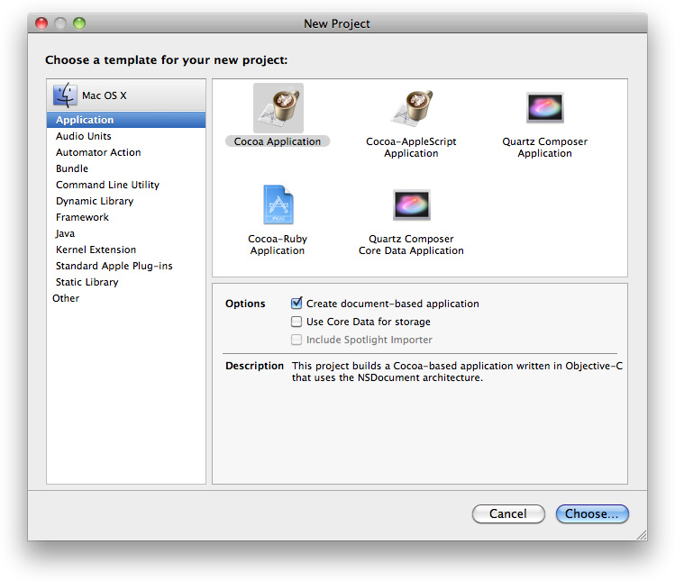
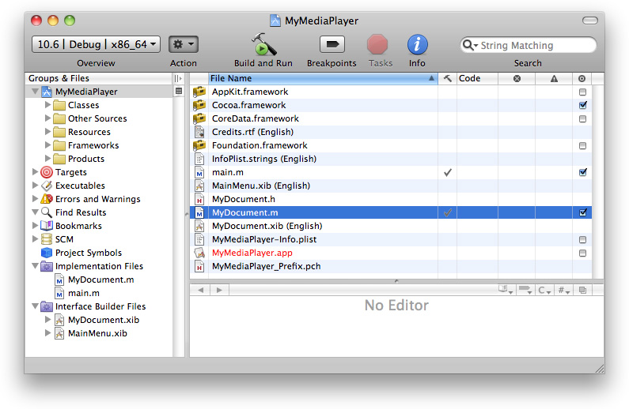
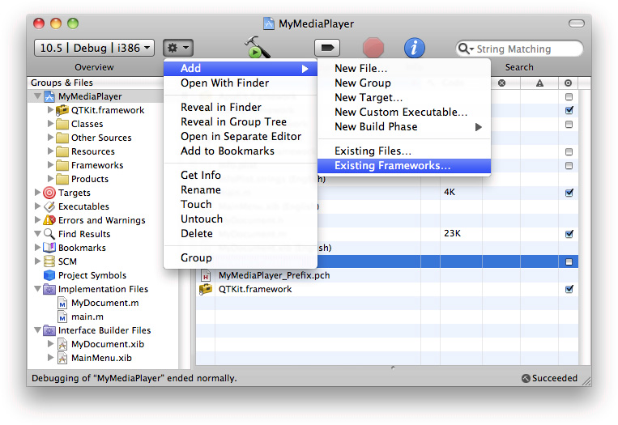
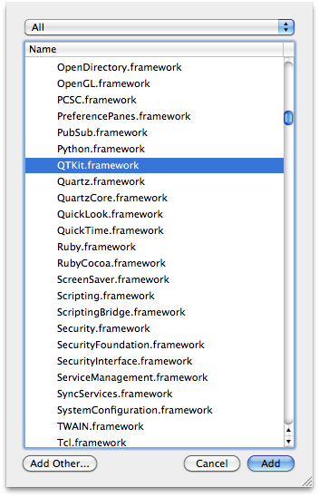
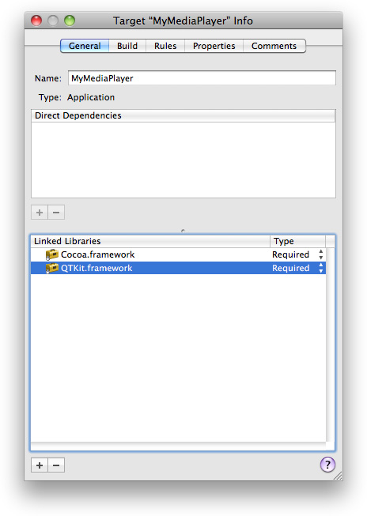
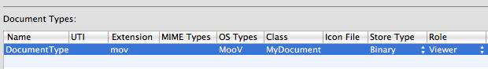
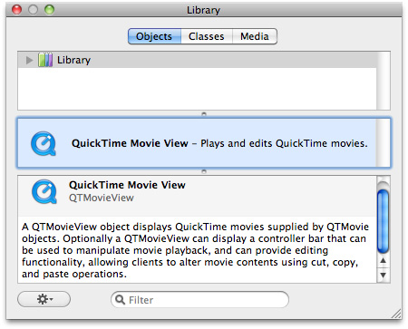
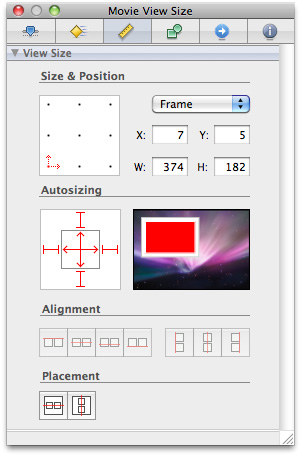

> 导航：[总目录](../../../README.md) · [documentation](../../../_indexes/documentation.md) · [QTKit Application Tutorial](Introduction.md)


[Next](Extending%20the%20Media%20Player%20Application.md)[Previous](Introduction.md)

# Creating a Simple QTKit Media Player Application

In this chapter, you build a QTKit media player application that takes advantage of some of the most useful methods and classes available in the QTKit framework. To implement this media player, you’ll be surprised at how few lines of [Objective-C](https://developer.apple.com/library/archive/documentation/General/Conceptual/DevPedia-CocoaCore/ObjectiveC.html#//apple_ref/doc/uid/TP40008195-CH43) code you’ll have to write.

To create the project:

1. Launch Xcode 3.2 and choose File > New Project.
2. When the new project window appears, select OS X > Application > Cocoa Application.

   In the Options panel, check Create document-based application, then click Choose.

   This builds a Cocoa-based application written in Objective-C that uses the `NSDocument` architecture.

   
3. Name the project `MyMediaPlayer` and navigate to the location where you want the Xcode application to create the project folder.

   The Xcode project window appears.

   
4. Verify that the files in your project match those in the illustration.

   Note that the icons representing both the `MyDocument.xib` and `MainMenu.xib` nibs have the extension `.xib`, which indicates that your project is using Interface Builder 3xx. The xib file format is preferred during development because it provides a diff-able text and SCM-friendly format. At build time, Xcode automatically converts your project’s xib files to nib files so that they can be deployed with your application. If you have existing nib files, however, you can also continue saving to that same format.
5. Add the QTKit framework to your MyMediaProject project.

   - From the Action menu in your Xcode project, choose Add > Add to Existing Frameworks.

     
   - In the `/System/Library/Frameworks` directory, select `QTKit.framework`.

     
   - Click the Target “MyMediaPlayer” Info panel and verify you have linked to the QTKit.framework and the Type `Required` is selected, as shown in the illustration.

     
   - In the same Target “MyMediaPlayer” Info window, select the Properties button and open the Properties pane.
   - Select the DocumentType row. In the Extensions column, enter `mov`, and in the OS Types column, enter `MooV`.

     
   - In the DocumentType row, select `Binary` from the Store Type and `Viewer` from the Role pull-down menu.

   This completes the first basic sequence of steps in your project. In the next few sequences, you declare the instance methods you need in Xcode _before_ working with Interface Builder.

In the declaration (`.h`) file of your Xcode project, you import a QTKit header file and declare an instance variable (`movie`).

1. In the Xcode project window for MyMediaPlayer, open the `MyDocument.h`.
2. After the file’s import statement for Cocoa, add an import statement for QTKit.

   Your code should look like this:

```objc
#import <Cocoa/Cocoa.h>
#import <QTKit/QTKit.h>
```
3. Declare the instance variable `movie` that points to the `QTMovie` object.

```
{
     QTMovie *movie;
}
```

   The line returns the `QTMovie` object that you will bind your movie to later on.
4. Declare a retained reference to a `QTMovie` instance, using the `@property` directive.

```objc
@property(retain) QTMovie *movie;
```

   At this point, the code in your `MyDocument.h` file should look like this.

```objc
#import <Cocoa/Cocoa.h>
#import <QTKit/QTKit.h>

@interface MyDocument : NSDocument {
    QTMovie *movie;
}

@property(retain) QTMovie *movie;

@end
```
5. Save the file.

In the implementation (.m) file of the Xcode project, you set the contents of your movie document.

1. Open the `MyDocument.m` implementation file.
2. Set a URL location for obtaining the contents of your movie document and use the `setMovie:` method to set the document’s movie to be the `QTMovie` object you just created.

   - Scroll down to the block of code that includes the `- (BOOL)readFromData:` method.
   - Replace that block of code with the following code in the next step.

```objc
- (BOOL)readFromURL:(NSURL *)absoluteURL ofType:(NSString *)typeName error:(NSError **)outError
{
     QTMovie *newMovie = [QTMovie movieWithURL:absoluteURL error:outError];
     if (newMovie) {
        [self setMovie:newMovie];
     }
    return (newMovie != nil);
}
```
3. Add the `@synthesize` directive to generate the [getter and setter methods](https://developer.apple.com/library/archive/documentation/General/Conceptual/DevPedia-CocoaCore/AccessorMethod.html#//apple_ref/doc/uid/TP40008195-CH2) you need and to complete your implementation.

```objc
@synthesize movie;
```
4. Deallocate memory.

```objc
-(void)dealloc
{
    if (movie) {
       [movie release];
    }
    [super dealloc];
}
```
5. Save your file.

This completes the second stage of your project. Next, you construct the user interface for your project using Interface Builder 3.2.

To create the user interface:

1. Launch Interface Builder 3.2.
2. Open the `MyDocument.xib` file.

   Because of the integration between Xcode 3.2 and Interface Builder 3.2, the methods you declared in your `MyDocument.h` file have been synchronously updated in Interface Builder 3.2.
3. In Interface Builder 3.2, select Tools > Library to open a library of plug-in controls.

   - Scroll down until you find the QuickTime Movie View control in the objects library.

   The `QTMovieView` object provides you with an instance of a view subclass to display QuickTime movies that are supplied by `QTMovie` objects in your project.
4. Select the “Your document contents here” text object in the window and press Delete.
5. Drag the `QTMovieView` object from the library into your window and resize the object to fit the window.

   Note that the object combines both a view and a control for playback of media.
6. Modify the movie view attributes.

   - Choose Tools > Inspector.
   - In the Inspector panel, select the Movie View Attributes icon, which appears as the first icon in the row at the top of the panel.
   - Make sure the Show Controller checkbox is checked.
7. Set the autosizing for the `QTMovieView` object in the Movie View Size, as shown in the illustration.

   
8. Connect the movie object to the QuickTime movie to be displayed. You do this by defining a Cocoa binding:

   - In the `QTMovieView` Inspector (select the `QTMovieView` and open with Command-Shift-I, if needed), navigate to the Bindings panel. (You can also access it by selecting Tools > Bindings Panel.)
   - In the Parameters section of the Bindings panel, open the movie parameter by clicking the disclosure triangle next to it.
   - In the “Bind to:” pull-down menu, select File’s Owner.
   - In the Model Key Path field, enter the text `movie`.

     
   - Check the “Bind to:” checkbox to save your settings.

   In this case, by specifying the [binding](https://developer.apple.com/library/archive/documentation/General/Conceptual/DevPedia-CocoaCore/DynamicBinding.html#//apple_ref/doc/uid/TP40008195-CH15) above, you’ve instructed Cocoa essentially to create a connection at runtime between the object that loads the user interface––that is, the File’s Owner object––and the `QTMovieView` object. This connection provides the `QTMovieView` object with a reference to the QuickTime movie that is to be opened and displayed.
9. Save your `MyDocument.xib` file in Interface Builder and return to your Xcode project.

That completes the user interface construction and coding of your media player. Now you’re ready to build and compile the application in Xcode.

Before you build and compile your project, you need to specify that your player will open QuickTime movies, that is, movies with the extension `.mov`. You accomplish this as follows:

1. In your Xcode project, select Targets > MyMediaPlayer > Properties
2. In the Document Types pane, enter `mov` in the Extensions field.
3. Enter `MooV` in the OSTypes field.
4. Enter `MyDocument` in the Class field.
5. Specify the Store Type as Binary and the Role as Viewer.

Now you are ready to build and run the MyMediaPlayer project in Xcode. When the player launches, you can open and play any QuickTime movie of your choice. Simply locate a `.mov` file and launch the movie from the File > Open menu in your media player application.

In this chapter you learned how to:

- Create a Cocoa document-based application that lets you open and play QuickTime movies with fewer than ten lines of Objective-C code.
- Construct the user interface of the application in Interface Builder 3.2.
- Work with Cocoa Bindings to create a connection at runtime between the object that loads the user interface and the object that displays and plays back a QuickTime movie.

[Next](Extending%20the%20Media%20Player%20Application.md)[Previous](Introduction.md)

