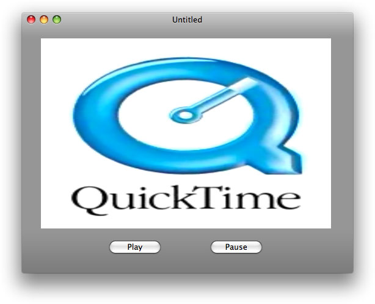
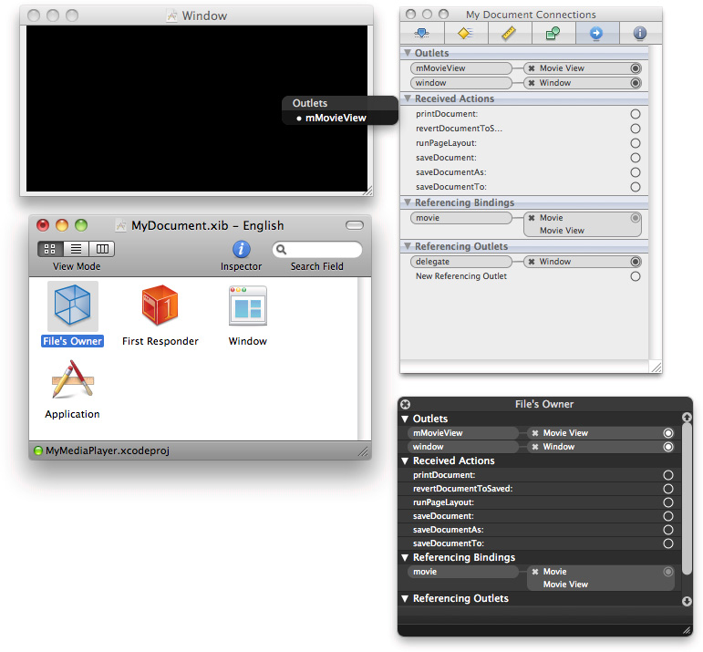

> 导航：[总目录](../../../README.md) · [documentation](../../../_indexes/documentation.md) · [QTKit Application Tutorial](Introduction.md)


[Next](Building%20a%20Simple%20QTKit%20Recorder%20Application.md)[Previous](Extending%20the%20Media%20Player%20Application.md)

# Customizing the Media Player Application

In this chapter, you further extend the capabilities and performance of your media player application. You begin by adding your own control buttons from the Interface Builder library of plug-in controls. These buttons enable you to control movie playback without relying on the built-in controls available in the `QTMovieView` object. Next, you work with movie attributes that enable you to better handle the display and playback of movies. You do this by using code to set up view resizing that respects the size and aspect ratio of displayed media content. In the last section of this chapter, you implement, with QuickTime X, the capabilities of a lightweight media player for faster, more efficient playback of media content.

The chapter builds on the understanding of the QTKit API you’ve gained from the previous chapters. The code samples discussed in this chapter rely on the media player application you built in [Extending the Media Player Application](Extending%20the%20Media%20Player%20Application.md#apple-f4xwc4dqnrsv64tfmyxwi33df52wszbpkridimbqga4dcnjvfvbuqnjnknltc).

Adding custom controls for movie playback to your media player project is relatively straightforward. You define the instance variables in your declaration file and then launch Interface Builder to add the controls from the library of available plug-in controls and wire up the play and pause buttons to the `QTMovieView` object for custom control of movie playback.

Working with the MyMediaPlayer sample project you constructed in [Extending the Media Player Application](Extending%20the%20Media%20Player%20Application.md#apple-f4xwc4dqnrsv64tfmyxwi33df52wszbpkridimbqga4dcnjvfvbuqnjnknltc), in the steps that follow, you create custom controls for your player application.

1. In your MyMediaPlayer Xcode project, open the `MyDocument.h` declaration file.
2. Declare an `mMovie` instance variable that points to a `QTMovie` object.
3. Declare an `mMovieWindow` instance variable that points to an `NSWindow` object as an Interface Builder outlet.

```
IBOutlet NSWindow     *mMovieWindow;
```
4. Declare an `mMovieView` instance variable that points to a `QTMovieView` Interface Builder outlet.

```
IBOutlet QTMovieView     *mMovieView;
```

   At this point, the code in your `MyDocument.h` file should look like this.

```objc
#import <Cocoa/Cocoa.h>
#import <QTKit/QTKit.h>

@interface MyDocument : NSDocument
{
    QTMovie                  *mMovie;

    IBOutlet NSWindow        *mMovieWindow;
    IBOutlet QTMovieView     *mMovieView;
}
@end
```
5. Save your file.

Now you’re ready to add the control buttons you need to customize media playback of content in your Xcode project.

To add buttons in Interface Builder:

1. Launch Interface Builder 3.2 and open the `MyDocument.xib` file in your Xcode project window.
2. Resize the `QTMovieView` object in your window so that you allow space at the bottom for placement of your control buttons.
3. Choose Tools > Library to open the Interface Builder library of controls and scroll down until you find the oval push button (`NSButton`) controls you need for your project.

   - Select and drag two buttons, which you can name Play and Pause, into the lower region of your window.
   - Control-drag the Play button to the `play:` action of the `QTMovieView` object and the Pause button to the `pause:` action of the `QTMovieView` object to wire up and connect both objects.
   - Click the `QTMovieView` object.
4. Modify the attributes of the `QTMovieView` object.

   - Choose Tools > Inspector.
   - In the Inspector panel, select the Movie View Attributes icon, which appears as the first icon in the row at the top of the panel.
   - Make sure the Show Controller checkbox is unselected.
5. Save your the file in Interface Builder and return your Xcode project.

After you’ve completed the sequence of steps, simply build and run the MyMediaPlayer project in Xcode. When the player launches, open and play any QuickTime movie of your choice.

Locate a `.mov` file and launch the movie from the File > Open menu in your media player application. Use the custom controls you’ve added to play and pause the playback of media content.



If you open and review the _QTMovie Class Reference_, you find a series of tables that describe movie attributes. These movie attributes are some of the most powerful features of the QTKit API, in that you can access the data in a `QTMovie` object, which is stored as attributes, by using an attribute key. The data encapsulated as attributes can be included in a dictionary and used appropriately in your code to handle a number of important tasks.

Whenever you instantiate a new `QTMovie` object, you can use its specified attributes to perform certain tasks. For example, you can use movie attributes in a dictionary to specify:

- The location of the movie data
- How the movie is to be instantiated
- The playback characteristics of the movie or other properties of the `QTMovie` object

Here are some of the keys that specify attributes of movie data you can access and manipulate in your application. The complete list of movie attributes is available in the _[QTKit Framework Reference](https://developer.apple.com/documentation/qtkit)_.

| Attribute | Description |
| --- | --- |
| `QTMovieCopyrightAttribute` | Contains the copyright string for a movie. |
| `QTMovieEditableAttribute` | Indicates whether the movie can be edited or not. |
| `QTMovieHasAudioAttribute` | Indicates whether the movie has an audio track or not. |
| `QTMovieIsSteppableAttribute` | Indicates whether the movie can be stepped from frame to frame. |
| `QTMovieNaturalSizeAttribute` | Returns the size of the movie when displayed at full resolution. |

In [Extending the Media Player Application](Extending%20the%20Media%20Player%20Application.md#apple-f4xwc4dqnrsv64tfmyxwi33df52wszbpkridimbqga4dcnjvfvbuqnjnknltc), you already accessed and set one of the important attribute keys available in the `QTMovie` class when you added the following single line of code to your media player application:

```
    [newMovie setAttribute:[NSNumber numberWithBool:YES] forKey:QTMovieEditableAttribute];
```

By setting that attribute, you enabled your media player to support simple cut, copy, and paste editing on the movie.

When you open and display any QuickTime movie, you probably notice that the movie size may not match the actual size of the original QuickTime movie, when played back in QuickTime Player. For example, an audio-only file still opens and displays the size of the default QuickTime movie associated with your Xcode project. Now you can modify the display of any media content by accessing a movie attribute key in your code.

To play back movies at the original QuickTime movie size:

1. Modify the code in your `MyDocument.h` declaration file so that it looks like this:

```objc
#import <Cocoa/Cocoa.h>
#import <QTKit/QTKit.h>

@interface MyDocument : NSDocument
{
    //movie document
    QTMovie                    *mMovie;
    // movie view
    IBOutlet QTMovieView    *mMovieView;
}

@property(retain) QTMovie *movie;

@end
```
2. Save your file.
3. In your `MyDocument.m` implementation file, add the following line of code after your `#import "MyDocument.h"` statement:

```
const static CGFloat kDefaultWidthForNonvisualMovies = 320;
```

   This specifies a static default constant width of 320 pixels for movies that are not visual, that is, typically audio files such as `.mp3` audio clips as illustrated below. You want to be able to play back these files at the appropriate width and height, and not as fully expanded QuickTime movies.

   
4. After your `@implementation My Document` directive, set up a [notification](https://developer.apple.com/library/archive/documentation/General/Conceptual/DevPedia-CocoaCore/Notification.html#//apple_ref/doc/uid/TP40008195-CH35) that the natural size of your movie has changed, if you are deploying your application using OS X v10.6.

```objc
- (void)dealloc
{
    QTMovie *movie = [self movie];
    if (movie)
    {
        [[NSNotificationCenter defaultCenter] removeObserver:self
#if defined(MAC_OS_X_VERSION_10_6) && (MAC_OS_X_VERSION_MIN_REQUIRED >= MAC_OS_X_VERSION_10_6)
                                                        name:QTMovieNaturalSizeDidChangeNotification
#else
                                                        name:QTMovieEditedNotification
#endif
                                                      object:movie];
    }

    [self setMovie:nil];

    [super dealloc];
}
```
5. Now set the size value as the natural size attribute for a movie.

```objc
- (void)windowControllerDidLoadNib:(NSWindowController *) aController
{
    [super windowControllerDidLoadNib:aController];

    QTMovie *movie = [self movie];
    if (movie)
    {
        [self sizeWindowToMovie];

        [[NSNotificationCenter defaultCenter] addObserver:self
                                 selector:@selector(movieNaturalSizeDidChange:)
#if defined(MAC_OS_X_VERSION_10_6) && (MAC_OS_X_VERSION_MIN_REQUIRED >= MAC_OS_X_VERSION_10_6)
                                     name:QTMovieNaturalSizeDidChangeNotification
#else
                                     name:QTMovieEditedNotification
#endif
                                   object:movie];
    }
    else
        [mMovieView setMovie:[QTMovie movie]];

    [mMovieView setShowsResizeIndicator:YES];

    [[mMovieView window] setShowsResizeIndicator:NO];
}
```
6. Size the player window to match the size of the movie.

```objc
- (void)sizeWindowToMovie
{
    QTMovie *movie = [self movie];

    NSSize contentSize = NSZeroSize;
    NSValue *contentSizeValue = [movie attributeForKey:QTMovieNaturalSizeAttribute];
    if (contentSizeValue)
        contentSize = [contentSizeValue sizeValue];

    if ([mMovieView isControllerVisible])
    {
        contentSize.height += [mMovieView movieControllerBounds].size.height;
        if (contentSize.width == 0)
        {
            contentSize.width = kDefaultWidthForNonvisualMovies;
        }
    }

    [[mMovieView window] setContentSize:contentSize];
}
```
7. Specify a notification that the size of window has changed.

```objc
- (void)movieNaturalSizeDidChange:(NSNotification *)notification
{
    [self sizeWindowToMovie];
}
```
8. Read the movie and mark it as editable.

```objc
- (BOOL)readFromURL:(NSURL *)absoluteURL ofType:(NSString *)typeName error:(NSError **)outError
{
    QTMovie *newMovie = [QTMovie movieWithURL:absoluteURL error:outError];

    if (newMovie) {
        [newMovie setAttribute:[NSNumber numberWithBool:YES] forKey:QTMovieEditableAttribute];

        [self setMovie:newMovie];
    }
    return (newMovie != nil);
}
```
9. Add the `@synthesize` directive.

```objc
@synthesize movie = mMovie;
```
10. At the top of your file––after the `const static CGFloat kDefaultWidthForNonvisualMovies = 320;` statement–– declare the interface for the `sizeWindowToMovie` method.

```objc
@interface MyDocument (MyDocumentInternal)
- (void)sizeWindowToMovie;
@end
```
11. Save your Xcode project.
12. Click the `MyDocument.xib` in your project and open the nib in Interface Builder.
13. In Interface Builder, Control-drag from the File’s Owner icon to the `QTMovieView` object and wire up the outlet to `mMovieView`.

    
14. Save your Interface Builder nib.
15. Now build and compile your project in Xcode.
16. Open any video/audio media content that QuickTime supports, such as H.264 movies, and it will display and render at the appropriate, original size of the media.

By adding these blocks of code, you sized the window to the natural size of the movie when it opens and displays media content, and you added a notification observer to ensure that the movie resizes to the size of the window and notifies you when the size changes. These are important concepts to understand in developing applications that behave properly and play back QuickTime and media content at its original size.

If you need to play back media, you can take advantage of the high-performance playback efficiency provided by QuickTime X in OS X v10.6. You gain access to the media playback services through the QTKit framework.

QuickTime X is a new media architecture developed by Apple that provides media services for QTKit application developers who need to play back audio/video media. Available in OS X v10.6, it is specifically designed for efficient, high-performance playback of audio/video media, with optimized support for modern codecs such as H.264 and AAC.

Using QuickTime X, you can open a media file, gather information about the playback characteristics of the movie (such as its duration, the codecs used, and thumbnail images), display the movie in a view, and control the loading and playback of that movie. However, movies using the new media services cannot be edited or exported.

In OS X v10.6, two new movie attributes are defined. The first attribute, `QTMovieOpenAsyncRequiredAttribute`, indicates whether a `QTMovie` object must be opened asynchronously. The second attribute, `QTMovieOpenForPlaybackAttribute`, indicates whether a `QTMovie` object will be used only for playback and not for editing or exporting.

The default behavior of `QTMovie` is to open movies that can be made editable and exportable. You pass the `QTMovieOpenForPlaybackAttribute` [key with the value](https://developer.apple.com/library/archive/documentation/General/Conceptual/DevPedia-CocoaCore/KeyValueCoding.html#//apple_ref/doc/uid/TP40008195-CH25) `NSNumber numberWithBool:YES` in the dictionary of attributes passed to `initWithAttributes:error:`. This indicates that you are interested only in playing the movie. If you don’t need to do editing or exporting, `QTMovie` may be able to select more efficient code paths.

To open and playback a movie file, you use the following code:

```objc
 - (void)windowControllerDidLoadNib:(NSWindowController *) aController
    {
        [super windowControllerDidLoadNib:aController];
        if ([self fileName]) {
            NSDictionary *attributes = [NSDictionary dictionaryWithObjectsAndKeys:
                                        [self fileName], QTMovieFileNameAttribute,
                                        [[NSNumber numberWithBool:YES],
                                        QTMovieOpenForPlaybackAttribute, nil];
            movie = [[QTMovie alloc] initWithAttributes:attributes error:NULL];
            [movieView setMovie:movie];
            [movie release];
            [[movieView movie] play];
        }
    }
```

Because the attributes dictionary contains a key-value pair with the `QTMovieOpenForPlaybackAttribute` key and the value `YES`, QTKit uses the new media services, if possible, to play back the media content in the selected file.

In this chapter you learned how to:

- Customize the functionality of the MyMediaPlayer application, enabling you to create custom start and stop controls for the playback of QuickTime movie or audio files.
- Use movie attributes to access the data in a `QTMovie` object, enabling you to access and manipulate movie data in your application
- Modify the MyMediaPlayer application for the playback of movies and media at their original or natural size.
- Access the new media services available in QuickTime X and OS X v10.6.

If you’ve worked through the coding examples in the first three chapters of this tutorial, you are well on your way toward mastering the skills you need to have in order to develop applications for media playback.

The next three chapters introduce you to the methods and classes in the QTKit API that let you do capture and recording of media content. You build a recorder application that is simple to design and implement, yet powerful in its functionality.

Beyond that, you add code to the recorder application to support the capture of DV video and audio media, and then create another application that enables you to capture and record still images, using the techniques employed by the movie industry for stop motion animation. After recording those still images, you’ll be able to output the content to a QuickTime movie, creating some unusual, animated effects.

[Next](Building%20a%20Simple%20QTKit%20Recorder%20Application.md)[Previous](Extending%20the%20Media%20Player%20Application.md)

