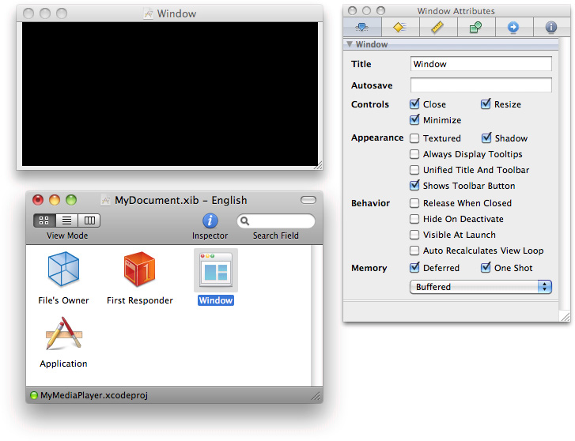
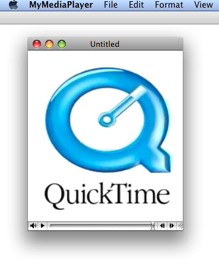
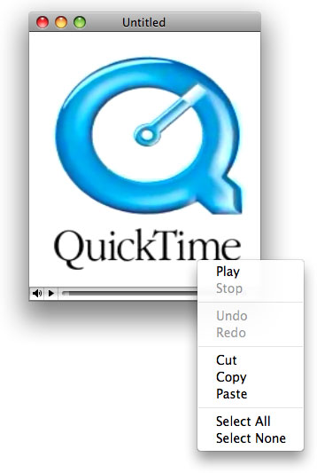

> 导航：[总目录](../../../README.md) · [documentation](../../../_indexes/documentation.md) · [QTKit Application Tutorial](Introduction.md)


[Next](Customizing%20the%20Media%20Player%20Application.md)[Previous](Creating%20a%20Simple%20QTKit%20Media%20Player%20Application.md)

# Extending the Media Player Application

In this chapter, you extend your QTKit media player beyond the simple player you constructed in the previous chapter. This time, when completed, your QTKit media player application allows you not only to display and play back a video or audio file as a QuickTime movie but also to edit the contents of that movie file. To implement this media player, you’ll be surprised, again, at how few lines of [Objective-C](https://developer.apple.com/library/archive/documentation/General/Conceptual/DevPedia-CocoaCore/ObjectiveC.html#//apple_ref/doc/uid/TP40008195-CH43) code you’ll have to write.

The goal of this chapter is to build on and extend your knowledge of the methods available in the QTKit framework. The focus, as in the previous chapter, is on how to accomplish media playback and, in this case, editing of video/audio content as efficiently as possible with a minimum of Objective-C code and in conformance with techniques for best practices in developing Cocoa applications.

To extend the MyMediaPlayer project:

1. Launch Xcode 3.2 and choose File > Open.
2. Select the MyMediaPlayer project you created in the previous chapter and open it.
3. In your MyMediaPlayer project, click the `MyDocument.h` declaration file.
4. Declare a `mMovieView` instance variable to point to the `QTMovieView` Interface Builder outlet, following the line of code in which you declared the `movie` instance variable pointing to the `QTMovie` object.

```
IBOutlet QTMovieView  *mMovieView;
```

   At this point, the code in your `MyDocument.h` file should look like this:

```objc
#import <Cocoa/Cocoa.h>
#import <QTKit/QTKit.h>

@interface MyDocument : NSDocument
{
    QTMovie *movie;

    IBOutlet QTMovieView *mMovieView;
}
@property(retain) QTMovie *movie;

@end
```
5. Save your file.

This completes the first stage of your project. Now you use Interface Builder 3.2 to construct the user interface for your project.

Interface Builder and Xcode are designed to work seamlessly together, enabling you to construct and implement the various elements in your project more efficiently and with less code overhead.

1. Launch Interface Builder 3.2 and open the `MyDocument.xib` file in your Xcode project window that you created following the steps in the previous chapter in [Create the User Interface with Interface Builder](Creating%20a%20Simple%20QTKit%20Media%20Player%20Application.md#apple-f4xwc4dqnrsv64tfmyxwi33df52wszbpkridimbqga4dcnjvfvbuqmznknlteoi).
2. Press Control-drag to wire up the File’s Owner to the movie view object, specifying the `mMovieView` instance variable as an outlet.
3. Select the Window object in the `MyDocument.xib` panel.

   - In the Inspector, click the Window attributes icon.
   - Define the behavior and appearance of the Window object.
4. Save and quit Interface Builder.

This completes the sequence steps for constructing your media player user interface. In the next sequence, you return to your `MyDocument.m` implementation file to add the necessary blocks of code for your project.

To modify the implementation file:

1. Open the `MyDocument.m` file and scroll down to the block of code that begins with the following:

```objc
- (void)windowControllerDidLoadNib:(NSWindowController *) aController
```
2. To show the movie control grow box, use the `setShowsResizeIndicator:` method.
3. To hide the window’s resize indicator so it does not interfere with the movie control, use the `setShowsResizeIndicator:` method.
4. Add the following lines so that your code looks like this:

```objc
- (void)windowControllerDidLoadNib:(NSWindowController *) aController
{
    [super windowControllerDidLoadNib:aController];
    [mMovieView setShowsResizeIndicator:YES];
    [[mMovieView window] setShowsResizeIndicator:NO];
}
```
5. Inside the block of code beginning with the `readFromURL:ofType:error:` method, which sets the contents of the document by reading from a file or file package, of a specified type, located by a URL, add this line:

```
[newMovie setAttribute:[NSNumber numberWithBool:YES] forKey:QTMovieEditableAttribute];
```
6. Make sure the complete block of code appears as follows:

```objc
- (BOOL)readFromURL:(NSURL *)absoluteURL ofType:(NSString *)typeName error:(NSError **)outError
{
    QTMovie *newMovie = [QTMovie movieWithURL:absoluteURL error:outError];
    if (newMovie) {
        [newMovie setAttribute:[NSNumber numberWithBool:YES] forKey:QTMovieEditableAttribute];

        [self setMovie:newMovie];
   }

    return (newMovie != nil);
}
```

   By calling the `setAttribute:forKey:` method and using the `QTMovie` editable attribute, you’ve marked the movie as _editable_. This means that any editing operations you choose, such as cut, copy, and paste, can be performed on the movie itself. The [value for this key](https://developer.apple.com/library/archive/documentation/General/Conceptual/DevPedia-CocoaCore/KeyValueCoding.html#//apple_ref/doc/uid/TP40008195-CH25) is of type `NSNumber`, interpreted as a Boolean value. If the movie can be edited, the value is `YES`. Understanding how to use attributes to specify and perform certain tasks is important in working with the QTKit API. Attributes you can access in the QTKit framework are discussed in the next chapter, [Customizing the Media Player Application](Customizing%20the%20Media%20Player%20Application.md#apple-f4xwc4dqnrsv64tfmyxwi33df52wszbpkridimbqga4dcnjvfvbuqnznknltc).

That completes the construction and coding of your extended media player application. Now you’re ready to build and compile the application in Xcode.

After you’ve completed these steps, launch your media player in Xcode, open and display QuickTime movies and perform editing on those movies.

1. In Xcode, build and run the media player application. In File > Open, select a movie and open it. The movie is completely editable with a slider bar for editing.

   
2. To access the editing features of the player or to control playback, stopping or starting the sample movie, control-click anywhere in the movie. A contextual menu appears.

   

In this chapter you learned how to:

- Extend the functionality of the `MyMediaPlayer` application, enabling you to open, play and edit QuickTime movies or audio files.
- In code, mark the movie as “editable” to perform editing operations such as cut, copy, and paste by using the `setAttribute:forKey:` method.
- Specify a movie controller grow box, using the `setShowsResizeIndicator:` method and hide the window’s resize indicator, using the `setShowsResizeIndicator:` method.

[Next](Customizing%20the%20Media%20Player%20Application.md)[Previous](Creating%20a%20Simple%20QTKit%20Media%20Player%20Application.md)

