> 导航：[总目录](../../../README.md) · [documentation](../../../_indexes/documentation.md) · [Ruby and Python Programming Topics for Mac](Introduction%20to%20Ruby%20and%20Python%20Programming%20Topics%20for%20OS%20X.md)


[Next](Using%20RubyOSA.md)[Previous](Ruby%20and%20Python%20on%20OS%20X.md)

# Building a RubyCocoa Application: A Tutorial

This tutorial demonstrates how easy it is to create a RubyCocoa application using the developer applications Xcode and Interface Builder. It walks you through the steps for constructing the RSS Photo Viewer application, which is an example project installed in `<Xcode>/Examples/Ruby/RubyCocoa`. It assumes you have some knowledge of Ruby but not of RubyCocoa, and it assumes that you might be fairly new to the OS X development environment.

When it is built and run, the RSS Photo Viewer (shown in Figure 1) lets you view photos that are accessed through a URL identifying an RSS feed. It enables you to scroll through the photos and zoom in on selected ones.

__Figure 1__  The RSS Photo Viewer application

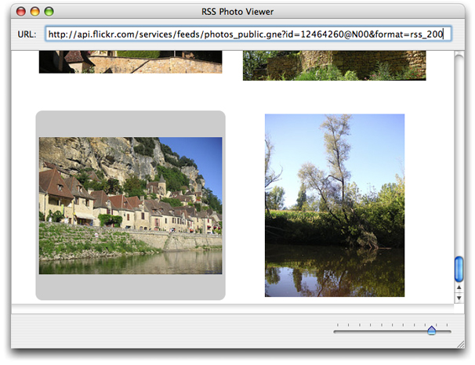

By completing this tutorial you will gain familiarity with the following RubyCocoa development tasks on OS X:

- Creating and setting up a RubyCocoa project
- Using Interface Builder to construct a user interface
- Defining a RubyCocoa class
- Defining and connecting outlets and actions
- Responding to delegation and data-source messages
- Implementing accessor methods
- Integrating a custom Ruby class

There are several Xcode templates for RubyCocoa projects of various types: simple applications, document-based applications, Core Data applications, and Core Data document-based applications. The RSS Photo Viewer uses the simple RubyCocoa application template.

1. In Xcode, choose New Project from the File menu.
2. In the New Project assistant, select the Cocoa-Ruby Application template and click Next.

   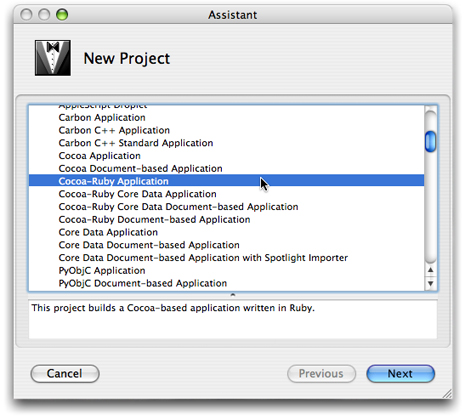
3. In the subsequent window, name the project folder “RSSPhotoViewer” and identify in a suitable location in the file system. Click Next.

At first glance the project window looks like any other Cocoa project (see Figure 2). It has the necessary frameworks (including the RubyCocoa framework, a nib file with the main menu, the information property list (`Info.plist`), and the `main.m` file.

__Figure 2__  The initial project window for the RSS Photo Viewer project

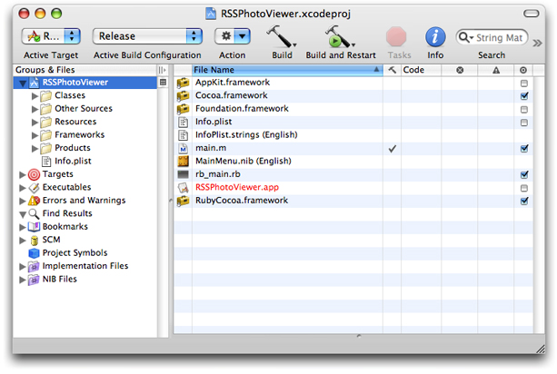

However, it does have one file that you don’t find in regular Cocoa application projects: `rb_main.rb`. When you build a RubyCocoa application, the Ruby scripts of the project are put in the `Resources` directory of the application bundle. If the application is double-clicked, the `rb_main.rb` script gets those Ruby and RubyCocoa files and loads them; if a RubyCocoa script is run from the command line (for debugging), however, the script instead calls the [NSApplicationMain](https://developer.apple.com/documentation/appkit/1428499-nsapplicationmain) function.

Next add one line to the `rb_main.rb` script, the “`include OSX`” statement, as shown in Listing 1. By including the OSX module in the main scope, you are able to access RubyCocoa classes and methods directly—that is, without having to use the `OSX::` prefix.

__Listing 1__  The `rb_main.rb` script

```
require 'osx/cocoa'
# add the following line:
include OSX

def rb_main_init
  path = OSX::NSBundle.mainBundle.resourcePath.fileSystemRepresentation
  rbfiles = Dir.entries(path).select {|x| /\.rb\z/ =~ x}
  rbfiles -= [ File.basename(__FILE__) ]
  rbfiles.each do |path|
    require( File.basename(path) )
  end
end

if $0 == __FILE__ then
  rb_main_init
  OSX::NSApplicationMain(0, nil)
end
```

But what invokes the `rb_main.rb` script to begin with? Cocoa applications by default look for the execution entry point (that is, the function `main`) in `main.m`. However, this file in a RubyCocoa application project has different content than it does in a regular Cocoa application. As shown in Listing 2, the `main` function in RubyCocoa projects calls function `RBApplicationMain`, which takes as its first argument a string referencing `rb_main.rb`, and runs the script.

__Listing 2__  The `main.m` file in a RubyCocoa project

```objc
#import <RubyCocoa/RBRuntime.h>

int
main(int argc, const char* argv[])
{
  return RBApplicationMain("rb_main.rb", argc, argv);
}
```


The RSS Photo Viewer project has one significant source file, `RSSWindowController.rb`. This file contains definitions of two custom classes, a RubyCocoa subclass of [NSWindowController](https://developer.apple.com/documentation/appkit/nswindowcontroller) and a simple custom Ruby subclass. We’ll start with the `NSWindowController` subclass and define the outlets and actions that are used to control the user interface.

To add a RubyCocoa source file to the project, complete the following steps in the Xcode project:

1. Choose New File from the File menu.
2. Select “Ruby NSWindowController subclass” in the New File assistant window. Click Next.
3. In the subsequent assistant window name the new file “RSSRubyController.rb” and click Next.

   Xcode adds the file to the RSSPhotoViewer project.

The template file for the RubyCocoa subclass of `NSWindowController` includes some initial code: a `require ‘osx/cocoa’` statement and an initial definition of the subclass. Change the name of this subclass from “RSSRubyController” (the name of the file) to “RSSWindowController”:

```
class RSSWindowController < NSWindowController
end
```

Expand this initial class definition by typing the code shown in Listing 3.

__Listing 3__  Defining the outlet and actions of the RSSWindowController class

```
require 'osx/cocoa'

class RSSWindowController < NSWindowController
    ib_outlet :imageBrowserView

    # Actions

    def zoomChanged(sender)

    end
    ib_action :zoomChanged

    def parse(sender)

    end
    ib_action :parse

end
```

You just defined the outlet (`imageBrowserView`) and the two actions (`zoomChanged` and `parse`) that the `RSSWindowController` class uses for communicating with objects in the user interface. (In [Creating the User Interface](#apple-f4xwc4dqnrsv64tfmyxwi33df52wszbpkridimbqga2timrvfvjvonq) you’ll connect the outlet and actions to their user-interface objects.) To define an outlet use the `ib_outlet` method of the OSX module followed by the Ruby symbol “:imageBrowserView”. You define an action by defining a method with a single argument named `sender`—the sender is the user-interface object sending the action message—followed by the `ib_action` method and the symbolized method name. Leave the action methods unimplemented for now; we’ll return to them in [Implementing the Custom Window Controller](#apple-f4xwc4dqnrsv64tfmyxwi33df52wszbpkridimbqga2timrvfvjvony).

The next step is to import the `RSSWindowController` class, along with its action and outlet definitions, into the application’s nib file.

1. Double-click the nib file `MainMenu.nib` in the Xcode project window to open it in Interface Builder.
2. Open the Library window (if it isn’t displayed) by selecting Library from the Tools menu.
3. Locate the generic Object in the object library (that is, the browser in the Library window), either by browsing or search for it by typing “Object” in the window’s search field.

   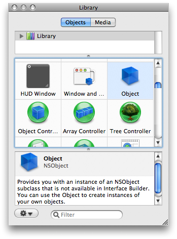

   Drag this object into the nib file window, the window in this case with the title of MainMenu.nib.

   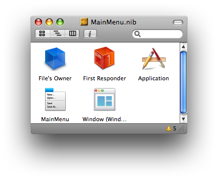

   The nib file window, which is sometimes called the nib document window, lets you examine the contents of a nib file. The default mode shows the top-level objects of the nib file—that is, those objects that are the top-level objects of an object graph (such as a window or menu) or that are standalone objects, such as controllers, which own no subordinate objects.
4. With the generic object selected, open the Identity pane of the inspector by choosing Identity Inspector from the Tools menu.
5. In the Class field, type “RSSWindowController” and press Return.

   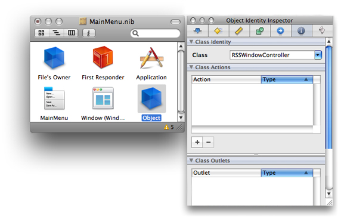

Completing the above steps imports the class into Interface Builder and assigns it as the class of the proxy object, which you can then use for target and action connections. This application is now “aware” of the `RSSWindowController` class, and automatically notices any future changes to the class—for example, additions of actions or removals of outlets.

The user interface of the RSS Photo Viewer application is simple. It is a single-window application, and on that window are only three objects:

- A labeled text field for specifying a URL
- A slider for zooming a selected image
- An Image Kit browser view for displaying the images

The Library window contains ready-made objects for the labeled text field and the slider. You drag these objects from the Library onto the window (provided by default) and then resize them, reposition them, and configure their other attributes. But before you do this, make sure the window is large enough to hold the objects. Using the image in [Figure 1](#apple-f4xwc4dqnrsv64tfmyxwi33df52wszbpkridimbqga2timrvfvjvomq) as a guide, resize the window by dragging the tab on the lower-right corner of the window.

Now that your attention is on the window, give it a title. Select its icon in the nib file window (if it isn’t already selected), and choose Attributes Inspector from the Tools menu to open the Attributes pane (or click the 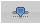button at the top of the inspector). Enter “RSS Photo Viewer” in the Title field.

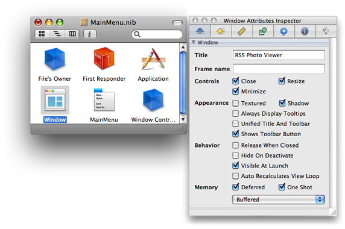

Follow these steps to add and configure the URL text field:

1. In the object library find the Text Field object (you can search for it by typing “text field” in the Library window’s search field).
2. Drag this object (not Text Field Cell) and drop it on the upper part of the window.
3. Resize the text field using the resize handles on the edges of the object. (Make sure you leave space for the “URL” label”). Reposition it if necessary by dragging it over the window’s “surface.“
4. Locate the Label object in the object and drag it to a point left of the text field.

   This object is a text field too, but it is preconfigured to be read-only and to have a gray background.
5. Double-click “Label” and type “URL:” in place of the selected text. Resize the label if necessary and position it close to the text field.

You’ll notice as you move these objects around and resize them that blue lines appear. These are guide lines showing you how to place objects in relation to each other as recommended in the _OS X Human Interface Guidelines_.

Next find the horizontal slider in the object library and drag it to the lower part of the window. You will need to configure this object, following these steps:

1. Resize the object to about twice its default length.
2. Select the object and open the inspector to the Attributes pane (Tools > Attributes Inspector).)
3. Set the number of tick marks and the minimum, maximum, and current values as shown in this example:

   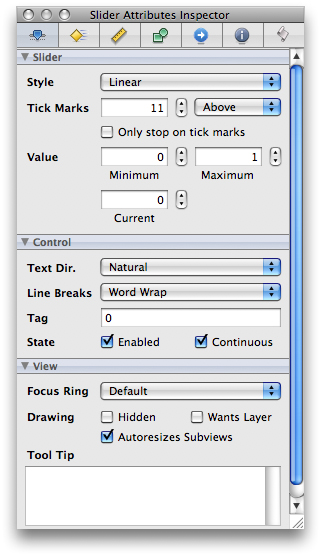

   Also make sure the Enabled and Continuous boxes in the Control slice are checked. Note that the inspector here is showing you the attributes belonging to the various inheritance layers of the slider: as an [NSSlider](https://developer.apple.com/documentation/appkit/nsslider) object, as an [NSControl](https://developer.apple.com/documentation/appkit/nscontrol) object, and as an [NSView](https://developer.apple.com/documentation/appkit/nsview) object.

The final piece in the user interface of the RSS Photo Viewer application is the Image Kit image browser view (an [IKImageBrowserView](https://developer.apple.com/documentation/quartz/ikimagebrowserview) object). Because this Objective-C framework does not yet include an Interface Builder plug-in for its view objects, we will have to use the Custom View library object as a proxy, and then assign the `IKImageBrowserView` class to this proxy. Interface Builder is aware of this class, however, because the Application Kit framework has a dependency on the Quartz umbrella framework, which includes the Image Kit framework. The steps for setting up the image browser view are the following:

1. Find the Custom View object in the object library and drag it onto the window.

   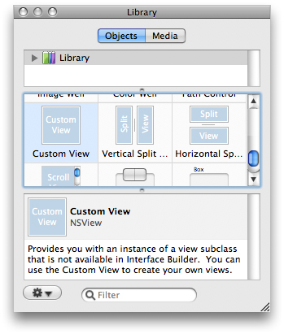
2. Resize the Custom View object to fill the space below the URL text field and above the slider.

   Note the blue guide lines for placement and resizing boundaries.
3. With the Custom View selected, open the Identity pane of the inspector.
4. Type “IKImageBrowserView” in the Class field and press Return.

   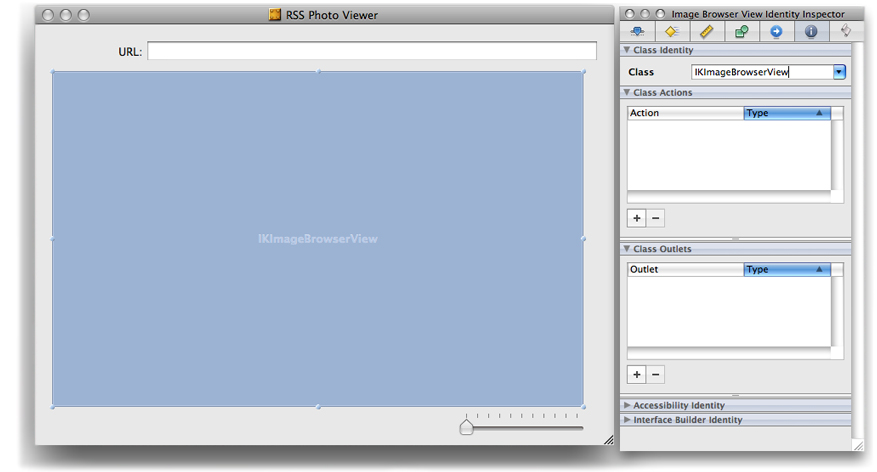

Save the nib file. The RSS Photo Viewer application’s user interface is now complete. The next step is to hook up your outlet and action connections.

Before we leave Interface Builder and return to Xcode we need to connect the outlet and actions we defined in [Defining Classes, Targets, and Actions](#apple-f4xwc4dqnrsv64tfmyxwi33df52wszbpkridimbqga2timrvfvjvomjs) to their targets. Let’s start with the outlet from the `RSSWindowController` class to the `IKImageBrowserView` object.

1. Select the `RSSWindowController` object in the nib file window and right-click (or Control-click) the mouse.

   The connections panel appears for that object, showing its possible connections.
2. Click the mouse pointer in the circle next to the `imageBrowserView` outlet and drag a line to the `IKImageBrowserView` object.

   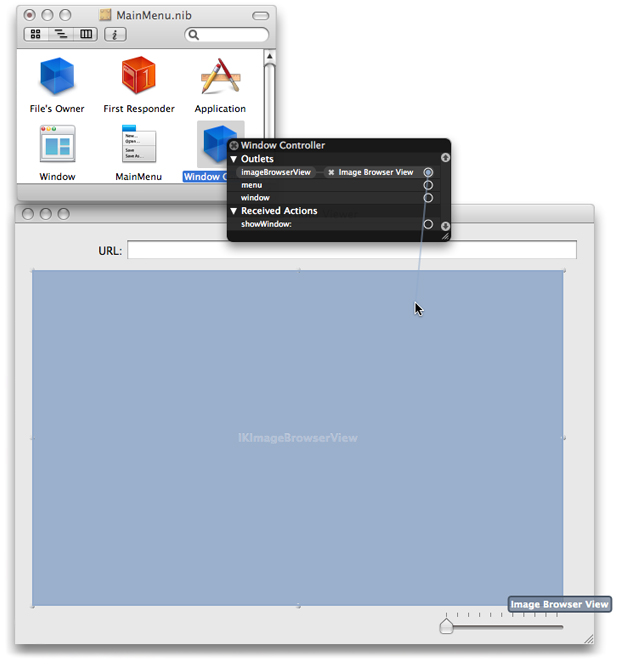
3. Release the mouse button.

Next connect the action parse from the URL text field to the target object (`RSSWindowController`).

1. Select the object in the nib file window representing `RSSWindowController` and right-click (or Control-click) the mouse..
2. In the connections panel, drag a line from the circle next to parse in the Received Actions slice and drag it to the URL field.

   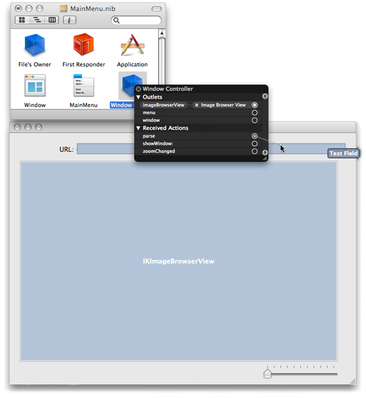
3. Release the mouse button.

Complete the same sequence of steps for the slider object and the `zoomChanged` action. Then save the nib file and return to the Xcode project.

The implementation code of the RSS Photo Viewer application is centered around the programmatic interface of the [IKImageBrowserView](https://developer.apple.com/documentation/quartz/ikimagebrowserview) class of the Image Kit framework. The `RSSWindowController` class implements methods of informal protocols for data sources and delegates and calls `IKImageBrowserView` methods to set up and control the image browser. The RSSPhoto class, which you’ll implement in [Implementing a Custom Ruby Class](#apple-f4xwc4dqnrsv64tfmyxwi33df52wszbpkridimbqga2timrvfvjvooa) is a simple Ruby class that conforms to informal-protocol methods for objects that represent items in the image browser.

Now it’s time to write some code. We’ll start by completing the implementation of the `RSSWindowController` class. Open `RSSRubyController.rb` in Xcode and add the following method:

```
 def awakeFromNib
    @cache = []
    @imageBrowserView.setAnimates(true)
    @imageBrowserView.setDataSource(self)
    @imageBrowserView.setDelegate(self)
  end
```

The Application Kit framework sends the [awakeFromNib](https://developer.apple.com/documentation/objectivec/nsobject/1402907-awakefromnib) message to all interested objects when all nib-file objects have been unarchived and loaded into memory. This method presents an opportunity for controller objects to perform initializations involving objects unarchived from nib files (view objects). The `awakeFromNib` method of `RSSWindowController` sets the `animates` property of the `IKImageBrowserView` object and assigns itself as the delegate and data source of that object. It also initializes a `@cache` instance variable, a Ruby Array object that contains the current collection of RSSPhoto objects (representing photos).

Next insert two more `require` statements after the `require ‘osx/cocoa’` statement.

```
require 'rss'
require 'open-uri'
```

As you’ll soon see, the `RSSWindowController` class uses the open-uri library for accessing HTTP resources. It also uses the RSS library for accessing information disseminated on the Internet through the RSS protocol.

Implement the `zoomChanged` and `parse` action methods as shown in Listing 4.:

__Listing 4__  Implementing the action methods

```
def zoomChanged(sender)
    @imageBrowserView.setZoomValue(sender.floatValue)
  end

  def parse(sender)
    begin
      uri = URI.parse(sender.stringValue.to_s)
      raise "Invalid URL" unless uri.respond_to?(:read)
      @parser = RSS::Parser.parse(uri.read, false)
      @cache.clear
      @imageBrowserView.reloadData
    rescue => e
      NSRunAlertPanel("Can't parse URL", e.message, 'OK', nil, nil)
    end
  end
```

There are a few things to note about this code:

- The `zoomChanged` message is sent when the user moves the slider under the image browser; the implementation here gets the new float value from the `sender` of the message (the slider) and sets the zoom factor of the image browser to that value.
- In implementing its `parse` action method, the `RSSWindowController` class uses the `parse` method of the open-uri library’s URI class to validate the URL fetched from the text field (via the `sender.stringValue` call) and create a URI object from it. If the URL is not valid, it raises an exception.
- It then uses the `parse` method of the RSS library to parse the RSS stream referenced by the URI object and store the individual RSS entries in a Parser object referenced by the `@parser` instance variable. It then clears the local cache of photos and tells the image browser to reload its data.
- If any of the foregoing steps raises an exception, the parse method of the `RSSWindowController` class handles it by displaying an alert panel using the Application Kit’s [NSRunAlertPanel](https://developer.apple.com/documentation/appkit/1540934-nsrunalertpanel) function.

When the `IKImageBrowserView` object receives a [reloadData](https://developer.apple.com/documentation/quartz/ikimagebrowserview/1504391-reloaddata)message, it requests from its data source—in this case, the `RSSWindowController` object—the images to display by sending it first a `numberOfItemsInImageBrowser`. Depending on the number of items returned by this method (assuming it’s a positive value), the `IKImageBrowserView` object then sends one or more [imageBrowser:itemAtIndex:](https://developer.apple.com/documentation/objectivec/nsobject/1504064-imagebrowser) messages to its data source. Listing 5 shows how `RSSWindowController` implements the methods invoked by these messages.

__Listing 5__  Implementing the data-source and delegate methods

```
  def numberOfItemsInImageBrowser(browser)
    @parser ? @parser.items.length : 0
  end

  def imageBrowser_itemAtIndex(browser, index)
    photo = @cache[index]
    if photo.nil?
      item = @parser.items[index]
      url = item.description.scan(/img src="([^"]+)/).first.first
      photo = RSSPhoto.new(url)
      @cache[index] = photo
    end
    return photo
  end

  def imageBrowser_cellWasDoubleClickedAtIndex(browser, index)
    NSWorkspace.sharedWorkspace.openURL(@cache[index].url)
  end
```

Let’s examine the interesting aspects of this code, especially the RubyCocoa parts. The `imageBrowser_itemAtIndex` and `imageBrowser_cellWasDoubleClickedAtIndex` methods illustrate the RubyCocoa convention of replacing all keyword colons of Objective-C method signatures with underscores, except for the final colon. The implementation of `imageBrowser_itemAtIndex` checks if the photo referenced by the index value (of the browser) is in its cache of photos; it the photo doesn’t exist, it gets the corresponding URL from the RSS Parser object and with that creates a `RSSPhoto` object, adds it to the cache, and returns it to the image browser, which displays the photo. (You will implement the `RSSPhoto` class in the following section, Implementing a Custom Ruby Class.)

Recall that in `awakeFromNib` you set the `RSSWindowController` object to be the delegate of the `IKImageBrowserView` object. The image browser sends the `imageBrowser_cellWasDoubleClicked` message to its delegate when a user clicks on an image. This implementation uses the `NSWorkspace` method [openURL:](https://developer.apple.com/documentation/appkit/nsworkspace/1533463-openurl) to open the image in the preferred application.

The RSSPhoto class is a simple Ruby subclass in that it implicitly inherits from the root Ruby class. Although it doesn’t inherit from a Cocoa class, as does RSSWindowController, it does implement the required methods of the `IKImageBrowserItem Protocol` informal protocol. By doing so, it represents an image that can be displayed in the [IKImageBrowserView](https://developer.apple.com/documentation/quartz/ikimagebrowserview) object. .

Listing 6 shows the RubyCocoa code used in implementing the RSSPhoto class, which is included in the `RSSRubyController.rb` file. The `imageUID`, `imageRepesentationType`, and `imageRepresentation` method implementations are required by the `IKImageBrowserItem` protocol. The `imageRepresentation` class provides the image browser with the `NSImage` object to display, using the [initByReferencingURL:](https://developer.apple.com/documentation/appkit/nsimage/1519990-init) initializer; note how this method uses Ruby syntax to lazily create the image object.

__Listing 6__  Implementation of the RSSPhoto class

```
class RSSPhoto
  attr_reader :url

  def initialize(url)
    @urlString = url
    @url = NSURL.alloc.initWithString(url)
  end

  # IKImageBrowserItem protocol conformance

  def imageUID
    @urlString
  end

  def imageRepresentationType
    :IKImageBrowserNSImageRepresentationType
  end

  def imageRepresentation
    @image ||= NSImage.alloc.initByReferencingURL(@url)
  end
end
```

[Next](Using%20RubyOSA.md)[Previous](Ruby%20and%20Python%20on%20OS%20X.md)

