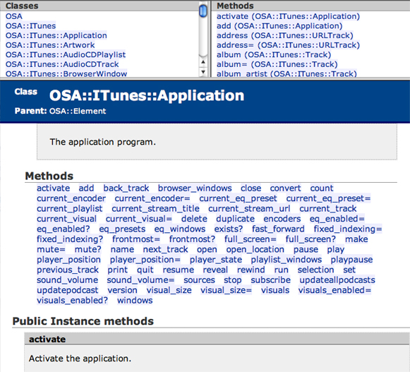

> 导航：[总目录](../../../README.md) · [documentation](../../../_indexes/documentation.md) · [Ruby and Python Programming Topics for Mac](Introduction%20to%20Ruby%20and%20Python%20Programming%20Topics%20for%20OS%20X.md)


[Next](Using%20Scripting%20Bridge%20in%20PyObjC%20and%20RubyCocoa%20Code.md)[Previous](Building%20a%20RubyCocoa%20Application-%20A%20Tutorial.md)

# Using RubyOSA

RubyOSA is a bridge that lets developers control scriptable applications, including the Finder, using the Ruby scripting language. An application is called scriptable when it makes its operations and data available in response to messages called Apple events. RubyOSA provides a bridge between Ruby and the Open Scripting Architecture (OSA), an infrastructure for interprocess communication that uses Apple events as its mechanism for event dispatching and data transport. (AppleScript is the original OSA scripting language, and is still quite popular.)

A scriptable application specifies the set of scripting terms it understands and its scriptable interface in an XML dictionary called an `sdef` file (“sdef” for scriptable definition). At runtime RubyOSA parses the scriptable definition of a given application and populates a new namespace with classes, methods, constants, enumerations, and all other symbols described by the definition. It also dynamically creates Ruby proxy objects to represent these symbols and uses OSA mechanisms to build and send Apple events to applications and receive their responses.

RubyOSA has some obvious advantages, especially for Ruby programmers. With it you can control applications on OS X and get requested objects back from them. You can do anything with these object that you can do in regular Ruby code, such as string manipulations and regular expressions. Your code also has access to all installed Ruby modules and libraries. Finally, you can combine RubyOSA and RubyCocoa in the same script to apply the technologies of the OS X frameworks to the access to scriptable applications that OSA makes possible.

You can download the latest version of RubyOSA from its open-source repository and install it on your system by running the following command in a Terminal shell:

```
sudo gem install rubyosa
```


The essential idea behind using RubyOSA is to get a proxy instance of a scriptable application and then send messages to it. The messages that you can send are described in the application’s scriptable definition, or dictionary. Let’s start by looking at a simple example (Listing 1).

__Listing 1__  The `iTunes_inspect.rb` script

```
# Quick inspection of iTunes' sources, playlists and tracks.

require 'rubygems'
require 'rbosa'

app = OSA.app('iTunes')
OSA.utf8_strings = true
app.sources.each do |source|
    puts source.name
    source.playlists.each do |playlist|
        puts " -> #{playlist.name}"
        playlist.tracks.each do |track|
            puts "     -> #{track.name}" if track.enabled?
        end
    end
end
```

When you run this script from the command line, it prints information similar to the following lines:

```swift
Library
-> Classical CD
     -> Toccata & Fugue in D Minor
     -> Air on the G String (2nd movement from Orchestral Suite No. 3 in D)
     -> No.13 Waltz of the Flowers
     -> Montagues And Capulets
     -> Egmont Overture, Op 84
     -> Die Zauberflöte
     -> Horn concerto 3EFlat, 1. Allegro
     -> Horn concerto 3EFlat 2. Romance. Larguetto
     -> Horn concerto 3EFlat, 3. Allegro
     ........
```

The first thing to notice about the script in [Listing 1](Using%20Scripting%20Bridge%20in%20PyObjC%20and%20RubyCocoa%20Code.md#apple-f4xwc4dqnrsv64tfmyxwi33df52wszbpkridimbqga2timrufvjvomy) is `require ‘rbosa’`. This statement loads the rbosa library, which includes the OSA class. The next line of the script is equally important:

```
app = OSA.app('iTunes')
```

This line returns a proxy Ruby object representing a scriptable application, in this case iTunes. (Note that all you have to do specify the name of the application; you don’t have to include its file-system location or its extension.) From this point on, the script sends messages to the application object and the objects it “contains,“ and performs Ruby operations on the results. In RubyOSA’s internal representation of a scriptable application, a hierarchy of objects descends from the application object; sending a message to the application object may return a collection objects, each of which may be a collection of subordinate objects. You can send appropriate messages to each of these objects. Take these lines as an example:

```
app.sources.each do |source|
    puts source.name
    source.playlists.each do |playlist|
        puts " -> #{playlist.name}"
```

The `sources` message to the iTunes proxy object returns an object that implements the Ruby Array interface. The script then loops through the array and in a block sends a `name` message to each fetched object (`source`, representing a music source) and prints the returned Ruby string. It next sends `playlists` to `source` and iterates through the array returned from that call, which represents the playlists associated with that music source. It prints the name of each playlist. And so on proceeds the script.

This might seem simple and straightforward—and it is—but a question might arise: where do you find out which messages you can send to a scriptable application’s hierarchy of objects? RubyOSA includes a documentation tool, `rdoc-osa`. Using this you tool you can generate a set of HTML pages that document the scriptable definition of a Mac app. The Basics shows the opening page of the iTunes documentation.

__Figure 1__  A page from the rdoc-osa documentation for iTunes



If you were to use this documentation, you would find that sending `sources` to a proxy object representing the iTunes application returns an array (or list) of OSA::iTunes::Source objects. Sending `playlists` to one of these objects returns an array of OSA::ITunes::Playlist objects. And sending `tracks` to one of these objects returns an array of OSA::ITunes::Track objects. You can then send `name` to one of these objects to get the name of the track.

You might have wondered about the following line in the sample script in [Listing 1](Using%20Scripting%20Bridge%20in%20PyObjC%20and%20RubyCocoa%20Code.md#apple-f4xwc4dqnrsv64tfmyxwi33df52wszbpkridimbqga2timrufvjvomy):

```
OSA.utf8_strings = true
```

OSA is a Ruby class in its own right, and has other methods besides `app`, among them `utf8_strings`. Listing 2 describes the methods of the OSA class.

__Table 1__  Methods of the OSA class

| Method | Description |
| `OSA.app(`_application-specifier_`)` | Returns an OSA proxy object representing the application specified by the string _application-specifier_. You can specify the application by name, by bundle ID, by path, or by signature. For more information on specifying applications, both local and remote, see below. |
| `OSA.lazy_events` | Controls whether OSA proxy objects are resolved on demand or are resolved automatically. By default objects are resolved on demand (`true`), meaning that OSA objects are resolved only when necessary.  Object resolution involves the sending of an Apple event to discover the type of an object. Thus automatic resolution can have performance implications when there is a considerable number of objects (for example, a loop to get all iTunes tracks). However, this might be unavoidable when the target application’s scriptable definition doesn’t describe the types of objects, instead using the “reference” type for each of them. |
| `OSA.utf8_strings` | Controls whether strings will be encoded as Unicode (UTF8) or as ASCII. By default this property is set to `false` because some applications might not be able to handle Unicode strings. |
| `OSA.timeout` | Controls the timeout period for getting responses to Apple events. The value is expressed in ticks (seconds). By default it's set to -1, which is about one minute. A value of -2 means there is no timeout. |
| `OSA.wait_reply` | Controls whether RubyOSA should expect a result from the Apple events it sends. If set to `nil` (the default), RubyOSA determines the value by examining the scriptable definition; this might (rarely) result in a malformed application command. Set this value to `true` (or `false`) to force RubyOSA to send back (or not send back) a return value. |

All RubyOSA objects inherit from the `OSA::Element` class, which is completely opaque to the user.

With the RubyOSA `app` method you can identify scriptable applications in several ways:

- By name, simply by putting the application name (minus the app extension) between single quotation marks.

  Example: `OSA.app(‘Finder’)`

  This simple style of argument is a convenience for `:name => ‘AppName’`. RubyOSA uses Launch Services to locate the scriptable application to launch and use.
- By file-system path, using the `:path` key.

  Example: `OSA.app(:path => ‘/Users/jdoe/Applications/BBEdit.app’)`
- By the application’s bundle ID, using the `:bundle_id` key.

  Example: `OSA.app(:bundle_id => ‘com.apple.iTunes’)`
- By an application’s four-character creator signature (if any), using the `:signature` key.

  Example: `OSA.app(:signature -> ‘woof’)`

The `app` method also lets you specify applications on remote machines as well as locally—thus you can control and get data from applications that aren’t even installed on your local system. After specifying the application by name, you add one to three key-value pairs identifying the machine, the user name, and the password. For each pair, use the `:machine`, `:username`, and `:password` keys, respectively. For example:

```
OSA.app('iTunes', :machine => 'kubla.acme.com', :username => 'jdoe' :password => '3x534C2')
```

There are a few things to be aware of when calling the `app` method to get proxy instances of remote applications: First, you may only specify the remote-access key-value pairs when the first argument specifies the application by name. Second, if you omit the `:username` or `:password` keys (or both), RubyOSA prompts for the user name and password (or both).

- The Remote Apple Events checkbox in the Sharing pane of System Preferences on the remote machine should be checked for your RubyOSA script to control its applications.
- You may only specify the remote-access key-value pairs when the first argument specifies the application by name.
- if you omit the `:username` or `:password` keys (or both), RubyOSA prompts for the user name and password (or both).

When you send a message whose name has a plural form (for example, `sources`), what you get in return may look and behave like an Array, but it is actually an list element (OSA::ObjectSpecifierList ) containing object specifiers—that is, references to real objects. Although the Ruby Array class is not directly used in this case, the OSA::ObjectSpecifierList class conforms to the Array interface; in other words, it mixes the Enumerable module. Therefore you can call _most_ of the methods on an object-specifier list that you can call on an Array.

Methods with names such as `title` and `name` refer to properties in a scriptable definition and return the appropriate Ruby objects (in both these cases, String objects). On the other hand, methods such as `current_track` return an object specifier, in this case an object specifier of the OSA::ITunes::Track class. The rule that RubyOSA follows to distinguish between these two general types of properties is that when the type of the property is defined within the target application's scriptable definition (as `current_track` is), it returns an object specifier. Otherwise it assumes the object is of a primitive type (`String`, `Integer`, `Date`, and so on) and it resolves the return value directly by querying for the type with an extra Apple event.

To better appreciate the varieties of ways in which you might use RubyOSA, let’s examine a few of the examples installed in `/Developer/Examples/Ruby/RubyOSA`. The script in Listing 3 creates a proxy instance of the Finder application and from it requests the current contents of the Desktop. Using Ruby regular expressions and string-manipulation methods, it formats and prints these items.

__Listing 2__  The `Finder_show_desktop.rb` script

```
# Lists the content of the Finder desktop.

require 'rubygems';
require 'rbosa'

ary = OSA.app('Finder').desktop.entire_contents.get
ary.each do |x|
    next unless x.is_a?(OSA::Finder::Item)
    puts "#{x.class.name.sub(/^.+::/, '').sub(/_/, ' ').ljust(25)} #{x.name}"
end
```

Listing 3 is a script that displays the album artwork associated with the iTunes track that is currently playing. Note that it creates a temporary file to hold the image data and then makes a `system` call to open this file in the Preview application. With the `system` call your script can do anything that can be done at the command line.

__Listing 3__  The `iTunes_artwork.rb` script

```
# Open the artwork of the current iTunes track in Preview.

require 'rubygems'
require 'rbosa'

artworks = OSA.app('iTunes').current_track.artworks
if artworks.size == 0
  puts "No artwork for current track."
  exit 1
end

fname = '/tmp/foo.' + artworks[0].format.downcase.strip
File.open(fname, 'w') { |io| io.write(artworks[0].data) }
system("open -a Preview #{fname}")
```

What is noteworthy about the script in Listing 4 is that it exchanges data between proxy instances of two applications, TextEdit and Mail. It gets the selected messages in all current Mail viewers and copies each the content of each message to a TextEdit window.

__Listing 4__  The `get_selected_mail.rb` script

```
# Copy contents of selected Mail messages to a TextEdit window

require 'rubygems'
require 'rbosa'

textedit = OSA.app('TextEdit')
mailApp = OSA.app('Mail')
viewers = mailApp.message_viewers
viewers.each do |viewer|
    viewer.selected_messages.each do |message|
        textedit.make(OSA::TextEdit::Document).text = message.content
     end
end
```

Finally. the Listing 5 script updates in the iChat status area the time the system has been running since it was last booted. It is similar to [Listing 1](Using%20Scripting%20Bridge%20in%20PyObjC%20and%20RubyCocoa%20Code.md#apple-f4xwc4dqnrsv64tfmyxwi33df52wszbpkridimbqga2timrufvjvomy) it that it makes a system call, but instead of calling the `system` method, it invokes the `uptime` command simply by enclosing it single quotes. It then formats the output of the command and assigns this formatted string to the iChat `status_message` property. All this occurs in a closed loop, which is re-executed after a five-second pause, which causes a periodic update of the system-uptime message.

__Listing 5__  The `iChat_uptime.rb` script

```
# Periodically set your iChat status to the output of uptime(1).

require 'rubygems'
require 'rbosa'

app = OSA.app('iChat')
previous_status_message = app.status_message
trap('INT') { app.status_message = previous_status_message; exit 0 }
while true
    u = `uptime`
    hours = u.scan(/^\s*(\d+:\d+)\s/).to_s + ' hours'
    days = u.scan(/\d+\sdays/).to_s
    app.status_message = "OSX up #{days} #{hours}"
    sleep 5
end
```

This script traps interruption of the script (such as happens when the user presses Control-C) and restores the previous value of the iChat status message before exiting.

You can use the `rdoc-osa` tool to generate HTML or `ri` documentation for the dictionary (that is, scriptable definition) of an application. Using `rdoc-osa` is simple. For example, to generate HTML documentation of the iTunes dictionary, you would enter the following command on a shell’s command line:

```
rdoc-osa --name iTunes
```

The `ruby-osa` tool generates the documentation from the application’s dictionary and puts it in a folder named `doc` in the current working directory. Instead of identifying the application by name, you can identify it by path, bundle ID, or four-character creator signature. To generate `ri` documentation instead of HTML, append “`--ri`“ to the command.

To get help on `rdoc-osa`, enter “`rdoc-osa --h`“ at the command line. The `rdoc-osa` tool accepts all options used in `rdoc`, the documentation generator for Ruby classes and modules. Enter “`rdoc --h`“ at the command line to learn about the options for that tool.

[Next](Using%20Scripting%20Bridge%20in%20PyObjC%20and%20RubyCocoa%20Code.md)[Previous](Building%20a%20RubyCocoa%20Application-%20A%20Tutorial.md)

