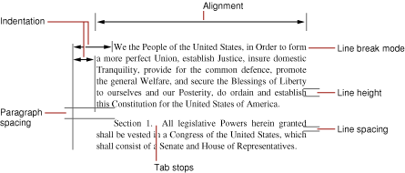

> 导航：[总目录](../../../README.md) · [documentation](../../../_indexes/documentation.md) · [Ruler and Paragraph Style Programming Topics](Introduction%20to%20Rulers%20and%20Paragraph%20Styles.md)

[Next](Breaking%20Lines%20by%20Truncation.md)[Previous](Introduction%20to%20Rulers%20and%20Paragraph%20Styles.md)

# About Paragraph Styles

NSParagraphStyle and its subclass NSMutableParagraphStyle encapsulate the paragraph or ruler attributes used by the NSAttributedString classes. Instances of these classes are often referred to as paragraph style objects, or when no confusion will result, as paragraph styles.

A paragraph style object represents a complex attribute value in an attributed string, storing a number of subattributes that affect paragraph layout for the characters of the string. Among these subattributes are alignment, tab stops, and indents. Figure 1 illustrates these and other paragraph style attributes.

__Figure 1__  Paragraph style attributes

These are the paragraph style attributes the text system uses:

- `alignment` is the text alignment. It is `NSLeftTextAlignment`, `NSRightTextAlignment`, `NSCenterTextAlignment`, `NSJustifiedTextAlignment`, or `NSNaturalTextAlignment`.
- `firstLineHeadIndent` is the distance in points from the leading margin of a text container to the beginning of the paragraph’s first line.
- `headIndent` is the distance in points from the leading margin of a text container to the beginning of lines other than the first.
- `tailIndent` is the distance in points from the margin of a text container to the end of lines.
- `tabStops` is an array of NSTextTab objects, sorted by location, that define the tab stops for the paragraph style.
- `lineBreakMode` is the mode that should be used to break lines when laying out the paragraph's text. It can be one of the following:

  - `NSLineBreakByWordWrapping` wraps at word boundaries.
  - `NSLineBreakByCharWrapping` wraps at character boundaries.
  - `NSLineBreakByClipping` clips lines past the edge of the text container.
  - `NSLineBreakByTruncatingHead` displays each line so that the end fits in the container and the missing text at the beginning is indicated by an ellipsis glyph.
  - `NSLineBreakByTruncatingTail` displays each line so that the beginning fits in the container and the missing text at the end is indicated by an ellipsis glyph.
  - `NSLineBreakByTruncatingMiddle` displays each line so that the beginning and end both fit in the container and the missing text in the middle is indicated by an ellipsis glyph.
- `maximumLineHeight` is the maximum height that any line in the receiver can occupy, regardless of the font size or size of any attached graphic.
- `minimumLineHeight` is the minimum height that any line in the receiver can occupy, regardless of the font size or size of any attached graphic.
- `lineHeightMultiple` is a factor by which the default line height (a metric of the font) is multiplied before being constrained by minimum and maximum line height.
- `lineSpacing` is extra space in points added between lines within the paragraph.
- `paragraphSpacing` is space in points added at the end of the paragraph to separate it from the following paragraph.
- `paragraphSpacingBefore` is space in points added between the top of the paragraph and the beginning of its text content.

[Next](Breaking%20Lines%20by%20Truncation.md)[Previous](Introduction%20to%20Rulers%20and%20Paragraph%20Styles.md)

