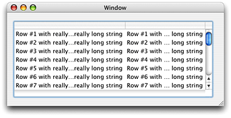

> 导航：[总目录](../../../README.md) · [documentation](../../../_indexes/documentation.md) · [Ruler and Paragraph Style Programming Topics](Introduction%20to%20Rulers%20and%20Paragraph%20Styles.md)


[Next](About%20Ruler%20Views.md)[Previous](About%20Paragraph%20Styles.md)

# Breaking Lines by Truncation

In OS X version 10.3 and later, paragraph style objects (NSParagraphStyle and NSMutableParagraphStyle) have support for line breaking by truncation. In addition to the previously available line-breaking modes of word wrapping, character wrapping, and clipping, paragraph styles can fit the line into the layout container by truncating the line at its head, tail, or middle. The missing text is indicated by an ellipsis glyph (…). This capability is very useful inside table cells, where space is likely to be limited and users can easily resize column widths.

The technique you use to configure a table view to break lines by truncation is simple but not entirely obvious. First, you configure the table column cells with the message `[cell setWraps:YES]`. Then, for the object value returned by the data source, use an attributed string configured with the desired paragraph style.

Figure 1 shows a table view displaying two columns of strings configured with a paragraph style line-breaking mode of `NSLineBreakByTruncatingMiddle` as shown in Listing 1.

__Figure 1__  Truncated strings displayed in table cells



The following example has a controller object with an outlet named `_tableView` representing the table view. The controller object is the table’s data source. Listing 1 shows the entire controller implementation.

__Listing 1__  Controller implementation defining a table view using string truncation

```objc
@implementation Controller
- (void)awakeFromNib {
    NSArray *columns = [_tableView tableColumns];
    int index, count = [columns count];
    for (index = 0; index < count; index++) {
        NSTableColumn *column = [columns objectAtIndex:index];
        [[column dataCell] setWraps:YES];
    }
}

- (int)numberOfRowsInTableView:(NSTableView *)tableView {
    return 20;
}

- (id)tableView:(NSTableView *)tableView objectValueForTableColumn:(NSTableColumn *)tableColumn row:(int)row {
    static NSDictionary *info = nil;

    if (nil == info) {
        NSMutableParagraphStyle *style = [[NSParagraphStyle defaultParagraphStyle] mutableCopy];
        [style setLineBreakMode:NSLineBreakByTruncatingMiddle];
        info = [[NSDictionary alloc] initWithObjectsAndKeys:style, NSParagraphStyleAttributeName, nil];
        [style release];
    }

    return [[[NSAttributedString alloc] initWithString:[NSString stringWithFormat:@"Row #%d with really, really, really, really long string", row + 1] attributes:info] autorelease];
}

@end
```

The `awakeFromNib` implementation configures the data cell for each column in the table view (the number of columns in the table is set up in Interface Builder). The key message is `[[column dataCell] setWraps:YES]`. This message tells the table to use the line-breaking mode of the attributed string that is the cell’s object value. If the value passed with this call were `NO`, the cells’ contents would merely be clipped.

The `tableView:objectValueForTableColumn:row:` method sets up a paragraph style object with a line-break mode of `NSLineBreakByTruncatingMiddle`. The method then places the paragraph style in an attributes dictionary. The last line returns an attributed string, with this dictionary, as the object value for each cell in the table.

[Next](About%20Ruler%20Views.md)[Previous](About%20Paragraph%20Styles.md)

