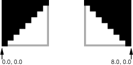

> 导航：[总目录](../../../README.md) · [documentation](../../../_indexes/documentation.md) · [Ruler and Paragraph Style Programming Topics](Introduction%20to%20Rulers%20and%20Paragraph%20Styles.md)


[Next](Letting%20Users%20Manipulate%20Markers.md)[Previous](Changing%20a%20Ruler%E2%80%99s%20Measurement%20Units.md)

# Using a Ruler View’s Client

Once you’ve set up a ruler view, as described in [Setting Up a Ruler View](Setting%20Up%20a%20Ruler%20View.md#apple-f4xwc4dqnrsv64tfmyxwi33df52wszbpgiydambqha3tilkcijbuossdirfa), the scroll view’s document view, or any subview of the document view, can become its client by sending it a `setClientView:` message. This method notifies the prior client that it’s losing the ruler view using the `rulerView:willSetClientView:` method, removes all of the ruler view’s markers, and sets the new client view. A client view normally appropriates the ruler when it becomes first responder and keeps it until some other view appropriates it. After appropriating the ruler view, the client needs to set up its layout and markers.

If the client has a custom accessory view, it sets that using `setAccessoryView:`. Clients without accessory views should avoid removing the ruler view’s accessory view when appropriating the ruler, as this can cause unsightly screen flicker as the ruler is redrawn. It’s better in this case for a client view that has an accessory view to implement `rulerView:willSetClientView:`, disabling the controls in the accessory view so that they’re not active when other clients are using the ruler. Then, when the client view with the accessory view appropriates the ruler, it should set its accessory view again in case another client swapped the accessory view out, and reenable the controls.

Aside from the layout of the ruler view itself, the client can also add markers to indicate the positions of its graphic elements, such as tabs and margins in text or the bounding boxes of drawn shapes or images. Each marker is an NSRulerMarker object, which displays a graphic image on the ruler at its given location and can be associated with an object that identifies the attribute indicated by the marker. You initialize an NSRulerMarker using its `initWithRulerView:markerLocation:image:imageOrigin:` method, which takes as arguments the NSRulerView where the marker is displayed, its location on the ruler in the client view’s coordinate system, the image to display, and the point within the image that lies on the ruler’s baseline. Once you’ve created the markers, you can use the NSRulerView methods `addMarker:` or `setMarkers:` to put them on the ruler. This Objective-C code fragment, for example, sets up markers denoting the left and right edges of the selected object’s frame rectangle:

```
NSRulerMarker *leftMarker;
NSRulerMarker *rightMarker;

leftMarker = [[NSRulerMarker alloc] initWithRulerView:horizRuler
    markerLocation:NSMinX([selectedItem frame]) image:leftImage
    imageOrigin:NSMakePoint(0.0, 0.0)];

rightMarker = [[NSRulerMarker alloc] initWithRulerView:horizRuler
    markerLocation:NSMaxX([selectedItem frame]) image:rightImage
    imageOrigin:NSMakePoint(8.0, 0.0)];

[horizRuler setMarkers:[NSArray arrayWithObjects:leftMarker, rightMarker, nil]];
```

The images used for this example are 8 pixels square and lie just inside of their relevant positions. The figure below shows the left and right marker images, enlarged and with gray bounding boxes. Thus, the left marker’s image must be placed with its lower left corner, or (0.0,0.0), at the marker location, while the lower right corner of the right marker, at (8.0,0.0), is used. The image origin is always expressed in the coordinate system of the image itself, just as an NSCursor’s hot spot is.



A new NSRulerMarker allows the user to drag it around on its ruler but not to remove it. You can change these defaults by sending it `setMovable:` and `setRemovable:` messages. For example, you might make markers representing tabs in text removable to allow the user to edit the paragraph settings.

Markers bear one additional attribute, which allows you to distinguish among multiple markers, specifically markers that share the same image. This is the represented object, set with the NSRulerMarker method `setRepresentedObject:`. A represented object can simply be a string identifying a generic attribute, such as “Left Margin” or “Right Margin”. It can also be an object stored in the client view or in the selection; for example, the text system records tab stops as NSTextTab objects, which include the tab location and its alignment. When the user manipulates a tab marker, the client can simply retrieve its represented object to get the tab being affected.

[Next](Letting%20Users%20Manipulate%20Markers.md)[Previous](Changing%20a%20Ruler%E2%80%99s%20Measurement%20Units.md)

