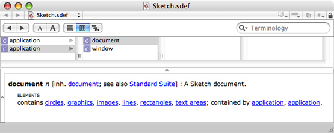
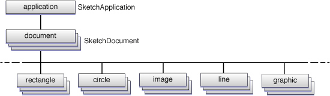
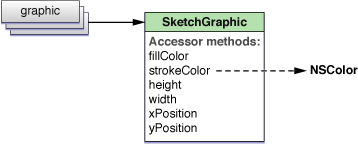

> 导航：[总目录](../../../README.md) · [documentation](../../../_indexes/documentation.md) · [Scripting Bridge Programming Guide](Introduction%20to%20Scripting%20Bridge%20Programming%20Guide%20for%20Cocoa.md)


[Next](Using%20Scripting%20Bridge.md)[Previous](Introduction%20to%20Scripting%20Bridge%20Programming%20Guide%20for%20Cocoa.md)

# About Scripting Bridge

Scripting Bridge is a technology that makes it easy for a program written in Objective-C to communicate with scriptable applications. The following sections explain what Scripting Bridge is and point out its value to Cocoa developers.

Many applications on OS X are scriptable. A scriptable application is one that you can communicate with from a script or another application, enabling you to control the application and exchange data with it. To be scriptable, an application must define an interface for responding to commands. This interface and its implementation must conform to an object model (prescribed by Open Systems Architecture, or OSA) that specifies the classes of scripting objects, the accessible properties of those objects, the inheritance and containment relationships of scripting objects, and the commands that the scriptable application responds to. OSA packages commands to scriptable applications as Apple events and uses the Apple Event Manager to dispatch those events and receive data in return. Apple events are a pervasive feature of OS X; for example, the operating system uses them to control the life cycles of applications and coordinate their interactions.

AppleScript scripts have long been the principal way to communicate with scriptable applications. But an application can also send commands to a scriptable application and receive responses back to it. The “traditional” way of doing this requires you to use the data structures and functions of the OSA framework to create and send Apple events, but this can be a dauntingly complex task. Typical Cocoa applications—until Scripting Bridge, that is—relied on one of two other techniques. They included an AppleScript script in the application bundle and used Cocoa's [NSAppleScript](https://developer.apple.com/documentation/foundation/nsapplescript) class to execute the script. Or they used the [NSAppleEventDescriptor](https://developer.apple.com/documentation/foundation/nsappleeventdescriptor) class to create Apple events which they then send with Apple Event Manager routines. However, both of these approaches are not straightforward for Cocoa developers and can be inefficient.

The Scripting Bridge framework makes it possible to send and receive Apple events using Objective-C messages instead of AppleScript commands or Apple-event descriptors. For Cocoa programmers, Scripting Bridge provides a simple and clear model for controlling scriptable applications. It makes Cocoa programs that send and receive Apple events more efficient, and it doesn't require you to have detailed knowledge of the target application's Apple event model. Scripting Bridge integrates well with existing Objective-C code and works with standard Cocoa designs, such as key-value coding, target-action, and declared properties. It has other advantages too.

- It gives your application access to any scriptable feature of any available scriptable application.
- It uses native Cocoa data types—`NSString`, `NSArray`, `NSURL`, and so on—so you'll never have to deal with less familiar Carbon types.
- It manages Apple event data structures for you, using standard Cocoa memory management to allocate and free Apple events.
- It requires much less code than needed to use `NSAppleEventDescriptor` and direct Apple Event Manager calls.
- It checks for syntax errors at compile time, unlike `NSAppleScript`.
- It runs more than twice as fast as a precompiled `NSAppleScript`, and up to 100x as fast as an uncompiled `NSAppleScript`.

Because Scripting Bridge dynamically populates an application’s namespace with Objective-C objects representing the items defined by an application’s scripting definition, it enables other scripting languages bridged to Objective-C—namely RubyCocoa and PyObjC—to communicate with and control scriptable applications. It thus gives those scripting languages the same advantages as AppleScript scripts and Objective-C programs using Scripting Bridge. For more information on using Scripting Bridge in RubyCocoa and PyObjC code, see _[Ruby and Python Programming Topics for Mac](../Ruby%20and%20Python%20Programming%20Topics%20for%20Mac/Introduction%20to%20Ruby%20and%20Python%20Programming%20Topics%20for%20OS%20X.md#apple-f4xwc4dqnrsv64tfmyxwi33df52wszbpkridimbqga2dsmzw)_.

When you request an instance of a scriptable application from Scripting Bridge, it first locates the bundle of the application by bundle identifier, URL, or process identifier (depending on what you specify). It then gets from the bundle the scripting definition of the application contained in its `sdef` file (or, for older applications, its suite terminology and suite definition files) and parses it. From the items in the scripting definition—classes, properties, elements, commands, and so on—it dynamically declares and implements Objective-C classes corresponding to the scripting classes of the application. The dynamically generated classes inherit from one of the classes defined by the Scripting Bridge framework, [SBObject](https://developer.apple.com/documentation/scriptingbridge/sbobject).

The scripting classes of an application frequently exist in hierarchical relationships of inheritance, but there is also a containment hierarchy, or object graph. When you ask an object for the objects it contains, Scripting Bridge instantiates those objects from the appropriate scripting classes and returns them. If you request the objects contained by one of those objects, Scripting Bridge instantiates new scripting objects from the appropriate class and returns those. Usually this continues until you reach a leaf node of the graph, which is typically a property containing actual data.

At the root of the object graph is the instance of a dynamically generated subclass of `SBApplication` that represents the application object; in the case of iTunes, for example, that subclass is named `iTunesApplication`. For other scripting objects in the object graph (for example, “document” or “track”), Scripting Bridge uses an instance of a dynamically generated `SBObject` subclass; an iTunes track, for example, is represented by an `iTunesTrack` instance. Elements, which specify to-many relationships with other scripting objects, are implemented as methods that return instances of [SBElementArray](https://developer.apple.com/documentation/scriptingbridge/sbelementarray). `SBElementArray` is a subclass of `NSMutableArray`, and so you can send it messages such as [addObject:](https://developer.apple.com/library/archive/documentation/LegacyTechnologies/WebObjects/WebObjects_3.5/Reference/Frameworks/ObjC/Foundation/Classes/NSArrayClassCluster/Description.html#//apple_ref/occ/instm/NSMutableArray/addObject:) and [objectAtIndex:](https://developer.apple.com/library/archive/documentation/LegacyTechnologies/WebObjects/WebObjects_3.5/Reference/Frameworks/ObjC/Foundation/Classes/NSArrayClassCluster/Description.html#//apple_ref/occ/instm/NSArray/objectAtIndex:).

Scripting Bridge implements commands and properties (directly or indirectly) as methods of the `SBApplication` subclass or of one of the application’s scripting classes. It implements the properties of a class as Objective-C declared properties, which results in the synthesis of accessor methods for those properties. Many of these accessor methods return, and sometimes set, objects of an appropriate Foundation or Application Kit type, such as `NSString`, `NSURL`, `NSColor`, and `NSNumber`. These properties represent the concrete data of a scriptable application. (See “[About Scriptable Cocoa Applications](https://developer.apple.com/library/archive/documentation/Cocoa/Conceptual/ScriptableCocoaApplications/SApps_about_apps/SAppsAboutApps.html#//apple_ref/doc/uid/TP40001976)“ in _[Cocoa Scripting Guide](../Cocoa%20Scripting%20Guide/Introduction%20to%20Cocoa%20Scripting%20Guide.md#apple-f4xwc4dqnrsv64tfmyxwi33df52wszbpkridimbqgazdcnru)_ for a mapping of Cocoa types to AppleScript types.) For commands, Scripting Bridge evaluates the direct parameter to determine the class to assign the method implementation to. If it’s a specific scripting class (such as `document`), the command becomes a method of that class; if it’s of a generic class (such as `specifier`), it becomes a method of the `SBApplication` subclass.

Scripting objects in Scripting Bridge—that is, objects derived from `SBObject`—are essentially object specifiers. That is, they are references to objects in the scriptable application. To get or set concrete data in the application, the scripting object must be evaluated, which results in Scripting Bridge sending an Apple event to the application. For more on scripting objects as object specifiers, see [Object Specifiers and Evaluation](#apple-f4xwc4dqnrsv64tfmyxwi33df52wszbpkridimbqga3dcmbufvbuqmznknlto).

The best way to understand how Scripting Bridge processes an application’s scripting definition is to look at a “real” application, in this case the Sketch application. The Sketch example project in `<Xcode>/Examples/AppKit` builds a simple but functionally complete graphics application; with it you can draw and color geometric shapes, lines, and text. The project includes an `sdef` XML file that defines the scripting interface of the application. Listing 1-1 shows the part of the `sdef` file that defines the Sketch `document` class.

__Listing 1-1__  The definition of the `document` class for Sketch

```
<class name="document" code="docu" description="A Sketch document.">
           <cocoa class="SKTDrawDocument"/>
           <property name="name" code="pnam" type="text" access="r" description="Its name.">
                <cocoa key="displayName"/>
            </property>
            <property name="modified" code="imod" type="boolean" access="r" description="Has it been modified since the last save?">
                <cocoa key="isDocumentEdited"/>
            </property>
            <property name="file" code="file" type="file" access="r" description="Its location on disk, if it has one.">
                <cocoa key="fileURL"/>
            </property>

            <!-- This is just here for compatibility with old scripts. New scripts should use the more user-friendly file property. -->
            <property name="path" code="ppth" type="text" access="r" description="Its location on disk, if it has one, as a POSIX path string." hidden="yes">
                <cocoa key="fileName"/>
            </property>

            <element type="graphic"/>
            <element type="box">
                <cocoa key="rectangles"/>
            </element>
            <element type="circle"/>
            <element type="image"/>
            <element type="line"/>
            <element type="text area"/>
            <responds-to name="close">
                <cocoa method="handleCloseScriptCommand:"/>
            </responds-to>
            <responds-to name="print">
                <cocoa method="handlePrintScriptCommand:"/>
            </responds-to>
            <responds-to name="save">
                <cocoa method="handleSaveScriptCommand:"/>
            </responds-to>
        </class>
```

The Dictionary viewer (accessible from the Script Editor application) displays this XML definition of the `document` class as shown in Figure 1-1. It shows the containment of `document` by `application`, and it includes both the common properties of the class (derived from the Standard Suite) as well as the application-specific elements: graphics, boxes, circles, and so on.

__Figure 1-1__  The `document` class in the Sketch dictionary



Scripting Bridge translates the definition of the Sketch `document` class into the following Objective-C declarations:

```objc

@interface SketchDocument : SketchItem

@property (readonly) BOOL modified;  // Has the document been modified since the last save?
@property (copy) NSString *name;  // The document's name.
@property (copy) NSString *path;  // The document's path.

@end

// More class declarations here.....

@interface SketchDocument (SketchSuite)

- (SBElementArray *) circles;
- (SBElementArray *) graphics;
- (SBElementArray *) images;
- (SBElementArray *) lines;
- (SBElementArray *) rectangles;
- (SBElementArray *) textAreas;
@end
```

Note that Scripting Bridge makes the declarations for the `SketchDocument` class in two parts. The initial declared properties are for the common properties of the `document` scripting class as defined by the Standard Suite. The category adds declarations specific to the Sketch Suite; these declare methods (corresponding to elements in the scripting definition) that return [SBElementArray](https://developer.apple.com/documentation/scriptingbridge/sbelementarray) objects.

[Figure 1-2](#apple-f4xwc4dqnrsv64tfmyxwi33df52wszbpkridimbqga3dcmbufvbuqmznknltk) depicts how Scripting Bridge converts the Sketch scripting definition of the document class into the implicit graph of objects that constitutes the application’s containment hierarchy. At the root of the graph is an instance of the `SketchApplication` class, which inherits from the [SBApplication](https://developer.apple.com/documentation/scriptingbridge/sbapplication) class. This application object contains one or more instances of the `SketchDocument` class, which inherits from the `SketchItem` class, itself a descendent of the [SBObject](https://developer.apple.com/documentation/scriptingbridge/sbobject) class. . Each element contained by the `document` class is implemented as a method returning an [SBElementArray](https://developer.apple.com/documentation/scriptingbridge/sbelementarray) object, which is a subclass of [NSMutableArray](https://developer.apple.com/library/archive/documentation/LegacyTechnologies/WebObjects/WebObjects_3.5/Reference/Frameworks/ObjC/Foundation/Classes/NSArrayClassCluster/Description.html#//apple_ref/occ/cl/NSMutableArray).

__Figure 1-2__  Object graph representing the Sketch `document` class



Thus the `graphics` method returns zero or more `SketchGraphic` objects—each corresponds to a `graphic` object in the scripting definition—using an `SBElementArray` object as the container. The `graphic` scripting class of Sketch is particularly interesting because it’s also the superclass of the `box` objects, `circle` objects, and the other objects returned by the other element methods. The `graphic` class defines the properties common to all Sketch graphical objects, including fill color, stroke color, origin, and size; these properties are implemented as Objective-C declared properties, which synthesize accessor methods that get and set the property values.

```objc

@interface SketchGraphic : SketchItem
@property (copy) NSColor *fillColor;  // The fill color.
@property int height;  // The height of the graphic's bounding rectangle.
@property (copy) NSColor *strokeColor;  // The stroke color.
@property int strokeThickness;  // The thickness of the stroke.
@property int width;  // The width of the graphic's bounding rectangle.
@property int xPosition;  // The x coordinate of the graphic's bounding rectangle.
@property int yPosition;  // The y coordinate of the graphic's bounding rectangle.
@end
```

Figure 1-3 shows both this and the inheritance relationship of the `SketchGraphic` class that Scripting Bridge implements for the `graphic` class.

__Figure 1-3__  The `graphic` scripting class of Sketch becoming the `SketchGraphic` class



When you set a property in Scripting Bridge, make sure the value of the property is of an appropriate type. Thus, if you try to set the stroke color of a `SketchGraphic` object, you should pass in an [NSColor](https://developer.apple.com/documentation/appkit/nscolor) object as the new value.

Scripting objects in a Scripting Bridge program inherit from the [SBObject](https://developer.apple.com/documentation/scriptingbridge/sbobject) class. `SBObject` objects represent object specifiers in AppleScript. Object specifiers function as proxies for the remote objects in the target application. They help to locate a scriptable object in that application’s containment hierarchy. For example, a series of messages sent to objects in a scriptable application could be equivalent to an AppleScript statement such as `get the first track of the third playlist of the source “Library”`. Each segment of this statement, such as `third playlist`, would be represented by an object specifier.

In a Scripting Bridge program, object specifiers are initially in a form of reference supplied by the scripting definition. A `currentTrack` message sent to an `iTunesApplication` instance, for example, would be a reference such as “the ‘current track’ property of iTunes”. When you _evaluate_ an object specifier, however, an Apple event is sent to the scriptable application and a more precise, canonical form of reference is obtained for the scripting object. The canonical form of reference provides an exact location of an object within the application, using such things as unique numeric or string identifiers. In the case of `currentTrack`, the canonical reference might be something like “track id 42 of playlist id 23 of source 1”.

Because the evaluation of an object specifier results in the dispatch of an Apple event—which is an expensive operation—Scripting Bridge restricts the occasions that trigger evaluation. Lazy evaluation occurs when a message requests concrete data, which is always the value of a property. You can also force evaluation of a reference by sending a [get](https://developer.apple.com/documentation/scriptingbridge/sbobject/1423965-get) message to a scripting object. In both cases, the evaluated object or objects are given a canonical form of reference that doesn’t vary over time. (If concrete data is requested, the message also results in a response Apple event that contains the data.)

Often you force evaluation when you want to keep a reference to an object in the scriptable application when the non-canonical form of reference could change at any time. For example, the frontmost document in an application is the referenced object at index zero of the application’s `documents` element array. But the ordering of the documents in the array can change as the user clicks on various documents. So to ensure that you have a reference to the current frontmost document, you could do something similar to this:

```
SketchDocument *frontmost_doc = [[[app documents] objectAtIndex:0] get];
```

For more on lazy evaluation and the use of the `get` method, see [Improving the Performance of Scripting Bridge Code](Improving%20the%20Performance%20of%20Scripting%20Bridge%20Code.md#apple-f4xwc4dqnrsv64tfmyxwi33df52wszbpkridimbqga3dcmbufvbuqnrnknltc).

The Scripting Bridge framework has three public classes:

- [SBApplication](https://developer.apple.com/documentation/scriptingbridge/sbapplication)—A class for objects representing scriptable applications
- [SBElementArray](https://developer.apple.com/documentation/scriptingbridge/sbelementarray)—A class for collections of objects returned from elements (implemented as methods)
- [SBObject](https://developer.apple.com/documentation/scriptingbridge/sbobject)—The base class for an application’s scripting objects

The following class factory methods of `SBApplication` return an object representing an OSA-compliant application (autoreleased in memory-managed environments):

- `+ (id) applicationWithBundleIdentifier:(NSString *)bundleID;`

  Finds the application using its bundle identifier, for example `@“com.apple.iTunes”`. This is the recommended approach for most situations, especially when the application is local, because it dynamically locates the application.
- `+ (id) applicationWithURL:(NSURL *)url;`

  Finds the application using an object representing a URL with a `file:` or `eppc:` file scheme; the latter scheme is used for locating remote applications.
- `+ (id) applicationWithProcessIdentifier:(pid_t)pid;`

  Finds the application using its BSD process identifier (`pid`).

Calling one of these methods is the first step when using Scripting Bridge. Before it returns the application instance, Scripting Bridge parses the scripting definition of the designated application and dynamically implements the required classes.[Creating the Application Object](Using%20Scripting%20Bridge.md#apple-f4xwc4dqnrsv64tfmyxwi33df52wszbpkridimbqga3dcmbufvbuqnbnknltcni) shows how you might use these methods in your Cocoa applications.

Programs that use Scripting Bridge generally don’t need to call many of the methods declared by `SBObject`, `SBApplication`, and `SBElementArray`. The methods you invoke tend to be the ones that Scripting Bridge dynamically declares and implements for an application and its scripting objects. However, several framework methods (listed in Table 1-1) are useful in common situations.

__Table 1-1__  Commonly called methods of the Scripting Bridge framework

| Methods | Purpose |
| [initWithProperties:](https://developer.apple.com/documentation/scriptingbridge/sbobject/1423973-init) (`SBObject`)  [initWithData:](https://developer.apple.com/documentation/scriptingbridge/sbobject/1423961-initwithdata) (`SBObject`) | Initializes a scripting object with properties or data; used in conjunction `classForScriptingClass:`. See [Creating and Adding Scripting Objects](Using%20Scripting%20Bridge.md#apple-f4xwc4dqnrsv64tfmyxwi33df52wszbpkridimbqga3dcmbufvbuqnbnknltcmi) for an example. |
| [get](https://developer.apple.com/documentation/scriptingbridge/sbobject/1423965-get) (`SBObject`) | Forces evaluation of a scripting object which is implemented as an object specifier. Evaluation returns the canonical form of reference for the object. For more information, see [Object Specifiers and Evaluation](#apple-f4xwc4dqnrsv64tfmyxwi33df52wszbpkridimbqga3dcmbufvbuqmznknlto) and [Listing 3-2](Improving%20the%20Performance%20of%20Scripting%20Bridge%20Code.md#apple-f4xwc4dqnrsv64tfmyxwi33df52wszbpkridimbqga3dcmbufvbuqnrnknltg). |
| [classForScriptingClass:](https://developer.apple.com/documentation/scriptingbridge/sbapplication/1423987-class) (`SBApplication`) | Returns the `Class` object for a scripting class of the application. With this object you can allocate an instance of the scripting class and then initialize it with `initWithProperties:` or `initWithData:`. |
| [activate](https://developer.apple.com/documentation/scriptingbridge/sbapplication/1423959-activate) (`SBApplication`)  [isRunning](https://developer.apple.com/documentation/scriptingbridge/sbapplication/1423981-isrunning) (`SBApplication`) | Allow you to monitor and activate an application. [Improving the Performance of Scripting Bridge Code](Improving%20the%20Performance%20of%20Scripting%20Bridge%20Code.md#apple-f4xwc4dqnrsv64tfmyxwi33df52wszbpkridimbqga3dcmbufvbuqnrnknltc) discusses the use of `isRunning`. |
| [objectWithName:](https://developer.apple.com/documentation/scriptingbridge/sbelementarray/1423971-objectwithname) (`SBElementArray`)  [objectWithID:](https://developer.apple.com/documentation/scriptingbridge/sbelementarray/1423985-objectwithid) (`SBElementArray`)  [objectAtLocation:](https://developer.apple.com/documentation/scriptingbridge/sbelementarray/1423963-objectatlocation) (`SBElementArray`) | Enables you to obtain a scripting object in an element array by specifying its name, unique identifier, or location. See [Using Element Arrays](Using%20Scripting%20Bridge.md#apple-f4xwc4dqnrsv64tfmyxwi33df52wszbpkridimbqga3dcmbufvbuqnbnknltcmq) for an example. |
| [arrayByApplyingSelector:](https://developer.apple.com/documentation/scriptingbridge/sbelementarray/1423951-arraybyapplyingselector) (`SBElementArray`)  [arrayByApplyingSelector:withObject:](https://developer.apple.com/documentation/scriptingbridge/sbelementarray/1424007-array) (`SBElementArray`) | Creates an array populated with the objects returned from a message sent to every object in an element array. See [Using Element Arrays](Using%20Scripting%20Bridge.md#apple-f4xwc4dqnrsv64tfmyxwi33df52wszbpkridimbqga3dcmbufvbuqnbnknltcmq) for an example. |

The Scripting Bridge framework also includes the [SBApplicationDelegate](https://developer.apple.com/documentation/scriptingbridge/sbapplicationdelegate) informal protocol. A delegate may implement the sole method of this protocol ([eventDidFail:withError:](https://developer.apple.com/documentation/scriptingbridge/sbapplicationdelegate/1424011-eventdidfail)) to handle Apple event errors returned from the target application.

[Next](Using%20Scripting%20Bridge.md)[Previous](Introduction%20to%20Scripting%20Bridge%20Programming%20Guide%20for%20Cocoa.md)

