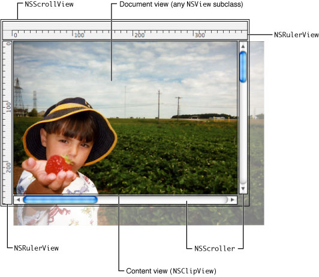

> 导航：[总目录](../../../README.md) · [documentation](../../../_indexes/documentation.md) · [Scroll View Programming Guide for Mac](Introduction%20to%20Scroll%20View%20Programming%20Guide%20for%20Cocoa.md)

[Next](Creating%20and%20Configuring%20a%20Scroll%20View.md)[Previous](Introduction%20to%20Scroll%20View%20Programming%20Guide%20for%20Cocoa.md)

# How Scroll Views Work

Scroll views act as the central coordinator for the Application Kit’s scrolling machinery, managing instances of scrollers, rulers, and clipping views. A scroll view changes the visible portion of the displayed document in response to user-initiated actions or to programmatic requests by the application. This article describes the various components of a scroll view and how the scrolling mechanism works.

Cocoa provides a suite of classes that allow applications to scroll the contents of a view. Instances of the `NSScrollView` class act as the container for the views that work together to provide the scrolling mechanism. Figure 1 shows the possible components of a scroll view.

__Figure 1__  Exploded view of a scroll view's components

`NSScrollView` instances provide scrolling services to its _document view_. This is the only view that an application must provide a scroll view. The document view is responsible for creating and managing the content scrolled by a scroll view.

`NSScrollView` objects enclose the document view within an instance of `NSClipView` that is referred to as the _content view_. The content view is responsible for managing the position of the document view, clipping the document view to the content view's frame, and handling the details of scrolling in an efficient manner. The content view scrolls the document view by altering its bounds rectangle, which determines where the document view’s frame lies. You don't normally interact with the `NSClipView` class directly; it is provided primarily as the scrolling machinery for the `NSScrollView` class.

The `NSScroller` class provides controls that allow the user to scroll the contents of the document view. Scroll views can have a horizontal scroller, a vertical scroller, both, or none. If the scroll view is configured with scrollers, the `NSScrollView` class automatically creates and manages the appropriate control objects. An application can customize these controls as required. See [How Scrollers Interact with Scroll Views](#apple-f4xwc4dqnrsv64tfmyxwi33df52wszbpkridimbqgaztinrrfvjvomq) for more information.

Scroll views also support optional horizontal and vertical rulers, instances of the `NSRulerView` class or a custom subclass. To allow customization, rulers support accessory views provided by the application. A scroll view's rulers don’t automatically establish a relationship with the document view; it is the responsibility of the application to set the document view as the ruler's client view and to reflect cursor position and other status updates. See _[Ruler and Paragraph Style Programming Topics](../Ruler%20and%20Paragraph%20Style%20Programming%20Topics/Introduction%20to%20Rulers%20and%20Paragraph%20Styles.md#apple-f4xwc4dqnrsv64tfmyxwi33df52wszbpgeydambqga4ds2i)_ for more information.

A scroll view's document view is positioned by the content view, which sets its bounds rectangle in such a way that the document view’s frame moves relative to it. The action sequence between the scrollers and the corresponding scroll view, and the manner in which scrolling is performed, involve a bit more detail than this.

Scrolling typically occurs in response to a user clicking a scroller or dragging the scroll knob, which sends the `NSScrollView` instance a private action message telling it to scroll based on the scroller's state. This process is described in [How Scrollers Interact with Scroll Views](#apple-f4xwc4dqnrsv64tfmyxwi33df52wszbpkridimbqgaztinrrfvjvomq). If you plan to implement your own kind of scroller object, you should read that section.

The `NSClipView` class provides low-level scrolling support through the `scrollToPoint:` method. This method translates the origin of the content view’s bounds rectangle and optimizes redisplay by copying as much of the rendered document view as remains visible, only asking the document view to draw newly exposed regions. This usually improves scrolling performance but may not always be appropriate. You can turn this behavior off using the `NSClipView` method `setCopiesOnScroll:` passing `NO` as the parameter. If you do leave copy-on-scroll active, be sure to scroll the document view programmatically using the `NSView` method `scrollPoint:` method rather than `translateOriginToPoint:`.

Whether the document view scrolls explicitly in response to a user action or an `NSClipView` message, or implicitly through a `setFrame:` or other such message, the content view monitors it closely. Whenever the document view’s frame or bounds rectangle changes, it informs the enclosing scroll view of the change with a `reflectScrolledClipView:` message. This method updates the `NSScroller` objects to reflect the position and size of the visible portion of the document view.

`NSScroller` is a public class primarily for developers who decide not to use an instance of `NSScrollView` but want to present a consistent user interface. Its use outside of interaction with scroll views is discouraged, except in cases where the porting of an existing application is more straightforward.

Configuring an `NSScroller` instance for use with a custom container view class (or a completely different kind of target) involves establishing a target-action relationship as defined by `NSControl`. In the case of the scroll view, the target object is the content view. The target object is responsible for implementing the action method to respond to the scroller, and also for updating the scrollers in response to changes in target.

As the scroller tracks the mouse, it sends an action message to its target object, passing itself as the parameter. The target object then determines the direction and scale of the appropriate scrolling action. It does this by sending the scroller a `hitPart` message. The `hitPart` method returns a part code that indicates where the user clicked in the scroller. Table 1 shows the possible codes returned by the `hitPart` method.

__Table 1__  Part codes returned by `hitPart`

| Part code returned by `hitPart` | Scrolling behavior |
| `NSScrollerNoPart` | The scroll view should not scroll at all. |
| `NSScrollerIncrementLine` | The scroll view should scroll down or to the right by the amount specified by the `verticalLineScroll` or `horizontalLineScroll` methods, dependent on the scroller's orientation. |
| `NSScrollerDecrementLine` | The scroll view should scroll up or to the left by the amount specified by the `verticalLineScroll` or `horizontalLineScroll` methods, dependent on the scroller's orientation. |
| `NSScrollerIncrementPage` | The scroll view should scroll down or to the right by the amount specified by the `verticalPageScroll` or `horizontalPageScroll` methods, dependent on the scroller's orientation. |
| `NSScrollerDecrementPage` | The scroll view should scroll up or to the left by the amount specified by the `verticalPageScroll` or `horizontalPageScroll` methods, dependent on the scroller's orientation. |
| `NSScrollerKnob` or `NSScrollerKnobSlot` | The scroll view should scroll directly to the horizontal or vertical location—dependent on the scroller's orientation—returned by the scroller's `floatValue` method. |

The target object tracks the size and position of its document view and updates the scroller to indicate the current position and visible proportion of the document view by sending the appropriate scrollers a `setFloatValue:knobProportion:` message, passing the current scroll location. The knob proportion parameter is a floating-point value between 0 and 1 that specifies how large the knob in the scroller should appear. `NSClipView` overrides most of the `NSView` `setBounds...` and `setFrame...` methods to perform this updating.

[Next](Creating%20and%20Configuring%20a%20Scroll%20View.md)[Previous](Introduction%20to%20Scroll%20View%20Programming%20Guide%20for%20Cocoa.md)

