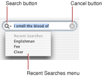

> 导航：[总目录](../../../README.md) · [documentation](../../../_indexes/documentation.md)

[Next](Adding%20a%20Search%20Field%20to%20Your%20Application.md)

# Introduction to Search Fields

A _search field_ is a rounded text field that displays text that the user can select or edit, and that sends its action message to its target when the user presses the Return key. It presents a standard user interface for searches, including a search button, a cancel button, and a pop-up icon menu for listing recent search strings and custom search categories. The search button includes a menu and the option to send the results while the user is typing or when the user presses the Return key. If there is no text in the search field, the cancel button is hidden. Figure 1 shows the major components of a search field.

__Figure 1__  A search field

A search field is implemented by two classes: [NSSearchFieldCell](https://developer.apple.com/documentation/appkit/nssearchfieldcell), the cell that does most of the work, and [NSSearchField](https://developer.apple.com/documentation/appkit/nssearchfield), the control that contains that cell.

There are, broadly speaking, two ways to configure and use a search field—programmatically, or with Cocoa bindings.

- If you configure a search field programmatically, you should set the target and action of the control or its cell to the receiver that is interested in the search request. Also, remember that `NSSearchFieldCell` and `NSSearchField` classes are direct subclasses of `NSTextFieldCell` and `NSTextField`, respectively, so you can use all the methods inherited from these classes.
- If you use bindings, you typically set the multi-value `Predicate` binding to set the predicates on a controller such as an instance of `NSArrayController`.

You can, of course, mix these approaches—for example, you may need to programmatically update the `Predicate` binding if you dynamically change the search categories based on the visibility of columns in a table view.

To learn how to add a search field to your application, using either a xib file or in code, read [Adding a Search Field to Your Application](Adding%20a%20Search%20Field%20to%20Your%20Application.md#apple-f4xwc4dqnrsv64tfmyxwi33df52wszbpgiydambsgi2dilkcifbemskcjfaq).

To learn how to set up the search field’s pop-up icon menu to show recent search strings and search categories, read [Adding a Search Field to Your Application](Adding%20a%20Search%20Field%20to%20Your%20Application.md#apple-f4xwc4dqnrsv64tfmyxwi33df52wszbpgiydambsgi2dilkcifbemskcjfaq).

To learn how to implement suitable methods in the search field’s target, read [Adding a Search Field to Your Application](Adding%20a%20Search%20Field%20to%20Your%20Application.md#apple-f4xwc4dqnrsv64tfmyxwi33df52wszbpgiydambsgi2dilkcifbemskcjfaq).

To learn how to change the appearance of a search field programatically, read [Customizing Your Search Field’s Appearance](Customizing%20Your%20Search%20Field%E2%80%99s%20Appearance.md#apple-f4xwc4dqnrsv64tfmyxwi33df52wszbpgiydambsgi2dmlkcifbemskcjfaq).

- _OS X Human Interface Guidelines_ provides guidelines on when to use particular interface items and how to position them.
- _[Search Kit Reference](https://developer.apple.com/documentation/coreservices/search_kit)_ describes a powerful and streamlined C language framework for indexing and searching text in most human languages.
[Next](Adding%20a%20Search%20Field%20to%20Your%20Application.md)

