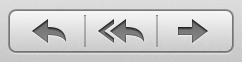

> 导航：[总目录](../../../README.md) · [documentation](../../../_indexes/documentation.md) · [Segmented Control Programming Guide](Introduction%20to%20Segmented%20Controls.md)

[Next](Using%20Segmented%20Controls.md)[Previous](Introduction%20to%20Segmented%20Controls.md)

# Segmented Controls Overview

_NSSegmentedControl_ is a subclass of [NSControl](https://developer.apple.com/documentation/appkit/nscontrol) that implements a horizontal control made of multiple segments. It provides a compact means of grouping together a number of controls, as shown in Figure 1.

__Figure 1__  A segmented control in Mail

Segments may contain text, images, and menus. One of the simplest applications of a segmented control is its use as a compact alternative to a group of radio buttons. Here, the user makes a single selection from a number of options. In a more complex example, segments can be independently selected or have associated menus.

[NSSegmentedControl](https://developer.apple.com/documentation/appkit/nssegmentedcontrol) has these features:

- Each segment can have an image, text (label), menu, tooltip, and tag.
- Either the whole control or individual segments can be enabled or disabled.
- There are three modes: radio button (as illustrated by Finder’s view mode selection control), momentary (as illustrated by Safari’s toolbar buttons), or any on/off.
- Each segment can either be a fixed width or be autosized to fit the contents.
- It provides full keyboard control of the user interface.

A segmented control’s appearance and behavior are controlled by the class [NSSegmentedCell](https://developer.apple.com/documentation/appkit/nssegmentedcell). Most `NSSegmentedCell` methods have covers in `NSSegmentedControl`, which simply call the `NSSegmentedCell` equivalent. For more information, see the _[NSSegmentedCell Class Reference](https://developer.apple.com/documentation/appkit/nssegmentedcell)_ and _[NSSegmentedControl Class Reference](https://developer.apple.com/documentation/appkit/nssegmentedcontrol)_ class specifications.

A segmented control requires some basic configuration. You must specify its tracking mode—the way in which selections are handled; how many segments it contains; and, optionally, the width of each segment. Segmented controls support three different tracking modes:

- Only one segment can be selected
- Any segment can be selected
- Segments are selected only while tracking

You can configure a segmented control programatically or using Interface Builder. In Cocoa, the tracking mode is set using an `NSSegmentedCell` method. Since connections are usually made to the control that contains the cell, you typically have to access the cell first and then send the message, if you are setting the tracking mode programmatically.

You can set a text label (title) or image independently for each segment. By default, each segment autosizes to fit its contents. If you want to ensure a fixed size—perhaps with each segment the same width—you must set the width of each segment individually. In this case it is up to you to ensure that each segment is wide enough for its contents. If a segment is too narrow for its contents, text is truncated and images are clipped.

A segment can have a menu; you can configure this menu programatically or in Interface Builder. You then set the menu for a segment programatically, using the `setMenu:forSegment:` method. You typically set a menu together with a label or an image. If you do not specify either, the segment remains blank, although the menu will appear when the user clicks on it.

[Next](Using%20Segmented%20Controls.md)[Previous](Introduction%20to%20Segmented%20Controls.md)

