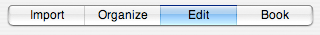
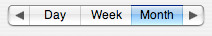
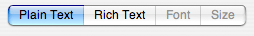

> 导航：[总目录](../../../README.md) · [documentation](../../../_indexes/documentation.md) · [Segmented Control Programming Guide](Introduction%20to%20Segmented%20Controls.md)


[Next](Document%20Revision%20History.md)[Previous](Segmented%20Controls%20Overview.md)

# Using Segmented Controls

You can create and configure a segmented control programatically or using Interface Builder. You can also interact with the control programatically, for example to set the selection, and to enable and disable segments.

There are a number of aspects of a segmented control that you should configure: its tracking mode—the way in which selections are handled; how many segments it contains; and the properties of each segment. Segmented controls support three different tracking modes, specified by the following constants:

__[NSSegmentSwitchTrackingSelectOne](https://developer.apple.com/documentation/appkit/nssegmentswitchtracking/nssegmentswitchtrackingselectone)__: Only one button can be selected

__[NSSegmentSwitchTrackingSelectAny](https://developer.apple.com/documentation/appkit/nssegmentswitchtracking/nssegmentswitchtrackingselectany)__: Any button can be selected

__[NSSegmentSwitchTrackingMomentary](https://developer.apple.com/documentation/appkit/nssegmentswitchtracking/nssegmentswitchtrackingmomentary)__: Segments are selected only while tracking

The easiest way to create a segmented control is in Interface Builder. To do so, simply drag a segmented control from the Cocoa-Controls palette to your window. Use the Attributes panes of the Inspector window to configure the attributes of the segmented control. These are:

- _Size_. Specifies the control size. Like other controls, segmented controls come in three sizes: regular, small, and mini.
- _Selection_. Specifies the tracking mode of the segmented control. The possible options are:

  - _Single_. This corresponds to the constant`NSSegmentSwitchTrackingSelectOne` and specifies that only one segment can be selected.
  - _Multiple_. This corresponds to the constant `NSSegmentSwitchTrackingSelectAny` and specifies that any segment can be selected.
  - _Momentary_. This corresponds to the constant `NSSegmentSwitchTrackingMomentary` and indicates that segments are selected only while tracking.
- _Text Direction_. Specifies the direction of any label text. This defaults to Natural, indicating the text direction native to the user's current language settings.
- _Segments_. Specifies the number of segments in the segmented control.
- _Tag_. Specifies a tag identifying the segmented control.
- _Segment Widths_. Specifies the width of the individual segments in the segmented control. By default, segments are autosized to fit their contents. If you want to ensure a fixed width for each segment, you can specify that width here. You can type in a specific width or you can use the Avg and Max buttons to calculate the current average or maximum segment width, respectively, and set the fixed segment width to that number.

Certain attributes must be configured individually for each segment. To configure a segment, double-click to select it. The Inspector window for an `NSSegmentedCell` lets you configure these attributes:

- _Label_. Specifies the text label of the segment, if any.
- _Tag_. Specifies a tag identifying the individual segment.
- _Icon_. A file containing the image for the segment to display. A segment should have either an icon or a text label, but not both. See UI Element Guidelines: Controls in _OS X Human Interface Guidelines_.

You can also create a segmented control programmatically. One of the simplest applications of a segmented control is its use as a compact alternative to a group of radio buttons. Here, the user makes a single selection from a number of options. [Listing 1](#apple-f4xwc4dqnrsv64tfmyxwi33df52wszbpgiydambsgi2taljrgi4tembzfvbegskhjjceura) shows code to create a control like one found in iPhoto.

__Listing 1__  Simple text-based example

```
// Set the number of segments
[segControl setSegmentCount:4];
// Set titles for each segment
[segControl setLabel:@"Import" forSegment:0];
[segControl setLabel:@"Organize" forSegment:1];
[segControl setLabel:@"Edit" forSegment:2];
[segControl setLabel:@"Book" forSegment:3];
```

By default a segmented control autosizes to fit. To programatically mark a segment as autosizing, set its width to `0`. If any segments are marked as autosizing, then the widths are adjusted so that all segments are displayed completely in the control.

If you want to ensure a fixed size, perhaps with each segment the same width, you must set the width of each segment individually, as shown in [Listing 2](#apple-f4xwc4dqnrsv64tfmyxwi33df52wszbpgiydambsgi2taljrgmydimbxfvbegskiizdugqq).

__Listing 2__  Setting segments to equal widths

```
[segControl setWidth:70 forSegment:0];
[segControl setWidth:70 forSegment:1];
[segControl setWidth:70 forSegment:2];
[segControl setWidth:70 forSegment:3];
```

Combining code from [Listing 1](#apple-f4xwc4dqnrsv64tfmyxwi33df52wszbpgiydambsgi2taljrgi4tembzfvbegskhjjceura) and [Listing 2](#apple-f4xwc4dqnrsv64tfmyxwi33df52wszbpgiydambsgi2taljrgmydimbxfvbegskiizdugqq) produces a controller like that shown in [Figure 1](#apple-f4xwc4dqnrsv64tfmyxwi33df52wszbpgiydambsgi2taljrgmydinbzfvbegskcizbemrq).

__Figure 1__  Control with segments of equal width



It is up to you to ensure that each segment is wide enough for its contents. If an image is too large to fit, it is clipped on the right. If the text, or the combination of the text and image, is too wide for a segment, the text is truncated using an ellipsis.

Some of the methods you may require for configuration (for example the tracking mode) are implemented only in `NSSegmentedCell`, so you must access the control’s cell, as in the following example:

```
[[segControl cell] setTrackingMode:NSSegmentedSwitchTrackingSelectAny];
```

In common with other controls, `NSSegmentedControl` is available in three sizes—regular, small, and mini (although textured windows only support regular-sized segmented controls). The size is also configured by the cell:

```
[[segControl cell] setControlSize:NSMiniControlSize];
```


There is no requirement that all segments within a segmented control be of the same type. The following code creates a segmented control like that found in iCal, as illustrated in [Figure 2](#apple-f4xwc4dqnrsv64tfmyxwi33df52wszbpgiydambsgi2taljrgmydgnzvfvbegskfjfeeqri):

```
[segControl setSegmentCount:5];
// Configure each segment
[segControl setImage:MYLeftArrowImage forSegment:0];
[segControl setLabel:@"Day" forSegment:1];
[segControl setLabel:@"Week" forSegment:2];
[segControl setLabel:@"Month" forSegment:3];
[segControl setImage:MYRightArrowImage forSegment:4];
```


__Figure 2__  Segmented control showing a combination of segment types



It is not possible, however, to specify different tracking modes for different segments. You cannot specify momentary selection for some segments and radio button behavior for others. Thus, although the control in [Figure 2](#apple-f4xwc4dqnrsv64tfmyxwi33df52wszbpgiydambsgi2taljrgmydgnzvfvbegskfjfeeqri)_looks_ like one found in iCal, it cannot function in the same way (that is, where the arrows are selected momentarily and advance through the calendar, and one of the text buttons remains continuously selected to choose the display option). The exception to this rule is a segment that contains a menu. A segment with a menu always acts as a momentary control and cannot be toggled on, even if the control is configured as “select one” or “select any”.

Although it is possible to set both a label and an image for a segment, a segment should have one or the other, as described in _OS X Human Interface Guidelines_.

There are a number of methods for interacting with a segmented control programatically—for example, to change the selected segment, and to enable and disable individual segments.

You can find out which segment, if any, is selected, using `selectedSegment`. If no segment is selected, the method returns `–1`. When a control is configured to allow multiple selections, you can find out if an individual segment is selected using `isSelectedForSegment:`. Conversely, you can set the selection using `setSelectedSegment:` and `setSelected:forSegment:`.

Similarly, you can enable and disable individual segments within the control using `setEnabled:forSegment:`. Doing so may be useful to restrict the user to making selections that are valid for the current environment, as illustrated below.



As with any control, you can set a segmented control's target, action, and tag. Each segment within the control, however, may have its own tag. When any segment in the control is clicked, the action message is sent to the target—unless the segment is disabled or has only a menu. You can determine which segment was clicked by finding the tag for the selected segment, as shown in the following example:

```objc
- (void)awakeFromNib
{
    [segControl setSegmentCount:3];
    [[segControl cell] setTag:0 forSegment:0];
    [[segControl cell] setTag:1 forSegment:1];
    [[segControl cell] setTag:2 forSegment:2];
    [segControl setTarget:self];
    [segControl setAction:@selector(segControlClicked:)];
}

- (IBAction)segControlClicked:(id)sender
{
    int clickedSegment = [sender selectedSegment];
    int clickedSegmentTag = [[sender cell] tagForSegment:clickedSegment];
    //...
}
```

The cell’s `selectedSegment` method returns the segment that was last clicked. This means you can find out which segment was clicked, even when tracking mode is `NSSegmentSwitchTrackingSelectAny` or `NSSegmentSwitchTrackingMomentary`. Note that if the segment has only a menu, the menu is displayed when the user clicks the segment. If the segment has both a menu and an action, the action is triggered when the user clicks and the menu is displayed when the user clicks and holds.

[Next](Document%20Revision%20History.md)[Previous](Segmented%20Controls%20Overview.md)

