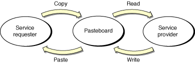
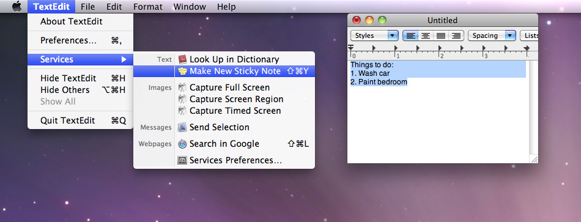
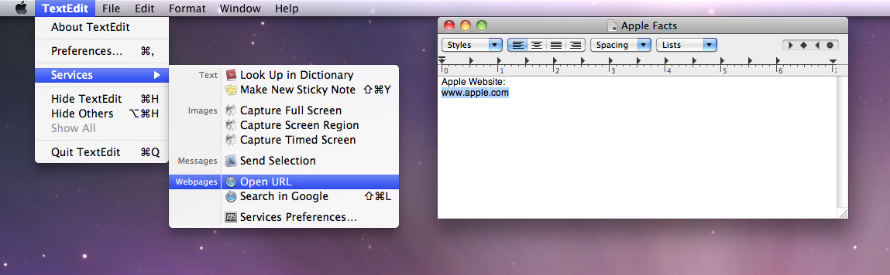
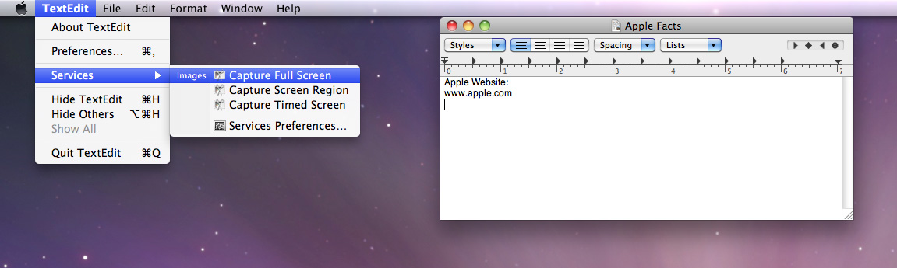
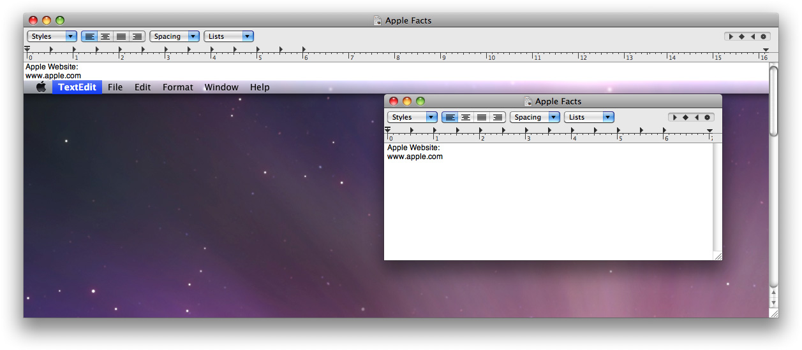

> 导航：[总目录](../../../README.md) · [documentation](../../../_indexes/documentation.md) · [Services Implementation Guide](Introduction.md)

[Next](Items%20in%20the%20Services%20Menu.md)[Previous](Introduction.md)

# Services Overview

Services allow a user to access the functionality of one application from within another application. An application that provides a service advertises the operations it can perform on a particular type of data—for example, encryption of text, optical character recognition of a bitmapped image, or generating text such as a message of the day. When the user is manipulating that particular type of data in some application, the user can choose the appropriate item in the Services menu to operate on the current data selection (or merely insert new data into the document).

This chapter discusses how services are processed and describes some sample services.

Services are performed by transferring data back and forth between applications through a shared pasteboard. Note that the two applications—service requester and service provider—are completely separate; they do not run in a shared memory space. The pasteboard holding the data is specific to the service request and does not normally interfere with the standard Copy/Paste pasteboard.

When the user chooses a Services menu item, data flows as shown in Figure 1. The current selection is copied to a pasteboard which is then passed to the service provider application. If the service provider is not currently running, it is automatically launched. The service provider reads the contents of the pasteboard and operates on it. The service provider writes new data back to the pasteboard and the pasteboard is returned to the original application. The original application then pastes the pasteboard’s contents into the document, replacing the current selection, if there is one. The service provider application does not automatically quit at the end of the service request.

__Figure 1__  Data flow in a service request

Not all services both receive and provide data. Some services only receive data and others only provide data. In these cases only one of the copy and paste steps is performed. Services can thus be divided into two groups:

- __Processor.__ This type of service acts on data. A processor service acts on the current selection and then sends it to the service. For example, if a user selects an email address in a TextEdit document, and then chooses Send Selection from the Services menu, TextEdit copies the person’s address to the pasteboard, the Mail application launches, and Mail pastes the address into the Send field of a new email message.
- __Provider.__ This type of service gives data to the calling application. For example, if a user chooses Capture Full Screen from the Services menu, the Grab application opens, takes a screen shot, then returns the screen shot (TIFF data in this case) to the calling application. The calling application (such as TextEdit) is responsible for pasting the data into the active document.

A service falls into both categories if it processes the current selection and then provides a replacement value. For example, a text encryption service takes the current text selection, encrypts it, and then returns the encrypted text to the service requester to replace the current selection.

The following figures show services in action. Figure 2 shows the Services menu from the TextEdit application. Make New Sticky Note is an example of a processor service. The Make New Sticky Note command takes the current selection in the TextEdit document, opens a new Stickies document, and then pastes the selection into the Stickies document. For more convenient use, a keyboard shortcut (Command-Shift-Y) is defined for this service.

__Figure 2__  Make New Sticky Note is a processor service

Figure 3 shows another example of a processor service. In this case, the Open URL command copies the selected text, launches a Web browser, pastes the selected text into the browser’s location field, and then tries to connect to that location.

__Figure 3__  Open URL is a processor service

Capture Full Screen is a provider service. Figure 4 shows the Apple Facts document before Capture Full Screen is invoked.

__Figure 4__  Capture Full Screen is a provider service

Figure 5 shows the Apple Facts document after Grab has taken a shot of the current screen and returned the data to the TextEdit application. Recall that it is the responsibility of TextEdit to do something with the returned data. In this example, TextEdit simply pastes the TIFF into the current document at the insertion point.

__Figure 5__  The Apple Facts document after a screen shot has been inserted

App Sandbox is an access control technology that works to contain the damage that can be caused by an app that has become compromised. When you adopt App Sandbox, your app is restricted from using system resources that it does not need to get its job done. When you adopt App Sandbox for an app that provides a service, you follow the same steps as for any other app, as described in _[App Sandbox Design Guide](https://developer.apple.com/library/archive/documentation/Security/Conceptual/AppSandboxDesignGuide/AboutAppSandbox/AboutAppSandbox.html#//apple_ref/doc/uid/TP40011183)_. You simply include the code that implements the service in the sandboxing procedure.

In some cases, a service, especially one provided by an app that is not sandboxed, might enable another app to escape from its sandbox. For example, the Apple Finder app is not sandboxed because it needs complete access to the file system to function properly. Further, this app provides a service that allows the user to highlight text in another app, and open the file at the path given by that text. Because services can be invoked programmatically (see [Invoking a Service Programmatically](Using%20Services.md#apple-f4xwc4dqnrsv64tfmyxwi33df52wszbpgiydambqha2tiljzg44temq)), a compromised app could use the Open service to escape its sandbox, and execute an arbitrary file anywhere on the system.

To avoid this problem, you mark a potentially dangerous service as restricted (as is the case for the Finder app’s Open service) by setting its `NSRestricted` property to `YES`. When a restricted service is invoked from a sandboxed app, the system warns the user and asks if the operation should proceed, as show in Figure 6. The service is still available, but only with explicit user consent.

__Figure 6__  Restricted service confirmation dialog

!

[Next](Items%20in%20the%20Services%20Menu.md)[Previous](Introduction.md)

