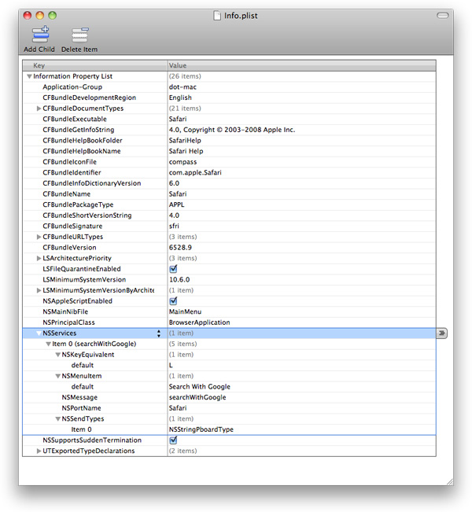

> 导航：[总目录](../../../README.md) · [documentation](../../../_indexes/documentation.md) · [Services Implementation Guide](Introduction.md)

[Next](Providing%20a%20Service.md)[Previous](Items%20in%20the%20Services%20Menu.md)

# Services Properties

Any application that has one or more services to provide must advertise the type of data its services can handle. Services are advertised through the `NSServices` property of the application’s information property list (`Info.plist`) file.

`NSServices` is a property whose value is an array of dictionaries that specifies the services provided by the application. Keys for each dictionary entry, are as follows:

- `NSMessage` indicates the instance method to invoke. Its value is used to construct an Objective-C method of the form _messageName_`:userData:error:`. This message is sent to the application’s service provider object.
- `NSPortName` is the name of the port on which the application should listen for service requests. Its value depends on how the service provider application is registered. In most cases, this is the application name. This property is ignored for Automator workflows being used as services.
- `NSMenuItem` is a dictionary that specifies the text of the Services menu item. Only one entry should be in this dictionary, and its key should be `default`. Its string value is used as the menu item’s text. There are no submenus in the Services menu, so the text preceding and including any slash present is discarded. (In OS X version 10.5 and earlier, you could use a slash to specify a submenu. For example, `Mail/Send Selection` appears in the Services menu as a submenu named Mail with an item named Send Selection.)

  Any services with identical names are disambiguated by adding the application name providing each service in parentheses after its name. (In OS X version 10.5 and earlier, `NSMenuItem` must be unique, as only one is used in the Services menu if there are duplicates.)

  To localize the string specified, create a `ServicesMenu.strings` file for each localization in your bundle with the above `default` menu item string as the lookup key. For example, create a `.strings` file that has `Send Selection` as the key and the localized text as its value. (See _[Resource Programming Guide](../Resource%20Programming%20Guide/About%20Resources.md#apple-f4xwc4dqnrsv64tfmyxwi33df52wszbpgeydambqga2tc2i)_ for details on localized strings files.) If a localized string is not found, the `default` text is used.
- `NSKeyEquivalent` is an optional dictionary that specifies the keyboard equivalent for invoking the menu command. Like `NSMenuItem`, the only entry in the dictionary should have the key `default` with a string value that can be localized in the `ServicesMenu.strings` file. The string value must be a single character. The keyboard shortcut is this one character, with the Command key modifier. If the character is uppercase, the Shift modifier is also used.

  Use key equivalents sparingly. Remember that your shortcuts are being added to the collection of shortcuts defined by each application as well as defined by the other services. When an application already has a shortcut with that key equivalent, the application’s shortcut wins. If multiple services define the same shortcut, which one gets invoked is undefined.
- `NSRestricted` is an optional boolean that, when set to `YES`, indicates the service does something that might enable an app that adopts App Sandbox to escape from its sandbox. If set to `NO`, or left unspecified, the service is considered sandbox safe. For more information about App Sandbox, see the _[App Sandbox Design Guide](https://developer.apple.com/library/archive/documentation/Security/Conceptual/AppSandboxDesignGuide/AboutAppSandbox/AboutAppSandbox.html#//apple_ref/doc/uid/TP40011183)_.

  When a sandboxed app attempts to invoke a service marked as restricted, the system warns the user and asks for explicit permission to continue. This prevents a compromised app from invoking the service programmatically without the user’s consent. Services not marked as restricted do not trigger a user warning.

  This property has no effect when the invoking app is not sandboxed.
- `NSSendTypes` is an optional array that contains data type names. Send types are the types sent from the application requesting a service. _[NSPasteboard Class Reference](https://developer.apple.com/documentation/appkit/nspasteboard)_ lists several common data types. Additionally, in OS X version 10.5 and later, Uniform Type Identifiers may be used. (See _[Uniform Type Identifiers Overview](../../File%20Management/Uniform%20Type%20Identifiers%20Overview/Introduction%20to%20Uniform%20Type%20Identifiers%20Overview.md#apple-f4xwc4dqnrsv64tfmyxwi33df52wszbpkridimbqgaytgmjz)_ for more information on Uniform Type Identifiers.) This key is not required. (In OS X version 10.5 and earlier, an application that provides a service must specify `NSSendTypes`, `NSReturnTypes`, or both.)
- `NSReturnTypes` is an optional array that contains data type names. Return types are the data types returned to the application requesting a service. The NSPasteboard class description lists several common data types. Additionally, in OS X version 10.5 and later, Uniform Type Identifiers may be used. (See _[Uniform Type Identifiers Overview](../../File%20Management/Uniform%20Type%20Identifiers%20Overview/Introduction%20to%20Uniform%20Type%20Identifiers%20Overview.md#apple-f4xwc4dqnrsv64tfmyxwi33df52wszbpkridimbqgaytgmjz)_ for more information on Uniform Type Identifiers.) This key is not required. (In OS X version 10.5 and earlier, an application that provides a service must specify `NSSendTypes`, `NSReturnTypes`, or both.)
- `NSUserData` is an optional string that contains a value of your choice. You can use this string to customize the behavior of your service. For example, if your application provides several similar services, you can have the same `NSMessage` value for all of them (each service invokes the same method) and use different `NSUserData` values to distinguish between them. This entry is also useful for applications that provide open-ended, or add-on, services. This property is ignored for Automator workflows being used as services.
- `NSTimeout` is an optional numerical string that indicates the number of milliseconds that services should wait for a response from the application providing a service when a response is required. If the wait time exceeds the timeout value, the application aborts the service request and continues without interruption. If you don’t specify this entry, the timeout value is 30000 milliseconds (30 seconds).

  Users may also press the Escape key or type Command-period to cancel.
- `NSSendFileTypes` is an array that contains file type names. Only Uniform Type Identifiers are allowed; pasteboard types are not permitted. (See _[Uniform Type Identifiers Overview](../../File%20Management/Uniform%20Type%20Identifiers%20Overview/Introduction%20to%20Uniform%20Type%20Identifiers%20Overview.md#apple-f4xwc4dqnrsv64tfmyxwi33df52wszbpkridimbqgaytgmjz)_ for more information on Uniform Type Identifiers.) By assigning a value to this key, your service declares that it can operate on files whose type conforms to one or more of the given file types. Your service will receive a pasteboard from which you can read file URLs. You may specify values for both `NSSendTypes` and `NSSendFileTypes` if your service can operate on both pasteboard data and files.
- `NSServiceDescription` is a string that contains a description of your service that is suitable for presentation to users. It can be localized via the `ServicesMenu.strings` file.

  The description may be long. If your description is long, the value of `NSServiceDescription` should be a short token, such as `SERVICE_DESCRIPTION`. The full text should be given in the `ServicesMenu.strings` file with that token as its key.
- `NSRequiredContext` is a dictionary that can be used to limit when the service appears. Through judicious use of `NSRequiredContext`, you can ensure that your service appears only when it applies and does not clutter the Services menu when it is not applicable.

  `NSRequiredContext` may be a dictionary that contains any of the following keys, all of which are optional. It may also be an array of such dictionaries, in which case the service is enabled if any of the given contexts is satisfied.

  - `NSApplicationIdentifier`
  - `NSTextScript`
  - `NSTextLanguage`
  - `NSWordLimit`
  - `NSTextContent`

  These keys have the following significance:

  - `NSApplicationIdentifier` is a bundle ID as a string or an array of such IDs. Your service will appear only if the bundle ID of the current application matches one of the given bundle IDs. For example, you could use this to limit a service to appear only in Xcode or in the Finder.
  - `NSServiceCategory` is a UTI or category name as a string. If you provide a UTI, your service will appear in the category that corresponds to the provided UTI. For example, “public.text” will cause your service to appear in the Text category, while “public.source-code” will put it in the Development category. If you provide a literal category name, such as “Internet”, your service will appear there.

    You can not establish new categories with this key, but it does allow you to control which existing category a service appears in. Behavior for values that don’t match an existing category is undefined.
  - `NSTextContent` is a string specifying a data type that the text must contain, or an array of such strings. The valid values are as follows:

    - `URL`
    - `Date`
    - `Address`
    - `Email`
    - `FilePath`

    The service is available only if the selected text contains one of the specified data types. All text selected is provided to the service-vending application, not just the parts found to contain the given data types.
  - `NSTextLanguage` is a string containing the required overall language of the selected text as a BCP-47 tag. It may also be an array of such strings. The service appears only if the BCP-47 tag of the overall language of the selected text matches one of the given tags.

    The matching is performed via the default language range matching scheme, which is a prefix-matching scheme. For example, the `NSTextLanguage` string “zh” matches text whose language is “zh-Hant”. This key is relevant only for services that accept text.
  - `NSTextScript` is a string containing a standard four-letter script tag, such as `Latn` or `Cyrl`. It may also be an array of such strings. The service will only appear if the dominant script of the selected text is text corresponding to one of the given script tags. This key is relevant only for services that accept text.
  - `NSWordLimit` is an integer representing the maximum number of selected words that the service operates on. For example, a service to look up a stock by ticker symbol might have an `NSWordLimit` of 1 because ticker symbols cannot contain spaces. It may not be an array. This key is relevant only for services that accept text.

You typically define services when you create your application and advertise them in the `Info.plist` file of the application’s bundle. The Services facility also allows you to advertise services outside of the application bundle, enabling you to create “add-on” services after the fact. This is where the `NSUserData` entry becomes truly useful: you can define a single message in your application that performs actions based on the user data provided, such as running the user data string as a UNIX command or treating it as a special argument in addition to the selected data that gets sent through the pasteboard. To define an add-on service, you create a bundle with a `.service` extension that contains an `Info.plist` file, which in turn contains the add-on service’s `NSServices` property. The property uses the application’s `NSMessage` and `NSPortName` values.

The `NSServices` property for Safari is shown in Figure 1 as it appears in the Property List Editor application.

__Figure 1__  The `NSServices` property for Safari

The `NSServices` property has one entry that represents the only service offered by Safari: “Search with Google.” Note that, for this entry, the port name is Safari. As mentioned, the port name is usually the application name.

The entry has one return type, `NSStringPboardType`. An application can have more than one return type per entry, and the return types don’t necessarily need to be the same for each entry. Both Uniform Type Identifiers and pasteboard types are valid here. (For more information on Uniform Type Identifiers, see _[Uniform Type Identifiers Overview](../../File%20Management/Uniform%20Type%20Identifiers%20Overview/Introduction%20to%20Uniform%20Type%20Identifiers%20Overview.md#apple-f4xwc4dqnrsv64tfmyxwi33df52wszbpkridimbqgaytgmjz)_.)

The entry has a key equivalent of L, which means that Command-L can be used to invoke the service.

[Next](Providing%20a%20Service.md)[Previous](Items%20in%20the%20Services%20Menu.md)

