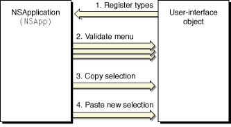

> 导航：[总目录](../../../README.md) · [documentation](../../../_indexes/documentation.md) · [Services Implementation Guide](Introduction.md)


[Next](Document%20Revision%20History.md)[Previous](Providing%20a%20Service.md)

# Using Services

The default nib file created for new Cocoa applications contains a Services menu in the application menu, so there is nothing else you need to do for your application to work with the Services facility; your application automatically has access to all appropriate services provided by other applications. If you need to construct menus programmatically, you simply designate the `NSMenu` object that you want as your Services menu with the `setServicesMenu:` method of `NSApplication`.

If you subclass `NSView` or `NSWindow` (or any other subclass of `NSResponder`), you need to implement it such that it interacts properly with the Services facility. Tying custom views or windows into the Services facility entails the following steps:

1. Registering your user-interface objects for services
2. Validating the Services menu items for the current selection
3. Sending the current selection to the service
4. Receiving data from the service to replace the current selection

The steps for using services are illustrated in Figure 1.

__Figure 1__  Using services



When a pure provider service is invoked (in other words, a service with no send types), step 3 is skipped. When a pure processor service is invoked (in other words, a service with no return types), step 4 is skipped.

The following sections cover each of these steps. A final section, [Invoking a Service Programmatically](#apple-f4xwc4dqnrsv64tfmyxwi33df52wszbpgiydambqha2tiljzg44temq), shows how to invoke a service in your code.

The Services menu does not contain every service offered by other applications. For example, in a text editor a service to invert a bitmapped image is of no use and should not be offered. Which services appear in the Services menu is determined by the data types that the objects in the application—specifically, the `NSResponder` objects—can send and receive through the pasteboard.

An `NSResponder` object registers these data types using the `NSApplication` Objective-C method `registerServicesMenuSendTypes:returnTypes:`. Objects in the AppKit framework already do this for the basic text services, but your custom `NSResponder` subclass must do this to expand the list. A convenient location is in your subclass’s `initialize` class method, which is guaranteed to be invoked by the runtime before any other method of the class. All types used by instances of the class must be registered, even if they are not always available; Services menu items are either present or not present based on what is available at the moment, as described in [Validating Services Menu Items](#apple-f4xwc4dqnrsv64tfmyxwi33df52wszbpgiydambqha2tiljzg42tamy).

An object does not have to register the same types for both sending and receiving. For example, suppose you are writing a rich text editor that can send unformatted and rich text, but can receive only unformatted text. Here is a portion of the initialization method for a text-editor’s `NSView` subclass:

```objc
+ (void)initialize
{
    static BOOL initialized = NO;
    /* Make sure code only gets executed once. */
    if (initialized == YES) return;
    initialized = YES;

    sendTypes = [NSArray arrayWithObjects:NSStringPboardType,
                    NSRTFPboardType, nil];
    returnTypes = [NSArray arrayWithObjects:NSStringPboardType,
                    nil];
    [NSApp registerServicesMenuSendTypes:sendTypes
                    returnTypes:returnTypes];
}
```

Your `NSResponder` object can register any pasteboard data type, public or proprietary, common or rare. If it handles the public and common types, of course, it has access to more services. For a list of standard pasteboard data types, see _[NSPasteboard Class Reference](https://developer.apple.com/documentation/appkit/nspasteboard)_.

While your application is running, various types of data can be selected and available for transfer on the pasteboard. If a service does not apply to the type of the selected data, its menu item needs to be disabled. To check whether a service applies, the application object sends `validRequestorForSendType:returnType:` messages to Objective-C objects in the responder chain to see whether they have data of the type used by that service. While the Services menu is visible, this method is called frequently—typically many times per event—to ensure that the menu items for all service providers are properly enabled: it is sent for each combination of send and return types supported by each service and possibly for many objects in the responder chain. Because this method is called frequently, it must be fast so that event handling does not fall behind the user’s actions.

The following example shows how this method can be implemented for an object that handles unformatted text:

```objc
- (id)validRequestorForSendType:(NSString *)sendType
            returnType:(NSString *)returnType
{
    if ([sendType isEqual:NSStringPboardType] &&
        [returnType isEqual:NSStringPboardType]) {
        if ([self selection] && [self isEditable]) {
            return self;
        }
    }
    return [super validRequestorForSendType:sendType returnType:returnType];
}
```

This implementation checks both the types indicated and the state of the object. The object is a valid requester if the send and return types are unformatted text or simply are not specified, and if the object has a selection and is editable (when send and return types are given). If this object cannot handle the service request in its current state, it invokes its superclass’s implementation.

The `validRequestorForSendType:returnType:` message is sent along an abridged responder chain, comprising only the responder chain for the key window and the application object. The main window is excluded.

When the user chooses a Services menu command, the responder chain is checked with `validRequestorForSendType:returnType:`. The first object that returns a value other than `nil` is called upon to handle the service request by providing data (if any is required) with a `writeSelectionToPasteboard:types:` message. You can implement this method to provide the data immediately or to provide the data only when it is actually requested. Here is an implementation for an object that writes unformatted text immediately:

```objc
- (BOOL)writeSelectionToPasteboard:(NSPasteboard *)pboard
types:(NSArray *)types
{
    NSArray *typesDeclared;

    if ([types containsObject:NSStringPboardType] == NO) {
        return NO;
    }
    typesDeclared = [NSArray arrayWithObject:NSStringPboardType];
    [pboard declareTypes:typesDeclared owner:nil];
    return [pboard setString:[self selection]
                    forType:NSStringPboardType];
}
```

This method returns `YES` if it successfully writes or declares any data and `NO` if it fails. If you have large amounts of data or you can provide the data in many formats, you should provide the data only on demand. You declare the available types as above, but with an owner object that responds to the message `pasteboard:provideDataForType:`. For more details, see _[NSPasteboard Class Reference](https://developer.apple.com/documentation/appkit/nspasteboard)_.

After the service requester writes data to the pasteboard, it waits for a response as the service provider is invoked to perform the operation; if the service does not return data, of course, the requesting application continues running and none of the following applies. The service provider reads the data from the pasteboard, works on it, and then returns the result. At this point the service requester is sent a `readSelectionFromPasteboard:` message telling it to replace the selection with whatever data came back. The simple text object can implement this method as follows:

```objc
- (BOOL)readSelectionFromPasteboard:(NSPasteboard *)pboard
{
    NSArray *types;
    NSString *theText;

    types = [pboard types];
    if ( [types containsObject:NSStringPboardType] == NO ) {
        return NO;
    }
    theText = [pboard stringForType:NSStringPboardType];
    [self replaceSelectionWithString:theText];
    return YES;
}
```

This method returns `YES` if it successfully reads the data from the pasteboard; otherwise, it returns `NO`.

Though the user typically invokes a standard service by choosing an item in the Services menu, you can invoke it in code using this function:

```
BOOL NSPerformService(NSString *serviceItem, NSPasteboard *pboard)
```

This function returns `YES` if the service is successfully performed; otherwise, it returns `NO`. The name of a Services menu item (in any language) is contained in _serviceItem_. It must be the full name of the service; for example, “`Search in Google`.” The parameter _pboard_ contains the data to be used for the service, and, when the function returns, it contains the data returned from the service. You can then do with the data what you wish.

[Next](Document%20Revision%20History.md)[Previous](Providing%20a%20Service.md)

