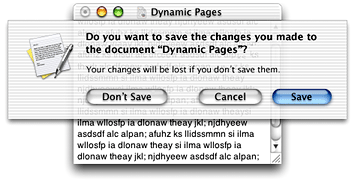

> 导航：[总目录](../../../README.md) · [documentation](../../../_indexes/documentation.md) · [Sheet Programming Topics](Introduction%20to%20Sheets.md)

[Next](Types%20of%20Alerts.md)[Previous](Introduction%20to%20Sheets.md)

# About Sheets

A sheet is simply a dialog attached to a specific window, ensuring that a user never loses track of which window the dialog belongs to. The ability to keep a dialog attached to its pertinent window enables users to take full advantage of the OS X window layering model and also encourages modelessness; users can work on other documents or in other applications while a sheet is open.

__Figure 1__  An example of a sheet

A sheet is _document modal_—that is while it is open the user is prevented from doing anything else in the window, or document, until the dialog is dismissed. In contrast, a dialog that is _application modal_ prevents the user from doing anything else within the application.

Managing the animation of sheets, and making sure the sheet appears properly if the parent window is narrower than the sheet or near the edge of the screen, is provided “for free” by Cocoa.

Cocoa provides an API for presenting sheets. Because sheets are document modal, these calls return immediately after presenting a sheet. Callback methods are used to let your application know when the user dismisses a sheet.

Use sheets for dialogs specific to a document when the user interacts with the dialog and dismisses it before proceeding with work. Some examples of when to use sheets:

- A modal dialog that is specific to a particular document, such as saving or printing. The Cocoa classes NSSavePanel and NSPrintPanel present their views as sheets.
- A modal dialog that is specific to a single-window application that does not create documents. A single-window utility program might use a sheet to request acceptance of a licensing agreement from the user, for example.
- Other window-specific dialogs typically dismissed by the user before proceeding. Use a sheet when a dialog benefits from being attached to the window as a modal dialog, even if you might otherwise design the dialog as a modeless dialog.

Because sheets in Cocoa are document modal, when you display a sheet, normal program execution continues, allowing the user to do other things in other windows. This means your application must be prepared to handle user interaction when it occurs.

When you display a sheet, you specify selectors for the callback methods sent when the user dismisses the sheet, as well as the receiver of these messages, known as the _modal delegate_. The modal delegate is informed of the button the user clicked as a parameter in the method it receives.

Unlike other delegates in Cocoa, modal delegates in sheets are temporary and the relationship lasts only until the sheet is dismissed. The sheet’s modal delegate is not retained by any document-modal method or function.

Sheets are laid out like any other dialog in OS X. You are responsible for loading, showing, and closing sheets. While a sheet is displayed, events are handled by the Application Kit just as for any other window. Other sheet behavior, such as the animation when it appears and is dismissed, is handled automatically by the Application Kit.

Each sheet function takes as an argument a modal delegate and one or more callback methods. All calls specify a callback method that is sent before dismissing the sheet, sometimes referred to as the did-end selector. Some sheet functions also allow for a second callback method that is sent after dismissing the sheet, known as the did-dismiss selector. When you display a sheet you can optionally include a context-info argument. When the sheet ends, the modal delegate is sent the did-end selector, receiving as parameters the sheet window object, the result of running the sheet (either a Boolean value or a return code), and the context-info argument. context-info is a way for you to pass information from the start of the modal session to the end, and this information can be whatever you wish: a simple value, a structure, or an object.

The did-end selector is sent before dismissing the sheet, providing you the opportunity to dismiss the sheet and the parent document window at the same time. For example, you might want to do this when dismissing a “do you want to save” alert before closing a window. If the user clicks Don't Save, you want to close both the document window and the sheet without the sheet effect. This can be accomplished by calling `[documentWindow close]` from the did-end selector. You can also dismiss just the sheet in this method by calling `[sheet orderOut: self]`. If you do not dismiss the sheet, it will be done for you on return from the did-end selector. You may be in a situation, however, where you want to immediately present another sheet, and this is best done from the did-end selector after dismissing the first sheet.

You may find it convenient to implement both the did-end selector and the did-dismiss selector, but it is not required.

[Next](Types%20of%20Alerts.md)[Previous](Introduction%20to%20Sheets.md)

