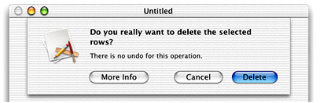

> 导航：[总目录](../../../README.md) · [documentation](../../../_indexes/documentation.md) · [Sheet Programming Topics](Introduction%20to%20Sheets.md)


[Next](Sheet%20Notifications.md)[Previous](Using%20Custom%20Sheets.md)

# Presenting a Series of Sheets

Cocoa does not support the notion of cascading, or nested sheets. Per _Apple Human Interface Guidelines_, “when the user responds to a sheet, and another sheet for that document opens, the first sheet must close before the second one opens.”

Expanding on the sample in [Using Alert Sheets](Using%20Alert%20Sheets.md#apple-f4xwc4dqnrsv64tfmyxwi33df52wszbpgiydambrga2dklkcifbemskcjfaq), Figure 1 shows a third button added to the alert sheet displayed by `deleteSelectedRows:`. This button displays additional information to the user in the form of a custom sheet with additional information.

__Figure 1__  Alert sheet with three buttons



Listing 1 shows the implementation of the method that creates this alert.

__Listing 1__  The deleteSelectedRows: method implemented to present a sheet with three buttons

```objc
- (BOOL)deleteSelectedRows: (NSWindow *)sender
{
    NSBeginAlertSheet(
        @"Do you really want to delete the selected information?",
                                // sheet message
        @"Delete",              // default button label
        @"More Info",           // allow user to check on the delete
        @"Cancel",              // other button label
        sender,                 // window sheet is attached to
        self,                   // we’ll be our own delegate
        @selector(sheetDidEndShouldDelete:returnCode:contextInfo:),
                                // did-end selector
        NULL,                   // no need for did-dismiss selector
        sender,                 // context info
        @"There is no undo for this operation.",
                                // additional text in sheet
        nil);                   // no parameters in message

// We don’t know if the rows should be deleted until the user responds,
// so don’t.

    return NO;
}
```

The did-end selector is updated to handle the user requesting the additional information. Should the user request the information, the alert sheet is closed prior to presenting the custom sheet:

```objc
- (void)sheetDidEndShouldClose: (NSWindow *)sheet
        returnCode: (NSInteger)returnCode
        contextInfo: (void *)contextInfo
{
    if (returnCode == NSAlertAlternateReturn) {
        [sheet close];
        [self showMoreInfo: (NSWindow *)contextInfo];
    }
    if (returnCode == NSAlertDefaultReturn)
    // delete selected rows here
}
```

Creation and display of custom sheets is discussed in [Using Custom Sheets](Using%20Custom%20Sheets.md#apple-f4xwc4dqnrsv64tfmyxwi33df52wszbpgiydambrgi4talkcifbemskcjfaq).

In a separate nib, a window with the explanatory text and a Close button are defined. The Close button is set to perform the `showMoreInfo:` method when clicked. Implementation of the `showMoreInfo:` method would be the same as the `showCustomSheet:` method shown in [Listing 1](Using%20Custom%20Sheets.md#apple-f4xwc4dqnrsv64tfmyxwi33df52wszbpgiydambrgi4taljvg42tonrnijbusqsiifbug).

__Listing 2__  Displaying the custom sheet

```objc
- (void)showMoreInfo: (NSWindow *)window
// User has asked for more information about the delete. Display it.
{
    if (!moreInfoSheet)
        [NSBundle loadNibNamed: @"DeleteExpenseInfo" owner: self];

    [NSApp beginSheet: moreInfoSheet
            modalForWindow: window
            modalDelegate: nil
            didEndSelector: nil
            contextInfo: nil];
    [NSApp runModalForWindow: moreInfoSheet];
    // Sheet is up here.
    [NSApp endSheet: moreInfoSheet];
    [moreInfoSheet orderOut: self];
}
```

When the user clicks the Close button, the `showMoreInfo:` method is executed (this was specified in the nib file when creating the sheet), which stops the application’s modal display of the nested sheet.

Another example of a second sheet that appears as the result of the user clicking a button in a sheet is having a sheet with a progress indicator appear following a Save As dialog.

[Next](Sheet%20Notifications.md)[Previous](Using%20Custom%20Sheets.md)

