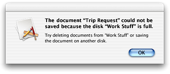
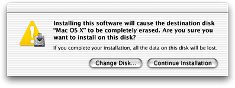

> 导航：[总目录](../../../README.md) · [documentation](../../../_indexes/documentation.md) · [Sheet Programming Topics](Introduction%20to%20Sheets.md)

[Next](Using%20Alert%20Sheets.md)[Previous](About%20Sheets.md)

# Types of Alerts

There are two types of alerts, standard and caution. Most alerts should be standard alerts, which display the application icon of the current application, as shown in Figure 1.

__Figure 1__  A standard alert with an application icon

Use a caution alert only to warn the user when a possible side effect of the current task is the inadvertent destruction of data. A caution alert displays a caution icon badged with application icon, as shown in Figure 2.

__Figure 2__  A caution alert with the caution icon

How you specify the alert type varies according to programmatic interface:

- _NSAlert_. Send `setAlertStyle:` to an NSAlert object with an argument of `NSWarningAlertStyle` or `NSInformationalAlertStyle` to specify a standard alert. Send the same message with an argument of `NSCriticalAlertStyle` to specify a caution alert.
- _Functional API_. Use the `NSBeginAlertSheet` function to display a standard alert and `NSBeginCriticalAlertSheet` to display a caution alert.

Caution alerts should be used only as specified in the Alerts section of _Apple Human Interface Guidelines_.

[Next](Using%20Alert%20Sheets.md)[Previous](About%20Sheets.md)

