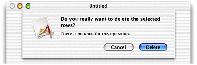

> 导航：[总目录](../../../README.md) · [documentation](../../../_indexes/documentation.md) · [Sheet Programming Topics](Introduction%20to%20Sheets.md)


[Next](Displaying%20Alert%20Help.md)[Previous](Types%20of%20Alerts.md)

# Using Alert Sheets

Alert sheets are used by almost every application. Cocoa makes it easy to create them. This task demonstrates how to quickly add an alert sheet to your application. See the Dialogs section of _Apple Human Interface Guidelines_ for details on when a sheet should be used.

Cocoa gives you two ways to create and display alert sheets. You can use the Application Kit’s functional API for alert sheets, or you can use the methods of the NSAlert class. The latter approach is recommended for applications built for OS X v10.3 and later; NSAlert not only brings the advantages of the object-oriented model, it introduces new features, such as the ability to display help related to the alert. This document explains both approaches.

Using the NSAlert API to display an alert sheet involves three simple steps: creating and initializing an NSAlert instance, displaying the sheet, and interpreting and acting on the user’s choice.

1. Create the NSAlert object though the standard Objective-C `alloc`-and-`init` procedure. Then send the required NSAlert “setter” messages to initialize the alert. [Listing 1](#apple-f4xwc4dqnrsv64tfmyxwi33df52wszbpgiydambrga2dkljwgi2dsojnijbusrsbifcuu) gives an example of this.

   __Listing 1__  Creating and initializing the NSAlert object

```
NSAlert *alert = [[[NSAlert alloc] init] autorelease];
[alert addButtonWithTitle:@"OK"];
[alert addButtonWithTitle:@"Cancel"];
[alert setMessageText:@"Delete the record?"];
[alert setInformativeText:@"Deleted records cannot be restored."];
[alert setAlertStyle:NSWarningAlertStyle];
```
2. Invoke the `beginSheetModalForWindow:modalDelegate:didEndSelector:contextInfo:` method on the NSAlert object (Listing 2). This displays the sheet attached to the specified window.

   __Listing 2__  Displaying the alert sheet

```
[alert beginSheetModalForWindow:[searchField window] modalDelegate:self didEndSelector:@selector(alertDidEnd:returnCode:contextInfo:) contextInfo:nil];
```

   The modal-delegate parameter must be an object that implements a method with the following signature:

```objc
- (void)alertDidEnd:(NSAlert *)alert returnCode:(NSInteger)returnCode
    contextInfo:(void *)contextInfo;
```

   The NSAlert object invokes this method when the user clicks a button on the alert sheet to indicate his or her choice (which consequently dismisses the sheet). The modal delegate is not the recipient of any other delegation messages; it is the delegate _only_ for the current modal session. The context-info parameter is for any data you wish to pass to the modal delegate. Instead of autoreleasing the NSAlert object when you create it, you may release the object in this method, if you wish.
3. Implement the modal-delegate method to identify the user’s choice and proceed accordingly (Listing 3).

   __Listing 3__  Interpreting the result in the modal delegate method

```objc
- (void)alertDidEnd:(NSAlert *)alert returnCode:(NSInteger)returnCode contextInfo:(void *)contextInfo {
    if (returnCode == NSAlertFirstButtonReturn) {
    [self deleteRecord:currentRec];
    }
}
```

   The return code is an `enum` constant identifying the button on the dialog that the user clicked. The first button added to the dialog (which, in left-to-right scripts, is the one closest to the right edge) is identified by `NSAlertFirstButtonReturn`. The second button that is added appears just to the left of the first and is identified by `NSAlertSecondButtonReturn` —and so forth for the third button.

As a convenience for compatibility with the older functional API (see [Using the Functional API](#apple-f4xwc4dqnrsv64tfmyxwi33df52wszbpgiydambrga2dkljwge3toni)), you can create NSAlert objects with the class factory method `alertWithMessageText:defaultButton:alternateButton:otherButton:informativeTextWithFormat:`. This method allows you to retain the earlier constants used to identify the button clicked. Here is an example of how you might invoke this method (with the previous example in mind):

```
NSAlert *alert = [NSAlert alertWithMessageText:@"Delete the record?"
    defaultButton:@"OK" alternateButton:@"Cancel" otherButton:nil
    informativeTextWithFormat:@"Deleted records cannot be restored."];
```


The application assumed for this example is a table of expense report entries similar to a spreadsheet. The `deleteSelectedRows:` method is sent when the user tries to delete selected rows in the expense report. `deleteSelectedRows:` asks the user’s permission to delete the rows by displaying an alert sheet using the `NSBeginAlertSheet` function.

`NSBeginAlertSheet` has a fairly long list of parameters, but the function is not difficult to use. Here is a summary of the parameters:

___title___: The main text of the alert, which appears in the emphasized system font.

___defaultButton___: The label for the sheet’s default button; the button label should correspond to the action that will result from pressing the button–for example, “Save,” “Erase,” or “Delete”.

___alternateButton___: The label for the sheet’s alternate button. If you pass `nil`, only the _defaultButton_ is displayed.

___otherButton___: The label for the sheet’s other button. If you pass `nil`, only the _defaultButton_ and _alternateButton_ are displayed.

___documentWindow___: A reference to the NSWindow the sheet is attached to.

___modalDelegate___: A reference to the object acting as the sheet’s delegate.

___didEndSelector___: A selector for a method implemented by _modalDelegate_. This method is sent when the modal session is ended, but before the sheet is dismissed. If you don’t need this capability, pass `NULL`.

___didDismissSelector___: A selector for a method implemented by _modalDelegate_. This method is sent after the sheet is dismissed in the event your application might need to perform additional processing. If you don’t need this capability, pass `NULL`.

___contextInfo___: Additional information you can define to pass to _modalDelegate_ as a parameter of _didEndSelector_ and _didDismissSelector_.

___message___: Optional additional text that appears in the sheet. The text appears in the small system font. This string can contain `printf`-style escape sequences.

___optionalParameters___: The `printf`-style parameters used to format _message_.

So, the implementation of `deleteSelectedRows:` would simply look as shown in Listing 4.

__Listing 4__  The deleteSelectedRows: method implemented to present a sheet with two buttons

```objc
- (BOOL)deleteSelectedRows: (NSWindow *)sender
{
    NSBeginAlertSheet(
        @"Do you really want to delete the selected rows?",
                                // sheet message
        @"Delete",              // default button label
        nil,                    // no third button
        @"Cancel",              // other button label
        sender,                 // window sheet is attached to
        self,                   // we’ll be our own delegate
        @selector(sheetDidEndShouldDelete:returnCode:contextInfo:),
                                // did-end selector
        NULL,                   // no need for did-dismiss selector
        sender,                 // context info
        @"There is no undo for this operation.");
                                // additional text

// We don’t know if the rows should be deleted until the user responds,
// so don’t.

    return NO;
}
```

When the user attempts to delete the selected expenses, the sheet shown in Figure 1 drops down from the window title bar.

__Figure 1__  Alert to confirm deletes



The implementation of the did-end selector `sheetDidEndShouldDelete:returnCode:contextInfo:`, sent when the user clicks a button is as follows:

```objc
- (void)sheetDidEndShouldDelete: (NSWindow *)sheet
        returnCode: (NSInteger)returnCode
        contextInfo: (void *)contextInfo
{
    if (returnCode == NSAlertDefaultReturn)
    // delete selected rows here
}
```

If the user clicks the Cancel button, the value of _returnCode_ is `NSAlertOtherReturn`. If a third button were provided, its return value would be `NSAlertAlternateReturn`.

[Next](Displaying%20Alert%20Help.md)[Previous](Types%20of%20Alerts.md)

