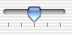
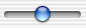

> 导航：[总目录](../../../README.md) · [documentation](../../../_indexes/documentation.md) · [Slider Programming Topics](Introduction%20to%20Sliders.md)

[Next](Setting%20the%20Shape%20Of%20a%20Slider.md)[Previous](About%20Sliders.md)

# Using Slider Tick Marks

To set the number of tick marks, use `setNumberOfTickMarks:`. The tick marks are evenly spaced between the minimum and maximum values. For example, if the minimum value is 0, the maximum value is 100, and the tick mark count is five, the tick marks are at 0, 25, 50, 75, and 100. The following figure shows a horizontal bar slider with five tick marks.

__Figure 1__  Horizontal bar slider with tick marks

The following figure shows a slider with no tick marks.

__Figure 2__  Horizontal bar slider with no tick marks

To set where the tick marks appear, use `setTickMarkPosition:`. For horizontal sliders, the possible arguments are shown below.

__Table 1__  Arguments to add tick marks to horizontal sliders

|  | Tick marks below | Tick marks above |
| _Argument_ | `NSTickMarkBelow` | `NSTickMarkAbove` |
| _Illustration_ | art/sliderticksbottom.gif | art/slidertickstop.gif |

For vertical sliders, the arguments are shown below.

__Table 2__  Arguments to add tick marks to vertical sliders

|  | Tick marks below | Tick marks above |
| _Argument_ | `NSTickMarkLeft` | `NSTickMarkRight` |
| _Illustration_ | art/sliderticksleft.gif | art/sliderticksright.gif |

The default values are `NSTickMarkBelow` and `NSTickMarkLeft`. These arguments are used only with bar sliders; for circular sliders, the tickmarks are always outside the circle.

To restrict a slider’s value to only the values at tick marks, use `setAllowsTickMarkValuesOnly:`. After a user moves the slider’s knob, the knob jumps to the tick mark nearest the cursor. For example, if a slider is restricted to tick mark values only and has a minimum value of 0, a maximum value of 100, and a marker count of five, the allowable values are 0, 25, 50, 75, and 100. By default, a slider can have any value between its minimum and maximum.

To get the value of the tick mark that’s closest to another value, use `closestTickMarkValueToValue:`. To get the value that corresponds to a specific tick mark, use `tickMarkValueAtIndex:`. To find the tick mark closest to a specific point, use `indexOfTickMarkAtPoint:`. Note that the lowest tick mark has an index of 0.

[Next](Setting%20the%20Shape%20Of%20a%20Slider.md)[Previous](About%20Sliders.md)

