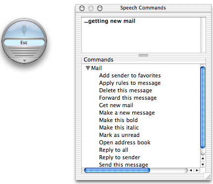

> 导航：[总目录](../../../README.md) · [documentation](../../../_indexes/documentation.md) · [Speech Programming Topics](Introduction%20to%20Speech.md)


[Next](Document%20Revision%20History.md)[Previous](Synthesizing%20Speech.md)

# Recognizing Speech

With an audio input device (such as a microphone) and an NSSpeechRecognizer object an application can listen for spoken commands and act upon those commands. Speech recognition is an essential aid for users with physical disabilities that limit their use of the keyboard and mouse. It can also be a convenience for all users by enabling them to control an application without forcing them to divert attention from what they’re currently working on.

The centralized system service Speech Recognition is activated on a system whenever an application (including those listed in the Speech Recognition pane of System Preferences) begins listening through any Speech Recognition API, including those of NSSpeechRecognizer. When speech recognition is activated, an on-screen microphone and (optionally) the Speech Commands window appear. The Speech Commands window lists the current commands that can be given as well as acknowledgements from applications that have responded to recent commands. [Figure 1](#apple-f4xwc4dqnrsv64tfmyxwi33df52wszbpgiydambsga4dcljrgaydkmztgiwueq2jjjfeersf) shows what the microphone and Speech Commands window look like (in the context of the Mail application).

__Figure 1__  Screen microphone and Speech Commands window



Integrating speech recognition into a Cocoa application is simple. The important steps involve specifying the commands to listen for and then listening and responding to those commands. The remainder of this article goes into each of these steps in detail.

To prepare an NSSpeechRecognizer for use, you must:

1. Allocate and initialize an instance of NSSpeechRecognizer.
2. Set the commands that the object should listen for using the `setCommands:` method.
3. Set a delegate for the NSSpeechRecognizer object.

Listing 1 shows how you might initialize an NSSpeechRecognizer object.

__Listing 1__  Preparing an NSSpeechRecognizer object

```objc
- (id)init {
    self = [super init];
    if (self) {
        NSArray *cmds = [NSArray arrayWithObjects:@"Sing", @"Jump", @"Roll over", nil];
        recog = [[NSSpeechRecognizer alloc] init]; // recog is an ivar
        [recog setCommands:cmds];
        [recog setDelegate:self];
    }
    return self;
}
```

Commands are words or short phrases, encapsulated as NSString objects, that are specific to the application. The recommended phrase length is three to six words. If your application has many commands, you can use the `setDisplayedCommandsTitle:` method to group them in the Speech Commands window under subheadings.

Before your application can process spoken commands, you must activate the speech-recognition engine by sending a `startListening` message to the NSspeechRecognizer object. The engine then attempts to discern commands in the stream of words and phrases the user speaks into the microphone. If it identifies a command, the NSSpeechRecognizer object invokes the `speechRecognizer:didRecognizeCommand:` delegation method, passing in the command in the second parameter. To suspend the speech-recognition engine, send the NSSpeechRecognizer object a `stopListening` message.

You can instantaneously update the list of commands for which the NSSpeechRecognizer object listens by sending it a `setCommands:` message. Command updating occurs even when the object is actively listening.

The delegate should implement the `speechRecognizer:didRecognizeCommand:` delegation method to respond to each spoken command. Listing 2 shows an example implementation of this method. It also shows an action method that toggles between starting and stopping the recognition engine.

__Listing 2__  Starting the recognition engine and responding to commands

```objc
- (IBAction)listen:(id)sender
{
    if ([sender state] == NSOnState) { // listen
    [recog startListening];
    } else {
    [recog stopListening];
    }
}

- (void)speechRecognizer:(NSSpeechRecognizer *)sender didRecognizeCommand:(id)aCmd {

    if ([(NSString *)aCmd isEqualToString:@"Sing"]) {
        NSSound *snd = [[NSSound alloc] initWithContentsOfFile:[[NSBundle mainBundle] pathForResource:@"HappyBirthday" ofType:@"aif"] byReference:NO];
        [snd play];
        [snd release];
        return;
    }

    if ([(NSString *)aCmd isEqualToString:@"Jump"]) {
        NSRect frm = [[phraseField window] frame];
        [[phraseField window] setFrameOrigin:NSMakePoint(frm.origin.x+20, frm.origin.y+20)];
        return;
    }

    if ([(NSString *)aCmd isEqualToString:@"Roll over"]) {
        // .... some response here...
    }
}
```

[Next](Document%20Revision%20History.md)[Previous](Synthesizing%20Speech.md)

