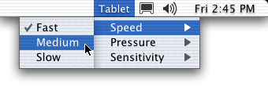

> 导航：[总目录](../../../README.md) · [documentation](../../../_indexes/documentation.md) · [Status Bar Programming Topics](Introduction%20to%20Status%20Bars.md)

[Next](Creating%20Status%20Items.md)[Previous](Introduction%20to%20Status%20Bars.md)

# About Status Bars

Status bars display a collection of status items that provide interaction with or feedback to the user. A status item can be displayed with text or an icon, can provide a menu or send a target-action message when clicked, or can be a fully customized view that you create.

Only one status bar, the system status bar, is currently available. It resides in the system-wide menu bar as shown in [Figure 1](#apple-f4xwc4dqnrsv64tfmyxwi33df52wszbpgiydambqhe4tkljrga2dimjsfvbuuqshijeeksa). Status items appear on the right side of the menu bar, just to the left of the menu bar clock and Menu Extras, such as the Displays and Sound menus. The items remain in the menu bar even when your application is not in the foreground.

__Figure 1__  System status bar

Each new item is added to the left of pre-existing items. When an item is removed, items to the left of it shift to the right to reclaim its space. If the status bar extends into the current application’s menu bar, the leftmost status items are hidden to make room for the menus.

[Next](Creating%20Status%20Items.md)[Previous](Introduction%20to%20Status%20Bars.md)

