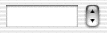

> 导航：[总目录](../../../README.md) · [documentation](../../../_indexes/documentation.md)

[Next](Setting%20a%20Stepper%E2%80%99s%20Behavior.md)

# Introduction to Steppers

A stepper consists of two small arrows that can increment and decrement a value that appears beside it, such as a date or time. These are common controls for date and time entries. The illustration below shows an NSStepper to the right of a text field, which would show the stepper’s value.

[Setting a Stepper’s Behavior](Setting%20a%20Stepper%E2%80%99s%20Behavior.md#apple-f4xwc4dqnrsv64tfmyxwi33df52wszbpgiydambqg4ztelkciffekqkjivcq) discusses how to change a stepper’s behavior.

[Next](Setting%20a%20Stepper%E2%80%99s%20Behavior.md)

