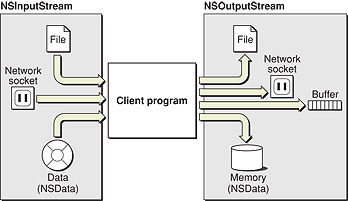

> 导航：[总目录](../../../README.md) · [文档](../../../_indexes/documentation.md) · [流编程指南](Introduction%20to%20Stream%20Programming%20Guide%20for%20Cocoa.md)

[下一页](Reading%20From%20Input%20Streams.md)[上一页](Introduction%20to%20Stream%20Programming%20Guide%20for%20Cocoa.md)

# Cocoa 流

流（stream）为程序提供了一种简便的方式，让它能以与设备无关的方式和各种介质交换数据。流是在通信路径上串行传输的连续比特序列。它是单向的，因此从程序的角度看，一个流要么是输入流（读取流），要么是输出流（写入流）。除基于文件的流之外，流是不可定位的——流数据一旦被提供或被消费，就无法再从流中取回。

Cocoa 包含三个与流相关的类：`NSStream`、`NSInputStream` 和 `NSOutputStream`。`NSStream` 是一个抽象类，它为所有流对象定义了基础接口和属性。`NSInputStream` 和 `NSOutputStream` 是 `NSStream` 的子类，实现了默认的输入流和输出流行为。对于位于内存中、或者要写入文件或 C 缓冲区（buffer）的流数据，你可以创建 `NSOutputStream` 实例；对于从 `NSData` 对象或文件读取的流数据，你可以创建 `NSInputStream` 实例。你也可以在基于套接字（socket）的网络连接两端使用 `NSInputStream` 和 `NSOutputStream` 对象，而且使用流对象时无需一次性把全部流数据载入内存。图 1 按数据来源或去向展示了各种输入流对象和输出流对象。

__图 1__  流对象的来源与去向

由于处理的是流这样一种非常基础的计算抽象，`NSStream` 及其子类适用于较底层的编程任务。如果有更适合某项具体任务的高层 Cocoa API（例如 `NSURL` 或 `NSFileHandle`），请优先使用它们。

流对象带有一些与之关联的属性。大多数属性与网络安全和网络配置有关，即安全套接字（SSL）级别和 SOCKS 代理信息。另外还有两个重要属性：`NSStreamDataWrittenToMemoryStreamKey` 允许你取回输出流写入内存的数据，`NSStreamFileCurrentOffsetKey` 则让你可以操纵基于文件的流当前的读写位置。

流对象还关联着一个[委托](https://developer.apple.com/library/archive/documentation/General/Conceptual/DevPedia-CocoaCore/Delegation.html#//apple_ref/doc/uid/TP40008195-CH14)（delegate）。如果没有显式设置委托，流对象自身就成为委托（这对自定义子类来说是个很有用的约定）。流对象每处理一个与流相关的事件（event），就会调用唯一的委托方法 `stream:handleEvent:`。其中特别重要的事件是：输入流中有字节可读时的事件，以及输出流表示它已准备好接收字节时的事件。对这两个事件，委托会根据流的类型向流发送相应的消息——`read:maxLength:` 或 `write:maxlength:`——从流中取出字节，或者把字节放到流上。

`NSStream` 构建在 Core Foundation 的 `CFStream` 层之上。这种紧密关系意味着 `NSStream` 的具体子类 `NSOutputStream` 和 `NSInputStream` 与它们在 Core Foundation 中的对应类型 `CFWriteStream` 和 `CFReadStream` 是免费桥接（toll-free bridged）的。尽管 Cocoa 和 Core Foundation 的流 API 高度相似，它们的实现并不完全一致。Cocoa 流类使用委托模型来实现异步行为（前提是采用运行循环调度），而 Core Foundation 使用客户端回调。Core Foundation 流类型设置客户端（在 Core Foundation 中称为 context）的方式与 NSStream 设置委托的方式不同；设置委托的调用不应与设置 context 的调用混用。除此之外，你可以在代码中自由混用这两套 API 的调用。

虽然二者高度相似，但 `NSStream` 相比 `CFStream` 有一个重大优势：由于以 Objective-C 为基础，它是可扩展的。你可以派生 `NSStream`、`NSInputStream` 或 `NSOutputStream` 的子类，以定制流的特性和行为。例如，你可以创建一个输入流，统计它所读取字节的相关信息；也可以编写一个 `NSStream` 子类，让其实例能够在流中定位，把已读取的字节放回去。`NSStream` 有它自己一组必须重写的方法，`NSInputStream` 和 `NSOutputStream` 同样如此。关于派生这些类的子类的细节，请参阅 `NSStream`、`NSInputStream` 和 `NSOutputStream` 的参考文档。

[下一页](Reading%20From%20Input%20Streams.md)[上一页](Introduction%20to%20Stream%20Programming%20Guide%20for%20Cocoa.md)

