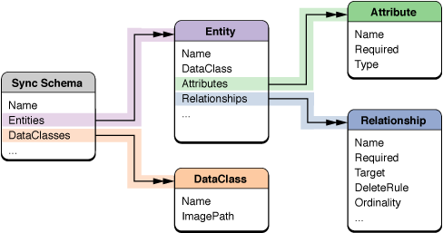

> 导航：[总目录](../../../README.md) · [documentation](../../../_indexes/documentation.md) · [Sync Services Programming Guide](Introduction%20to%20Sync%20Services%20Programming%20Guide.md)


[Next](Registering%20Schemas.md)[Previous](Managing%20Your%20Sync%20Session.md)

# Creating a Sync Schema

A sync schema consists of a property list, image files, and localization files contained in a bundle that you specify when registering a schema. If you are using Core Data, then it might contain one or more managed object models, too. You can create a schema to extend an existing schema or to define your own schema. The schema property list contains a description of the entities and properties used by the client as well as other attributes used by the sync engine.

See [Cocoa Design Patterns](https://developer.apple.com/library/archive/documentation/Cocoa/Conceptual/CocoaFundamentals/CocoaDesignPatterns/CocoaDesignPatterns.html#//apple_ref/doc/uid/TP40002974-CH6) in _[Cocoa Fundamentals Guide](../Cocoa%20Fundamentals%20Guide/Introduction.md#apple-f4xwc4dqnrsv64tfmyxwi33df52wszbpkridimbqgazdsnzu)_ for a description of entity-relationship models and terminology. See [Registering Schemas](Registering%20Schemas.md#apple-f4xwc4dqnrsv64tfmyxwi33df52wszbpkridimbqgaytcnjufvbuuqsfjbaucry) for how to register your own schemas.

A sync schema is a property list stored in a `.syncschema` bundle along with other related files such as localization and image files. A property list is made up of primitive types such as arrays, dictionaries, and string values, not arbitrary types. Nevertheless, it’s helpful to view a property list as a pseudo object model.[Figure 1](#apple-f4xwc4dqnrsv64tfmyxwi33df52wszbpkridimbqgaytcnjtfuytimbvgi2c2qscinfegqkhim) illustrates the components in a sync schema: the schema itself, entities, data classes, attributes, and relationships. The double arrowheads in the diagram imply a to-many relationship (implemented as an array in the property list) between components.

__Figure 1__  Sync schema components



You can create a schema bundle using Xcode. Just select New Project from the File menu and select the Sync Schema template from the Assistant. Then edit the `Schema.plist` file to define your entities and properties as described in [Creating a Sync Schema Property List](#apple-f4xwc4dqnrsv64tfmyxwi33df52wszbpkridimbqgaytcnjtfuytgojsgi2q). You can also localize the names of entities and properties using the `Schema.strings` file as described in [Localizing Property Names](#apple-f4xwc4dqnrsv64tfmyxwi33df52wszbpkridimbqgaytcnjtfuytonbwga4q).

After you create a schema bundle, you edit the `Schema.plist` file to define your entities and properties. Unless otherwise stated, the following high-level sync schema properties are optional:

| Property | Description |
| --- | --- |
| `BaseName` | A string that is the name of the schema that this schema is extending, if applicable.  Available in Mac OS X v10.6 and later. |
| `BaseMajorVersion` | An integer that is the major version number of the schema that this schema is extending, if applicable. For example, if the version number is `10.4`, the major version is `10` and the minor version is `4`.  Available in Mac OS X v10.6 and later. |
| `BaseMinorVersion` | An integer that is the minor version number of the schema that this schema is extending, if applicable. For example, if the version number is `10.4`, the major version is `10` and the minor version is `4`.  Available in Mac OS X v10.6 and later. |
| `Comment` | A string used to document the schema.  Available in Mac OS X v10.4 and later. |
| `DataClasses` | An array containing one or more dictionaries that describe a data class. The properties of a data class are described in [Data Class Properties](#apple-f4xwc4dqnrsv64tfmyxwi33df52wszbpkridimbqgaytcnjtfuytgojyg44q). If this is not a schema extension, this key is required.  Available in Mac OS X v10.4 and later. |
| `Entities` | An array of dictionaries describing new record types and record type extensions. The entity properties are described in [Entity Properties](#apple-f4xwc4dqnrsv64tfmyxwi33df52wszbpkridimbqgaytcnjtfuytgojzgq4a).  Available in Mac OS X v10.4 and later. |
| `MajorVersion` | An integer that is the major version of this schema, if applicable. For example, if the version number is `10.4`, the major version is `10` and the minor version is `4`.  Available in Mac OS X v10.6 and later. |
| `ManagedObjectModels` | An array of strings containing the paths to the Core Data managed object model files (files with a `.mom` suffix) associated with this schema.  Relative paths are relative to the location of the schema bundle. Use a relative path to load a model that lives outside the schema bundle—for example, use `../../../MyModel.mom` to load a model located in the application's `Resources` directory.  Use this property if you want to sync Core Data managed objects. By default, all entities and properties defined in a managed object model are registered with the sync manager. Read [Syncing Core Data Applications](Syncing%20Core%20Data%20Applications.md#apple-f4xwc4dqnrsv64tfmyxwi33df52wszbpkridimbqga2temzsfvjvomi) for how to designate a subset of entities and properties to sync and set other required sync information in a managed object model.  Available in Mac OS X v10.5 and later. |
| `MinorVersion` | An integer that is the minor version of this schema, if applicable. For example, if the version number is `10.4`, the major version is `10` and the minor version is `4`.  Available in Mac OS X v10.6 and later. |
| `Name` | A string providing a unique name for this schema. Typically, a reverse DNS-style name such as `com.mycompany.SyncExamples`. You should never change the schema name. Doing so orphans the old schema definition, which you then must remove. This key is required.  Available in Mac OS X v10.4 and later. |
| `StrictParsing` | Set to `true` if you want to use strict validation, `false` otherwise. If not specified, uses the validation corresponding to the binary registering the schema. If the binary was built on Mac OS X v10.5 and later, uses strict validation.  Available in Mac OS X v10.5 and later. |
| `UIHelperClass` | Set to the class that implements the `ISyncUIHelper` informal protocol. Use this key if you want to customize the presentation of your records and schema in the user interface.  When the sync schema bundle is loaded, an instance of this class is created to handle presentation requests from the data change alert and conflict resolver user interfaces. Therefore, if this key is set, the class must be included in this schema bundle.  Available in Mac OS X v10.5 and later. |

For example, the following property list fragment specifies the name of the sync schema as `com.mycompany.SyncExamples`. Typically, you use reverse DNS-style names for schemas, entities, and client identifiers.

```xml
<plist version="1.0">
<dict>
    <key>Name</key>
    <string>com.mycompany.SyncExamples</string>
    <key>DataClasses</key>
    <array>
     ...
    </array>
    <key>Entities</key>
    <array>
     ...
    </array>
</dict>
</plist>
```


A data class is a logical grouping of related entities. Typically, it is a grouping that makes sense to a user—for example, a group of entities that a user might want to sync over MobileMe such as contacts. You can add an entity to a data class by setting the entity’s `DataClass` attribute. Any data class you create should be added to the schema’s `DataClasses` property.

The properties of a data class are as follows:

| Property | Description |
| --- | --- |
| `ImagePath` | Path to an image representing this data class. If it is a relative path, then it is assumed to be relative to the schema bundle. Typically, the image is an icon file that can be displayed at different resolutions. Otherwise, it should be at least 32 x 32 pixels. This key is required.  Available in Mac OS X v10.4 and later. |
| `Name` | A unique name for the data class. Typically, a reverse DNS-style name such as `com.apple.Contacts`. Can be localized using the `Schema.strings` file located in the schema bundle. This key is required.  Available in Mac OS X v10.4 and later. |

For example, the following property list fragment specifies the data classes for an example application:

```
    <key>DataClasses</key>
    <array>
        <dict>
            <key>Name</key>
            <string>com.mycompany.SyncExamples</string>
            <key>ImagePath</key>
            <string>SyncExamples.icns</string>
        </dict>
    </array>
```


The properties of an entity within a sync schema are described below and are optional unless explicitly stated otherwise:

| Property | Description |
| --- | --- |
| `Attributes` | An array containing dictionaries describing the attributes in the entity or extension. Attribute properties are described in [Attribute Properties](#apple-f4xwc4dqnrsv64tfmyxwi33df52wszbpkridimbqgaytcnjtfuytimbqhe2a).  Available in Mac OS X v10.4 and later. |
| `CompoundIdentityProperties` | An array of arrays of property names used to match a new record from a sync client with an existing record in the truth database. This key is similar to the `IdentityProperties` key except that it supports more flexible matches. If both this key and the `IdentityProperties` key are set, then this property key is used to match records instead.  When this key is used to match records, the properties in each array are used as the identity properties in the order that the array appears. If none of the properties in an array are pushed by a client, then the properties in the next array are used as the identity properties. A property should not be in more than one array of a `CompoundIdentityProperties` array.  For example, the contacts schema sets the `CompoundIdentityProperties` key to two arrays. The first array contains the `first name`, `middle name`, and `last name` property keys. The second array contains the `company name` property key. This allows a contact pushed without a company name to match a record that was previously pushed with the same first and last name but with a company name set. It also allows for company-only matches.  Available in Mac OS X v10.6 and later. |
| `DataClass` | The name of the data class this entity belongs to. This key is required.  Available in Mac OS X v10.4 and later. |
| `ExcludeFromDataChangeAlert` | Set to `true` if you want to exclude changes to records of this entity type from the total count of changed records used in alert messages, `false` otherwise. The default value is `false`.  Available in Mac OS X v10.4 and later. |
| `ExtensionName` | A unique name for this extension, if you are adding attributes to an existing entity. The extension name is used to scope the attribute and relationship names to prevent collisions. Typically, a reverse DNS-style name such as `com.apple.iCal.CalendarExtensions`. If this is a schema extension, this key is required.  Available in Mac OS X v10.4 and later. |
| `IdentityProperties` | An array containing the names of the entity properties that are used to match a new record from a sync client with an existing record in the truth database. If the target of a to-one relationship is used, the name of the relationship is specified as the property.  A client record matches a truth record if all the identity property values in the client record are equal to the values in the truth record. Properties with `null` values (values that are not set) also need to match.  Available in Mac OS X v10.4 and later. |
| `Name` | A unique name for the entity. Typically, a reverse DNS-style name such as `com.apple.Contacts`. Can be localized using the `Schema.strings` file located in the schema bundle. This key is required.  Available in Mac OS X v10.4 and later. |
| `Parent` | The name of the relationship that contains or encloses records belonging to this entity. Used to display a user friendly entity name when conflicts occur during syncing. For example, in the contacts schema, the target of the `contact` relationship is the parent of a Phone Number record.  Available in Mac OS X v10.4 and later. |
| `PropertyDependencies` | An array containing arrays of groups of properties that are dependent on each other. A dependent property is one which must be pushed to a client if any of its dependencies are changed. Each entry in this array is itself an array of strings, specifying the names of the codependent properties. Entries in these arrays may be an attribute name or a relationship name.  Available in Mac OS X v10.4 and later. |
| `Relationships` | An array containing dictionaries describing the relationships in the entity or extension. Relationship properties are described in [Relationship Properties](#apple-f4xwc4dqnrsv64tfmyxwi33df52wszbpkridimbqgaytcnjtfuytimbrha3a).  Available in Mac OS X v10.4 and later. |

For example, the following property list fragment describes the properties of the `com.mycompany.syncexamples.Media` entity. Sample values for the `Attributes` and `Relationships` properties appear in [Attribute Properties](#apple-f4xwc4dqnrsv64tfmyxwi33df52wszbpkridimbqgaytcnjtfuytimbqhe2a) and [Relationship Properties](#apple-f4xwc4dqnrsv64tfmyxwi33df52wszbpkridimbqgaytcnjtfuytimbrha3a).

```
<dict>
    <key>Name</key>
    <string>com.mycompany.syncexamples.Media</string>
    <key>DataClass</key>
    <string>com.mycompany.SyncExamples</string>
    <key>Attributes</key>
    ...
    <key>Relationships</key>
    ...
    <key>IdentityProperties</key>
    ...
</dict>
```


The properties of an attribute belonging to an entity are as follows:

| Property | Description |
| --- | --- |
| `AutomaticConflictResolutionPolicy` | A dictionary containing tips on how to automatically resolve conflicts to values of this attribute without generating change alert messages. See [Table 1](#apple-f4xwc4dqnrsv64tfmyxwi33df52wszbpkridimbqgaytcnjtfvjvomq) for a description of the optional keys you can use in this dictionary.  Available in Mac OS X v10.6 and later. |
| `ExcludeFromDataChangeAlert` | Set to `true` if you want to exclude changes to this attribute from the total count of changed attributes used in alert messages, `false` otherwise.  Available in Mac OS X v10.4 and later. |
| `Name` | The name of the attribute. Can be localized using the `Schema.strings` file located in the schema bundle. The localization key is `$entity/$attribute_name`. For example, the localization key for the `title` attribute of the `com.mycompany.syncexamples.Media` entity would be `com.mycompany.syncexamples.Media/title`. This key is required.  Available in Mac OS X v10.4 and later. |
| `Required` | Set to `true` if required, `false` otherwise. The sync engine will reject a record that doesn’t have a required attribute set. The default value is `false`.  Available in Mac OS X v10.4 and later. |
| `Type` | The type of the attribute. See [Table 2](#apple-f4xwc4dqnrsv64tfmyxwi33df52wszbpkridimbqgaytcnjtfvjvomy) for possible values. This key is required.  Available in Mac OS X v10.4 and later. |

Use the keys in [Table 1](#apple-f4xwc4dqnrsv64tfmyxwi33df52wszbpkridimbqgaytcnjtfvjvomq) in the `AutomaticConflictResolutionPolicy` dictionary to automatically resolve conflicts to attribute values.

__Table 1__  `AutomaticConflictResolutionPolicy` Keys

| Key | Description |
| `PreferredClientTypes` | An array of client type strings specifying the preferred order of clients for resolving conflicts. The client types are described in [Table 1](Registering%20Clients.md#apple-f4xwc4dqnrsv64tfmyxwi33df52wszbpkridimbqgaytcnjvfvjvomi). For example, if `app` is the first item in the `PreferredClientTypes` array and the client is an application, then its record is selected instead of a record from a client of type `device` or `server`.  Available in Mac OS X v10.6 and later. |
| `PreferredRecord` | A string specifying which record should be selected when there is a conflict. This string must be one of the following predefined values: `Truth`, `Client`, or `LastModified`.  If the value for this key is `Truth`, the record in the truth database is selected. If the value for this key is `Client`, the client’s record is selected. If the value for this key is `LastModified`, the record with the most recent changes is selected. Typically, you set this key to `LastModified`, in which case, you do not need to set the `PreferredClientTypes` key.  Available in Mac OS X v10.6 and later. |

Sync Services supports the types of attributes shown in [Table 2](#apple-f4xwc4dqnrsv64tfmyxwi33df52wszbpkridimbqgaytcnjtfvjvomy). Note that the types are case-sensitive and expected to appear in lowercase. The corresponding instance must be a member of the Objective-C class.

__Table 2__  Attribute types

| Attribute type | Objective-C class | Description |
| `array` | NSArray | Available in Mac OS X v10.4 and later. |
| `boolean` | NSNumber | Available in Mac OS X v10.4 and later. |
| `calendar date` | NSCalendarDate | Available in Mac OS X v10.4 and later. |
| `color` | NSColor | Available in Mac OS X v10.4 and later. |
| `data` | NSData | Available in Mac OS X v10.4 and later. |
| `date` | NSDate | Available in Mac OS X v10.4 and later. |
| `dictionary` | NSDictionary | Available in Mac OS X v10.4 and later. |
| `enum` | NSString | Available in Mac OS X v10.4 and later. |
| `number` | NSNumber | Available in Mac OS X v10.4 and later. |
| `set` | NSSet | Available in Mac OS X v10.6 and later. |
| `string` | NSString | Available in Mac OS X v10.4 and later. |
| `url` | NSURL | Available in Mac OS X v10.4 and later. |

For example, the following property list fragment describes the attributes of the `com.mycompany.syncexamples.Media` entity. Each dictionary below contains the name and type of each attribute. For example, the `date` attribute is specified as a `calendar date` type. Therefore, when pushing or pulling a `com.mycompany.syncexamples.Media` record, the value for the `date` key will be an instance of NSCalendarDate.

```
<key>Attributes</key>
<array>
    <dict>
        <key>Name</key>
        <string>date</string>
        <key>Type</key>
        <string>calendar date</string>
    </dict>
    <dict>
        <key>Name</key>
        <string>imageURL</string>
        <key>Type</key>
        <string>url</string>
    </dict>
    <dict>
        <key>Name</key>
        <string>title</string>
        <key>Type</key>
        <string>string</string>
    </dict>
</array>
```

If you use an `array` type, you can further limit the contents of the array to instances of a class and its subclasses using the `Subtype` key. For example, the following property list fragment describes a `dates` attribute as an array containing NSCalendarDate objects. The `Subtype` key is optional but if used, is enforced by the sync engine.

```
<key>Attributes</key>
<array>
    <dict>
        <key>Name</key>
        <string>dates</string>
        <key>Type</key>
        <string>array</string>
        <key>Subtype</key>
        <string>calendar date</string>
    </dict>
</array>
```

If you use an `enum` type, you must also specify the possible `enum` values using the `EnumValues` key. In this example, the `display order` attribute is an `enum` that can be either `firstNameFirst` or `lastNameFirst`:

```
<dict>
    <key>EnumValues</key>
    <array>
    <string>firstNameFirst</string>
    <string>lastNameFirst</string>
    </array>
    <key>Name</key>
    <string>display order</string>
    <key>Type</key>
    <string>enum</string>
</dict>
```


Relationships from one entity to another are allowed only if the entities belong to the same data class. If you attempt to define a relationship to an entity in another data class, validation fails at runtime and an exception is raised. Schema validation may fail as well.

The properties of a relationship belonging to an entity are:

| Property | Description |
| --- | --- |
| `ExcludeFromDataChangeAlert` | Set to `true` if you want to exclude changes to this relationship from the total count of changed relationships used in alert messages, `false` otherwise.  Available in Mac OS X v10.4 and later. |
| `DeleteRule` | A value of `cascade` or `nullify`. If set to `cascade`, then when the source record of the relationship is deleted, all the target records are deleted. If set to `nullify`, then when the target record is deleted, the reference from the source’s relationship is removed. If it is a to-one relationship, the relationship is set to `null`. If it is a to-many relationship, then it is removed from that relationship.  Available in Mac OS X v10.4 and later. |
| `InverseRelationships` | An array of dictionaries specifying this relationship’s inverse relationships. The keys in an inverse relationship dictionary are described in [Inverse Relationship Properties](#apple-f4xwc4dqnrsv64tfmyxwi33df52wszbpkridimbqgaytcnjtfuytiojzg4za).  Available in Mac OS X v10.4 and later. |
| `Name` | The name of the relationship. Can be localized using the `Schema.strings` file located in the schema bundle. The localization key is `$entity/$relationship_name`. For example, the localization key for the `event` relationship of the `com.mycompany.syncexamples.Media` entity would be `com.mycompany.syncexamples.Media/event`. This key is required.  Available in Mac OS X v10.4 and later. |
| `Ordinality` | Indicates a to-one or to-many relationship, value of `one` or `many`. The default value is `one`.  Available in Mac OS X v10.4 and later. |
| `Ordering` | Value of `none`, `weak` or `strong`. If the value is `none`, then no order is maintained. If the value is `strong`, then the order is maintained and alert panels appear when conflicts occur. If the value is `weak`, then the order is maintained but alert panels do not appear when conflicts occur—the sync engine merges ordering conflicts. The default value is `none`.  Available in Mac OS X v10.4 and later. |
| `Required` | Set to `true` if required, `false` otherwise. The sync engine will reject a record that doesn’t have a required relationship set. The default value is `false`.  Available in Mac OS X v10.4 and later. |
| `Target` | An array containing the names of the target entities belonging to the same data class. Generally, a relationship has a single target. However, you can specify multiple entities as the target if the target can be a number of different types. This key is required.  Available in Mac OS X v10.4 and later. |

For example, the following property list fragment describes the relationships of the `com.mycompany.syncexamples.Media` entity. The fragment defines a to-one relationship, called `event`, from `com.mycompany.syncexamples.Media` to `com.mycompany.syncexamples.Event`.

```
<key>Relationships</key>
<array>
    <dict>
        <key>Name</key>
        <string>event</string>
        <key>Ordinality</key>
        <string>one</string>
        <key>Target</key>
        <array>
            <string>com.mycompany.syncexamples.Event</string>
        </array>
    </dict>
</array>
```


The properties of an inverse relationship belonging to a relationship are as follows:

| Property | Description |
| --- | --- |
| `EntityName` | The name of the entity belonging to the same data class. This key is required.  Available in Mac OS X v10.4 and later. |
| `RelationshipName` | The name of the entity that has the inverse relationship. This key is required.  Available in Mac OS X v10.4 and later. |

For example, the following property list fragment describes the inverse relationship between the `event` relationship of the `com.mycompany.syncexamples.Media` entity and the `media` relationship of the `com.mycompany.syncexamples.Event` entity. The `media` relationship is a to-many relationship from `com.mycompany.syncexamples.Event` to `com.mycompany.syncexamples.Media`.

```
<key>InverseRelationships</key>
<array>
    <dict>
        <key>EntityName</key>
        <string>com.mycompany.syncexamples.Event</string>
        <key>RelationshipName</key>
        <string>media</string>
    </dict>
</array>
```


The value of the `IdentityProperties` key is an array containing the names of the properties that are used to identify a record of this entity type if there is a conflict. For example, the identity properties for a `com.mycompany.syncexamples.Media` entity are specified as the `date` and `title` properties below. The `com.mycompany.syncexamples.Media` entity may have other properties, such as `imageURL`, which are not in this array.

```
<key>IdentityProperties</key>
<array>
    <string>date</string>
    <string>title</string>
</array>
```


In some cases, if one property changes, you might want to push another related property, even if its value didn’t change. For example, suppose you change a calendar event to an all day event in iCal and using your phone you change the start time of the same event. Even though each client changed a different property, the changes conflict and need to be resolved. You can inform the sync engine about dependent properties within your entities so that these types of conflicts are recognized when syncing.

The value of the `PropertyDependencies` key is an array of arrays containing the dependent properties. Each array contains the set of properties that are dependent on each other. For example, you might declare that the `startDate`, `endDate` and `allDayEvent` properties are dependent as follows:

```
<key>PropertyDependencies</key>
<array>
    <array>
        <string>startDate</string>
        <string>endDate</string>
        <string>allDayEvent</string>
    </array>
</array>
```


You can define user-friendly names for data classes, entities, and properties by editing the `Schema.strings` schema bundle localization file. Localized names are used by Sync Services applications that present records to users.

For example, an alert message might appear using a data class name in a message—for example, a panel might appear asking the user if it’s okay to syncronize with other applications. If no localization is provided, the DNS-style data class name is used in the alert message which might be confusing to the user. You should modify your `Schema.strings` file to provide both plural and singular forms of data class names.

Specifically, you can define a localized string for the DataClass, Entity, Relationship, and Attribute components illustrated in [Figure 1](#apple-f4xwc4dqnrsv64tfmyxwi33df52wszbpkridimbqgaytcnjtfuytimbvgi2c2qscinfegqkhim). The key for the DataClass and Entity localized string is simply the Name attribute of the DataClass component. The key for an Attribute or Relationship component is of the form:

```
$entity/$property
```

For example, the `Schema.strings` file for the MediaExample application is:

```
/* Data Class: The data class for the Sync Services examples.*/
"com.mycompany.SyncExamples" = "Media Example Data";

/* Singular Data Class Name: Used for any UI that needs a singular name.*/
"Singular:com.mycompany.SyncExamples" = "Media Example Data";

/* Entity: A media item such as a photo taken at an event. */
"com.mycompany.syncexamples.Media" = "Media";

/* Attribute: The date a photo was taken. */
"com.mycompany.syncexamples.Media/date" = "Creation Date";

/* Attribute: The file URL for the image. */
"com.mycompany.syncexamples.Media/imageURL" = "Image URL";

/* Attribute: A user-friendly title of the photo. */
"com.mycompany.syncexamples.Media/title" = "Image Title";

/* Relationship: The event where the photo was taken. */
"com.mycompany.syncexamples.Media/event" = "Event";
...
```


Sync Services also allows you to extend an existing schema without changing it directly—for example, when you don’t have permission to change it directly or you want to encapsulate your extensions from other applications. Sync Services ensures that only those applications that use the extension see the entities and properties defined by them. You can even extend existing Apple Applications schemas without adversely affecting other desktop applications. Read _Apple Applications Schema Reference_ for details on these schemas.

Schema extensions reside in a bundle structure that is identical to sync schema bundles. The only difference is that the `Schema.plist` and `Schema.strings` files pertain only to entity and property extensions. Use unique reverse DNS-style names for the entities and properties you add to an existing schema.

For example, suppose you want to add an entity called Calendar to the MediaExample schema, which maintains a collection of Event records. That way, when you import an iCal file, you can group the events together. You can do this by creating a Calendar entity with an identity attribute, such as a name or title, and an inverse to-many relationship to Event.

Follow these steps to create a schema extension that adds a Calendar entity to `SyncExamples.syncschema` where the existing schema uses `com.mycompany.synceexamples` and the extension uses `com.anothercompany` as the prefix for names:

1. Define a unique name for the schema extension in `Schema.plist`:

```
    <key>Name</key>
    <string>SyncExamplesExtension</string>
```
2. Add new properties to existing entities in `Schema.plist` using a unique reverse DNS-style name for each. Specifically, add an inverse to-one relationship from Event to Calendar:

```
<dict>
    <key>ExtensionName</key>
    <string>com.anothercompany.EventExtensions</string>
    <key>Name</key>
    <string>com.mycompany.syncexamples.Event</string>
    <key>Relationships</key>
    <array>
        <dict>
            <key>InverseRelationships</key>
            <array>
                <dict>
                    <key>EntityName</key>
                    <string>com.anothercompany.Calendar</string>
                    <key>RelationshipName</key>
                    <string>events</string>
                </dict>
            </array>
            <key>Name</key>
            <string>com.anothercompany.calendar</string>
            <key>Ordinality</key>
            <string>one</string>
            <key>Target</key>
            <array>
                <string>com.anothercompany.Calendar</string>
            </array>
        </dict>
    </array>
</dict>
```
3. Add new entity definitions to `Schema.plist`. Specifically, add a Calendar entity and to-many inverse relationship from Calendar to Event. You can use the same data class, `com.mycompany.SyncExamples`, defined in `SyncExamples.syncschema` but use unique DNS-style names for the added class:

```
<dict>
    <key>Attributes</key>
    <array>
        <dict>
            <key>Name</key>
            <string>title</string>
            <key>Type</key>
            <string>string</string>
        </dict>
    </array>
    <key>DataClass</key>
    <string>com.mycompany.SyncExamples</string>
    <key>IdentityProperties</key>
    <array>
        <string>title</string>
    </array>
    <key>Name</key>
    <string>com.anothercompany.Calendar</string>
    <key>Relationships</key>
    <array>
        <dict>
            <key>InverseRelationships</key>
            <array>
                <dict>
                    <key>EntityName</key>
                    <string>com.mycompany.syncexamples.Event</string>
                    <key>RelationshipName</key>
                    <string>com.anothercompany.calendar</string>
                </dict>
            </array>
            <key>Name</key>
            <string>events</string>
            <key>Ordinality</key>
            <string>many</string>
            <key>Target</key>
            <array>
                <string>com.mycompany.syncexamples.Event</string>
            </array>
        </dict>
    </array>
</dict>
```
4. Finally, add localization strings for new entities and properties to `Schema.strings`:

```
/* Relationship: The calendar associated with an event. */
"com.mycompany.syncexamples.Event/com.anothercompany.calendar" = "Calendar";

/* Entity: A calendar, group of events.*/
"com.anothercompany.Calendar" = "Calendar";

/* Attribute: The calendar title. */
"com.anothercompany.Calendar/title" = "Title";

/* Relationship: The events associated with a calendar. */
"com.anothercompany.Calendar/events" = "Events";
```

[Next](Registering%20Schemas.md)[Previous](Managing%20Your%20Sync%20Session.md)

