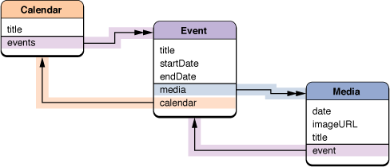

> 导航：[总目录](../../../README.md) · [documentation](../../../_indexes/documentation.md) · [Sync Services Programming Guide](Introduction%20to%20Sync%20Services%20Programming%20Guide.md)


[Next](Formatting%20Records.md)[Previous](Using%20Sync%20Anchors.md)

# Filtering Records

You can use the `ISyncFiltering` protocol and the `setFilters:` method of `ISyncClient` to filter the types of records your application syncs. Your filter can contain any custom logic you like as long as the sync engine can archive the filter and compare it with another filter. This article describes how to implement a filter using an example—extending the MediaExample application.

To implement a filter, you create a filter class that conforms to the `NSCoding` and `ISyncFiltering` protocols. The class needs to conform to `NSCoding` so that it can be archived. The `ISyncFiltering` protocol defines the methods that the sync engine will invoke to perform the actual filtering operation. The filter class also needs to override `isEqual:` so that the sync engine can compare two filters.

For example, suppose you want to add to the MediaExample schema an entity called Calendar, which maintains a collection of events. That way, when you import an iCal file, you can group the events together. You can do this by creating a Calendar entity with an identity attribute, such as a name or title, and an inverse to-many relationship to Event. [Figure 1](#apple-f4xwc4dqnrsv64tfmyxwi33df52wszbpkridimbqgaytcnjyfuzdgnbugq3c2q2kijeeqqscii) illustrates the modified schema.

__Figure 1__  Extended MediaExample schema



You can modify the Events application to group events by calendar—when you import events, you add Event records to a Calendar record. You can then use a filter to sync only those events that belong to your Calendar records—when the filter is set, no other events will be pushed or pulled. This section describes how to create a filter.

Follow these steps to create a filter that rejects all Event records that do not belong to a specified Calendar:

1. In this example, the filter class is called CalendarFilter and defines one instance variable, the record identifier of the Calendar record:

```objc
@interface CalendarFilter : NSObject <NSCoding, ISyncFiltering> {
   NSString *calendarIdentifier;
}

- (NSString *)calendarIdentifier;
- (void)setCalendarIdentifier:(NSString *)value;

@end
```
2. Next add implementations of the NSCoding protocol methods, [initWithCoder:](https://developer.apple.com/library/archive/documentation/LegacyTechnologies/WebObjects/WebObjects_3.5/Reference/Frameworks/ObjC/Foundation/Protocols/NSCoding/Description.html#//apple_ref/occ/intfm/NSCoding/initWithCoder:) and [encodeWithCoder:](https://developer.apple.com/library/archive/documentation/LegacyTechnologies/WebObjects/WebObjects_3.5/Reference/Frameworks/ObjC/Foundation/Protocols/NSCoding/Description.html#//apple_ref/occ/intfm/NSCoding/encodeWithCoder:), to `CalendarFilter.m`:

```objc
- (id)initWithCoder:(NSCoder *)coder
{
    if ( [coder allowsKeyedCoding] ) {
        calendarIdentifier = [[coder decodeObjectForKey:@"calendarIdentifier"] retain];
    } else {
        calendarIdentifier = [[coder decodeObject] retain];
    }
    return self;
}

- (void)encodeWithCoder:(NSCoder *)coder
{
    if ([coder allowsKeyedCoding]) {
        [coder encodeObject:calendarIdentifier forKey:@"calendarIdentifier"];
    } else {
        [coder encodeObject:calendarIdentifier];
    }
    return;
}
```
3. Then add implementations for the `ISyncFiltering` methods, `supportedEntityNames` and `shouldApplyRecord:withRecordIdentifier:`, to `CalendarFilter.m`. The `supportedEntityNames` method simply returns the names of the entities that you are filtering.

```objc
- (NSArray *)supportedEntityNames
{
    return [NSArray arrayWithObject:@"com.mycompany.syncexamples.Event"];
}
```

   The `shouldApplyRecord:withRecordIdentifier:` method performs the actual filter operation. In this example, the filter rejects all Event records that do not belong to the Calendar record specified by `calendarIdentifier`.

```objc
- (BOOL)shouldApplyRecord:(NSDictionary *)record withRecordIdentifier:(NSString *)recordIdentifier
{
    NSArray *relationship = [record valueForKey:@"calendar"];
    if ((relationship != nil) && ([relationship count] > 0) &&
        [[relationship objectAtIndex:0] isEqual:[self calendarIdentifier]])
        return YES;
    else
        return NO;
}
```


You can set multiple filters. For example, you can create multiple instances of CalendarFilter—one for each Calendar instance in your application—or create an entirely different filter for other entities.

You create an instance of a filter and activate it by sending `setFilters:` to your sync client. The `setFilters:` method takes an array of filters as the argument. The sync engine compares the filters with existing filters (using `isEqual:`) and replaces only those filters that are different.

```
id filter = [[CalendarFilter alloc] init];
[filter setCalendarIdentifier:calendarIdentifier];
[mySyncClient setFilters:[NSArray arrayWithObject:filter]];
```


If you set a filter and push records that do not match that filter, the sync engine will issue deletes for those pushed records on the subsequent pull phase. This is because filters are applied to the pulled records only, not the pushed records. If this behavior is not desired, clients should implement their own filters when pushing records (for example, don’t push records that you don’t want to pull), or modify their filters to accept all pushed records.

You can also use the `ISyncFilter` class to create a combination of filters—that is, create a filter that is a logical `AND` or `OR` of multiple filters.

You can also filter the entities and properties your client syncs using the client description property list. The client description property list specifies the entities and properties you support and can be a subset of the entities and properties defined in your schemas. See [Registering Clients](Registering%20Clients.md#apple-f4xwc4dqnrsv64tfmyxwi33df52wszbpkridimbqgaytcnjvfvbuuqsfjbaucry) for more details on the format of client description property lists.

For example, if you want to use the existing iCal Calendars schema but only want to sync Calendar and Event entities, and a minimal set of their properties, then you could edit the client description property list as follows:

```xml
<?xml version="1.0" encoding="UTF-8"?>
<!DOCTYPE plist PUBLIC "-//Apple Computer//DTD PLIST 1.0//EN" "http://www.apple.com/DTDs/PropertyList-1.0.dtd">
<plist version="1.0">
<dict>
    <key>DisplayName</key>
    <string>FooApp</string>
    <key>ImagePath</key>
    <string>FooApp.icns</string>
    <key>Entities</key>
    <dict>
        <key>com.apple.calendars.Calendar</key>
        <array>
            <string>title</string>
            <string>notes</string>
            <string>events</string>
        </array>
        <key>com.apple.calendars.Event</key>
        <array>
            <string>summary</string>
            <string>start date</string>
            <string>calendar</string>
        </array>
    </dict>
</dict>
</plist>
```

Although the Calendar entity defines many more properties, when your client syncs this entity, it will only push and pull the `title`, `notes` and `events` properties. (The `events` property is an inverse to-many relationship to Event.) Similarly, it will only push and pull the `start date`, `summary` and `calendar` properties of Event records.

See _Apple Applications Schema Reference_ for a complete description of the iCal Calendars schema.

[Next](Formatting%20Records.md)[Previous](Using%20Sync%20Anchors.md)

