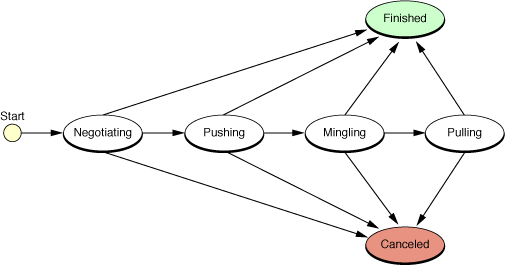
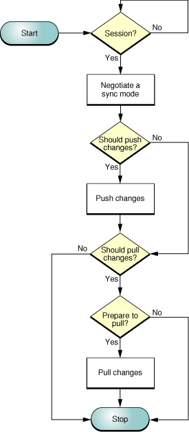
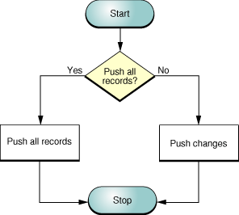
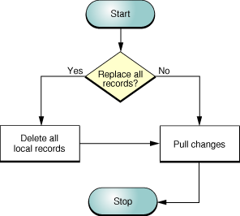
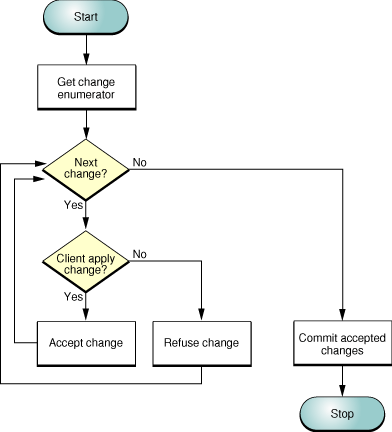

> 导航：[总目录](../../../README.md) · [documentation](../../../_indexes/documentation.md) · [Sync Services Programming Guide](Introduction%20to%20Sync%20Services%20Programming%20Guide.md)


[Next](Creating%20a%20Sync%20Schema.md)[Previous](Sync%20Services%20Overview.md)

# Managing Your Sync Session

In the simplest form of syncing, the client pushes changes to the sync engine, the sync engine applies those changes to the truth database, and the client pulls changes from the sync engine that were made by other clients since the last sync. In reality, syncing is not that simple, because events can take place, on either the client or server, that change the sync mode. Understanding how to manage different sync modes is fundamental to using the Sync Services framework.

An `ISyncSession` object encapsulates the process of a single sync operation. Sync Services uses a client-server model analogous to a database model. The client sends read and write instructions within a transaction to the sync engine using an `ISyncSession` object. The `ISyncSession` object behaves as finite state machine. For example, pushing and pulling changes are different states, and you always push before you pull. There are implicit transactions within each state, too, and sometimes multiple transactions within a state. Invoking some `ISyncSession` methods may begin a transaction, end a transaction, or transition to another state. It’s important to understand these states and transactions when managing a sync session.

This chapter describes how to use the core `ISyncSession` methods to manage your sync session. Refer to [Sync Services Overview](Sync%20Services%20Overview.md#apple-f4xwc4dqnrsv64tfmyxwi33df52wszbpkridimbqgaytcnjrfvbuuqsfjbaucry) if you are unfamiliar with the sync architecture and terminology.

In a sync session, you essentially create an `ISyncSession` object, use it to sync your records, and then release it. A session object behaves as a finite state machine illustrated in [Figure 1](#apple-f4xwc4dqnrsv64tfmyxwi33df52wszbpkridimbqgaytcnrsfuytimjwg42c2qscineugskciq). The states always change in the direction depicted by the arrows in this figure.

__Figure 1__  ISyncSession finite state machine



Only certain `ISyncSession` methods may be used within a state; invoking other methods in a state may raise an exception. You also transition from one state to another explicitly or implicitly depending on the methods you invoke. Negotiation and mingling are mandatory states, but pushing and pulling are optional as long as you push records before you pull records. Finishing or canceling terminates a session.

The exact sequence of messages sent to an `ISyncSession` object depends on your application and the way you store your records. This article outlines the typical sequence of messages for syncing your data and contains sample code to help you write your own custom sync methods to meet the needs of your application or device.

[Figure 2](#apple-f4xwc4dqnrsv64tfmyxwi33df52wszbpkridimbqgaytcnrsfuytinjsgu3s2qscincekqkhii) shows the logic of a typical sync method implementation. After creating a sync session and negotiating a sync mode, you ask the sync engine if you should push changes for an entity. If the answer is yes, you push the changes; otherwise, you skip to the pulling state. Similarly, when pulling changes, you ask the sync engine if you should pull changes. If the answer is yes, you prepare to pull changes which runs the mingler. The _mingler_ is a process in the sync engine that computes the changes to be pulled by each client that participates in a sync session. When the mingler completes this process, you pull the changes; otherwise, you can abort the sync session. The methods you use to implement your sync methods are described next.

__Figure 2__  Typical sync logic



The sync engine won’t let your application sync when syncing is disabled by the user or some other event, and when the sync engine is waiting for other clients to join a sync session.

Before beginning any sync operation, you first determine whether the sync engine is disabled as follows:

```
    if ([[ISyncManager sharedManager] isEnabled] == YES) {
        // begin syncing
        ...
    }
```

If the sync engine is disabled, you can optionally register for the `ISyncAvailabilityChangedNotification` notification to sync later as follows:

```
[[NSNotificationCenter defaultCenter] addObserver:self selector:@selector(syncWasEnabled:) name:ISyncAvailabilityChangedNotification object:@"YES"];
```

When registering for this notification, pass either "YES" or "NO" as the notification object. If you only want to be notified when the sync engine is enabled, pass “YES” as the notification object.

Typically, a client syncs its records independent of other clients. Sync Services also supports multiple clients syncing simultaneously. A client registers itself as an observer of another client and is alerted when that client syncs. For example, a device client for a phone might want to sync whenever Address Book syncs to update its contacts. Therefore, when you begin a sync session, the sync engine needs to alert all dependent clients and wait until those clients either join the sync session or don’t. Because this process may block your client momentarily, you have the option of specifying how long you are willing to wait for other clients to join the session.

There are two ways to create a sync session. You begin a `ISyncSession` object using one of two `ISyncSession` class methods:

- `beginSessionWithClient:entityNames:beforeDate:`
- `beginSessionInBackgroundWithClient:entityNames:target:selector:`

The `beginSessionWithClient:entityNames:beforeDate:` method is a blocking method that returns when all dependent clients have had the opportunity to join the sync session, as follows:

```
ISyncSession *session =
        [ISyncSession beginSessionWithClient:client
                entityNames:entityNames
                beforeDate:[NSDate dateWithTimeIntervalSinceNow:5]];
```

If you change the _beforeDate_ argument to the current date or a past date, this method returns immediately with or without creating a sync session.

The `beginSessionInBackgroundWithClient:entityNames:target:selector:` method allows you to specify a target and selector to be invoked when all clients have joined the session. Use this method if you do not want to block the client while waiting for other clients.

All clients need to negotiate a sync mode before pushing and pulling records. The sync modes are slow sync, fast sync, refresh sync, pull the truth, and push the truth.

The first time a client syncs, it slow syncs—that is, it pushes all its records. Otherwise, the default mode (fast syncing) is used to push and pull changes only. However, certain events can prevent a fast sync. When this happens, the client might request a different sync mode, or the sync engine might force a mode. If multiple clients sync simultaneously, then all the client requests need to be considered. For example, if one client wants to push the truth, all other clients need to pull the truth.

Use the `clientWantsToPushAllRecordsForEntityNames:` method to request a slow sync. For example, if your client doesn’t know what records changed since the last sync, it should slow sync. This method informs the sync engine that the client will push all its records:

```
// Request a slow sync
[session clientWantsToPushAllRecordsForEntityNames:entityNames];
```

If a client is slow syncing, the client may pull deletes for records that the engine knew were on the client during the last sync.

The `clientDidResetEntityNames:` method informs the sync engine that the client was reset and wants to refresh sync. However, if a client is refresh syncing, the engine doesn’t use the client snapshot to compare pushed records. Consequently, no delete changes are pulled.

If you want all client records replaced by the truth database records, send `setShouldReplaceClientRecords:forEntityNames:` to your `ISyncClient` object. This is how you request a pull the truth sync mode:

```
// Requests that client records be replaced by truth
[client setShouldReplaceClientRecords:YES
                       forEntityNames:entityNames];
```


Typically, the sync modes for all the entities synced by a client are the same. However, in some cases the sync modes may be different. The most common case is when a client doesn't sync the same entities in every sync session or explicitly requests a different sync mode for one entity and not another. Because of such differences, the sync engine might allow a fast sync of one entity and force a slow sync of another entity. This is permissible except when relationships exist between these entities.

To avoid relationship inconsistencies, clients should always request the same sync mode for entities that have relationships between them. In other words, clients should use the same sync mode for records belonging to the same object graph; otherwise, inconsistencies between the records may result—especially if inverse relationships are changed.

Assuming you negotiated a sync mode, you can now push your changes to the sync engine. Pushing changes is an optional step—it can be skipped if the client has no changes or is not ready to push them. However, if you decide to push changes, you must do so before pulling changes.

[Figure 3](#apple-f4xwc4dqnrsv64tfmyxwi33df52wszbpkridimbqgaytcnrsfuytinjshays2qscinbeerkcii) shows the flow of a typical pushing method. You first ask the sync engine if you should push any changes for the specified entities. Then you ask if you should push all the records or just the changes. You do this because the sync engine might select a mode other than the one you requested.

__Figure 3__  Typical pushing logic



When slow syncing, a client pushes all its records to the sync engine and lets it determine which properties of those records changed. The sync engine does this by comparing each pushed record to a snapshot of the record taken at the end of the previous sync.

When fast syncing, a client may push only the records that changed. Similarly, the sync engine determines what individual properties of those records changed by comparing them to the snapshot.

Alternatively, a client can save time and effort by pushing just the changes to individual properties of records (assuming that the client keeps track of every property change to every record).

The sync session transitions to the pushing state the first time any of the methods discussed below are invoked. All the methods can be used only during this state, except `clientLostRecordWithIdentifier:shouldReplaceOnNextSync:`, which can also be invoked during the pulling state. An implicit transaction begins when entering the pushing state and ends when leaving this state.

Although the methods for requesting a sync mode and pushing and pulling records are entity-based, entities in the same data class usually have the same sync mode. Entities can have relationships to other entities in the same data class, but not relationships to entities in other data classes. Therefore, you should not request different sync modes for entities in the same data class, and enable or disable entities in the same data class after the application first syncs.

To determine whether any records belonging to an entity should be pushed, use the `shouldPushChangesForEntityName:` method, as follows:

```
        if ([session shouldPushChangesForEntityName:entityName]){
            // Push records for entityName
            ...
        }
```


To determine whether you should slow or fast sync, use the `shouldPushAllRecordsForEntityName:` method. If this method returns `YES`, you should push all records. If you do not push all the records, the sync engine assumes you deleted the records you did not push and deletes them from the truth database. If the `shouldPushAllRecordsForEntityName:` method returns `NO`, push just the changes since the last sync.

```
        if ([session shouldPushAllRecordsForEntityName:entityName]) {
            // Slow sync entityName
            ...
        } else {
            // Fast sync entityName
            ...
        }
```


You can push all records or just the changed records by using the `pushChangesFromRecord:withIdentifier:` method, as follows:

```
    [session pushChangesFromRecord:record withIdentifier:id];
```

Typically, you transform your entity objects into a dictionary representation before pushing them. The `record` argument above is a dictionary that contains only the supported properties you want to sync. It should not contain any local properties used exclusively by your client.

For example, the dictionary representation of a Media object pushed by the MediaAssets sample application might look like this:

```
MediaAssets[789] pushing sync record={
    "com.mycompany.syncservices.RecordEntityName" = "com.mycompany.syncexamples.Media";
    date = 2004-05-22 00:00:00 -0700;
    event = ("3571D5D0-C0A5-11D8-A57D-000A95BF2062");
    imageURL = "file://2004/05/22/IMG_1106.JPG";
    title = "IMG_1106.JPG";
}
```

The sync engine uses record identifiers to locate records. Record identifiers are unique across all sync records, not just within the scope of an entity. Therefore, the `record` dictionary also needs to contain a value for the `ISyncRecordEntityNameKey` key that identifies the record’s entity name.

The client is expected to create the unique record identifiers, typically a UUID, when pushing new records. Conversely, clients can either accept the record identifiers assigned by the sync engine when pulling new records or reset it to something else (see [Pulling](#apple-f4xwc4dqnrsv64tfmyxwi33df52wszbpkridimbqgaytcnrsfuyteojvhe2q)). For these reasons, your client needs to maintain the association between a record identifier and your entity object in order to communicate future changes to the sync engine.

How you generate record identifiers is dependent on your application but you should follow this rule:

- A local identifier for a given record must not change or collide with other identifiers for the life of the record—it can only be reused after the record is deleted and expunged from the truth database.

If you know what properties of a record changed, you can just push the properties that changed by creating an `ISyncChange` object and using the `pushChange:` method. You can improve efficiency by pushing just the changes.

When fast syncing, you don’t have to create an `ISyncChange` object for deleted records. You can use the `deleteRecordWithIdentifier:` method to push deleted record changes as follows:

```
[session deleteRecordWithIdentifier:recordID];
```


If you lost a record and want to replace it or ignore it in a future sync, use the `clientLostRecordWithIdentifier:shouldReplaceOnNextSync:` method.

The sync session enters the mingling state after all clients participating in the sync have pushed their changes. During mingling, the engine takes all the changes from all the participating clients, checks them for conflicts, and applies them to the truth database. At the end of the mingling state, all changes have been incorporated from multiple clients.

If there is a conflict, the engine first tries to resolve it using a set of rules specific to the entity in question—for example, the engine uses the identity properties of an entity to determine if two records are the same record.

The client informs the sync engine that it is ready to begin pulling changes by invoking one of the `prepareToPullChanges...` methods. Invoking them at any other time will raise an exception.

Using the `prepareToPullChangesForEntityNames:beforeDate:` method, you specify how long the client is willing to wait for the mingling state to complete as in:

```
if ([session prepareToPullChangesForEntityNames:entityNames beforeDate:[NSDate distantFuture]]) {
    // Pull changes for each entity
    ...
```

The mingling state ends when this method returns. If this method returns `NO`, you should skip pulling changes.

Using the `prepareToPullChangesInBackgroundForEntityNames:target:selector:` method, you specify a target and action to be invoked when the mingling state is complete. This method is nonblocking. The mingling state ends when this method invokes the action.

Note that the mingler considers the changes made between syncs to be transitive. The mingler optimizes a set of consecutive changes to a record by discarding all changes to a property except the last. Consequently, clients should not assume that changes are pulled in the same sequence in which they are pushed—only the final value in a sequence of changes is relevant.

Pulling changes from the sync engine is the final state in the sync session. The sync session transitions to this state at the end of the mingling state. Typically, you iterate through the entity names passed to one of the `prepareToPullChanges...` methods, and for each entity, you pull and apply the changes. But first you need to see whether you should try to pull changes. Figure 4 shows the logic of a typical pulling implementation. Details of pulling changes are covered in [Pulling Changes](#apple-f4xwc4dqnrsv64tfmyxwi33df52wszbpkridimbqgaytcnrsfuytinbsgy2q).

__Figure 4__  Typical pulling logic



You should first check with the sync engine, using the `shouldPullChangesForEntityName:` method, to determine whether you should try to pull changes for an entity before pulling changes. It is useful to create a filtered list of entities from the supported entities, as follows:

```
NSEnumerator *entityEnumerator = [entityNames objectEnumerator];
NSMutableArray *filteredEntityNames = [NSMutableArray array];
while (entityName = [entityEnumerator nextObject]){
    if ([session shouldPullChangesForEntityName:entityName])
        [filteredEntityNames addObject:entityName];
}
```


For each entity, you need to check with the sync engine, using the `shouldReplaceAllRecordsOnClientForEntityName:` method, to determine whether you should replace all its records. For example, you need to replace all the records if the sync mode is pull the truth. If this method returns `YES`, delete your copies of the records before pulling changes, as in this example:

```
if ([session shouldReplaceAllRecordsOnClientForEntityName:entityName]) {
    // Remove the records for this entity from the client data source
    ...
}
```


Now that you have a collection of entity names to pull changes for, you are ready to pull and apply the changes. Figure 5 shows the flow of a typical pulling implementation.

__Figure 5__  Typical pulling-changes logic



You use the `changeEnumeratorForEntityNames:` method to get the changes from the sync engine for the specified entity names. Because this method returns an object enumerator, you need to iterate through the changes and apply them one by one. [Figure 5](#apple-f4xwc4dqnrsv64tfmyxwi33df52wszbpkridimbqgaytcnrsfuytinjthezc2qscineuer2diy) shows how you might process each change.

For each change, you need to decide whether you are going to apply it to your local data source. If you apply it, you need to invoke `clientAcceptedChangesForRecordWithIdentifier:formattedRecord:newRecordIdentifier:` to inform the sync engine.

Otherwise, you invoke `clientRefusedChangesForRecordWithIdentifier:` to reject a change. This method applies only to add and modify changes, not deletes. On subsequent fast syncs, the rejected changes do not appear in the change enumerator returned by the `changeEnumeratorForEntityNames:` method. However, they do appear in the change enumerator during the next slow sync.

When you invoke the `clientAcceptedChangesForRecordWithIdentifier:formattedRecord:newRecordIdentifier:` method, you have the opportunity to change the record identifier supplied by the sync engine to a record identifier supplied by the client. The identifiers for new records are chosen by the sync engine. (When refresh syncing, every record not pushed by the client is considered new.) Optionally, you can change all the record identifiers for new records at the end of applying changes using the `clientChangedRecordIdentifiers:` method.

How you generate record identifiers is dependent on your application but you should follow this rule:

- A local identifier for a given record must not change or collide with other identifiers for the life of the record—it can only be reused after the record is deleted and expunged from the truth database.

Lost records are handled in a way that is similar to the pushing state. To inform the sync engine about a record that the client lost and may want to replace, use the `clientLostRecordWithIdentifier:shouldReplaceOnNextSync:` method.

When you are done processing all the changes, you invoke `clientCommittedAcceptedChanges` to commit the accepted changes to the sync engine. This method closes the transaction that was opened by the first invocation of one of the following methods:

- `clientAcceptedChangesForRecordWithIdentifier:formattedRecord:newRecordIdentifier:`
- `clientRefusedChangesForRecordWithIdentifier:`
- `clientChangedRecordIdentifiers:`
- `clientLostRecordWithIdentifier:shouldReplaceOnNextSync:`

The pulling state supports multiple transactions so that clients can batch changes and apply them more efficiently. A new transaction begins by invoking one of the above methods.

Sending `finishSyncing` to an `ISyncSession` object closes the last open transaction and terminates the session. The `ISyncSession` object cannot be reused after entering this state. This method can be invoked at any time during an active sync session.

If you invoke `finishSyncing` during the negotiating state, the sync engine assumes that the client has no records to push.

If you invoke `finishSyncing` during either the pushing or pulling states, the last transaction is closed and any changes in that transaction are applied by the sync engine. For example, if you are in the pulling state, then any changes you accepted using the `clientAcceptedChanges...` method are applied even if you did not invoke `clientCommittedAcceptedChanges` before finishing the session.

If you invoke `finishSyncing` during the mingling state (for example, while waiting for the target method specified in `prepareToPullChangesInBackgroundForEntityNames:target:selector:` to be invoked), the session is terminated and all changes made during the previous pushing state are applied.

An `ISyncSession` object cannot be reused, so release it after invoking `finishSyncing`.

You can invoke the `cancelSyncing` method at any time to terminate a sync session. However, when canceling a sync session, the sync engine rolls back to the state of the last closed transaction. It does not roll back all the transactions made within the session. For this reason, you need to know when transactions begin and end in the various states.

If you invoke `cancelSyncing` during the negotiating state, then any negotiation methods invoked during this state are ignored. For example, if you request a refresh sync, then you will have to request it again the next time you sync.

If you invoke `cancelSyncing` during the pushing state, all pushed changes, deletions, and lost records are discarded, and the state is rolled back to the end of the negotiation state. If a client is fast syncing, it must remember which records changed so that it can push those changes again during the next sync. If the client cannot do so, it should slow sync the next time.

If you invoke `cancelSyncing` during the mingling state, the session is terminated and all changes made during the previous pushing state are applied.

If you invoke `cancelSyncing` during the pulling state, all changes that were not committed using `clientCommittedAcceptedChanges` are pulled again during the next sync.

An `ISyncSession` object cannot be reused, so release it after invoking `cancelSyncing`.

[Next](Creating%20a%20Sync%20Schema.md)[Previous](Sync%20Services%20Overview.md)

