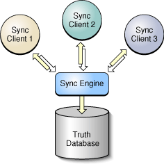

> 导航：[总目录](../../../README.md) · [documentation](../../../_indexes/documentation.md) · [Sync Services Programming Guide](Introduction%20to%20Sync%20Services%20Programming%20Guide.md)

[Next](Managing%20Your%20Sync%20Session.md)[Previous](Why%20Use%20Sync%20Services.md)

# Sync Services Overview

The primary goals of Sync Services are for syncing to be efficient and unobtrusive to the user. Most applications are expected to sync often, with small sets of changes. Applications may sync simultaneously with other applications. A sync operation can be interrupted or postponed, without data loss, to respond to user requests.

To achieve this, the Sync Services uses a finite state machine to manage a sync session. The API reveals this state machine, so developers have fine control over each state. Hence, the API is more flexible to meet the needs of diverse applications.

Because of the state machine, the core classes are more complex than typical Cocoa classes. The order in which methods are invoked, and the timing, are important. In fact, the consequences of using this API incorrectly are dire—the users may lose their data. Therefore, using Sync Services requires a deeper understanding of syncing concepts.

Syncing is also a coordinated effort between a number of client processes and a server running on a single computer. To use Sync Services, you first need to understand its architecture and the role of each component in that architecture. Then you need to understand sync modes and how to manage a sync session (covered in detail in [Managing Your Sync Session](Managing%20Your%20Sync%20Session.md#apple-f4xwc4dqnrsv64tfmyxwi33df52wszbpkridimbqgaytcnrsfvbuuqsfjbaucry)).

The Sync Services architecture is depicted in [Figure 1](#apple-f4xwc4dqnrsv64tfmyxwi33df52wszbpkridimbqgaytcnjrfuytimrtguzc2qsbijdemqsdja). All the processes and the truth database reside on a single computer. For each user account, there is one sync engine and one truth database. The _sync engine_ is responsible for coordinating and synchronizing data between multiple clients. The sync engine stores the aggregate of all client records in the _truth database_. The sync engine is the only process that accesses the truth database directly.

__Figure 1__  Sync Services architecture

This architecture is primarily a _client server model_ in which _clients_ initiate syncs by pushing changes to the sync engine and pulling changes—possibly made by other clients—from the sync engine which is the _server_. Clients sync when they want to by communicating directly with the sync engine. For example, if the user made local changes, a client might batch the changes and sync them immediately. If the user is busy with some operation, the client might postpone syncing until later when the client is idle. Clients should never sync directly with another client or through another process.

There are multiple types of clients—for example, your custom _applications_, iCal and Address Book, _tools_ for syncing devices such as phones, iPods, and other PDAs, and _servers_ for syncing data over the network such as MobileMe. Clients must be able to transform sync engine record formats into formats used by devices which might have limited storage capacity. Sync Services can also support extensions to existing schemas and custom schemas, not just those data records used by Apple products.

The _sync engine_ does the bulk of the work merging changes and computing changes to be pulled by different clients. It is lightweight enough for clients to synchronize frequently—as often as once a minute if need be—and coordinate the requests of multiple clients simultaneously. It can notify a dependent client that an observed client is syncing, and allow that client to join the sync session. How does the sync engine achieve all this without the user having to think about syncing?

The sync engine selects the appropriate _sync mode_ for each client, depending on the situation. Selecting a sync mode is typically a negotiation between the client and the sync engine. This is because syncing depends on the state of all the processes involved in the sync, not just on a single client. And because multiple clients may join the same sync session and have different requirements, a client is not necessarily given the sync mode it requests. Instead, the sync engine may force another mode.

The first time a client syncs, it pushes all its records to the sync engine and pulls changes computed by the sync engine. This sync mode is called _slow syncing_. While a client is pushing and pulling records, the sync engine keeps track of the client’s state using a snapshot so that subsequent syncs can be more efficient. The next time a client syncs, only changes are pushed and pulled. This sync mode is called _fast syncing._

Typically, the sync engine assumes the client is fast syncing unless the client negotiates another sync mode or some state has changed in the server or client that requires a different mode.

For example, if a device is reset, it may lose all its records. When this happens, a client can request a _refresh sync_. A refresh sync tells the sync engine to forget everything it knew about a client—the engine will remove the client snapshot. Typically, the client then pulls all the records and pushes none. A refresh sync is a slow process that should be performed only after a catastrophic event, such as the user manually resetting a device or deleting an application’s data files.

Sometimes, a client might want to replace all the truth database records with its own records. This mode is called _push the truth_. In contrast, a client might want to replace all its records with the records in the truth database. This mode, called _pull the truth_, can be initiated by the client or the sync engine. If a client initiates a sync and then pushes the truth, the sync engine may force all other clients participating in the sync to pull the truth.

Ideally, it’s transparent to the user whether or not a client is slow syncing or fast syncing, or how often it syncs. Most clients should _trickle sync_—that is, fast sync frequently and simultaneously with related clients. Dependent clients should just sync automatically without requiring human intervention.

Intelligence is built into the sync engine to resolve most conflicts and duplicates without requiring user input. The bulk of the sync engine’s job is to merge changes from multiple clients and, upon request, to give your client only the changes it needs. The sync engine is a field-differencing engine that processes changes to individual fields in a record, not just changes to records. If two clients modify different fields in the same record, the engine can merge the changes successfully. But if two clients modify the same field on a record, the engine generates a conflict.

The sync engine may also reduce a complicated sequence of changes into simpler ones if changes from multiple clients are redundant. For this reason, clients should not rely on the order in which changes are applied.

The _truth database_ contains an aggregate of all the client’s records. Consequently, the truth database uses a canonical schema that is an aggregate of all the schemas used by all the clients.

A sync schema is based on an entity-relationship model similar to that used by other Cocoa technologies. Read [Cocoa Design Patterns](https://developer.apple.com/library/archive/documentation/Cocoa/Conceptual/CocoaFundamentals/CocoaDesignPatterns/CocoaDesignPatterns.html#//apple_ref/doc/uid/TP40002974-CH6) in _[Cocoa Fundamentals Guide](../Cocoa%20Fundamentals%20Guide/Introduction.md#apple-f4xwc4dqnrsv64tfmyxwi33df52wszbpkridimbqgazdsnzu)_ to learn more about entity-relationship models and terms such as entity, property, attribute, relationship, to-one, and to-many.

You can use one of the existing sync schemas—for example, for contacts, calendars, and bookmarks— extend one of these schemas or create your own. If you extend a schema or create your own, then you need to create an entity model for your custom objects and save it in a schema format that Sync Services understands.

This format, called _sync schema_, is a property list that specifies details about the entities in your model. For entities, you might specify the name of the entity and names of its attributes and relationships (collectively referred to as its _properties_). For attributes, you might specify the name of the attribute and its data type. For relationships, you might specify the name, destination entity name, cardinality, and delete rule. See [Creating a Sync Schema](Creating%20a%20Sync%20Schema.md#apple-f4xwc4dqnrsv64tfmyxwi33df52wszbpkridimbqgaytcnjtfvbuuqsfjbaucry) for a complete description of the sync schema property list.

A sync schema defines a template for records stored in a database whose records are of a particular type (records belong to an entity) and may have relationships to other records. Records stored in the truth database are dictionary objects with key-value pairs, one for each property defined in the entity. Each record dictionary also has an entity name property and an associated unique record identifier. The record identifier is not stored with the record but is instead used by the client and sync engine when referring to a record. The truth database can also store custom fields in a record that are not defined in the schema. For example, these fields can be used to store client information added by a device.

The truth database doesn’t store arbitrary key-value coding-compliant objects—it stores record dictionaries. Therefore, unless all your entities are dictionaries, you typically transform records back and forth between the sync engine’s record representation and your client’s object representation. However, when fast syncing, you can apply changes only to properties—you don’t need to push and pull entire records when only a few property values changed.

Because the truth database is an aggregate of all the client schemas, it can contain a lot of information that your application doesn’t care about. Your client can filter the records that it pushes and pulls in several different ways.

Typically, a _client_ is an end-user applications (like your Cocoa application, iCal, or Address Book), a server applications (like MobileMe), or a tool that syncs a device (such as a phone). A _device client_ is a liaison between the sync engine and a device. A server client is a liaison for a remote server that stores user data. Actually, a client can be any application or tool running on Mac OS X that uses an existing schema, extends an existing schema or defines its own. Sync Services can be used to sync your custom objects. Clients may vary dramatically in their capacity to store records and in the complexity of their object models. For example:

- Some clients cannot support all entities and properties defined in a schema.
- Some device clients may restrict the format or limit the lengths of attributes (for example, truncate string values).
- During any given sync session, a client might want to push or pull only a subset of the entities it supports. For example, a phone device client might pull only calendar events that occur during the next two weeks.
- Some clients may not be capable of modifying records such as device clients for an iPod or a phone. Other clients might have full read and write access to the same records.

The sync engine is flexible enough to support a diverse set of clients as long as the clients do their part. Clients need to specify their capabilities, filter records, format records, and resolve conflicts when they arise. Any client that wants to sync records using Sync Services has several responsibilities, described next.

If a client extends an existing schema or defines its own schema, it needs to register that schema with the sync engine. Ideally, a client should register a schema once and thereafter reregister it only if it changed. (Reregistering the same schema is harmless if the schema is unchanged.)

Changing schemas should be done cautiously and infrequently. Changing schemas can cause data loss if entities and properties are removed. It can also require that all clients using the schema slow sync during the next sync.

See [Creating a Sync Schema](Creating%20a%20Sync%20Schema.md#apple-f4xwc4dqnrsv64tfmyxwi33df52wszbpkridimbqgaytcnjtfvbuuqsfjbaucry) for more information on schema formats, and [Registering Schemas](Registering%20Schemas.md#apple-f4xwc4dqnrsv64tfmyxwi33df52wszbpkridimbqgaytcnjufvbuuqsfjbaucry) for information on registering schemas.

A client must provide the sync engine with a description of its capabilities. At a minimum, the client must specify the schemas it uses, and the entities and properties in those schemas that it supports. You can also specify which entities are read-only and which entities are read-write allowing the sync engine to skip the pushing and mingling states when it can. The client description is one way a client can filter records.

A client description is stored in a property list file specified when registering the client with the sync engine. The sync engine periodically checks this file for changes and forces the client to slow sync on the next sync if the property list changes.

Note that the client description specifies the entities and properties that a client can support but not necessarily the entities and properties that a client can sync. The entities and properties that a client can sync must be a subset of the supported ones.

See [Registering Clients](Registering%20Clients.md#apple-f4xwc4dqnrsv64tfmyxwi33df52wszbpkridimbqgaytcnjvfvbuuqsfjbaucry) for more information on registering a client.

Most often it is the responsibility of the client to initiate syncs. A client should trickle sync—periodically fast sync in the background—or allow the user to manually sync the application as needed.

In contrast, a client may not initiate a sync if it shares a schema with another application. If a client is an observer of another client, it may be alerted by the sync engine to sync when the other client syncs. For example, a client that uses calendar records might receive an alert when iCal syncs. When alerted, the client can optionally join the sync session.

You can also specify a tool to be launched if an observed client syncs, so that your application doesn’t need to be running in order to sync. For example, an Address Book tool syncs, even if the Address Book application is not running, whenever MobileMe syncs.

The client is also responsible for managing the sync session and performing the sync operations in the expected sequence: that is, negotiate a sync mode, push changes to the sync engine, and pull changes from the sync engine. See [Managing Your Sync Session](Managing%20Your%20Sync%20Session.md#apple-f4xwc4dqnrsv64tfmyxwi33df52wszbpkridimbqgaytcnrsfvbuuqsfjbaucry) for more information on managing a sync session.

If a client wants to fast sync when pushing records, the client needs to keep track of changes made to its local data. When fast syncing, clients need to inform the sync engine which records and, optionally, which properties changed—syncs will be faster if you tell the engine which properties changed. Clients also need to inform the sync engine of added and deleted records.

Device clients might be able to obtain this information from the device itself. Otherwise, clients that use their own data stores need to record this information when users change records. If your client cannot provide this information, then it should slow sync each time it syncs.

Clients may specify filters that are applied to records pulled from the sync engine. A filter simply conforms to a filtering protocol that takes a record and either accepts or rejects that record. A client does not see rejected records. You can program business logic into the filters. You can also apply logical `AND` and `OR` binary operators to a set of filters creating composite filters. See [Filtering Records](Filtering%20Records.md#apple-f4xwc4dqnrsv64tfmyxwi33df52wszbpkridimbqgaytcnjyfvbecssfifeukri) for more information on setting filters.

It’s the clients responsibility to inform the sync engine of records that are “reformatted” by a device client. For example, if a device has limited data storage and truncates all first and last names to 20 characters, then the sync engine needs to know what the new device format is. Otherwise, the sync engine assumes the records changed on subsequent pushes and issues false changes to other clients. See [Formatting Records](Formatting%20Records.md#apple-f4xwc4dqnrsv64tfmyxwi33df52wszbpkridimbqgaytcnjsfvbuuqsfjjbeqsa) for more information on formatting records.

Conflicts can occur if two records that are “logically” the same record are added by different clients. In this case, the sync engine should recognize that these are changes to the same record, not two different records. The sync engine can do this if clients specify the properties that are used to identify a record in the sync schema. The sync engine uses these identity properties to resolve conflicts without duplicating records. See [Identity Properties](Creating%20a%20Sync%20Schema.md#apple-f4xwc4dqnrsv64tfmyxwi33df52wszbpkridimbqgaytcnjtfuytiojwgyya) for more information on identity properties.

For example, a device pushes a “John Smith” contact but there’s already a record for “John Smith” in the truth database. If the sync schema specifies that the `firstName`, `lastName`, and `dateOfBirth` properties be used to identify a record, then the sync engine correctly determines that these two records are the same record, and does not generate a duplicate.

The Sync Services API consists of a few classes and protocols that work together to perform syncing. Sync Services is a low-level API that offers great control and flexibility. Consequently, it requires a more in-depth understanding of the syncing process in order to use it. You need to write your own sync methods that sync your data the way you want. To do this, it’s important to understand the purpose of each class and how you use it. You can see this information in the list that follows.

__`ISyncManager`__: You use an `ISyncManager` object to communicate directly with the sync engine. You primarily use an `ISyncManager` to register schemas and clients. There’s only one `ISyncManager` shared instance per process.

__`ISyncClient`__: An `ISyncClient` object encapsulates information about your client that the sync engine uses to identify your client, determine its capabilities, and maintain its state.

__`ISyncSession`__: An `ISyncSession` object manages a single sync operation. You create an `ISyncSession` object, use it to sync your records, and then throw it away. `ISyncSession` supports multiple sync modes that you negotiate before pushing and pulling records.

__`ISyncChange`__: An `ISyncChange` object encapsulates a set of changes related to a single record such as adding a record, deleting a record, and modifying an existing record. You use `ISyncChange` objects to push and pull changes.

You always use the shared `ISyncManager` instance and register your schema with it. Sync Services provides three canonical schemas: Bookmarks, Contacts, and Calendars. You can extend one of these schemas or register your own (read [Creating a Sync Schema](Creating%20a%20Sync%20Schema.md#apple-f4xwc4dqnrsv64tfmyxwi33df52wszbpkridimbqgaytcnjtfvbuuqsfjbaucry) for how to design your own schema). Your schemas must be registered before beginning any sync operations (read [Registering Schemas](Registering%20Schemas.md#apple-f4xwc4dqnrsv64tfmyxwi33df52wszbpkridimbqgaytcnjufvbuuqsfjbaucry)).

Typically, you create one `ISyncClient` object per application or tool and then register it with the `ISyncManager` (read [Registering Clients](Registering%20Clients.md#apple-f4xwc4dqnrsv64tfmyxwi33df52wszbpkridimbqgaytcnjvfvbuuqsfjbaucry)). However, if your application syncs multiple devices or data files, you could have a client per device or data file.

You create an `ISyncSession` object each time you sync your records. `ISyncSession` is implemented as a finite state machine, so the order in which you invoke its methods is critical. Read [Managing Your Sync Session](Managing%20Your%20Sync%20Session.md#apple-f4xwc4dqnrsv64tfmyxwi33df52wszbpkridimbqgaytcnrsfvbuuqsfjbaucry) for an in-depth discussion of syncing.

Alternatively, you can use the `ISyncSessionDriver` class that uses a delegation model to control a sync session without using any of the core classes directly. Read [Using a Session Driver](Using%20a%20Session%20Driver.md#apple-f4xwc4dqnrsv64tfmyxwi33df52wszbpkridimbqgaztmmbqfvjvona) for more information on this approach.

[Next](Managing%20Your%20Sync%20Session.md)[Previous](Why%20Use%20Sync%20Services.md)

